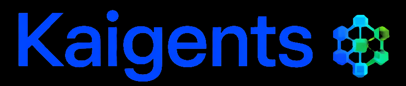

<p align="center">
  
</p>

# Kaigents Platform (GA Release)

Kaigents is a **production-ready**, Kubernetes-native platform for building, running, and operating AI agents in enterprise environments. It is optimized for low total cost of ownership (TCO) with a strong focus on AMD Ryzen AI hardware.

**Current Version**: 1.3.0 (Memory Subsystem + NebulaGraph Temporal Graph)

This repository is the Kaigents **platform** (distinct from any future marketing/community site).

## Canonical docs

- [`docs/product/kaigents-prd.md`](docs/product/kaigents-prd.md)
  - Product goals, MVP scope, functional requirements, UX requirements (run timeline), and milestones.
- [`docs/architecture/kaigents-architecture-and-design.md`](docs/architecture/kaigents-architecture-and-design.md)
  - Canonical system design: boundaries, data flows, and the role of tool plane, run timeline, artifacts, and RAG.
- [`docs/architecture/agent-memory-proposal.md`](docs/architecture/agent-memory-proposal.md)
  - Memory subsystem design: short-term, long-term, epistemic, and knowledge propagation. All implementation deviations resolved (Section 13).
- [`docs/research/knowledge-propagation-research.md`](docs/research/knowledge-propagation-research.md)
  - Research basis for M12 knowledge propagation: 11 challenges, dispositions, and package format design.
- [`docs/implementation/kaigents-implementation-tracker.md`](docs/implementation/kaigents-implementation-tracker.md)
  - Milestone tracker and push/review gates (when we are allowed to push working code).
- [`docs/implementation-plan.md`](docs/implementation-plan.md)
  - Detailed implementation plan including recovery plan (R0-R15) for memory milestones.
- [`docs/CODING_STANDARDS_AND_DOD.md`](docs/CODING_STANDARDS_AND_DOD.md)
  - Coding standards, CI quality gates, and definition of done.
- [`docs/research/technology/itd-register.md`](docs/research/technology/itd-register.md)
  - Important Technical Decisions (ITDs) that constrain implementation choices.
- [`docs/research/technology/oss-components-commercially-permissible.md`](docs/research/technology/oss-components-commercially-permissible.md)
  - OSS due diligence list and licensing posture (redistribute vs integrate-only vs exclude).

## Ecosystem Projects

Kaigents is supported by a suite of specialized ecosystem projects:

- **[KaiCatalog](https://github.com/jensjohansen/kaicatalog)**: A curated catalog service for MCP servers with 40+ pre-vetted tools, security posture ratings, and air-gapped mirroring support.
- **[KaiManager](https://github.com/jensjohansen/kaimanager)**: The management layer for Kaigents, providing first-class surfaces for agent personas, quality gates, and process health monitoring.
- **[KaiCLI](https://github.com/jensjohansen/kaicli)**: The operator interface for the Kaigents ecosystem. A unified command-line tool for managing MCP tools, personas, and platform health.

## Production Hardened

Kaigents 1.0.0 is built for stability and enterprise operations:
- **Durable Execution**: Long-running workflows survive component restarts.
- **Observability**: Full Prometheus metrics and JSON structured logs (Loki) across all components.
- **Enterprise Storage**: Cloud-agnostic S3 support with large-object streaming.
- **Identity**: Built-in OIDC (Keycloak) and Kubernetes RBAC integration.

## Features

- **Kubernetes-native**: Built on CRDs, standard RBAC, and GitOps-friendly workflows.
- **Enterprise Identity**: Full OIDC integration with Keycloak for platform-wide SSO.
- **Durable Execution**: Powered by Temporal for long-running, human-gateable agent workflows.
- **Hybrid Execution**: Declarative hardware pinning (CPU/GPU/NPU) via `RoutingPolicy`.
- **Observable**: Structured JSON logging (Loki-ready) and Prometheus metrics.
- **Cloud-Agnostic Storage**: S3-compatible artifact storage (AWS, MinIO, Ceph).
- **Agent Memory (M9-M12)**:
  - **Short-term memory** (M9): Real-time ingestion via Qdrant vector store; sub-second search; context budget enforcement via selection/truncation.
  - **Long-term memory** (M10): In-process and Temporal-based consolidation extracts episodic memory from run timelines; recall with provenance back-links across Qdrant (semantic) and RethinkDB (keyword); NebulaGraph temporal edges link episodes to source memories.
  - **Epistemic memory** (M11): Belief Manager with ATMS-style hypothesis tracking; graph-traversal-based retraction cascades via NebulaGraph (with RethinkDB fallback); repeat-prevention quality gates.
  - **Knowledge propagation** (M12): `.kgpkg` package format for cross-workspace knowledge transfer; single embedding model lock; package-scoped retraction cascades; cross-workspace semantic deduplication (embeddings + Qdrant); export/import CLI.
  - **Temporal graph layer** (R15): NebulaGraph-backed bi-temporal edges (`valid_from`/`valid_to`/`transaction_time`); as-of queries; edge invalidation; recursive graph traversal for retraction cascades; graceful degradation to RethinkDB when NebulaGraph unavailable.

## License and OSS posture

- Kaigents is MIT-licensed.
- Core dependencies must remain commercial-safe (redistribution-safe).
- Integrate-only components (user-supplied) are allowed only when clearly separated and documented.

## Getting Started

Follow the [Getting Started Guide](docs/getting-started/index.md) to install Kaigents and deploy your first AI agent team.

## Managed AI Teams

You can build any agent team on Kaigents yourself. You can also skip the build — we operate a growing catalog of production-ready AI agent teams as fully managed services. See [docs/product/managed-services.md](docs/product/managed-services.md) for an overview of available teams and how to get access.

## Development

This repo uses a minimal Makefile to run formatting, linting, and tests when relevant toolchains are present.

```bash
make fmt
make lint
make test
```

## Operations

- [Temporal installation](docs/ops/temporal-installation.md)

## Project status

Implementation scope, milestones, and acceptance criteria are tracked in `docs/implementation/kaigents-implementation-tracker.md`.
