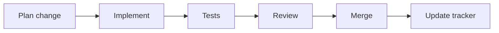

# Engineering Standards: Coding Standards & Definition of Done (Kaigents)

## Purpose
This document defines repository-wide coding standards and Definition of Done (DoD) requirements for Kaigents.

These standards and DoD checks must be applied before any push to the remote. Stated another way: we never push code to the remote unless it works and it passes our coding standards and Definition of Done.

---

## Automated CI Quality Gates

1. Rust code must pass `cargo fmt --check` and `cargo clippy` with no warnings.
2. Go code must pass `gofmt` checks and `golangci-lint` with no errors.
3. TypeScript code for the Kaigents dashboard/web UI must pass linting and typechecking.
4. Python (when present) must pass Ruff linting.
5. Unit tests all pass.
6. Integration or end-to-end tests requiring real-world connections to external services (e.g., a live Kubernetes cluster, live model servers, real object stores) are marked appropriately so CI doesn't try to run them as unit tests.
7. Security-oriented static checks are enabled where appropriate for the languages in use (e.g., Rust dependency audits; Go/TS dependency vulnerability scanning when enabled in CI).

| Gate | Applies to |
| --- | --- |
| Ruff lint | Python (optional lane) |
| rustfmt + clippy | Rust |
| gofmt + golangci-lint | Go |
| ESLint + typecheck | TypeScript (dashboard/web UI) |
| Tests | All |

---

## Manual Coding Standards (All languages)

1. No abbreviations in variable names. The code should read like a narrative; non-programmers should be able to follow the general logic.
2. Every method that can be imported from the module requires doc comments (e.g., docstrings or Rust doc comments `///`) that explain:
   - what it is,
   - why an importing module would use it,
   - and (when appropriate) links to supporting documentation like release notes.
   - A single supporting link is acceptable at the module level if it applies to the entire module.
3. Do not introduce non-permissive license dependencies for the open-source offering.
   - Kaigents is MIT-licensed.
   - Kaigents is intended to be commercial-safe OSS.
   - If a tool/library is not redistributable-safe for the OSS posture, it must be excluded from the core.
   - Integrate-only components are allowed only when clearly separated and documented.
   - Third-party notices must be updated as needed in `THIRD_PARTY_NOTICES.md`.
   - When introducing dependencies under licenses such as Apache-2.0 (or others), ensure required compliance artifacts are present and kept current, including:
     - license texts where required
     - attribution/NOTICE requirements where required
     - an SBOM where required by the release process
4. To encourage simplicity, files should be kept to 1200 lines of code or fewer. Larger files require management approval.

5. Per-file header (required)
   - Every file that supports comments must include a header at the top containing:
     - the file name and repository-relative path
     - a short description of what it provides
     - why it matters to the product/business
     - copyright and license

   Notes:
   - JSON does not reliably support comments across tooling. JSON files are exempt from the per-file header requirement.

   Python template:
   ```python
   """
   File: <repo-relative-path>/example.py
   Purpose: <what this file provides>
   Product/business importance: <why this matters to Kaigents>

   Copyright (c) 2026 John K Johansen
   License: MIT (see LICENSE)
   """
   
   from __future__ import annotations
   ```

   Shell template:
   ```bash
   # File: <repo-relative-path>/example.sh
   # Purpose: <what this file provides>
   # Product/business importance: <why this matters to Kaigents>
   #
   # Copyright (c) 2026 John K Johansen
   # License: MIT (see LICENSE)
   ```

   YAML/TOML template:
   ```yaml
   # File: .github/workflows/example.yml
   # Purpose: <what this file provides>
   # Product/business importance: <why this matters to Kaigents>
   #
   # Copyright (c) 2026 John K Johansen
   # License: MIT (see LICENSE)
   ```



---

## Rust-Specific Standards

1. Formatting: Rust code must be formatted with `rustfmt`.
2. Clippy: no warnings; prefer fixing at the source over allow-listing.
3. Error handling: avoid `unwrap()`/`expect()` in production code. Use `Result` and map errors to domain errors.
4. Unsafe: `unsafe` is prohibited unless explicitly reviewed and documented with a justification comment.
5. Ownership: avoid unnecessary cloning; prefer borrowing. Use `Arc`/`Mutex` only when required and document shared-state usage.
6. Async: avoid blocking inside async contexts. When using a runtime inside sync methods, document why and keep blocking sections minimal.
7. Logging/observability: error paths must log actionable context (error + identifiers) without leaking secrets.
8. Public APIs: document public structs/functions with `///` doc comments and include examples when helpful.
9. Tests: new behavior requires Rust unit tests or integration tests where appropriate.

---

## Python-Specific Standards

1. Formatting/linting: Ruff is the source of truth. Avoid suppressions; fix root causes.
2. Typing: add type hints to all public functions and data structures. Use `from __future__ import annotations` where needed.
3. Exceptions: raise explicit, typed exceptions with clear messages; avoid bare `except:`.
4. Resource handling: use context managers for files and network resources.
5. Serialization: all JSON boundaries must validate and sanitize inputs.
6. Logging: error paths must log actionable context (error + identifiers) without leaking secrets.
7. Tests: new behavior requires Python unit tests or integration tests where appropriate.

8. Evidence and traceability: when implementing run timeline, tooling, or artifact handling, ensure the system can always trace results back to:
   - run identifier
   - correlation identifiers
   - tool/model endpoint identifiers
   - artifact references

---

## Go-Specific Standards

1. Formatting: Go code must be formatted with `gofmt`.
2. Linting: prefer fixing at the source over allow-listing; `golangci-lint` must be clean.
3. Errors: return errors with context; avoid swallowing errors.
4. Context: all external calls must accept `context.Context` and honor cancellation/timeouts.
5. Logging/observability: error paths must log actionable context without leaking secrets.
6. Kubernetes clients: avoid ad-hoc polling loops; prefer informers/watch patterns where appropriate.
7. Tests: new behavior requires unit tests; use integration tests for Kubernetes interactions where appropriate.

---

## TypeScript (Dashboard/Web UI) Standards

1. Language: dashboard/web UI code is written in TypeScript.
2. Formatting/linting: enforce a single formatter/linter configuration and avoid suppressions; fix root causes.
3. Types: avoid `any` in new code; prefer explicit types and narrow unions.
4. API usage:
   - all backend calls must have timeouts and clear user-facing error messages
   - failures should be surfaced with correlation identifiers (run ID, event ID) where applicable
5. Telemetry: do not add default-on external telemetry.
6. Secrets: do not log tokens, credentials, file contents, or PII.
7. UI scope:
   - default to a minimal UI focused on agent/run browsing and run timeline rendering
   - keep artifact preview simple and safe by default
8. Testing:
   - add tests for key flows where feasible (run list, run timeline render, error rendering)

---

## Additional Recommended Standards (Commonly Missed)

These are not intended to add process overhead; they are here to prevent common production and security failures.

1. Dependency hygiene
   - Pin and review dependency changes.
   - Ensure dependency vulnerability scanning is enabled via redistributable tooling where appropriate.

2. Secrets and credentials
   - Never commit secrets.
   - Ensure code does not log credentials, tokens, or sensitive PII.

3. Backwards compatibility and migrations
   - When changing API or storage schemas, ensure backwards compatibility for consumers or provide a migration/bridge plan.
   - Any data migrations must have a documented rollback strategy.

4. Observability requirements for production changes
   - New or changed pipeline behavior must include appropriate logging and metrics.
   - Error paths must be observable and actionable (clear error messages + diagnostic fields).

5. Deterministic behavior and reproducibility
   - Prefer deterministic parsing and precedence rules (documented in PRDs) and add tests to lock behavior.

---

## Definition of Done (DoD)

1. The relevant PRD milestone acceptance criteria are satisfied (see `docs/product/kaigents-prd.md`).
2. The change is consistent with the Architecture & Design doc (see `docs/architecture/kaigents-architecture-and-design.md`) or the deviation is documented.
3. The relevant items in the implementation tracker are updated (see `docs/implementation/kaigents-implementation-tracker.md`).
4. Tests added/updated to cover the change.
5. No secrets are introduced.
6. The commercial-safe OSS posture is preserved:
   - do not bundle or redistribute integrate-only proprietary binaries
   - new dependencies are reviewed for licensing and redistribution safety
   - compliance artifacts are updated as needed (e.g., `THIRD_PARTY_NOTICES.md`, license texts, NOTICE files, SBOM when required)

| DoD area | Check |
| --- | --- |
| Product | PRD milestone acceptance criteria satisfied |
| Design | Consistent with Architecture & Design doc (or deviation documented) |
| Planning | Implementation tracker updated |
| Quality | Tests updated and passing |
| Security | No secrets introduced |
| OSS posture | Commercial-safe OSS posture preserved |
