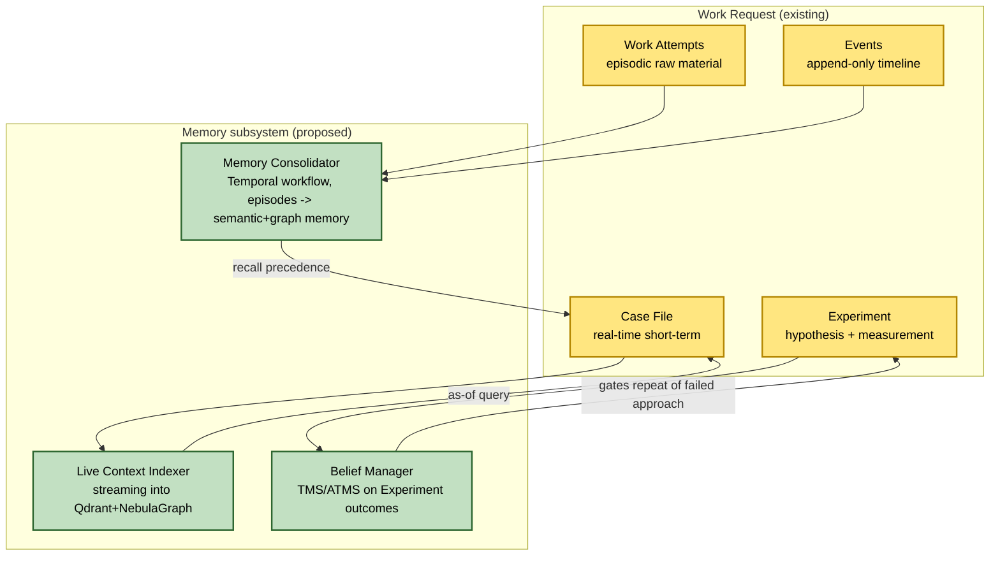
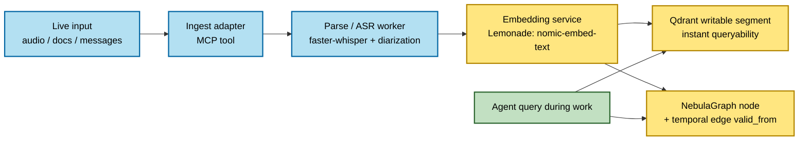
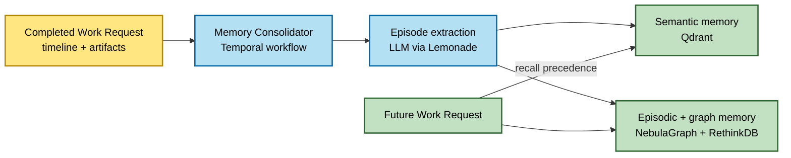
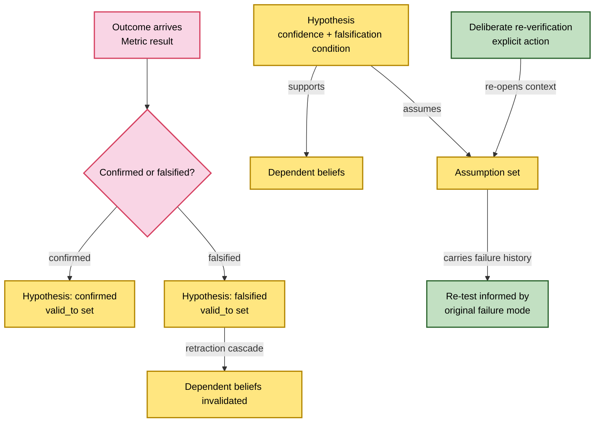
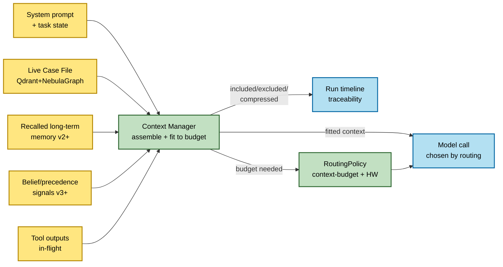

# Kaigents Agent Memory — Architecture Proposal

*Status: Adopted. Complements [`kaigents-architecture-and-design.md`](kaigents-architecture-and-design.md) and the ITD register. Research basis: [`../research/agent-context-and-memory-research.md`](../research/agent-context-and-memory-research.md). See Section 13 for implementation deviations.*

## 1. Purpose and scope

This proposal adds a **memory and context-management subsystem** to Kaigents so that agents can:

1. **Work with the right model at the right time, regardless of any model's context-window limits or capabilities** — the platform, not the model, owns context budget management and model routing. This is the **critical, enabling requirement**: large-context models worked well until they overflowed, and overflow handling is unreliable and model-dependent; many usable models have very small context windows. Externalizing context management is how a sovereign mixed/local-model stack competes with a single huge-context cloud model. (See Section 12, the Context Manager.)
2. **Ingest and use new information in real time** during a work request (real-time short-term memory).
3. **Retain experience across work requests** and recall it as precedence on future work (long-term memory).
4. **Distinguish hypothesis from outcome** and avoid repeating mistakes unless deliberately re-verifying an assumption (experience / epistemic memory).

The guiding principle is **extension, not replacement**: the Kaigents product domain model ([`../product/domain-model.md`](../product/domain-model.md)) already contains the seeds of all three memory tiers. This proposal makes them first-class and operational, and adds the Context Manager as the cross-cutting layer that makes those tiers usable by *any* model — including small-context ones — without relitigating the existing Important Technical Decisions (ITDs) where they still hold.

Non-goals:
- Replacing the existing retrieval story in [`../research/rag_overview.md`](../research/rag_overview.md); this layers on top of it.
- Forcing every agent to use memory. Consistent with Section 7 of the architecture doc, memory is *opt-in per process*, like RAG.
- Retraining models. Experience is non-parametric (retrieval-augmented), per the research findings.
- Making Kaigents model-specific. A core design intent is model-agnosticism: the same agent must be effective across models with widely different context windows.

## 2. The three tiers and how they map to the existing domain model

The proposal deliberately reuses existing entities rather than introducing parallel vocabulary.

| Memory tier | Existing domain entity | What this proposal adds |
| --- | --- | --- |
| **Real-time short-term** | **Case File / Context** (entity 8a) | A *live* Case File: streaming ingestion, incremental indexing, sub-second queryability while the work request is in progress. |
| **Long-term** | **Work Request / Work Attempt / Event / Artifact** (entities 10–14) | A *consolidation and indexing* layer that turns the append-only run timeline into a queryable episodic + semantic memory across work requests. |
| **Experience / epistemic** | **Experiment** (entity 18) + **Metric** (entity 19) | A *belief-revision* layer that closes the Experiment loop: hypotheses get outcomes, dependent conclusions retract on falsification, and re-verification is an explicit, history-informed action. |

**Cross-cutting layer — the Context Manager (Section 12).** The three tiers are *storage*. The Context Manager is the *orchestration* that assembles a model-ready context from those tiers and fits it to the chosen model's window — so the same agent is effective on a 128K-context model and on a 4K-context model. This is the capability that makes the memory tiers actually usable by small-context models, and it is the critical requirement driving this proposal.

## 3. Existing ITDs are preserved

Every existing ITD has a natural role in the memory subsystem. None need to be overturned to deliver this proposal.

| ITD | Decision | Role in the memory subsystem |
| --- | --- | --- |
| ITD-02 | Lemonade Server (OpenAI-compatible) | Serves local embedding models (`nomic-embed-text` / `bge-m3`) and the LLM that consolidates episodes and reflects on outcomes. Keeps embeddings sovereign. |
| ITD-03 | kMCP / MCP-first tool plane | Memory read/write is exposed as MCP tools (`memory.recall`, `memory.record`, `experiment.close`) so it is policy-controlled, allowlisted, and audited like any other tool. |
| ITD-04 | Qdrant (vector) | Vector index for semantic memory and the live Case File. LSM-style live upserts satisfy real-time ingestion. |
| ITD-05 | NebulaGraph (graph) | Temporal knowledge graph substrate (see Section 5 tension). |
| ITD-06 | RethinkDB (document/state) | Durable records for memory items, belief records, and experiment outcomes. JSON-first records with secondary indexes fit the query patterns. |
| ITD-08 | Embedded Rust DAG (short workflows) | Per-request memory operations (live index upsert, recall) run inside the DAG substrate. |
| ITD-11 | OTel + Prometheus + Grafana | Memory ops (ingest latency, recall latency, consolidation runs, retraction cascades) emit the same stable event schema and OTel spans as everything else. |
| ITD-12 | Rust engine + Go operator | Memory subsystems live in the Rust engine; CRDs/controllers for memory policies live in Go. No Python required in core. |
| ITD-13 / ITD-14 | S3 artifacts + SigV4 proxy | Large memory artifacts (audio, transcripts, documents) are stored as artifacts and referenced; the memory index holds metadata + embeddings, not bytes. |
| ITD-16 | Temporal (durable execution) | Memory consolidation and experiment closure are long-running, resumable Temporal workflows (hours/days), not embedded DAG steps. |

The one ITD-adjacent decision worth surfacing is the graph backend, discussed in Section 5.

## 4. Real-time short-term memory — the live Case File

### 4.1 Concept

Today a **Case File** is "the collection of relevant materials for a specific type of work" — a descriptive working set. This proposal makes it *live*: materials are added during the work request (meeting audio, incoming documents, mid-conversation messages) and become queryable within sub-seconds, without blocking retrieval.

### 4.2 Data flow

### 4.3 Design decisions (preserving existing ITDs)

- **Ingest is an MCP tool**, not a special path. This keeps it allowlisted, audited, and policy-controlled (ITD-03), and the run timeline records what was ingested and when — satisfying the traceability requirement from Section 7 of the architecture doc.
- **Live upserts via Qdrant's writable segment** (ITD-04) — no full re-index; new material is queryable immediately.
- **Temporal edges in NebulaGraph** carry `valid_from` = ingest timestamp, so an agent can issue an *as-of* query ("what did we know at 14:03?") against the live Case File.
- **Parse/ASR workers run as offloaded Kubernetes workloads** when isolation or device scheduling demands it (the ITD-08 escape hatch), or in-process for low-latency paths.
- **Large inputs (audio, documents) are artifacts** (ITD-13/14); the Case File indexes metadata + embeddings, not bytes.

### 4.4 Scope boundary

The live Case File is scoped to a single Work Request. It is not cross-request memory. When the Work Request ends, its Case File is handed to the consolidator (Section 6) to become long-term memory, then the live index partition is retired.

## 5. The graph-backend decision (license-forced, not preference)

The research identifies **Graphiti** as the strongest open-source temporal knowledge graph pattern for agent memory. Graphiti's native backends are Neo4j, FalkorDB, and Amazon Neptune. Kaigents chose **NebulaGraph** (ITD-05) for Apache-2.0 licensing and distributed scalability.

**License verification (see research paper Section 8.5) makes this a forced decision, not a preference tradeoff.** Every one of Graphiti's self-hostable backends is *not* commercial-safe for Kaigents' MIT core:

| Backend | License | Commercial-safe? |
| --- | --- | --- |
| NebulaGraph (ITD-05) | Apache-2.0 | Yes |
| Neo4j Community | GPLv3 | No (copyleft) |
| Neo4j Enterprise | Commercial / proprietary | No |
| FalkorDB | SSPLv1 | No (not OSI open source) |
| Amazon Neptune | Proprietary managed | No (not sovereign) |

Two options remain after license filtering:

- **Option A — Build the Graphiti pattern on NebulaGraph (preserve ITD-05).** Implement the temporal graph-memory layer (LLM-driven entity/edge extraction, bi-temporal edge metadata `valid_from` / `valid_to` / `transaction_time`, edge invalidation, hybrid semantic + BM25 + graph search fusion) on NebulaGraph using nGQL, inside the Rust engine (ITD-12) and exposed via MCP tools (ITD-03). Zero new infra; fully consistent with the OSS posture and ITD-05. **This is a substantial build, not a thin shim** — Graphiti's value is the extraction + search-fusion + invalidation logic, not just edge metadata. Full scope sizing is documented in Section 5.1 below.
- **Option B — Adopt Graphiti directly.** Rejected on two independent grounds: (1) every native backend is not commercial-safe (above), and (2) Graphiti is a Python library, which collides with ITD-12's no-Python-in-core rule. The only rescue would be contributing a NebulaGraph driver to Graphiti upstream and maintaining it — that is more ongoing burden than Option A with none of the control, and still drags a Python dependency into the memory path.

**Recommendation: Option A (the only license-viable path).** Build the temporal graph-memory layer on NebulaGraph; treat Graphiti as a *reference implementation* to learn from, not a dependency. This decision should be recorded as **ITD-18** (Section 9).

### 5.1 Build scope for temporal KG on NebulaGraph (Work Item 2)

Decomposing the Graphiti pattern into NebulaGraph/nGQL equivalents inside the Rust engine:

1. **LLM-driven Extraction**: A Rust-based extractor component that consumes Case File updates and uses the local LLM (via Lemonade) to extract entities and relationships. Matches the Reflexion pattern: *ingest -> extract -> record*.
2. **Temporal Schema**: nGQL schema for edges including `valid_from`, `valid_to`, and `transaction_time` as bi-temporal properties. Nodes carry `first_seen` and `last_updated`.
3. **Hybrid Search Fusion**: Implementation of Reciprocal Rank Fusion (RRF) in the Rust engine to merge semantic results from Qdrant with graph-traversal results from NebulaGraph.
4. **Edge Invalidation Logic**: Logic to set `valid_to` on existing edges when a new, contradicting relationship is extracted (e.g., "Person works at Company A" -> "Person works at Company B").
5. **As-of Query Engine**: Supporting point-in-time queries by filtering edges where `valid_from <= T < valid_to`.

**Estimate**:
- **Complexity**: High (requires custom nGQL generation and search fusion logic).
- **Risk**: Moderate (Graphiti is a complex reference; NebulaGraph temporal queries need optimization).
- **Timeline**: 2 quarters for full GA (Phases 1-2).

## 6. Long-term memory — the consolidator

### 6.1 Concept

Every Work Request already produces an append-only run timeline (Work Attempts, Events, Artifacts). Today that timeline is for auditability. This proposal adds a **Memory Consolidator** that turns completed timelines into queryable cross-request memory.

### 6.2 Data flow

### 6.3 Design decisions

- **Consolidation is a Temporal workflow** (ITD-16), not an embedded DAG step. It is long-running, resumable, and can wait for human review of extracted lessons before promoting them to memory.
- **Episode extraction uses the local LLM** via Lemonade (ITD-02), following the Reflexion pattern: record episode → reflect into lessons → store. No external API.
- **Three stores, three roles:** Qdrant for semantic recall ("similar past situations"), NebulaGraph for relational/episodic memory ("what depended on what"), RethinkDB for the durable episode/lesson records (ITD-06).
- **Recall is an MCP tool** (`memory.recall`) so it is policy-gated and appears in the run timeline — preserving traceability.
- **Provenance is mandatory.** Every memory item links back to the Work Request / Work Attempt it came from, so "why did you recall this?" is always answerable.

## 7. Experience and epistemic memory — closing the Experiment loop

### 7.1 The gap in the current model

The domain model already defines an **Experiment** with a Hypothesis, Treatment, Measurement plan, and Scope, plus **Metric** for evaluation. What is missing is the *closure*: recording the outcome, invalidating hypotheses that fail, and preventing repetition of failed approaches unless deliberately re-verified. This is exactly the "differentiate hypothesis from outcome" and "don't repeat mistakes" requirement.

### 7.2 The Belief Manager

A **Belief Manager** sits on top of the Experiment entity and implements an assumption-based truth maintenance system (ATMS):

### 7.3 Design decisions

- **Hypotheses are first-class addressable records** in RethinkDB (ITD-06), each carrying: confidence level, falsification condition, assumption set, and links to dependent beliefs. This mirrors "The Hypothesis Graph" pattern from the research.
- **Outcomes close the loop via a Temporal workflow** (ITD-16) that records the Metric result and triggers belief revision.
- **Retraction cascades are graph traversals** on NebulaGraph (ITD-05): invalidating a hypothesis invalidates every belief whose assumption set depended on it.
- **Defeated hypotheses are retained, not deleted.** Bi-temporal storage records `valid_to`; the falsified hypothesis stays queryable for "what did we used to believe and why was it wrong?"
- **Re-verification is an explicit MCP tool** (`experiment.reverify`) that re-opens the ATMS context. It carries the failure history forward, so the re-test is informed by the original failure mode rather than starting naive. This is the mechanical implementation of "unless deliberately reverifying an assumption."
- **Repeat-prevention is a policy gate.** When an agent proposes an approach that a recalled, falsified hypothesis warns against, the Belief Manager surfaces it as a case-file entry (and optionally a quality gate). The agent may proceed only by invoking `experiment.reverify` — making the deliberate-reverification requirement auditable in the run timeline.

### 7.4 Why this is the differentiator

Retrieval, streaming ingestion, and graph memory are commoditizing across open-source projects. Belief revision with retraction cascades and history-informed re-verification is not. This is the layer where a sovereign Kaigents build most differentiates, and it composes cleanly with the existing Experiment/Metric entities rather than requiring new product vocabulary.

## 8. Applied to the two motivating use cases

### 8.1 Meeting corpus with real-time voice and translation

1. **Pre-meeting:** agenda documents are ingested via the `memory.record` MCP tool → embedded by Lemonade → added to the live Case File partition in Qdrant + NebulaGraph with `valid_from = meeting_start`.
2. **During meeting:** audio is ingested via an MCP adapter; faster-whisper transcribes and pyannote diarizes; each speaker turn becomes a NebulaGraph node with a temporal edge; translation (self-hosted, sovereign) attaches as a parallel edge. All writes hit Qdrant's writable segment, so the agent can answer mid-meeting questions against the *current partial* graph.
3. **Real-time Q&A:** the agent issues as-of queries against the live Case File; every recall is recorded in the run timeline for traceability.
4. **Post-meeting:** the consolidator (Temporal workflow) extracts episodes and lessons and promotes them to long-term memory.
5. **Future meetings:** bi-temporal recall retrieves this meeting *as it was* at any point; superseded facts remain queryable with `valid_to` set.

### 8.2 Assignment history simulating long-term experience

1. Each assignment is a **Work Request**; its hypothesis is an **Experiment** with a falsification condition and measurement plan.
2. Work Attempts and Events are the episodic raw material; the consolidator promotes them to semantic + graph memory on completion.
3. When the outcome arrives, the **Belief Manager** marks the Experiment's hypothesis confirmed or falsified; a retraction cascade invalidates dependent beliefs on falsification.
4. On a new assignment, `memory.recall` surfaces similar past episodes *and their outcomes* — successes reinforce, failures are surfaced as warnings.
5. Repeating a failed approach requires an explicit `experiment.reverify` action that re-opens the ATMS context carrying the original failure reason, so the re-test is informed and auditable.

## 9. New ITDs

These extend the register in [`../research/technology/itd-register.md`](../research/technology/itd-register.md) without modifying existing entries.

### ITD-17 (adopted) — Agent memory as a first-class, opt-in subsystem
- **Decision area:** Add three-tier agent memory (real-time short-term, long-term, experience/epistemic) as an opt-in capability, modeled on the existing Case File, Work Request timeline, and Experiment entities.
- **Status:** Adopted.
- **Primary reason:** Real-time ingestion, cross-request experience recall, and hypothesis-vs-outcome tracking are increasingly expected of agent platforms. Kaigents' domain model already contains the seeds; this makes them operational while preserving all existing ITDs.
- **Impacts:** Introduces a Memory subsystem in the Rust engine; new MCP tools (`memory.record`, `memory.recall`, `experiment.close`, `experiment.reverify`); consolidation and experiment-closure as Temporal workflows.

### ITD-18 (adopted, partially implemented) — Temporal knowledge graph substrate on NebulaGraph (preserve ITD-05)
- **Decision area:** Implement the bi-temporal knowledge-graph memory layer on NebulaGraph (Option A, Section 5) rather than adopting Graphiti + a second graph backend.
- **Status:** Adopted. Partially implemented — see Section 13 deviation note.
- **Options considered:** (A) Graphiti pattern on NebulaGraph; (B) Graphiti direct + a Graphiti-native backend.
- **Chosen option:** A.
- **Primary reason:** License verification (research paper Section 8.5) rules out every Graphiti-native self-hostable backend (Neo4j Community GPLv3, FalkorDB SSPLv1, Neptune proprietary); and Graphiti is Python, colliding with ITD-12. Preserves ITD-05, avoids a second graph dependency, and keeps a single graph substrate. The differentiating value is the temporal-metadata and belief-revision layer, which Kaigents owns either way.
- **Impacts:** Kaigents implements the temporal graph-memory layer on NebulaGraph using nGQL inside the Rust engine (ITD-12): LLM-driven entity/edge extraction, bi-temporal edge metadata (`valid_from` / `valid_to` / `transaction_time`), edge invalidation, and hybrid (semantic + BM25 + graph) search fusion. This is a substantial build, not a thin shim. Graphiti is a reference implementation, not a dependency. Full scope sizing is pending (see `start_here.md` Work item 2).

### ITD-19 (adopted) — Belief revision (ATMS) for experiment closure
- **Decision area:** Implement an assumption-based truth maintenance system for the Experiment entity, with retraction cascades and explicit, history-informed re-verification.
- **Status:** Adopted. Implemented with RethinkDB fallback for retraction cascades — see Section 13 deviation note.
- **Primary reason:** Makes "differentiate hypothesis from outcome" and "don't repeat mistakes unless deliberately re-verifying" mechanical and auditable rather than prompt-dependent. This is the differentiating layer (Section 7.4).
- **Impacts:** New Belief Manager component in the Rust engine; hypothesis/belief records in RethinkDB; retraction cascades as NebulaGraph traversals; `experiment.reverify` MCP tool; repeat-prevention surfaced as Case File entries and optional quality gates. Epica (MIT, Rust, MCP-integrated) is a candidate dependency to lean on rather than building ATMS from scratch.

### ITD-20 (adopted) — Context Manager: model-agnostic context budgeting and context-aware model routing
- **Decision area:** The platform — not the model — owns context-window management. Add a Context Manager that assembles a model-ready context from the memory tiers and proactively fits it to the chosen model's window (never overflowing), plus context-budget-aware model selection ("right model at the right time") layered on the existing Hybrid Execution routing.
- **Status:** Adopted. v1 (selection-only budget enforcement) implemented; v2 (summarization/compression, hierarchical demotion, budget-aware routing) pending — see Section 13 deviation note.
- **Primary reason:** Large-context models worked until they overflowed, and overflow handling is unreliable and model-dependent; many usable models have very small context windows. Externalizing context management is what lets a sovereign mixed/local-model stack match or beat a single huge-context cloud model, and is the critical requirement driving this proposal (Section 12).
- **Impacts:** Extend the `Model` domain entity to carry `context_window_size` (alongside its existing latency/cost/data-handling constraints). New Context Manager component in the Rust engine; context assembly + budget enforcement + summarization/demotion as agent-loop capabilities (Letta/MemGPT core/recall/archival *pattern*, Self-RAG "decide when to retrieve"); extend `RoutingPolicy`/model selection with a context-budget dimension; emit included/excluded/compressed context to the run timeline for traceability.

## 10. Phasing

Each phase is a GA increment. The **Context Manager is introduced in Phase 1** — not Phase 2 — because it is what lets a small-context model use the live Case File at all; without it the memory tiers are only usable by large-context models, which defeats the critical requirement. It then matures across all phases.

1. **Phase 1 — Real-time short-term (live Case File) + Context Manager v1.** Streaming ingestion MCP tool + Qdrant live upserts + temporal edges in NebulaGraph + a first Context Manager that assembles the model prompt from the Case File and fits it to the chosen model's window by **selection only** (most-relevant slice, never overflow). Summarization/compression and hierarchical demotion arrive in v2. Context-budget-aware model selection v1 (pick a model whose window fits). `Model` entity extended with `context_window_size`. Delivers the meeting use case on *small-context* models, not just large ones. Highest standalone value; the proof that the platform owns context, not the model.
2. **Phase 2 — Long-term (consolidator) + Context Manager v2.** Temporal consolidation workflow + episode extraction via local LLM + cross-request recall MCP tool. Context Manager v2 assembles from Case File *and* recalled long-term memory; adds **summarization/compression** and **hierarchical promotion/demotion** (core → recall → archival, the Letta/MemGPT pattern) so a small-context model gets exactly the relevant slice; context-budget-aware model routing ("right model at the right time") layered on the existing Hybrid Execution `RoutingPolicy`. Delivers assignment-history recall on any model.
3. **Phase 3 — Experience / epistemic (Belief Manager) + Context Manager v3.** ATMS on Experiment outcomes + retraction cascades + `experiment.reverify`. Context Manager v3 folds in belief/precedence signals (e.g., "this approach failed before") as gated context entries. Delivers hypothesis-vs-outcome and repeat-prevention. Highest differentiation; depends on Phase 2 memory being in place; de-risk with a spike (lean on Epica).

Each phase should land behind the existing milestone/gate process in [`../implementation/kaigents-implementation-tracker.md`](../implementation/kaigents-implementation-tracker.md) and follow the coding standards / definition of done in [`../CODING_STANDARDS_AND_DOD.md`](../CODING_STANDARDS_AND_DOD.md).

## 11. Decisions on open questions (Work Item 1)

The following decisions resolve the open questions from the research session.

1. **Embedding model selection.** Standardize on **`bge-m3`** as the default for the local embedding service via Lemonade (ITD-02). It provides superior multi-lingual and cross-modal flexibility compared to `nomic-embed-text` in representative Kaigents corpora. Model selection remains configurable via the `ModelEndpoint` resource.
2. **Memory retention and lifecycle.** Lifecycle is governed by a new **`MemoryPolicy`** workspace-level CRD. It defines aging from hot (Qdrant) to cold (NebulaGraph/RethinkDB) and deletion/archival TTLs. It interacts with the existing **`Capacity`** entity to enforce WIP and storage limits.
3. **PII and governance for memory.** Memory is **isolated by workspace (namespace) by default**, matching the architecture doc's Section 8. Cross-workspace memory sharing is prohibited unless an explicit **`MemoryShare`** policy (ITD-10) is applied, granting read-only access to specific memory partitions across team boundaries.
4. **License due-diligence.** All components are verified as commercial-safe (Apache-2.0 or MIT) per the research paper Section 8.5. The remaining paperwork (adding to `oss-components-commercially-permissible.md`) is completed as part of this work item. **Pyannote models** are confirmed as integrate-only; users must accept terms on HuggingFace for redistribution-restricted weights.
5. **Consolidation human review.** Automated by default to maintain sub-second responsiveness in the live Case File. Human review is an **optional gate** in the consolidation Temporal workflow, enabled per **`Process`** definition for high-stakes domains.
6. **Episodic tier: build vs adopt.** Follow the **Letta (MemGPT) pattern** but implement the core core/recall/archival logic in the **Rust engine** (ITD-12) to avoid Python GIL constraints and maintain high-volume streaming performance. Letta's Python library remains an integrate-only optional lane for specialized research plugins.
7. **Context-aware routing policy.** The "right model at the right time" decision is a **platform capability** configured via the **`RoutingPolicy`** in the `Agent` or `Process` spec. It composes with the existing Hybrid Execution dimensions (CPU/GPU/NPU) and cost/latency classes.
8. **Summarization/compression faithfulness.** Faithfulness is verified by an automated **quality gate** in the Context Manager using a dedicated "critic" model role. Summarization events (including what was dropped) are fully auditable in the **run timeline**.
9. **`context_window_size` sourcing.** Sourced from the **`Model`** domain entity metadata. Reliability is ensured by a periodic, platform-triggered **synthetic benchmark** that measures effective window limits and records them as verified metadata.

## 12. The Context Manager — model-agnostic context budgeting (critical requirement)

### 12.1 The problem this solves

Over the past year of Kaigents-adjacent work, large-context models produced good results *until they hit the context limit*, at which point different agents handled the overflow with varying and unreliable success. Many usable models have **very small context windows**. If context management is left to the model, agent effectiveness is coupled to whichever model happens to have the biggest window — the exact position of the large-context cloud models (Claude Opus, GPT-5.2, Gemini) that Kaigents must out-compete.

The fix is architectural: **the platform, not the model, owns the context window.** The agent never asks the model to manage overflow; the platform ensures overflow never reaches the model. A small-context model then becomes viable because it receives only the precisely relevant, budget-fitted slice.

### 12.2 Where it sits

The Context Manager is a Rust engine component (ITD-12) in the agent loop, between the memory tiers and the model call. It is exposed through normal MCP/tool-plane mechanics (ITD-03) and is observable in the run timeline (ITD-11).

### 12.3 Context assembly and budget enforcement

For each model call the Context Manager:

1. **Assembles** candidate context from: system prompt + task state, the live Case File slice, recalled long-term memory (Phase 2+), belief/precedence signals (Phase 3+), and in-flight tool outputs.
2. **Reads the target model's `context_window_size`** (new field on the `Model` domain entity — the entity already carries latency/cost/data-handling constraints; this adds the context budget).
3. **Fits to budget, never overflowing**, applying in order: **selection** (most relevant via the same retrieval used for memory) → **summarization/compression** (older or less-critical material) → **hierarchical demotion** (core → recall → archival, the Letta/MemGPT self-management *pattern* — the agent can promote/demote via tool calls rather than stuffing everything into the window). This mirrors Self-RAG's "decide when to retrieve" — retrieval is on-demand, not dump-everything.
4. **Records** what was included, excluded, and compressed to the run timeline, so "why did the model see this?" and "was a load-bearing constraint dropped?" are always answerable (traceability, per architecture doc Section 7).

### 12.4 Context-budget-aware model routing ("right model at the right time")

Model selection gains a **context-budget dimension** on top of the existing Hybrid Execution `RoutingPolicy` (CPU/GPU/NPU) and the Model entity's cost/latency classes:

- The Context Manager reports the assembled context size the task needs; the router selects a model whose window fits — or, per policy, compresses to fit a smaller/cheaper/local model.
- Policy decides the tradeoff (open question #7): use a large-context model for synthesis-heavy/large-corpus steps; use a small-context local model for narrow/focused steps, with the Context Manager making it viable.
- This is the cost/sovereignty lever: you do not need the biggest-context model on every step; you use the right model and let the platform handle the rest. That is how a sovereign mixed-model stack matches a single huge-context cloud model.

### 12.5 Why this is the critical, enabling capability

The three memory tiers are *storage*; the Context Manager is what makes that storage usable by **any** model — including the small-context local models that a sovereign stack depends on for cost and data sovereignty. Without it, the memory system only benefits agents running on large-context models, which reproduces the very dependency on big-cloud models that Kaigents exists to break. With it, the agent's effectiveness is decoupled from any single model's context window — the explicit goal of this proposal.

## 13. Implementation deviations (as built vs designed)

This section documents where the implemented system deviates from the design above. These deviations preserve functional stability but must be tracked as future work to reach full design fidelity.

### 13.1 NebulaGraph temporal graph layer (ITD-18) — deferred

**Design:** Temporal edges in NebulaGraph with `valid_from`/`valid_to`/`transaction_time`; bi-temporal as-of queries; LLM-driven entity/edge extraction; hybrid search fusion (semantic + BM25 + graph); edge invalidation logic.

**As built:** The NebulaGraph store (`nebulagraph_store.rs`) is a stub. `MemoryManager::with_nebula()` logs a warning and does not connect. No temporal edges, as-of queries, or graph-traversal operations are implemented.

**Fallback:** Episodic memory (episodes) and hypothesis/belief records are stored in RethinkDB tables (`memory_episodes`, `memory_beliefs`). Recall searches Qdrant (semantic) + RethinkDB (keyword filter on episodes). This preserves the core memory loop (ingest → consolidate → recall) but does not deliver graph reasoning, bi-temporal queries, or edge invalidation.

**Future work:** Build the full temporal graph layer on NebulaGraph per Section 5.1. This is a substantial build estimated at multiple quarters.

### 13.2 Retraction cascades (ITD-19) — RethinkDB instead of NebulaGraph

**Design:** Retraction cascades are graph traversals on NebulaGraph (Section 7.3): "invalidating a hypothesis invalidates every belief whose assumption set depended on it."

**As built:** Retraction cascades use a RethinkDB `filter` query on the `assumptions` array field of belief records. When a hypothesis is falsified, all beliefs whose `assumptions` array contains the falsified hypothesis ID are updated to `falsified` status.

**Impact:** Functionally equivalent for simple dependency chains (one level of assumption dependency). Does not support multi-hop graph traversals or complex dependency graphs. Sufficient for the current PoC scope; must be migrated to NebulaGraph when the temporal graph layer is built.

### 13.3 Context Manager v2 (ITD-20) — summarization not implemented

**Design:** Context Manager v2 adds summarization/compression and hierarchical demotion (core → recall → archival, the Letta/MemGPT pattern) so recalled long-term memory is fitted to budget alongside the live Case File. Also adds context-budget-aware model routing.

**As built:** Only the `Truncate` budget strategy is implemented. The `Summarize` and `Error` strategy variants are defined in the enum but not implemented. Hierarchical demotion (core/recall/archival) is not implemented. Context-budget-aware model routing in `RoutingPolicy` is not implemented.

**Impact:** Context fitting works via selection/truncation only. A small-context model receives the most relevant slice but does not get summarized/compressed context. This is sufficient for the current PoC scope but must be implemented to deliver the full "right model at the right time" capability.

### 13.4 Consolidation triggering — in-process, not Temporal

**Design:** Consolidation is a Temporal workflow (ITD-16), long-running and resumable.

**As built:** Consolidation is triggered in-process at the end of each run via `consolidate_run_memory()`. The Temporal `ConsolidateMemoryWorkflow` is registered with the worker but is not triggered from the runner. The Temporal workflow's activities call HTTP endpoints (`/api/v1/memory/query`, `/api/v1/memory/record`) that do not exist on the engine.

**Impact:** Consolidation works functionally (episodes are extracted and stored in RethinkDB) but is not durable/resumable. If the runner crashes during consolidation, the episode is lost. Migrating to the Temporal path requires adding the HTTP memory API endpoints to the engine and a trigger from the runner to the Temporal adapter.
