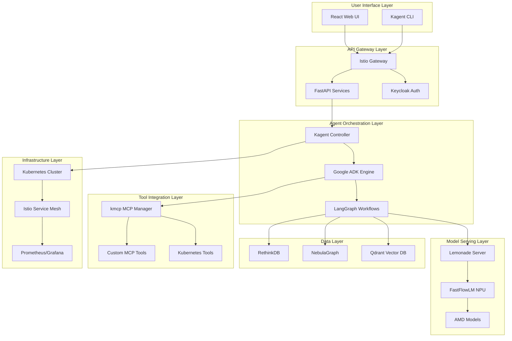

# AI Agent Engine Architecture

**Status:** Superseded by `docs/architecture/kaigents-architecture-and-design.md`.

**Project:** AI Customer Agents - General Purpose Agent Engine  
**Version:** 1.0  
**Date:** 2026-03-06  

---

## 🎯 ARCHITECTURAL OVERVIEW

This architecture defines a **general-purpose AI agent execution engine** optimized for AMD Ryzen AI hardware, built on Kubernetes-native foundations with commercial-safe open-source components.

### **Core Design Principles**
1. **Kubernetes-Native** - All components containerized and orchestrated
2. **AMD-Optimized** - NPU+GPU+CPU hybrid execution
3. **MCP-First** - Model Context Protocol for tool integration
4. **Commercial Safe** - All components permissively licensed
5. **Multi-Agent** - Support for complex agent orchestration

---

## 🏗️ HIGH-LEVEL ARCHITECTURE



---

## 🔧 COMPONENT ARCHITECTURE

### **1. Agent Orchestration Layer**

#### **Kagent Controller**
```yaml
Responsibilities:
  - Agent lifecycle management
  - Kubernetes custom resources
  - MCP server orchestration
  - OpenTelemetry integration
  
Components:
  - Controller: Watches Agent CRDs
  - UI: Web-based agent management
  - Engine: Runs agents using Google ADK
  - CLI: Command-line management tool
```

#### **Google ADK Engine**
```python
# Agent execution runtime
class ADKAgentRunner:
    def __init__(self):
        self.session_manager = SessionManager()
        self.tool_registry = ToolRegistry()
        self.llm_providers = LLMProviderRegistry()
    
    async def run_agent(self, agent_config, input_data):
        session = self.session_manager.create_session()
        tools = self.tool_registry.get_tools(agent_config.tools)
        llm = self.llm_providers.get_provider(agent_config.llm)
        return await agent.execute(session, tools, llm, input_data)
```

#### **LangGraph Workflow Engine**
```python
# Complex agent workflows
class AgentWorkflow:
    def __init__(self):
        self.graph = StateGraph(AgentState)
        self.setup_nodes()
        self.setup_edges()
    
    def setup_nodes(self):
        self.graph.add_node("planner", self.plan_step)
        self.graph.add_node("executor", self.execute_step)
        self.graph.add_node("validator", self.validate_step)
    
    def setup_edges(self):
        self.graph.add_edge("planner", "executor")
        self.graph.add_edge("executor", "validator")
        self.graph.add_conditional_edges("validator", self.should_continue)
```

### **2. Model Serving Layer**

#### **Lemonade + FastFlowLM Integration**
```yaml
Hybrid Execution Strategy:
  Prompt Processing: AMD NPU (FastFlowLM)
  Token Generation: AMD GPU (Vulkan)
  System Operations: CPU
  
Models:
  - Qwen3-Coder-30B-A3B-Instruct (Hybrid)
  - GPT-OSS-20B (Hybrid)
  - nomic-embed-text-v2-moe (Embeddings)
  
Environment Variables:
  - LEMONADE_FLM_LINUX_BETA=1
  - XRT_TARGET=amdxdna
  - MEMLOCK=infinity
```

#### **AMD NPU Optimization**
```python
class AMDOptimizedModel:
    def __init__(self, model_path):
        self.model_path = model_path
        self.npu_available = self.check_npu()
        self.hybrid_mode = self.npu_available
    
    async def generate(self, prompt):
        if self.hybrid_mode:
            return await self.hybrid_generate(prompt)
        else:
            return await self.gpu_generate(prompt)
    
    async def hybrid_generate(self, prompt):
        # NPU handles prompt processing
        processed_prompt = await self.npu_process(prompt)
        # GPU handles token generation
        return await self.gpu_generate_tokens(processed_prompt)
```

### **3. Tool Integration Layer**

#### **kmcp MCP Server Management**
```yaml
Built-in MCP Servers:
  - kubernetes: Pod, Service, Deployment management
  - istio: Traffic management, security policies
  - helm: Chart deployment and management
  - argo: CI/CD pipeline orchestration
  - prometheus: Metrics and monitoring
  - grafana: Dashboard management
  
Custom MCP Servers:
  - code-analysis: Repository analysis tools
  - documentation: Doc generation and management
  - testing: Test execution and reporting
```

#### **Custom Tool Development**
```python
# Example: Code Analysis MCP Server
class CodeAnalysisMCPServer:
    def __init__(self):
        self.tools = [
            self.analyze_repository,
            self.find_functions,
            self.extract_dependencies,
            self.generate_documentation
        ]
    
    async def analyze_repository(self, repo_path: str):
        """Analyze code repository structure and semantics"""
        analyzer = RepositoryAnalyzer(repo_path)
        return await analyzer.analyze()
```

### **4. Data Layer Architecture**

#### **Vector Database (Qdrant)**
```python
class KnowledgeBase:
    def __init__(self):
        self.qdrant = QdrantClient()
        self.embedder = AMDEmbedder()  # NPU-optimized
    
    async def store_code_knowledge(self, code_entities):
        embeddings = await self.embedder.embed(code_entities)
        await self.qdrant.upsert(
            collection_name="code_knowledge",
            points=embeddings
        )
```

#### **Graph Database (NebulaGraph)**
```python
class CodeKnowledgeGraph:
    def __init__(self):
        self.nebula = NebulaGraphClient()
    
    async def build_code_graph(self, ast_data):
        """Build knowledge graph from AST analysis"""
        vertices = self.extract_vertices(ast_data)
        edges = self.extract_edges(ast_data)
        await self.nebula.insert_vertices(vertices)
        await self.nebula.insert_edges(edges)
```

#### **Document Store (RethinkDB)**
```python
class AgentStateStore:
    def __init__(self):
        self.rethink = RethinkClient()
    
    async def store_agent_state(self, agent_id, state):
        """Store agent execution state"""
        await self.rethink.table("agent_states").insert({
            "id": agent_id,
            "state": state,
            "timestamp": r.now()
        })
```

---

## 🚀 DEPLOYMENT ARCHITECTURE

### **Kubernetes Namespace Structure**
```yaml
Namespaces:
  ai-agents-system:    # Core engine components
  ai-agents-workloads: # User agent workloads
  ai-agents-tools:     # MCP servers
  ai-agents-monitoring: # Observability stack
  ai-agents-data:      # Data layer services
```

### **Service Mesh Configuration**
```yaml
Istio Features:
  - mTLS between all services
  - Traffic management for A/B testing
  - Circuit breakers for resilience
  - Request tracing for debugging
  - Rate limiting for API protection
```

### **Resource Management**
```yaml
Hardware Allocation:
  NPU: Dedicated to model inference
  GPU: Shared between agents
  CPU: System operations and tool execution
  Memory: Vector databases and caching
  
Resource Limits:
  Agent Pods: 2-4 CPU, 4-8GB RAM
  Model Server: 1 NPU, 1 GPU, 16GB RAM
  Data Services: 4 CPU, 32GB RAM
```

---

## 🔒 SECURITY ARCHITECTURE

### **Authentication & Authorization**
```yaml
Authentication:
  - Keycloak OIDC integration
  - JWT tokens with short TTL
  - MFA for admin access
  
Authorization:
  - RBAC for agent management
  - Namespace-based isolation
  - Resource quotas per user
```

### **Data Security**
```yaml
Data Protection:
  - Encryption at rest (all databases)
  - Encryption in transit (mTLS)
  - API key rotation
  - Audit logging for all operations
  
Compliance:
  - GDPR data handling
  - SOC2 controls
  - Data retention policies
```

---

## 📊 MONITORING & OBSERVABILITY

### **Metrics Collection**
```yaml
Key Metrics:
  - Agent execution time
  - Token generation rate
  - NPU utilization
  - GPU utilization
  - Memory usage
  - Error rates
  - Request throughput
```

### **Distributed Tracing**
```yaml
OpenTelemetry Integration:
  - Agent workflow traces
  - Model inference traces
  - Tool execution traces
  - Cross-service correlation
```

### **Logging Strategy**
```yaml
Log Management:
  - Structured JSON logging
  - Centralized log aggregation
  - Log-based alerting
  - Retention policies
```

---

## 🔄 SCALING ARCHITECTURE

### **Horizontal Scaling**
```yaml
Scalable Components:
  - Agent execution pods
  - Model serving instances
  - MCP server replicas
  - API gateway instances
  
Scaling Strategies:
  - HPA based on CPU/memory
  - Custom metrics for queue depth
  - Cluster autoscaling for nodes
```

### **Performance Optimization**
```yaml
Optimization Techniques:
  - Model caching in memory
  - Vector database indexing
  - Connection pooling
  - Async processing
  - Batch operations
```

---

## 🎯 AMD OPTIMIZATION STRATEGY

### **NPU Acceleration**
```python
class NPUOptimizer:
    def __init__(self):
        self.npu_manager = NPUManager()
        self.hybrid_executor = HybridExecutor()
    
    async def optimize_inference(self, model, input_data):
        # Profile NPU vs GPU performance
        npu_time = await self.benchmark_npu(model, input_data)
        gpu_time = await self.benchmark_gpu(model, input_data)
        
        # Choose optimal execution path
        if npu_time < gpu_time * 0.8:  # 20% improvement threshold
            return await self.hybrid_executor.run_npu(model, input_data)
        else:
            return await self.hybrid_executor.run_gpu(model, input_data)
```

### **Model Optimization Pipeline**
```yaml
Model Preparation:
  1. Quantization: AMD-optimized quantization
  2. Calibration: NPU-specific calibration
  3. Validation: Accuracy and performance testing
  4. Deployment: Hybrid execution configuration
  
Supported Models:
  - Qwen series (coder variants)
  - GPT-OSS models
  - Embedding models (nomic)
  - Custom fine-tuned models
```

---

## 📋 IMPLEMENTATION ROADMAP

### **Phase 1: Foundation (Week 1-2)**
- [ ] Deploy Kubernetes cluster with Istio
- [ ] Install Kagent and Google ADK
- [ ] Setup kmcp and built-in MCP servers
- [ ] Deploy Qdrant and RethinkDB

### **Phase 2: Model Integration (Week 3-4)**
- [ ] Setup Lemonade with FastFlowLM
- [ ] Configure AMD NPU drivers
- [ ] Deploy hybrid model serving
- [ ] Performance testing and optimization

### **Phase 3: Agent Development (Week 5-6)**
- [ ] Implement LangGraph workflow engine
- [ ] Setup NebulaGraph knowledge graphs
- [ ] Develop custom MCP tools
- [ ] Create first domain-specific agent

### **Phase 4: Production Readiness (Week 7-8)**
- [ ] Implement security and monitoring
- [ ] Deploy React UI and API layer
- [ ] Load testing and optimization
- [ ] Documentation and training

---

## 🎯 SUCCESS METRICS

### **Technical Metrics**
- **Performance:** 2x tokens/second vs GPU-only
- **Efficiency:** 10x power efficiency improvement
- **Availability:** 99.9% uptime
- **Latency:** <100ms agent response time

### **Business Metrics**
- **Time-to-Market:** 8 weeks to MVP
- **Cost Efficiency:** 50% reduction vs cloud-only
- **Competitive Advantage:** First AMD NPU-optimized platform
- **Adoption:** 10+ pilot customers in Q2

---

*This architecture provides the foundation for building a commercial-safe, AMD-optimized AI agent platform with significant competitive advantages in performance and efficiency.*
