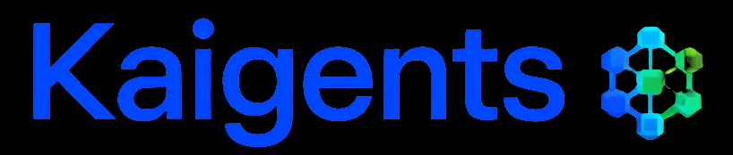
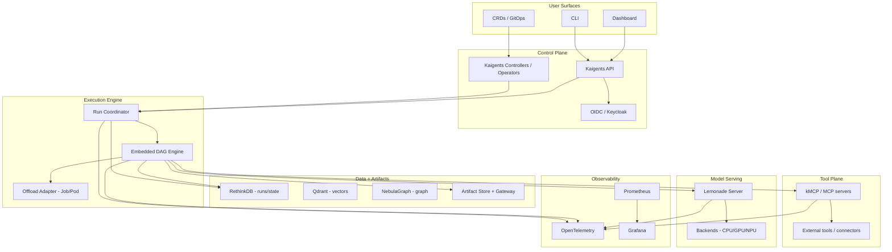

  

# Kaigents: Architecture & Design

## 1. Overview

This document describes the architecture and design of **Kaigents**, aligned to the Kaigents PRD and the Kaigents ITD register.

Scope:

- This document is the canonical architecture/design reference for Kaigents.
- It describes **capabilities, boundaries, contracts, and data flows**.
- It avoids over-specifying implementation details except where constrained by product bets (Kubernetes-native-first, AMD Ryzen AI / Hybrid Execution, commercial-safe OSS, GitOps-friendly operation).

## 2. Product bets and constraints (architectural drivers)

- **Kubernetes-native-first**
  - Primary interaction surfaces are CRDs/GitOps, CLI, and a lightweight dashboard.
  - The system must operate cleanly in a cluster (namespaces, RBAC, ingress, observability).

- **AMD Ryzen AI / Hybrid Execution**
  - The platform should maximize hardware utilization across CPU/GPU/NPU.
  - Hybrid Execution is a policy surface: the platform must make routing and correlation visible even if the underlying runtime chooses the exact device behavior.

- **Commercial-safe OSS core**
  - Kaigents core must depend on permissive/redistribution-safe components.
  - Components with additional terms may be supported only as **integrate-only (user-supplied)**.

- **Traceability as a first-class product feature**
  - Every run must produce a durable run timeline that correlates tool calls, model calls, workflow steps, and artifacts.

## 3. Canonical stack decisions (from ITDs)

The following items are treated as “locked” unless the ITD register is updated:

- **Model serving:** Lemonade Server (FastFlowLM NPU kernels integrate-only)
- **Tool plane:** kMCP (kmcp), MCP-first
- **Workflow substrate (Milestone 1):** embedded Rust DAG substrate with K8s offload escape hatch (ITD-08)
- **Durable process execution engine of record:** Pending decision (ITD-16) for long-running Work Requests (human-in-loop waits, bounded rework loops, durable resumability)
- **Stores:** Qdrant (vector), NebulaGraph (graph), RethinkDB (document/state), S3-compatible object store for artifact bytes (Ceph RGW) (ITD-13)
- **Identity:** Keycloak (OIDC)
- **Observability:** OpenTelemetry + Prometheus + Grafana (Langfuse optional)
- **Languages:** Rust-first execution engine; Go for controllers/CLI; Python optional runtime lane

## 4. High-level architecture

## 5. Core domain model (conceptual)

- **Agent/Team**
  - A declarative definition of behavior, tools, and policies.

- **Tool / Connector**
  - A callable capability (typically via MCP) with a documented JSON input/output contract.

- **Work Request (Run in Milestone 1)**
  - A single execution instance of work.
  - In the refined product domain model, a Work Request is an execution of a Process; in Milestone 1, this is represented as a Run that executes an embedded workflow.
  - Produces:
    - execution status
    - run/work-request timeline events
    - artifacts

- **Embedded workflow (DAG) (Milestone 1 substrate)**
  - A multi-step plan associated with a Run.
  - Supports dependencies, concurrency, retries, cancellation.
  - Retries are node-execution semantics and do not change the topology into a cyclic graph.
  - Note: this substrate is not assumed sufficient for long-running, human-in-the-loop process execution; that is governed by ITD-16.

## 6. Key data flows

### 6.1 Run lifecycle and run timeline

Goals:

- Provide a consistent run timeline across CLI and dashboard.
- Enable operators to understand failures quickly and correlate to traces/metrics.

Conceptual flow:

1. A user creates a run (CRD apply / CLI / UI).
2. The control plane accepts it and hands it to the Run Coordinator.
3. The execution engine runs a DAG:
   - invokes tools (MCP)
   - calls model serving
   - reads/writes run state
   - writes artifacts
4. Each significant event emits:
   - a durable run timeline event
   - an OTel span/log/metric correlation

### 6.2 Tool invocation (MCP-first)

- Tools are invoked through a standardized tool plane.
- Tool invocations are policy-controlled (allowlisting) and audited.
- Tool requests/responses must be representable as JSON (with bounded output policies for production safety).
- For MVP, the MCP server is the contract source of truth, and Kaigents stores a versioned snapshot of tool contracts for auditability and UI/CLI rendering.

### 6.3 Artifact access

- Runs produce artifacts (inputs, intermediates, outputs).
- Artifacts must be accessible via stable, environment-scoped URLs.
- Clients must not require object-store credentials.
- The artifact access layer must support large-object semantics needed for preview/streaming (e.g., range reads) where applicable.

Implementation constraints (from ITDs):

- Artifact **bytes** should be stored in an **S3-compatible object store** in production (Ceph RGW), while indexed stores persist artifact metadata and run timelines (ITD-13).
- When buckets are private, artifact access should follow a **server-side signing/proxy** pattern (or deployment-specific equivalent) so clients do not need object-store credentials, while preserving key HTTP semantics (e.g., `Range`, `ETag`, `Last-Modified`, `Content-Range`) (ITD-14).

### 6.4 Model calls and Hybrid Execution routing

- Kaigents uses an OpenAI-compatible model surface (via Lemonade Server).
- Hybrid Execution (CPU/GPU/NPU) is exposed as:
  - a policy/routing surface
  - an observability surface (what was requested, what happened, correlation IDs)
- FastFlowLM NPU kernels are treated as integrate-only where their licensing requires user-supplied installation.

### 6.5 Workflow execution: embedded DAG + offload escape hatch

- Default: embedded DAG execution for many small steps with low overhead.
- Escape hatch: offload a node to a Kubernetes workload when:
  - strong isolation is required
  - device scheduling/resource constraints are better expressed at the pod/job level
  - specialized images/runtime environments are required

## 7. RAG for domain knowledge (when and why)

Kaigents does not require RAG for every agent. RAG becomes necessary when:

- The agent must reliably use a **large, changing body of domain knowledge** (documents, runbooks, policies, codebases, tickets).
- The prompt budget is insufficient to include the knowledge inline.
- The agent needs repeatable, auditable grounding (“why did you answer this?”).

RAG is not sufficient on its own when:

- The task requires privileged actions (tool plane + governance still required).
- The task is primarily transactional or system-operational (tools and state dominate).

Kaigents supports a layered “domain knowledge” approach:

- **Tool-first knowledge**
  - Prefer tools that can answer questions directly (e.g., query systems of record).

- **Retrieval grounding (RAG) when needed**
  - Vector retrieval (Qdrant) for unstructured or semi-structured text.
  - Optional reranking models where required.

- **Structured knowledge**
  - Graph store (NebulaGraph) for relationship-heavy domains.
  - Document/state store (RethinkDB) for run history and structured artifacts.

Operational requirement:

- Any RAG evidence included in a run should be reflected in the run timeline (what was retrieved, from where, and how it influenced outputs) to support traceability.

## 8. Tenancy and isolation (MVP)

- MVP isolation model: **namespace per team**.
- Control plane must support a clean path to tighter tenancy if required later (without breaking the run/timeline/tool/artifact contracts).

## 9. Observability

- Use OpenTelemetry for cross-component correlation.
- Prometheus/Grafana are the baseline for metrics and dashboards.
- The run timeline is a first-class product feature and must remain usable even if external observability backends differ across deployments.

## 10. Deferred decisions (post-MVP)

The following topics are intentionally deferred until they are required by concrete MVP implementation needs:

- Minimal execution engine contract for multiple runtime implementations (Rust lane first; Python optional later) while preserving stable CRD semantics.
- Governance mechanisms for “high-risk” tool invocations in v1 (approval workflows, policy-as-code) and the product vs implementation boundary.
- Recommended minimum RAG starter kit for teams that need domain grounding without making RAG mandatory for all agents.
