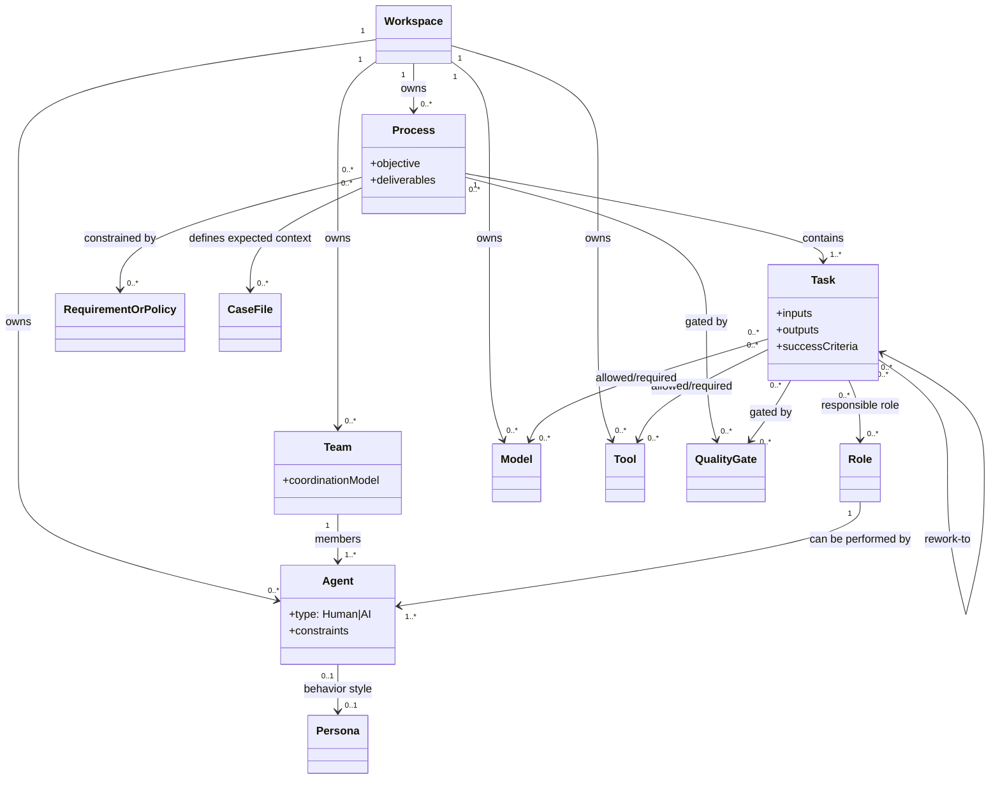
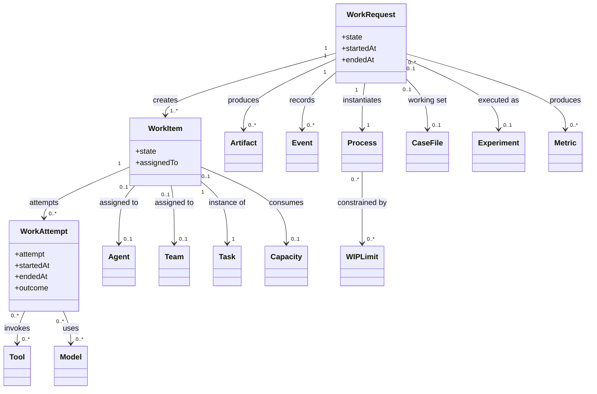

# Kaigents Product Domain Model (Draft)

## Purpose
This document defines the core product-domain entities in Kaigents and the relationships between them, independent of any implementation details (Kubernetes, controllers, jobs, pods, etc.).

Kaigents is a platform for designing and operating **AI Agents and Teams of Agents** that execute **Business Processes** using **Models**, **Tools**, and **Requirements/Policies** that constrain and verify outcomes.

## Terminology principles
- Use **plain-English primary terms** so a non-expert can read the product model.
- Provide **workflow/BPMN equivalent terms** in parentheses to avoid friction with domain experts.
- Separate **definitions** (reusable templates) from **instances** (a specific execution).

## Why process modeling matters for AI agent platforms
Many AI agent platforms make it easy to build a single automation that works in a developer’s head, but they often leave the “process” implicit:
- The intended sequence of work is informal.
- Policies and requirements are tribal knowledge.
- Quality gates and approvals are bolted on ad hoc.
- Auditability is inconsistent.

Kaigents treats **process modeling** as a first-class product concern:
- You define a **Process** as a reusable template.
- You execute a **Work Request** as a specific instance.
- You capture traceability through **Events** and **Artifacts**.

If you’re new to business process modeling, the single most important concept is this:

**Definitions are not executions.**

You can update a process definition over time, while each execution (work request) remains a historical record of what happened for that specific request.

## Core entities (definitions)

### 1) Process (Process Definition / Workflow Definition)
A **Process** is a reusable definition of a business procedure.

A process specifies:
- The objective and expected deliverables
- The sequence/structure of work as **Tasks** (workflow steps) including ordering, dependencies, and branching
- The set of participating **Actors** (AI and/or human)
- The constraints, requirements, and quality gates that must be satisfied
- The allowable **Tools** and **Models** (directly or via actors)

A process is *not* an execution. It is a definition.

A process definition is modeled as a **directed graph** of tasks:
- In the common case, it behaves like a straightforward flow.
- When rework is required, the graph may contain **explicit rework edges** (cycles).

To keep rework usable and safe, rework must be **bounded** (for example by attempt limits, time limits, or escalation requirements).

### 2) Task (Step / Activity / Task Definition)
A **Task** is a unit of work (a step) within a process definition.

A task specifies:
- Inputs required
- Outputs produced (including artifacts)
- Success criteria / acceptance checks
- Which **Actor(s)** are responsible
- Which **Tools** may/should be used
- Which **Model** may/should be used (if the responsible actor is an AI actor)
- Execution semantics (manual step, AI step, mixed, approval required, retry policy)

A task is a definition; its execution is an instance in a process interaction.

### 3) Agent (Actor)
An **Actor** is a participant that can perform tasks.

Kaigents uses the term **Agent** to mean an **actor definition**.

An actor can be:
- **AI actor**: performs tasks using one or more Models and Tools
- **Human actor**: performs tasks via human action, potentially with AI assistance

An actor definition includes:
- Role and responsibilities within processes
- Operating constraints (allowed tools, allowed data access, safety policies)
- Communication contract (what the actor expects, what it produces)

Agents also need **identity** for governance and audit:
- A human agent maps to a user identity (and group memberships).
- An AI agent needs a distinct service identity so a security/audit framework can answer:
  - “Which agent performed this action?”
  - “Under what permissions?”
  - “On behalf of which workspace/team?”

An AI actor additionally includes:
- Prompting and context strategy
- Default model selection rules (or explicit model binding)
- Tool usage policy/allowlist

### 3a) Persona (Personality prompt)
A **Persona** is a reusable definition of an agent’s behavior style and communication norms.

Personas are not processes and not policies. They answer:
- “How should the agent behave?”
- “What tone, rigor, or risk posture should it adopt?”

A persona can be applied to an AI agent, a team, or scoped to a specific process.

### 4) Team (Composite Actor)
A **Team** is a composite actor made of multiple actors.

A team specifies:
- Member actors (AI and/or human)
- Team-level objectives and constraints
- Interaction pattern(s) for collaboration (coordination model)

A team is itself an actor and can be assigned responsibility for tasks.

#### Coordination models (must be explicitly specified by the product model)
The product domain must specify which coordination model a team uses for task execution, such as:
- **Supervisor + specialists**: a coordinator delegates subtasks to members
- **Sequential handoff**: actors operate in a defined order
- **Parallel then merge**: actors work concurrently and a merge/arbiter step consolidates results
- **Debate/critique loop**: one actor proposes, another critiques, iterations are bounded

If a team is used without an explicit coordination model, the system behavior is undefined.

### 5) Model
A **Model** is a callable AI capability used by AI actors.

The domain representation includes:
- Provider type and access configuration (conceptually)
- Supported capabilities (chat, tool-calling, vision, embeddings, etc.)
- Constraints (latency class, cost class, data handling restrictions)

A model is not an actor. Models are used by AI actors.

### 6) Tool
A **Tool** is an external capability invoked by actors during tasks.

A tool definition includes:
- Name and purpose
- Input/output contract
- Safety constraints (timeouts, rate limits, output bounds)
- Audit requirements (what must be logged)

Tools can be grouped into connectors (e.g., MCP servers) but that is an implementation detail.

## Additional core entities (definitions)

### 6a) Workspace (Tenant / Project)
A **Workspace** is an ownership and governance boundary.

Workspaces answer:
- Who owns this process/tool/model/agent?
- Who can view or edit it?
- Which identities are authorized to execute it?

If Kaigents is used by multiple business units, workspaces prevent accidental cross-team coupling.

### 7) Role
A **Role** is a named responsibility profile used to describe what an Agent (human or AI) is accountable for within a process.

A role helps separate:
- The business expectation (role)
- The performer (agent)

### 8) Requirements / Policy
A **Requirement** or **Policy** is a normative rule that constrains how a process is executed and how outcomes are validated.

Examples:
- “All claims must cite sources.”
- “PII must not be sent to external tools.”
- “A human approver must sign off before customer-facing publication.”

Requirements/policies can apply at different scopes:
- Process-wide
- Task-specific
- Tool/model usage constraints

### 8a) Context / Case File
A **Case File** (or **Context**) is the collection of relevant materials for a specific type of work.

Case files are **descriptive**, not normative:
- They contain facts, source documents, references, and prior artifacts.
- They are the “working set” that agents should use to complete a request.

This is distinct from **Requirements/Policy**, which are the rules that constrain what is allowed and what qualifies as correct.

### 9) Quality gate
A **Quality gate** is a check that must pass before a process (or a task) can advance.

Quality gates can be:
- Automated checks (schema validation, linting, citation checks)
- AI checks (critique/review agent)
- Human checks (approval)

## Executions (instances)

### 10) Work Request (Process Instance / Workflow Execution)
A **Work Request** is an execution instance of a Process.

A work request:
- Has an initiating request and context
- Creates instances of tasks (work items)
- Produces a timeline/audit trail of actions
- Produces artifacts
- Has explicit state (planned, in-progress, blocked, completed, failed, cancelled)

### 11) Work Item (Task Instance)
A **Work Item** is the runtime instance of a Task inside a work request.

The purpose of a work item is to make a task concrete and assignable.

Work items support:
- Assignment (to a human agent, AI agent, or team)
- Status (queued, running, blocked, completed, failed, cancelled)
- Retries and escalation

### 12) Work Attempt (Task Execution / Attempt)
A **Work Attempt** records one attempt to perform a work item.

Work attempt records:
- Inputs and produced outputs
- Actor assignments and participation
- Tool invocations and their outcomes
- Model invocations (if applicable)
- Evidence for acceptance checks

### 13) Artifact
An **Artifact** is a tangible item (document, dataset, record, report, decision log, etc.) that a **Work Attempt** creates or operates on.

Artifacts can be:
- Inputs to a work attempt
- Outputs of a work attempt
- Both (e.g., a document that is revised)

Artifacts should be referenceable and auditable (what was produced, by whom/what, and when).

### 14) Event (Timeline / Audit Event)
An **Event** is an append-only record of something that happened during a work request.

Events capture:
- Work item state transitions
- Tool/model invocations
- Human approvals/decisions
- Errors and exceptions

## Continuous improvement and flow (LEAN-inspired)

This section captures the concepts needed to operate business processes at scale: constrained resources, work-in-progress, rework, experimentation, and continuous improvement.

### 15) Capacity (Constrained resource)
**Capacity** represents a constrained resource that limits throughput.

Examples:
- Human time (reviewers, approvers)
- AI budget (model spend per day)
- Tool capacity (rate limits)
- Operational limits (concurrency, quota)

Capacity is the reason a process needs prioritization, queueing, and WIP limits.

### 16) WIP Limit (Work-in-progress limit)
A **WIP Limit** constrains how many work items (or work requests) may be in a given state at once.

WIP limits are used to:
- Prevent overload
- Reduce thrashing and context switching
- Improve cycle time and predictability

WIP limits can be applied to a process, a task step, a team, or a role.

### 17) Rework
**Rework** is intentional repetition of work caused by quality failures, missing inputs, policy violations, or downstream changes.

In the domain model, rework manifests as:
- Additional work attempts on the same work item
- A work item returning to an earlier state
- Additional work items created to address gaps

### 18) Experiment (Improvement experiment)
An **Experiment** is a structured change intended to improve outcomes (quality, cost, time, safety).

An experiment defines:
- Hypothesis (what improvement is expected)
- Treatment (what change is applied: persona, model, tool set, task ordering, gate)
- Measurement plan (which metrics determine success)
- Scope (which processes/work requests are included)

### 19) Metric (Measure)
A **Metric** is a quantitative measure used to evaluate process performance and improvement.

Common metrics:
- Lead time / cycle time
- Rework rate
- Quality gate pass rate
- Cost per work request
- Tool/model error rate

## Relationships (summary)
- A **Process** contains one or more **Tasks**.
- A **Work Request** instantiates a Process.
- A **Work Request** creates one or more **Work Items** (instances of Tasks).
- A **Work Item** is performed by an **Agent** or **Team**.
- A **Work Item** may have one or more **Work Attempts** (attempts).
- An **Agent** is either an **AI agent** or a **Human agent**.
- A **Team** is a composite actor that contains multiple Agents and a coordination model.
- An **AI agent** uses one or more **Models**.
- Agents/Teams invoke **Tools** while performing work.
- **Requirements/Policies** and **Quality gates** constrain Processes, Tasks, Tools, and Models.
- **Artifacts** and **Events** are produced during a Work Request and provide auditability.

- **Capacity** and **WIP Limits** constrain flow and determine throughput.
- **Rework** increases the number of work attempts and may create additional work items.
- **Experiments** are executed through selected work requests and evaluated using **Metrics**.
