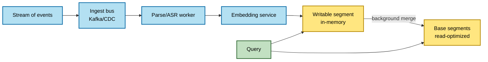
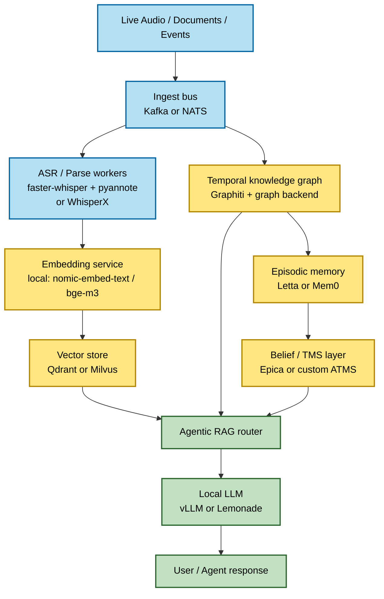

# Agent Context, Memory & Epistemic Infrastructure: A Research Overview

*Research Date: July 18, 2026*

## 0. Purpose and relationship to existing research

This document is a forward-looking companion to [`rag_overview.md`](rag_overview.md) (May 2025), which established the baseline RAG concepts Kaigents builds on (chunking, hybrid retrieval, reranking, multi-modal RAG, agent-based RAG). That overview treats RAG as a *retrieval quality* problem.

This paper covers what has changed since: the field has moved from **static retrieval** toward **dynamic, temporal, and epistemic** systems. The practical question driving this research is not "how do we retrieve better chunks?" but:

> *How does an agent ingest new information in real time, retain it as experience over time, distinguish hypothesis from outcome, and avoid repeating mistakes unless deliberately re-verifying?*

The research bias here is deliberately toward **open-source, self-hostable, sovereign** components, with cloud/SaaS mentioned only as a comparison baseline. This aligns with Kaigents' commercial-safe OSS posture.

## 1. The core shift: from static RAG to living memory

The single most important finding is that the techniques needed are no longer one product. They are the convergence of three previously separate fields, layered on top of a now-commodity retrieval layer.

| Layer | Old (2023 RAG) | New (2025–2026) |
| --- | --- | --- |
| **Retrieval** | Static chunks, single-pass | Agentic loops, self-correction, graph reasoning |
| **Ingestion** | Batch re-index | Streaming, incremental, temporal-versioned |
| **Memory** | Stateless context window | Hierarchical episodic + semantic memory |
| **Truth** | "Whatever the doc says" | Belief revision, provenance, falsifiability tags |

```mermaid
flowchart TB
    subgraph Legacy["Static RAG (2023)"]
        L1[Batch ingest] --> L2[Vector index]
        L2 --> L3[Single-pass retrieve]
        L3 --> L4[Generate]
    end
    subgraph Modern["Living Memory (2026)"]
        M1[Streaming ingest] --> M2[Temporal-versioned index]
        M2 --> M3[Agentic self-correcting retrieve]
        M3 --> M4[Episodic + semantic memory]
        M4 --> M5[Belief revision / provenance]
        M5 --> M6[Generate + retain outcome]
        M6 --> M4
    end
    classDef old fill:#ffe680,stroke:#b38600,stroke-width:2px,color:#000000
    classDef new fill:#c2e0c2,stroke:#2d6630,stroke-width:2px,color:#000000
    class L1,L2,L3,L4 old
    class M1,M2,M3,M4,M5,M6 new
```

## 2. Advanced retrieval (the commodity layer underneath)

These techniques improve *retrieval quality*. They layer underneath the memory/epistemic substrate and are now broadly available in open-source form.

### 2.1 GraphRAG and agentic graph retrieval

**GraphRAG** (Microsoft, open source) builds hierarchical knowledge graphs to support multi-hop reasoning and global dataset summaries, moving beyond simple chunk-based retrieval. Current advances extend it into agentic frameworks:

- **Graph-R1** and **GraphRAG-R1** use reinforcement learning to optimize multi-turn retrieval and dynamic knowledge graph updates end-to-end.
- **SCMRAG** (Self-Corrective Multihop RAG) adds closed-loop multi-hop retrieval for LLM agents.
- **MetaKGRAG** introduces metacognitive cycles for path-aware, closed-loop refinement in graph-based environments.

### 2.2 Self-reflective and corrective retrieval

Two complementary frameworks improve RAG reliability through self-evaluation loops:

- **Self-RAG** — a fine-tuned model that emits *reflection tokens* during inference to decide when to retrieve, critique the relevance and support of retrieved passages, and assess its own output quality. Enables controllable, on-demand retrieval and adaptive generation.
- **Corrective RAG (CRAG)** — a lightweight evaluator between retrieval and generation classifies documents as correct, incorrect, or ambiguous; it filters irrelevant data, performs web-search fallbacks, or refines content before generation.

Self-RAG excels at refining generation reasoning; CRAG ensures the generator only receives validated context. They are frequently used as a complementary hybrid.

### 2.3 Agentic RAG

Autonomous agents plan, select tools (web, SQL, vector DBs, graph), and iteratively refine queries until a satisfaction criterion is met. This replaces the static single-pass retrieve-then-generate pipeline with a reasoning loop. It is the retrieval-side analog of the memory layers below.

## 3. Real-time ingestion and indexing

This is the most mature of the three new layers and the one most directly relevant to "ingest new information in real time."

### 3.1 Incremental, streaming indexing

Re-embed only changed chunks (via SHA-256 content hashing) rather than full-corpus re-indexing. Backed by Change Data Capture (CDC), Kafka, or webhooks. Streaming SQL engines (e.g. RisingWave) process CDC events and trigger embedding updates continuously.

### 3.2 Dual-tier hot/cold storage

A hot tier (Milvus/HNSW or Qdrant) for recent, queryable data; a cold tier (Delta Lake) for versioned history. This is the architecture behind **LiveVectorLake**, an open-source real-time versioned knowledge base.

### 3.3 LSM-style live upserts

New embeddings land in an in-memory writable segment for *instant* queryability, while background merges fold them into read-optimized base segments. Qdrant and pgvector both handle live upserts this way, so retrieval is never blocked by ingestion.

### 3.4 Temporal and "as-of" retrieval

Critical for "future work references past work as context." Three open approaches:

- **LiveVectorLake** — point-in-time retrieval (`query "..." --as-of 2024-01-15`).
- **Z3rno** — PostgreSQL GiST range indexes on `(valid_from, valid_to)`.
- **MemoryGraph / Graphiti** — **bi-temporal** tracking: separates *validity time* (when a fact is true) from *transaction time* (when the fact was learned). This distinction is the keystone for hypothesis-vs-outcome differentiation (Section 5).

## 4. Long-term memory and experience precedence

Three open-source frameworks dominate, with meaningfully different philosophies.

### 4.1 Graphiti / Zep — temporal knowledge graph

[Graphiti](https://github.com/getzep/graphiti) is an open-source framework for building and querying **bi-temporal context graphs** for AI agent memory. It is the core engine behind Zep (managed platform; Graphiti core is self-hostable).

Properties:
- Tracks facts over time; supports point-in-time queries and automatic invalidation of superseded data.
- Hybrid search: semantic + BM25 + graph, with result fusion.
- Search latency typically under 100ms (bounded by the embedding API call).
- Ingests both unstructured and structured data; generates human-readable, full-text searchable edge semantics.
- Explicitly designed for **live voice transcriptions** as an input modality.
- Requires a graph backend (Neo4j, FalkorDB, or Amazon Neptune).

Graphiti is the closest off-the-shelf fit for a meeting-capture use case: agenda docs ingested pre-meeting, live transcription added as time-stamped graph nodes mid-meeting, future meetings retrieve this meeting *as it was* at any point in time.

### 4.2 Letta (formerly MemGPT) — OS-inspired memory hierarchy

[Letta](https://github.com/letta-ai/letta/) organizes memory into a hierarchy of **core, recall, and archival** tiers. The agent *self-manages* its own state via tool calls, deciding what to promote or summarize into memory to stay within context limits. Best suited for long-running, stateful agents that require autonomous context management.

### 4.3 Mem0 — extraction-based memory

[Mem0](https://github.com/mem0ai/mem0) uses an LLM-driven pipeline to distill salient facts from conversations and stores them as structured memories across vector, graph, and key-value indexes. Best suited for customer-facing assistants requiring rapid personalization and per-user fact tracking.

### 4.4 Episodic learning (simulating long-term experience)

A distinct, newer line of work that does **not** update model weights. It stores episodes + outcomes, reflects, and retrieves lessons on future tasks — non-parametric, retrieval-augmented learning from experience:

- **Reflexion** pattern: record episode → reflect into heuristics → retrieve on future tasks.
- **ERL** (Experiential Reflective Learning), **MemRL** (runtime reinforcement learning on episodic memory), **APEX-EM** (structured procedural-episodic replay).
- **Memento 2** — stateful reflective memory.

This is the mechanism for "historical precedence to simulate long-term experience": the agent improves by reading its own past, not by retraining.

## 5. Hypothesis vs. outcome and avoiding repeated mistakes

This is the least-served by mainstream tooling, but the research frontier is directly on point. The right framing is **epistemic infrastructure**, not memory.

### 5.1 Belief revision with Truth Maintenance Systems (TMS / ATMS)

A classical symbolic-AI concept (1980s) now being rebuilt for LLM agents. Each belief carries the *assumptions* it depends on. When a contradiction appears, a **retraction cascade** automatically invalidates every dependent belief — not just the mistaken one. This is the mechanical answer to "don't repeat a mistake."

**Assumption-based TMS (ATMS)** labels each datum with the *contexts* (sets of assumptions) under which it holds, enabling:
- Defeasible reasoning: "believed unless contradictory evidence exists."
- Simultaneous exploration of multiple contexts without dependency-directed backtracking.
- Explicit re-verification: a defeated assumption is retained (not deleted) and can be re-opened, carrying forward the *original failure reason* so a re-test is informed rather than naive.

### 5.2 Confidence-tagged, falsifiable beliefs

Emerging frameworks tag every claim with a confidence level and explicit *falsification conditions*, distinguishing confirmed facts from inferences from intuition. Relevant open projects:

- **[Epica](https://github.com/angelnicolasc/epica)** — Rust runtime with formal AGM (Alchourrón-Gärdenfors-Makinson) belief revision and dual-process uncertainty monitoring.
- **Chitta** — autonomous research OS using a typed belief graph for hypotheses and experiments.
- **OIDA** — epistemic memory architecture for organizational state.
- **Kumiho** — graph-native, versioned, dependency-linked primitives.
- **[Beliefs/Reasons](https://github.com/benthomasson/ftl-beliefs)** — markdown-based persistent claim tracking and truth maintenance.
- **The Hypothesis Graph** — a verifiable semantic memory for coding agents; tracks hypotheses as first-class addressable objects that can later be marked confirmed or falsified.

### 5.3 The bi-temporal + TMS combination

The combination that directly satisfies the research question is:

1. **Bi-temporal storage** records *when a hypothesis was made* (validity start) and *when it was confirmed/falsified* (validity end), plus *when the system learned each fact* (transaction time).
2. **TMS/ATMS** links each hypothesis to the assumptions it depends on and the beliefs that depend on it.
3. When an outcome arrives, the hypothesis is marked confirmed or falsified; a retraction cascade invalidates downstream conclusions built on a falsified hypothesis.
4. A deliberate re-verification is an explicit action that re-opens the ATMS assumption context, retaining the failure history so the re-test is informed by the original failure mode.

This is the architecture that makes "prevent repeating mistakes unless deliberately re-verifying" a mechanical property rather than a hopeful prompt instruction.

## 6. A fully sovereign reference stack

A concrete stack in which **no data leaves the environment** and every component is open-source:

Component notes:
- **LLM runtime**: vLLM (production concurrency) or Ollama / Lemonade (simpler ops).
- **Embeddings**: `nomic-embed-text` or `bge-m3` served locally — no external embedding API dependency.
- **Vector DB**: Qdrant (easy ops) or Milvus (scale); both do LSM-style live upserts.
- **Temporal graph memory**: Graphiti is the best *pattern* for the meeting and experience use cases, but its native graph backends are not commercial-safe (Neo4j GPLv3, FalkorDB SSPLv1 — see Section 8.5). For a sovereign/commercial-safe core the temporal-metadata layer must be built on NebulaGraph (Apache-2.0); Graphiti is a reference implementation, not a turnkey dependency.
- **Episodic reflection**: Letta (autonomous self-management, Apache-2.0) or Mem0 (extraction-based, Apache-2.0).
- **Epistemic / TMS layer**: Epica (Rust, MIT, AGM revision, MCP-integrated) — a candidate dependency for the Belief Manager, not just a reference; the piece that makes "don't repeat mistakes unless re-verifying" mechanical.
- **Meeting capture**: faster-whisper + pyannote.audio diarization; reference architectures exist (Bailiff — offline-first; MeetingScribe — local-first; Kairo — cross-meeting pgvector graph).
- **All-in-one RAG app layer** (if a starting point is preferred over components): R2R, Kotaemon, RAGFlow (notable for deep document parsing of messy layouts), LlamaIndex (code-first), Dify (visual).

## 7. Cloud / SaaS baseline (for comparison)

Mentioned for completeness; not the recommended direction for a sovereign deployment:

- **Zep** (managed Graphiti) — the only managed service that natively offers temporal graph memory.
- **Amazon Bedrock AgentCore** — episodic memory as a managed feature.
- **Letta Cloud**, **Mem0 Cloud** — hosted versions of the open-source frameworks.
- **OpenAI / Anthropic / Google** in-model context management (automatic compaction, long context windows) — *inside-model* context management, ephemeral and not sovereign.

Notably, **no major cloud provider offers the epistemic / TMS layer** — it remains open-source-only, which reinforces the sovereignty case.

## 8. Findings relevant to Kaigents

1. **The three layers map onto Kaigents' existing domain model**, not onto new vocabulary:
   - Real-time short-term context ↔ the existing **Case File / Context** entity.
   - Long-term episodic memory ↔ existing **Work Request / Work Attempt / Event / Artifact** records, plus a consolidation/indexing layer.
   - Experience and hypothesis-vs-outcome ↔ the existing **Experiment** entity (which already defines Hypothesis + Treatment + Measurement plan).
2. **Existing ITDs are compatible**, not in conflict: Qdrant (ITD-04), NebulaGraph (ITD-05), RethinkDB (ITD-06), Temporal (ITD-16), Lemonade (ITD-02), Rust engine (ITD-12), OTel (ITD-11) all have natural roles in a memory subsystem.
3. **The one genuine tension** is Graphiti's graph-backend assumption (Neo4j/FalkorDB/Neptune) versus Kaigents' ITD-05 choice of NebulaGraph. This is a build-vs-adopt decision worth surfacing explicitly rather than silently.
4. **The epistemic / TMS layer is the differentiator.** Retrieval, streaming ingestion, and graph memory are commoditizing; belief revision with retraction cascades is not. This is where a sovereign build would most differentiate.
5. **License posture is now confirmed** for the key components (see Section 8.5). The headline finding: Graphiti, Letta, Mem0, and Epica are all commercial-safe (Apache-2.0 or MIT), **but every one of Graphiti's self-hostable graph backends is not** — Neo4j Community is GPLv3, FalkorDB is SSPLv1, and Neptune is a proprietary managed service. This makes building the temporal layer on NebulaGraph (Apache-2.0, already ITD-05) not just preferable but the only license-viable path for a commercial-safe OSS core. Every memory component still needs to be added to [`technology/oss-components-commercially-permissible.md`](technology/oss-components-commercially-permissible.md) per the existing due-diligence process.

These findings are developed into a concrete proposal in [`../architecture/agent-memory-proposal.md`](../architecture/agent-memory-proposal.md).

## 8.5 License verification (confirmed July 18, 2026)

Licenses were verified directly from each project's repository, not assumed. "Commercial-safe" below means compatible with Kaigents' MIT-core, redistribution-safe posture (permissive licenses: Apache-2.0, MIT). Copyleft and source-available licenses are marked not commercial-safe.

### Memory frameworks and epistemic layer

| Component | License | Commercial-safe | Note |
| --- | --- | --- | --- |
| Graphiti (getzep/graphiti) | Apache-2.0 | Yes | Temporal KG engine; safe to integrate. Its *graph backends* are the license problem (see below). |
| Letta (formerly MemGPT) | Apache-2.0 | Yes | OS-inspired memory hierarchy. |
| Mem0 | Apache-2.0 | Yes | Extraction-based memory layer. |
| Epica (angelnicolasc/epica) | MIT | Yes | Rust AGM belief-revision runtime with MCP integration; candidate for the Belief Manager, not just a reference. |

### Graph backends (load-bearing for the memory graph decision)

| Backend | License | Commercial-safe | Note |
| --- | --- | --- | --- |
| NebulaGraph (vesoft-inc/nebula) | Apache-2.0 | Yes | Already ITD-05; explicitly permits SaaS/backend use. The only commercial-safe option here. |
| Neo4j Community Edition | GPLv3 | **No** | Copyleft; conflicts with Kaigents' MIT core. |
| Neo4j Enterprise Edition | Commercial (proprietary) | **No** | No longer open source; open-core model. |
| FalkorDB | SSPLv1 | **No** | Server Side Public License — not OSI-approved open source; strong network copyleft. |
| Amazon Neptune | Proprietary managed | **No** | Not self-hostable / not sovereign. |

This is decisive: adopting Graphiti *with its native backends* is not license-viable for Kaigents. The path is either (a) build the temporal-metadata pattern on NebulaGraph, or (b) contribute a NebulaGraph driver to Graphiti upstream and maintain it. Option (a) is recommended in the proposal.

### Sovereign stack components

| Component | License | Commercial-safe | Note |
| --- | --- | --- | --- |
| Qdrant | Apache-2.0 | Yes | Already ITD-04. |
| Milvus | Apache-2.0 | Yes | Alternative vector store. |
| Ollama | MIT | Yes | Local model runtime. |
| vLLM | Apache-2.0 | Yes | Production inference. |
| Lemonade Server | Apache-2.0 | Yes | Already ITD-02. |
| faster-whisper | MIT | Yes | ASR. |
| pyannote.audio (code) | MIT | Yes | Diarization toolkit code. |
| pyannote pretrained models | HF click-through conditions | **Verify per model** | Models require accepting HuggingFace user conditions; commercial-use terms must be checked per model before redistribution. Code is MIT; the model weights are the gating item. |

### Cloud / SaaS (for comparison, not integration)

| Component | License | Note |
| --- | --- | --- |
| Zep (managed platform) | Commercial SaaS | Hosted Graphiti; not self-hostable. |
| Letta Cloud, Mem0 Cloud | Commercial SaaS | Hosted versions of the Apache-2.0 frameworks. |
| Amazon Bedrock AgentCore | Proprietary managed | Episodic memory as a service. |

## 9. Sources

### Advanced retrieval
- Graph-R1: Agentic GraphRAG via end-to-end RL — https://arxiv.org/html/2507.21892v2
- SCMRAG: Self-Corrective Multihop RAG — https://www.ifaamas.org/Proceedings/aamas2025/pdfs/p50.pdf
- Self-RAG — https://selfrag.github.io/ , https://github.com/AkariAsai/self-rag
- Corrective RAG (CRAG) — https://www.kore.ai/blog/corrective-rag-crag
- MetaKGRAG (metacognitive KGRAG) — https://arxiv.org/html/2508.09460

### Real-time and temporal RAG
- LiveVectorLake (real-time versioned KB) — https://github.com/praj-tarun/LiveVectorLake , https://arxiv.org/html/2601.05270v1
- RisingWave continuous RAG pipeline — https://risingwave.com/blog/continuous-rag-pipeline-streaming-sql/
- SPI: query-depth-adaptive indexing for streaming RAG — https://arxiv.org/html/2511.16681
- EraRAG: incremental RAG for growing corpora — https://arxiv.org/html/2506.20963v2
- VersionRAG — https://arxiv.org/html/2510.08109
- Z3rno temporal versioning — https://astron-bb4261fd.mintlify.app/concepts/temporal-versioning
- memory-graph temporal memory — https://github.com/gregorydickson/memory-graph

### Long-term memory
- Graphiti — https://github.com/getzep/graphiti
- Zep temporal KG architecture — https://arxiv.org/html/2501.13956
- Letta (MemGPT) — https://github.com/letta-ai/letta/
- Mem0 — https://github.com/mem0ai/mem0
- Agent memory comparison 2026 — https://maidul-haque.vercel.app/blog/agent-memory-architectures-2026/

### Episodic learning
- Experiential Reflective Learning — https://arxiv.org/pdf/2603.24639v2
- MemRL — https://arxiv.org/html/2601.03192v2
- APEX-EM — https://arxiv.org/abs/2603.29093v1
- Memento 2 — https://arxiv.org/html/2512.22716
- Reflexion pattern — https://github.com/agentpatternscatalog/patterns/blob/main/patterns/reflexion.md

### Epistemic infrastructure
- Graph-native cognitive memory / belief revision — https://www.arxiv.org/pdf/2603.17244
- Epistemic infrastructure for organizational AI — https://arxiv.org/pdf/2604.11759v2
- The Hypothesis Graph (verifiable semantic memory) — https://june.kim/the-hypothesis-graph-semantic-memory-methodeutics
- Epica (Rust, AGM revision) — https://github.com/angelnicolasc/epica
- Beliefs/Reasons (TMS) — https://github.com/benthomasson/ftl-beliefs
- Assumption-based TMS (de Kleer) — https://dekleer.org/Publications/An%20Assumption-Based%20TMS.pdf

### Meeting capture and streaming multimodal
- Bailiff (offline-first meeting RAG) — https://github.com/ricardovinicius/bailiff
- MeetingScribe (local-first) — https://github.com/elmoghany/meeting-scribe
- Kairo (cross-meeting pgvector graph) — https://github.com/Areen-Zainab/Kairo-webapp
- WhisperX + Haystack voice agent RAG — https://callsphere.ai/blog/vw4h-build-voice-agent-whisperx-haystack-rag
- Streaming ingestion for vector databases — https://www.avichala.com/blog/streaming-ingestion-for-vector-databases

### Sovereign stack components
- Ollama — https://ollama.com/
- vLLM — https://github.com/vllm-project/vllm
- Qdrant — https://github.com/qdrant/qdrant
- Milvus — https://github.com/milvus-io/milvus
- faster-whisper — https://github.com/SYSTRAN/faster-whisper
- pyannote.audio — https://github.com/pyannote/pyannote-audio
