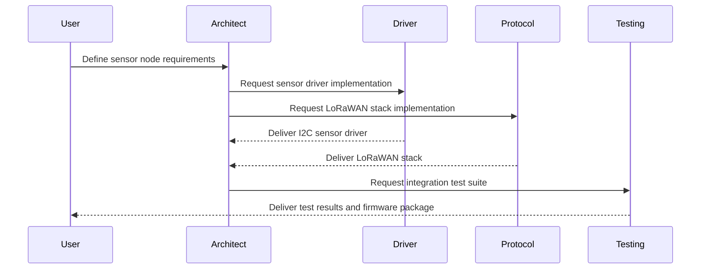
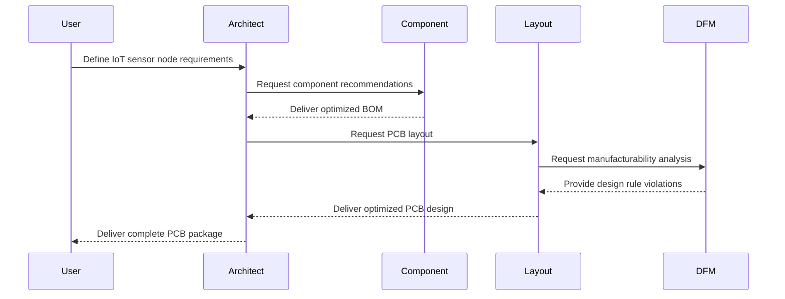

# AI Agents for Hardware Design and Development
## A Research Paper on Firmware Design, PCB Printing, and Prototyping

*May 3, 2025*

## Abstract

This research paper explores the application of AI agents in hardware design and development processes, with a specific focus on firmware implementation, PCB design, 3D printing, and prototype development. The paper examines current capabilities, potential architectures, and practical implementations of AI-assisted hardware development workflows, with particular attention to IoT firmware and module design.

## Table of Contents

1. Introduction
2. Current State of AI in Hardware Design
3. AI Agent Architecture for Hardware Development
4. Firmware Design and Implementation Agents
5. PCB Design and Manufacturing Agents
6. 3D Printing and Prototyping Agents
7. IoT-Specific Considerations
8. Implementation Framework
9. Case Studies
10. Challenges and Limitations
11. Future Directions
12. Conclusion

## 1. Introduction

### 1.1 The Hardware Development Challenge

Hardware development has traditionally been characterized by lengthy design cycles, expensive prototyping iterations, and complex interdependencies between firmware, electronics, and physical components. The process typically requires specialized expertise across multiple domains:

- Firmware engineering
- Electronic circuit design
- PCB layout and manufacturing
- Mechanical engineering and 3D design
- Testing and validation
- Manufacturing and production

These domains have historically operated in silos, with handoffs between specialists creating bottlenecks and introducing potential for errors. The complexity increases exponentially for IoT devices, which must balance power efficiency, connectivity, security, and physical constraints while meeting aggressive time-to-market goals.

### 1.2 The Promise of AI in Hardware Development

Recent advances in artificial intelligence, particularly in the domains of large language models (LLMs), multimodal AI, and agent-based architectures, present unprecedented opportunities to transform hardware development:

- **Knowledge Integration**: Bridging specialized domains through shared understanding
- **Design Automation**: Generating and optimizing designs based on requirements
- **Simulation and Testing**: Predicting performance and identifying issues before physical prototyping
- **Iteration Acceleration**: Reducing the time between design cycles
- **Constraint Satisfaction**: Balancing competing requirements across domains

### 1.3 AI Agents vs. Traditional CAD/EDA Tools

While Computer-Aided Design (CAD) and Electronic Design Automation (EDA) tools have long supported hardware development, AI agents represent a fundamental shift in approach:

| Traditional Tools | AI Agent Approach |
|------------------|-------------------|
| Tool-specific expertise required | Natural language interaction |
| Manual translation between domains | Automatic cross-domain integration |
| Rule-based constraints | Learning-based optimization |
| Linear workflows | Parallel exploration of alternatives |
| Explicit programming | Emergent problem-solving |

### 1.4 Research Objectives

This paper aims to explore how AI agents can be architected and deployed to revolutionize hardware development processes, with specific focus on:

1. Developing a comprehensive agent architecture for hardware design
2. Identifying specific agent roles and capabilities for firmware, PCB, and prototyping
3. Addressing IoT-specific challenges through specialized agent capabilities
4. Proposing practical implementation frameworks for organizations
5. Examining real-world applications and case studies
6. Analyzing current limitations and future research directions

## 2. Current State of AI in Hardware Design

### 2.1 AI Applications in Electronic Design

Artificial intelligence has already begun transforming various aspects of hardware design, though most applications remain specialized rather than comprehensive:

#### 2.1.1 PCB Design

- **Layout Optimization**: AI algorithms for component placement and trace routing
- **Design Rule Checking**: ML-based approaches to identify potential issues
- **Thermal Analysis**: Predictive models for heat distribution
- **Signal Integrity**: AI-assisted analysis of signal propagation and interference

#### 2.1.2 Firmware Development

- **Code Generation**: LLM-based assistants for embedded code writing
- **Bug Detection**: ML models to identify potential firmware issues
- **Resource Optimization**: AI-assisted memory and processing optimization
- **Hardware Abstraction**: Automated generation of hardware abstraction layers

#### 2.1.3 Physical Design

- **Generative Design**: AI-driven exploration of physical form factors
- **Structural Analysis**: ML models for predicting mechanical properties
- **Material Selection**: AI-assisted material recommendation systems
- **Manufacturing Optimization**: Process parameter optimization for 3D printing

### 2.2 Relevant AI Technologies

#### 2.2.1 Large Language Models (LLMs)

LLMs such as GPT-4, Claude, and Llama 3 have demonstrated capabilities relevant to hardware design:

- Understanding and generating code across multiple programming languages
- Reasoning about electronic components and circuit behavior
- Explaining complex technical concepts across domains
- Following multi-step instructions for design tasks

However, current LLMs have limitations in specialized hardware knowledge, spatial reasoning, and understanding of physical constraints.

#### 2.2.2 Multimodal AI

Recent advances in multimodal AI enable processing of various input types:

- **Vision-Language Models**: Understanding circuit diagrams, PCB layouts, and 3D models
- **Code-Vision Integration**: Connecting visual representations with code implementation
- **Simulation Integration**: Processing simulation outputs and recommending adjustments

#### 2.2.3 Specialized Design AI

Domain-specific AI tools have emerged for particular hardware design tasks:

- **EDA-specific AI**: Tools like Cadence Cerebrus and Synopsys DSO.ai for chip design
- **PCB Routing AI**: Specialized algorithms for trace optimization
- **Generative Design**: Tools like Autodesk's generative design for mechanical components

### 2.3 Agent-Based Approaches

While individual AI applications exist, comprehensive agent-based approaches to hardware design remain nascent:

#### 2.3.1 Early Agent Systems

- **AutoML for EDA**: Automated machine learning pipelines for electronic design
- **Design Space Exploration**: Agent-based approaches to exploring design alternatives
- **Simulation Agents**: Autonomous systems for running and analyzing simulations

#### 2.3.2 Emerging Agent Frameworks

- **LLM-powered Agents**: Systems like AutoGen and CrewAI for coordinating multiple specialized agents
- **Tool-using Agents**: Frameworks enabling AI to interact with CAD/EDA software
- **Multi-agent Collaboration**: Systems enabling specialist agents to collaborate on complex designs

### 2.4 Research Gaps

Despite progress, significant gaps remain in the application of AI agents to hardware design:

1. **Cross-domain Integration**: Limited coordination between firmware, electronic, and mechanical design
2. **End-to-end Workflows**: Lack of comprehensive agent systems spanning the entire development lifecycle
3. **Knowledge Representation**: Insufficient methods for representing hardware design constraints for AI consumption
4. **Tool Integration**: Limited ability for agents to directly interact with professional design tools
5. **Verification and Validation**: Challenges in ensuring AI-generated designs meet all requirements
6. **IoT-specific Optimization**: Need for specialized approaches to IoT hardware development

## 3. AI Agent Architecture for Hardware Development

### 3.1 Proposed Agent Framework

We propose a comprehensive multi-agent architecture for hardware development that integrates firmware, electronic, and physical design processes. The architecture consists of specialized agents organized in a hierarchical structure with clear roles and communication pathways.

#### 3.1.1 Core Agent Types


**Strategic Agents**
- **System Architect Agent**: Coordinates overall design strategy and requirements
- **Project Manager Agent**: Manages timelines, resources, and dependencies
- **Requirements Analyst Agent**: Interprets and refines user requirements

**Domain Specialist Agents**
- **Firmware Engineer Agent**: Develops embedded software and drivers
- **Electronic Design Agent**: Creates circuit designs and PCB layouts
- **Mechanical Design Agent**: Develops physical enclosures and components
- **Manufacturing Specialist Agent**: Optimizes designs for production

**Support Agents**
- **Research Agent**: Gathers component datasheets, standards, and reference designs
- **Simulation Agent**: Runs and analyzes various simulations
- **Testing Agent**: Develops test plans and analyzes results
- **Documentation Agent**: Creates technical documentation

### 3.2 Agent Capabilities and Technologies

#### 3.2.1 Foundation Models

Each agent is built on specialized foundation models optimized for their domain:

| Agent Type | Recommended Foundation Model | Key Capabilities |
|------------|------------------------------|------------------|
| System Architect | GPT-4o or Claude 3 Opus | Cross-domain reasoning, requirement analysis |
| Firmware Engineer | CodeLlama-34B or DeepSeek-Coder | Embedded C/C++, assembly, driver development |
| Electronic Design | Specialized Circuit LLM | Component selection, circuit analysis |
| Mechanical Design | Multimodal design model | 3D spatial reasoning, structural analysis |
| Manufacturing | Process-optimized LLM | DFM analysis, tolerance optimization |

#### 3.2.2 Tool Integration

Agents require integration with industry-standard tools:

**Firmware Development**
- IDE integration (VSCode, Eclipse, etc.)
- Compiler toolchains (GCC, IAR, Keil)
- Debugging interfaces (JTAG, SWD)

**Electronic Design**
- EDA software (KiCad, Altium, Eagle)
- Simulation tools (SPICE, Simulink)
- Component libraries and databases

**Physical Design**
- CAD software (Fusion 360, SolidWorks, FreeCAD)
- 3D printing slicers (Cura, PrusaSlicer)
- Material property databases

### 3.3 Agent Communication and Coordination

#### 3.3.1 Communication Protocols

The proposed architecture employs structured communication protocols:

- **Design Intent Protocol**: Formalized language for expressing design requirements and constraints
- **Design Review Protocol**: Standardized format for design feedback and iteration
- **Cross-domain Query Protocol**: Method for agents to request information from other domains

#### 3.3.2 Knowledge Representation

A unified knowledge representation system enables cross-domain understanding:

- **Component Ontology**: Hierarchical representation of components and their properties
- **Constraint Graph**: Network of design constraints and their relationships
- **Design State Representation**: Formalized representation of current design status

### 3.4 Workflow Orchestration

#### 3.4.1 Design Process Flow

The agent architecture supports a flexible, iterative design process:

1. **Requirements Analysis**: Requirements agents interpret user needs
2. **System Architecture**: System architect agent develops high-level design
3. **Parallel Development**: Domain specialists work concurrently on their aspects
4. **Integration Points**: Regular synchronization of cross-domain dependencies
5. **Simulation and Testing**: Continuous validation through virtual testing
6. **Refinement**: Iterative improvement based on test results
7. **Production Preparation**: Manufacturing optimization

#### 3.4.2 Decision Making Framework

A structured approach to design decisions includes:

- **Trade-off Analysis**: Formalized evaluation of competing design considerations
- **Design Space Exploration**: Systematic exploration of alternative approaches
- **Constraint Satisfaction**: Algorithms for resolving conflicting requirements
- **Risk Assessment**: Continuous evaluation of technical and schedule risks

## 4. Firmware Design and Implementation Agents

### 4.1 Firmware Agent Architecture

Firmware development presents unique challenges that specialized AI agents can address through a layered architecture:

#### 4.1.1 Firmware Agent Hierarchy

**Strategic Layer**
- **Firmware Architect Agent**: Designs overall firmware structure and interfaces
- **Resource Manager Agent**: Optimizes memory, processing, and power utilization
- **Security Analyst Agent**: Ensures firmware security and compliance

**Implementation Layer**
- **Driver Development Agent**: Creates hardware abstraction layers and drivers
- **Protocol Implementation Agent**: Develops communication protocol stacks
- **Application Logic Agent**: Implements core application functionality
- **Real-time Scheduler Agent**: Optimizes task scheduling and timing

**Support Layer**
- **Firmware Testing Agent**: Develops and runs test suites
- **Debug Assistant Agent**: Helps identify and resolve firmware issues
- **Documentation Agent**: Creates code documentation and technical references

### 4.2 Firmware Agent Capabilities

#### 4.2.1 Code Generation and Optimization

Firmware agents leverage specialized models for embedded systems development:

- **Microcontroller-Specific Code**: Generation of optimized code for specific MCU architectures
- **Memory Optimization**: Techniques for reducing RAM and flash usage
- **Power Management**: Implementation of efficient power states and transitions
- **Real-time Constraints**: Code that meets strict timing requirements

#### 4.2.2 Hardware Abstraction

Agents can create effective hardware abstraction layers:

- **Peripheral Drivers**: Automated generation of drivers for common peripherals
- **Register-Level Access**: Low-level code for direct hardware manipulation
- **Board Support Packages**: Custom BSPs for specific hardware configurations
- **Middleware Integration**: Connecting to common RTOS and middleware solutions

#### 4.2.3 Firmware Testing and Validation

Specialized testing capabilities for embedded systems:

- **Unit Test Generation**: Creating comprehensive test suites for firmware components
- **Hardware-in-the-Loop Testing**: Designing tests that incorporate physical hardware
- **Fault Injection**: Simulating error conditions to test robustness
- **Performance Profiling**: Analyzing execution time and resource usage

### 4.3 IoT-Specific Firmware Capabilities

#### 4.3.1 Connectivity and Communication

IoT firmware agents specialize in wireless connectivity:

- **Protocol Implementation**: Efficient implementations of BLE, WiFi, LoRaWAN, etc.
- **Security Implementation**: TLS/DTLS, certificate management, secure boot
- **OTA Updates**: Reliable over-the-air firmware update mechanisms
- **Mesh Networking**: Self-organizing network implementations

#### 4.3.2 Power Optimization

Critical for battery-powered IoT devices:

- **Sleep Mode Optimization**: Maximizing time in low-power states
- **Duty Cycle Management**: Optimizing active vs. sleep periods
- **Sensor Polling Strategies**: Efficient data collection approaches
- **Energy Harvesting Integration**: Firmware for energy harvesting systems

#### 4.3.3 Edge Computing

Enabling local processing to reduce cloud dependency:

- **Local Analytics**: Implementing lightweight ML algorithms on constrained devices
- **Data Preprocessing**: Filtering and compressing data before transmission
- **Event Detection**: Local recognition of significant events
- **Fallback Behavior**: Graceful degradation during connectivity loss

### 4.4 Firmware Development Workflow

#### 4.4.1 Requirements to Implementation

The firmware agent workflow follows a structured process:

1. **Requirement Analysis**: Interpreting hardware specifications and use cases
2. **Architecture Design**: Defining firmware modules and interfaces
3. **Resource Planning**: Allocating memory and processing resources
4. **Implementation**: Generating optimized code for each module
5. **Integration**: Combining modules into a cohesive system
6. **Testing**: Validating functionality and performance
7. **Optimization**: Refining code for efficiency and reliability

#### 4.4.2 Firmware Agent Collaboration Example



## 5. PCB Design and Manufacturing Agents

### 5.1 PCB Agent Architecture

PCB design requires specialized agents that understand electronic components, circuit behavior, and manufacturing constraints:

#### 5.1.1 PCB Agent Hierarchy

**Strategic Layer**
- **Circuit Architect Agent**: Designs overall circuit topology
- **Component Selection Agent**: Recommends optimal components
- **Design Rule Manager**: Ensures compliance with manufacturing constraints

**Implementation Layer**
- **Schematic Capture Agent**: Creates detailed circuit schematics
- **PCB Layout Agent**: Performs component placement and routing
- **Signal Integrity Agent**: Analyzes and optimizes signal paths
- **Power Distribution Agent**: Designs power delivery networks

**Support Layer**
- **BOM Manager Agent**: Creates and optimizes bills of materials
- **DFM Analysis Agent**: Ensures manufacturability
- **Documentation Agent**: Generates assembly and test documentation

### 5.2 PCB Agent Capabilities

#### 5.2.1 Circuit Design

PCB agents can assist with circuit design tasks:

- **Component Selection**: Recommending components based on requirements
- **Circuit Topology**: Generating optimal circuit configurations
- **Simulation Integration**: Setting up and analyzing circuit simulations
- **Design Rule Checking**: Ensuring compliance with electrical rules

#### 5.2.2 PCB Layout

Layout optimization is a key capability:

- **Component Placement**: Optimizing component locations
- **Trace Routing**: Finding optimal paths for connections
- **Layer Stack Management**: Designing appropriate layer configurations
- **Thermal Management**: Ensuring proper heat dissipation

#### 5.2.3 Manufacturing Preparation

Agents can prepare designs for production:

- **Gerber Generation**: Creating manufacturing files
- **Pick-and-Place Data**: Preparing assembly information
- **Test Point Placement**: Optimizing for testability
- **Panelization**: Arranging multiple boards for efficient production

### 5.3 IoT-Specific PCB Capabilities

#### 5.3.1 Antenna Design

Critical for wireless IoT devices:

- **Antenna Selection**: Recommending appropriate antenna types
- **Impedance Matching**: Designing matching networks
- **RF Layout Optimization**: Ensuring proper RF signal paths
- **Regulatory Compliance**: Meeting FCC, CE, and other requirements

#### 5.3.2 Power Management

Optimizing for battery-powered operation:

- **Power Supply Design**: Creating efficient power conversion circuits
- **Battery Management**: Designing charging and protection circuits
- **Low-power Component Selection**: Identifying energy-efficient components
- **Energy Harvesting Circuits**: Designing solar, vibration, or thermal harvesting

#### 5.3.3 Miniaturization

Enabling compact IoT form factors:

- **High-Density Routing**: Techniques for compact layouts
- **Component Package Selection**: Choosing appropriate package sizes
- **3D Component Placement**: Utilizing both sides of the PCB
- **Flex and Rigid-Flex Design**: Creating flexible circuit boards

### 5.4 PCB Development Workflow

#### 5.4.1 Design to Manufacturing

The PCB agent workflow encompasses the full development cycle:

1. **Requirements Analysis**: Interpreting electrical and mechanical specifications
2. **Component Selection**: Choosing appropriate components
3. **Schematic Design**: Creating the circuit schematic
4. **PCB Layout**: Placing components and routing connections
5. **Design Verification**: Checking for errors and compliance
6. **Manufacturing Preparation**: Generating production files
7. **Assembly Support**: Creating assembly instructions and test procedures

#### 5.4.2 PCB Agent Collaboration Example



## 6. 3D Printing and Prototyping Agents

### 6.1 3D Design Agent Architecture

Prototyping and physical design require specialized agents that understand mechanical properties, manufacturing processes, and ergonomics:

#### 6.1.1 3D Design Agent Hierarchy

**Strategic Layer**
- **Industrial Design Agent**: Creates aesthetically pleasing and functional designs
- **Mechanical Engineer Agent**: Ensures structural integrity and functionality
- **Manufacturing Process Agent**: Optimizes designs for specific production methods

**Implementation Layer**
- **CAD Modeling Agent**: Creates detailed 3D models
- **Assembly Design Agent**: Designs component interfaces and assembly methods
- **Material Selection Agent**: Recommends appropriate materials
- **Thermal Management Agent**: Designs cooling solutions

**Support Layer**
- **Simulation Agent**: Performs structural, thermal, and fluid simulations
- **Slicing Optimization Agent**: Prepares models for 3D printing
- **Documentation Agent**: Creates assembly instructions and BOM

### 6.2 3D Design and Printing Capabilities

#### 6.2.1 3D Modeling

Agents can assist with various aspects of 3D design:

- **Parametric Design**: Creating models with adjustable parameters
- **Organic Modeling**: Designing ergonomic and aesthetic shapes
- **Assembly Modeling**: Designing interconnected components
- **Topology Optimization**: Creating lightweight but strong structures

#### 6.2.2 3D Printing Optimization

Specialized capabilities for additive manufacturing:

- **Print Orientation**: Determining optimal orientation for strength and surface finish
- **Support Structure Optimization**: Minimizing supports while ensuring printability
- **Slicing Parameter Tuning**: Optimizing layer height, infill, and other parameters
- **Multi-material Design**: Creating models that leverage multiple materials

#### 6.2.3 Rapid Prototyping Workflow

Enabling efficient iterative development:

- **Test Fixture Design**: Creating specialized testing equipment
- **Prototype Iteration**: Suggesting improvements based on test results
- **Hybrid Approaches**: Combining 3D printing with other fabrication methods
- **Design for Assembly**: Ensuring parts can be easily assembled and tested

### 6.3 IoT-Specific Design Considerations

#### 6.3.1 Enclosure Design

Specialized requirements for IoT device enclosures:

- **Environmental Protection**: Designing for appropriate IP ratings
- **Antenna Integration**: Optimizing enclosures for wireless performance
- **Heat Management**: Passive cooling solutions for sealed devices
- **Battery Compartments**: Easy access for maintenance while maintaining protection

#### 6.3.2 Sensor Integration

Optimizing physical design for sensor performance:

- **Sensor Positioning**: Optimal placement for environmental sensing
- **Optical Path Design**: For cameras and optical sensors
- **Acoustic Design**: For microphones and speakers
- **Vibration Isolation**: For motion and vibration sensors

#### 6.3.3 Wearable and Human Factors

Considerations for wearable IoT devices:

- **Ergonomic Design**: Comfort for long-term wear
- **Bio-compatibility**: Material selection for skin contact
- **Weight Distribution**: Balanced design for wearable comfort
- **User Interaction**: Intuitive physical interfaces

## 7. IoT-Specific Considerations

### 7.1 IoT Development Challenges

IoT devices present unique challenges that require specialized agent capabilities:

#### 7.1.1 Integrated System Complexity

IoT devices combine multiple disciplines with tight constraints:

- **Size and Weight Limitations**: Especially for wearable and portable devices
- **Power Constraints**: Battery operation requires extreme efficiency
- **Connectivity Requirements**: Reliable wireless communication is essential
- **Environmental Resilience**: Operation in varied and harsh conditions
- **Cost Sensitivity**: Consumer and industrial IoT have strict cost targets

#### 7.1.2 End-to-End Considerations

IoT development spans from device to cloud:

- **Device-Cloud Integration**: Ensuring seamless data flow
- **Security Throughout**: From secure boot to encrypted cloud storage
- **Lifecycle Management**: From manufacturing to decommissioning
- **Regulatory Compliance**: Meeting requirements across jurisdictions

### 7.2 Specialized IoT Agent Capabilities

#### 7.2.1 System-Level Optimization

Agents that optimize across traditional boundaries:

- **Power Budget Analysis**: Balancing functionality against power consumption
- **Cost Optimization**: Component selection for price-performance targets
- **Size Optimization**: Minimizing footprint while maintaining functionality
- **Manufacturing Optimization**: Design for automated assembly

#### 7.2.2 Connectivity Selection and Implementation

Navigating the complex landscape of IoT connectivity:

- **Protocol Selection**: Choosing appropriate wireless technologies
- **Antenna Design**: Optimizing for size, range, and power
- **Certification Preparation**: Ensuring designs meet regulatory requirements
- **Coexistence Management**: Handling multiple radio technologies

#### 7.2.3 Security Implementation

Addressing IoT-specific security challenges:

- **Secure Boot**: Implementing trusted execution environments
- **Credential Management**: Secure storage and handling of keys
- **Intrusion Detection**: Monitoring for suspicious behavior
- **Update Security**: Ensuring secure over-the-air updates

### 7.3 IoT Reference Designs and Patterns

#### 7.3.1 Common IoT Device Categories

Agents can leverage knowledge of established patterns:

| Device Type | Key Characteristics | Agent Specialization |
|-------------|---------------------|----------------------|
| Sensor Node | Low power, wireless, environmental sensing | Power optimization, sensor integration |
| Gateway | Multiple connectivity options, edge processing | Protocol translation, security enforcement |
| Wearable | Compact, body-mounted, user interface | Ergonomics, battery optimization |
| Smart Appliance | Mains powered, user interface, actuators | Safety, reliability, user experience |
| Industrial IoT | Rugged, precise sensing, fieldbus protocols | Environmental hardening, industrial protocols |

#### 7.3.2 Reference Architectures

Agents can implement proven architectural patterns:

- **Sensor-to-Cloud**: Direct connection from sensor to cloud service
- **Edge-Processed**: Local processing before cloud transmission
- **Mesh Network**: Distributed devices with peer communication
- **Hub-and-Spoke**: Central gateway with satellite devices

## 8. Implementation Framework

### 8.1 Technical Implementation

#### 8.1.1 Agent Infrastructure

Implementing the proposed agent architecture requires several key components:

- **Foundation Model Layer**: Base LLMs with domain-specific fine-tuning
- **Tool Integration Layer**: Connectors to CAD, EDA, and development tools
- **Knowledge Base**: Structured repository of components, designs, and patterns
- **Workflow Orchestration**: System for coordinating agent activities
- **User Interface**: Methods for human-agent collaboration

#### 8.1.2 Recommended Technology Stack

| Component | Recommended Technologies | Considerations |
|-----------|--------------------------|----------------|
| Foundation Models | CodeLlama, DeepSeek-Coder, GPT-4o | Domain-specific fine-tuning required |
| Agent Framework | LangChain, AutoGen, CrewAI | Must support tool use and multi-agent coordination |
| Knowledge Storage | Vector database (Pinecone, Weaviate) | Efficient retrieval of technical information |
| Tool Integration | OpenAI Function Calling, LangChain Tools | Standardized interfaces to design tools |
| Orchestration | Kubernetes, Temporal | Scalable, reliable workflow management |

#### 8.1.3 Integration Points

Critical integration points with existing tools:

- **CAD Integration**: APIs for Fusion 360, SolidWorks, FreeCAD
- **EDA Integration**: KiCad Python API, Altium Scripting
- **Firmware IDE**: VSCode extensions, Eclipse plugins
- **Simulation Tools**: SPICE, FEA, CFD simulation interfaces
- **Manufacturing Systems**: Gerber generation, G-code creation

### 8.2 Implementation Approach

#### 8.2.1 Phased Deployment

A recommended phased approach to implementation:

**Phase 1: Assistant Augmentation**
- Deploy single-domain assistants (firmware, PCB, 3D)
- Focus on knowledge retrieval and code generation
- Limited tool integration with human oversight

**Phase 2: Specialist Agents**
- Implement domain-specific agent teams
- Add basic tool integration capabilities
- Enable simple workflows within domains

**Phase 3: Cross-Domain Integration**
- Connect specialist agents across domains
- Implement knowledge sharing protocols
- Enable end-to-end simple device designs

**Phase 4: Autonomous Design**
- Full workflow orchestration
- Advanced tool integration
- Comprehensive design space exploration

#### 8.2.2 Required Resources

Estimated resources for implementation:

| Resource Category | Requirements | Notes |
|-------------------|--------------|-------|
| Compute Infrastructure | GPU clusters for inference | A100/H100 GPUs recommended |
| Development Team | ML engineers, domain experts | Cross-functional expertise required |
| Training Data | Component libraries, design examples | May require licensing or partnerships |
| Integration Development | Tool-specific connectors | Depends on existing tool APIs |
| Evaluation Framework | Test designs, benchmarks | Needed to measure agent performance |

#### 8.2.3 Timeline Estimation

Realistic timeline for implementation:

- **Phase 1**: 3-6 months
- **Phase 2**: 6-12 months
- **Phase 3**: 12-18 months
- **Phase 4**: 18-36 months

### 8.3 Organizational Considerations

#### 8.3.1 Team Structure

Recommended team composition for implementation:

- **AI Engineering Team**: ML engineers, prompt engineers
- **Domain Experts**: Firmware, electronics, mechanical engineers
- **Tool Integration Specialists**: API developers, automation engineers
- **UX Designers**: Human-AI interaction specialists
- **Project Management**: Agile/scrum leadership

#### 8.3.2 Change Management

Strategies for organizational adoption:

- **Incremental Integration**: Start with non-critical projects
- **Engineer Augmentation**: Position as tools for engineers, not replacements
- **Success Metrics**: Clear KPIs for time/cost savings
- **Training Program**: Upskill engineers on AI collaboration
- **Feedback Loops**: Continuous improvement based on user experience

## 9. Case Studies

### 9.1 IoT Sensor Node Development

#### 9.1.1 Project Overview

A hypothetical case study of AI agent-assisted development of an environmental monitoring sensor node:

**Project Requirements**
- Battery-powered environmental sensor (temperature, humidity, air quality)
- LoRaWAN connectivity with 5+ year battery life
- Weatherproof enclosure (IP67)
- Low manufacturing cost (<$30 per unit)
- 3-month development timeline

#### 9.1.2 Traditional vs. Agent-Assisted Approach

| Development Phase | Traditional Approach | Agent-Assisted Approach | Improvement |
|-------------------|----------------------|-------------------------|-------------|
| Requirements Analysis | 1 week | 2 days | 60% time reduction |
| Component Selection | 2 weeks | 3 days | 70% time reduction |
| Schematic Design | 2 weeks | 1 week | 50% time reduction |
| PCB Layout | 3 weeks | 1 week | 67% time reduction |
| Firmware Development | 4 weeks | 2 weeks | 50% time reduction |
| Enclosure Design | 2 weeks | 4 days | 60% time reduction |
| Testing & Refinement | 3 weeks | 2 weeks | 33% time reduction |
| **Total Timeline** | **17 weeks** | **7 weeks** | **59% reduction** |

#### 9.1.3 Key Agent Contributions

- **Component Selection Agent**: Identified optimal ultra-low-power MCU and sensors
- **Power Management Agent**: Designed power circuit with 7μA sleep current
- **Firmware Agent**: Generated optimized code for LoRaWAN Class A operation
- **PCB Layout Agent**: Created compact 4-layer design with integrated antenna
- **Enclosure Agent**: Designed IP67 case with optimal sensor exposure

### 9.2 Smart Home Controller

#### 9.2.1 Project Overview

A case study of AI agent-assisted development of a smart home hub:

**Project Requirements**
- Multiple wireless protocols (WiFi, Zigbee, BLE)
- Voice control capabilities
- Wall-mountable design with touchscreen
- Custom injection-molded enclosure
- 6-month development timeline

#### 9.2.2 Agent Collaboration Highlights

- **Cross-domain Optimization**: Coordinated antenna placement with enclosure design
- **Thermal Management**: Balanced processing capabilities with passive cooling
- **User Interface**: Generated firmware for intuitive touchscreen interaction
- **Manufacturing Optimization**: Designed enclosure for efficient injection molding

#### 9.2.3 Results

- 40% reduction in development time
- 25% reduction in BOM cost through optimized component selection
- 30% improvement in wireless range through coordinated RF design
- 50% reduction in prototype iterations

## 10. Challenges and Limitations

### 10.1 Technical Challenges

#### 10.1.1 Model Limitations

Current AI models face several limitations for hardware design:

- **Spatial Reasoning**: Limited ability to reason about 3D structures and physical constraints
- **Domain Knowledge Gaps**: Incomplete understanding of specialized hardware domains
- **Simulation Integration**: Challenges in interpreting complex simulation results
- **Tool Interoperability**: Limited ability to directly interact with professional design tools
- **Hallucination Risk**: Potential to generate plausible but incorrect technical specifications

#### 10.1.2 Integration Challenges

Practical implementation faces integration hurdles:

- **Proprietary Tool APIs**: Limited access to commercial CAD/EDA software APIs
- **Format Compatibility**: Challenges with proprietary file formats
- **Performance Bottlenecks**: Computational demands of complex design tasks
- **Version Control**: Managing iterations across multiple domains
- **Design Validation**: Ensuring AI-generated designs meet all requirements

### 10.2 Organizational Challenges

#### 10.2.1 Adoption Barriers

Organizations face several barriers to adoption:

- **Skill Transition**: Engineers need to develop new skills for AI collaboration
- **Trust Issues**: Reluctance to rely on AI for critical design decisions
- **Process Integration**: Adapting established workflows to incorporate AI agents
- **ROI Justification**: Demonstrating value against implementation costs
- **Intellectual Property**: Concerns about design ownership and confidentiality

#### 10.2.2 Regulatory and Compliance

Regulatory considerations present additional challenges:

- **Certification Requirements**: Ensuring AI-designed hardware meets standards
- **Traceability**: Maintaining clear decision trails for regulatory approval
- **Liability Questions**: Determining responsibility for AI-influenced designs
- **Export Controls**: Managing AI capabilities under technology export regulations

## 11. Future Directions

### 11.1 Research Opportunities

#### 11.1.1 Model Advancements

Key areas for future research and development:

- **Hardware-specific Foundation Models**: Pre-trained on circuit designs, CAD models, and firmware
- **Multimodal Integration**: Better fusion of text, code, schematics, and 3D models
- **Physical Reasoning**: Enhanced capabilities for spatial and mechanical reasoning
- **Simulation-based Learning**: Models trained through hardware simulation environments
- **Quantum-resistant Security**: Advanced security implementations for IoT devices

#### 11.1.2 Tool Integration

Advancing the integration with design tools:

- **Universal Design Interchange**: Standard formats for cross-tool communication
- **API Standardization**: Common interfaces for CAD/EDA tool integration
- **Design Intent Representation**: Better methods to express design requirements
- **Collaborative Interfaces**: Improved human-AI co-design experiences

### 11.2 Emerging Applications

#### 11.2.1 Advanced IoT Domains

Promising application areas for AI-assisted hardware design:

- **Medical IoT**: Wearable health monitors and implantable devices
- **Industrial IoT**: Ruggedized sensors for harsh environments
- **Agricultural IoT**: Autonomous monitoring and control systems
- **Smart Cities**: Integrated urban sensing and control systems
- **Space Applications**: Radiation-hardened IoT for satellite and exploration

#### 11.2.2 Autonomous Design Systems

Longer-term possibilities for hardware design:

- **Self-improving Design Agents**: Systems that learn from design outcomes
- **Generative Hardware Design**: AI-driven exploration of novel device architectures
- **Adaptive Manufacturing Integration**: Direct connection to flexible manufacturing
- **Hardware-Software Co-optimization**: Unified design of physical and digital elements

## 12. Conclusion

This research paper has explored the application of AI agents to hardware design and development, with a specific focus on firmware implementation, PCB design, and prototype development for IoT devices. The proposed multi-agent architecture offers a comprehensive framework for addressing the complex, interdisciplinary challenges of modern hardware development.

Key findings include:

1. **Transformative Potential**: AI agents can significantly accelerate hardware development timelines, reduce costs, and improve design quality by bridging traditional domain silos and enabling parallel optimization across disciplines.

2. **IoT Specialization**: The unique constraints of IoT devices—including power limitations, size restrictions, connectivity requirements, and environmental challenges—can be effectively addressed through specialized agent capabilities.

3. **Implementation Pathway**: A phased approach to implementation, starting with assistant augmentation and progressing to autonomous design, provides a realistic roadmap for organizations to adopt these technologies.

4. **Current Limitations**: Significant challenges remain in spatial reasoning, tool integration, and organizational adoption that will require continued research and development.

5. **Future Opportunities**: Emerging capabilities in multimodal AI, simulation-based learning, and generative design point to even more transformative possibilities in the coming years.

As AI capabilities continue to advance, the integration of agent-based approaches into hardware design workflows represents a fundamental shift in how electronic products are conceived, designed, and manufactured. Organizations that successfully implement these technologies stand to gain significant competitive advantages through faster time-to-market, reduced development costs, and more innovative products.

The future of hardware design lies not in replacing human engineers, but in creating powerful collaborative systems where AI agents and human experts work together to push the boundaries of what's possible in electronic product development.

## 13. Practical MVP Implementation

### 13.1 Minimum Viable Product Approach

While the comprehensive agent architecture described in this paper represents a long-term vision, a more immediately achievable MVP can deliver significant value for IoT hardware development.

#### 13.1.1 MVP Knowledge Base Structure

A structured knowledge base of modules with their constraints forms the foundation of the MVP approach:

**Module Categories and Constraints:**

| Category | Examples | Key Constraints |
|----------|----------|----------------|
| Communication | ESP32, nRF52, RFM95 | Power requirements, antenna needs, certification |
| Sensors | BME280, MPU6050, OV2640 | Interface protocols, sampling rates, accuracy |
| Actuators | Servos, relays, displays | Current requirements, PWM capabilities, mechanical specs |
| Power | TP4056, LDO/Buck/Boost regulators | Voltage ranges, efficiency, thermal considerations |

This knowledge base would include standardized representations of:
- Pinouts and interfaces
- Power requirements
- Physical dimensions
- Typical application circuits
- Reference firmware snippets

#### 13.1.2 LLM Selection Strategy

For an effective MVP, the optimal approach is to leverage specialized models for different aspects of the development process:

| Development Task | Recommended Model | Rationale |
|------------------|-------------------|----------|
| Embedded C/C++ Firmware | CodeLlama-34B | Superior performance for low-level code, register manipulation |
| MicroPython/CircuitPython | WizardCoder-Python-34B | Optimized for Python, good for rapid prototyping |
| Hardware Selection | DeepSeek-Coder with RAG | Strong reasoning with domain-specific knowledge |

Rather than fine-tuning these models (which requires significant data and compute resources), the MVP would employ RAG (Retrieval-Augmented Generation) with domain-specific knowledge bases:

- Component datasheets and application notes
- Reference designs and implementation examples
- RTOS documentation (e.g., Zephyr, FreeRTOS)
- Hardware interface specifications

### 13.2 AIcad: AI-Friendly PCB Design Pipeline

#### 13.2.1 Design Workflow

The AIcad system would implement a progressive design workflow that supports iterative development:

1. **Component Selection**: AI agent recommends modules based on requirements
2. **Schematic Generation**: Creates logical circuit diagrams with proper connections
3. **Breadboard Layout**: Translates schematic to physical breadboard layout for testing
4. **Perfboard Design**: Converts validated design to more permanent perfboard layout
5. **PCB Design**: Generates professional PCB layout for manufacturing
6. **Manufacturing Package**: Prepares complete package for PCB fabrication

#### 13.2.2 Technical Architecture

AIcad would be built as an API-first design tool leveraging existing open-source components:

```
┌─────────────────┐     ┌───────────────────┐     ┌─────────────────┐
│                 │     │                   │     │                 │
│  LLM + RAG      ├────►│  Design Generator ├────►│  Design Validator│
│  (Component     │     │  (Schematic &     │     │  (DRC & ERC)    │
│   Selection)    │     │   Layout)         │     │                 │
└─────────────────┘     └───────────────────┘     └────────┬────────┘
                                                           │
                                                           ▼
┌─────────────────┐     ┌───────────────────┐     ┌─────────────────┐
│                 │     │                   │     │                 │
│  Manufacturing  │◄────┤  KiCad Python     │◄────┤  Interactive    │
│  Output         │     │  API Interface    │     │  Refinement     │
│  (Gerber)       │     │                   │     │                 │
└─────────────────┘     └───────────────────┘     └─────────────────┘
```

Key technical components would include:

- **JSON Schema**: Standardized representation of components and connections
- **KiCad Python API**: Interface to professional PCB design capabilities
- **Design Rule Checker**: Validation of electrical and physical constraints
- **Gerber Generator**: Industry-standard manufacturing output

#### 13.2.3 Implementation Strategy

The AIcad implementation would follow a phased approach:

**Phase 1: Schematic and Breadboard Generation**
- Component selection from knowledge base
- Logical connection definition
- Breadboard layout visualization

**Phase 2: PCB Design Integration**
- KiCad API integration
- Design rule checking
- Manufacturing file generation

**Phase 3: Design Optimization**
- Signal integrity analysis
- Power distribution optimization
- Component placement optimization

### 13.3 Manufacturing Integration

#### 13.3.1 PCB Manufacturing Process

The AIcad system would integrate with PCB manufacturing services through standardized file formats:

- **Gerber Files**: Industry-standard format for PCB fabrication
- **Drill Files**: Specifications for hole locations and sizes
- **Pick-and-Place Files**: Component placement information for assembly
- **BOM**: Detailed bill of materials with part numbers

#### 13.3.2 Firmware Flashing During Manufacturing

Pre-flashing firmware during manufacturing is indeed possible and commonly done for production devices. The process typically involves:

**Pre-flashing Options:**

1. **PCBA Service Integration**: Many PCB assembly (PCBA) services offer programming as part of their assembly process
   - Requires providing firmware binary and programming instructions
   - Often uses JTAG, SWD, or custom programming fixtures
   - Additional cost per board ($1-5 typically)

2. **Device Identifiers**: Manufacturing-time programming can include unique identifiers
   - Serial numbers (sequential or UUID-based)
   - Manufacturing date codes
   - Version information
   - Calibration data
   - Security keys and certificates

3. **Implementation Methods:**
   - **Flash Memory Programming**: Direct programming of microcontroller flash
   - **EEPROM/Configuration**: Writing to dedicated configuration memory
   - **OTP (One-Time Programmable) Memory**: For permanent identifiers
   - **Fuse Bits**: For hardware configuration settings

**AIcad Integration:**

The AIcad system would support manufacturing-time programming by:

1. Generating programming specifications as part of the manufacturing package
2. Creating device identity management systems for tracking programmed devices
3. Implementing secure key management for devices requiring encryption
4. Providing verification procedures to confirm proper programming

This capability is particularly valuable for IoT devices that require unique identifiers for cloud registration or security purposes.
