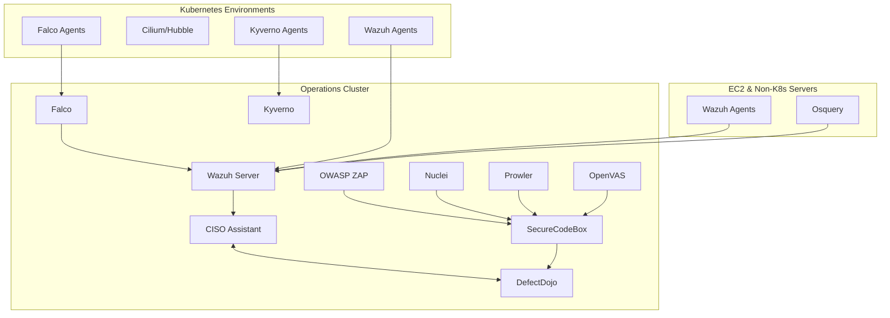
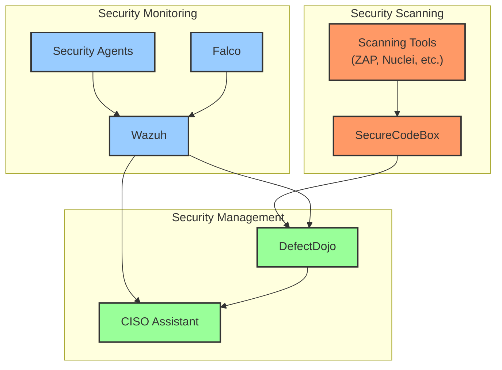

# CISO Toolkit: Open Source Security Operations Suite

## Overview

The CISO Toolkit is designed to help organizations without dedicated security teams implement a basic Information Security Management System (ISMS) using open source security tools. This document outlines the comprehensive strategy for deploying, configuring, and operating these tools to create an effective security operations capability.

## Target Audience

- Small to medium-sized organizations without dedicated security teams
- IT professionals tasked with implementing security controls
- Organizations seeking to establish basic security operations capabilities
- Companies preparing for security compliance requirements

## Solution Architecture

The CISO Toolkit integrates several open source security tools into a cohesive platform with three main deployment areas:



### 1. Operations Cluster (Central Security Hub)

The Operations Cluster serves as the central management and monitoring hub for all security operations.

**Core Components:**
- **CISO Assistant**: Central governance platform for security management
- **DefectDojo**: Vulnerability management platform
- **SecureCodeBox**: Orchestration for security scanners

**Monitoring and Detection:**
- **Falco**: Runtime security monitoring
- **Wazuh**: Security monitoring and SIEM capabilities
- **Kyverno**: Kubernetes policy management

**Scanning Tools:**
- **OWASP ZAP**: Web application security testing
- **Nuclei**: Template-based vulnerability scanning
- **Prowler**: AWS security assessment
- **OpenVAS/Greenbone**: Network vulnerability scanning

### 2. Per-Environment Deployments (Kubernetes Clusters)

Security components deployed in each Kubernetes environment to provide local monitoring and enforcement.

**Components:**
- **Falco Agents**: Runtime security monitoring
- **Cilium/Hubble**: Network security and visibility
- **Wazuh Agents**: Local security monitoring
- **Kyverno Agents**: Policy enforcement

### 3. EC2 and Non-Kubernetes Servers

Security components for traditional infrastructure.

**Components:**
- **Wazuh Agents**: Security monitoring
- **Osquery**: Endpoint visibility and monitoring

## Implementation Roadmap

The CISO Toolkit guides users through a phased implementation approach:

### Phase 1: Foundation Setup (Weeks 1-2)

1. **Initial Assessment**
   - Company profile creation
   - Basic asset inventory
   - Security goals definition

2. **Core Platform Deployment**
   - CISO Assistant installation and configuration
   - DefectDojo deployment
   - Integration setup between platforms

3. **Basic Monitoring**
   - Wazuh server deployment
   - Initial agent deployment on critical systems

### Phase 2: Enhanced Visibility (Weeks 3-4)

1. **Vulnerability Management**
   - SecureCodeBox deployment
   - Initial vulnerability scans configuration
   - Integration with DefectDojo

2. **Kubernetes Security** (if applicable)
   - Falco deployment
   - Kyverno policy implementation
   - Cilium/Hubble network monitoring

3. **Cloud Security**
   - Prowler deployment for AWS environments
   - Cloud security baseline establishment

### Phase 3: Operational Maturity (Weeks 5-8)

1. **Security Testing**
   - OWASP ZAP integration for web applications
   - Nuclei deployment for targeted scanning
   - OpenVAS/Greenbone for network scanning

2. **Incident Response**
   - Incident response workflow setup
   - Alert configuration and tuning
   - Basic playbook development

3. **Compliance Mapping**
   - Mapping controls to compliance frameworks
   - Gap assessment
   - Remediation planning

### Phase 4: Continuous Improvement (Ongoing)

1. **Metrics and Reporting**
   - Security dashboard development
   - Executive reporting
   - Trend analysis

2. **Process Refinement**
   - Workflow optimization
   - Automation enhancement
   - Knowledge base development

3. **Advanced Use Cases**
   - Threat hunting capabilities
   - Advanced correlation rules
   - Custom detection development

## Detailed Tool Deployment Guides

### CISO Assistant

CISO Assistant serves as the central governance platform for managing security controls, policies, and compliance requirements.

**Deployment Steps:**
1. Server requirements and preparation
2. Installation options (Docker, Kubernetes, standalone)
3. Initial configuration
4. User management and access control
5. Integration with other tools

**Key Features to Configure:**
- Policy management
- Risk assessment
- Compliance mapping
- Security control tracking

### DefectDojo

DefectDojo provides vulnerability management capabilities, tracking findings from various security tools.

**Deployment Steps:**
1. Server requirements and preparation
2. Installation options (Docker, Kubernetes)
3. Initial configuration
4. User management and access control
5. Integration with scanning tools

**Key Features to Configure:**
- Product and engagement setup
- Finding management workflow
- Metrics and reporting
- API integration with scanners

### SecureCodeBox

SecureCodeBox orchestrates security scanners and automates the vulnerability scanning process.

**Deployment Steps:**
1. Kubernetes cluster preparation
2. Helm chart installation
3. Scanner configuration
4. Scan target definition
5. Integration with DefectDojo

**Key Features to Configure:**
- Scan orchestration
- Scanner selection and configuration
- Scheduling and automation
- Result processing

### Wazuh

Wazuh provides security monitoring, threat detection, and incident response capabilities.

**Deployment Steps:**
1. Server requirements and preparation
2. Installation options (Docker, standalone)
3. Agent deployment strategies
4. Rule configuration
5. Alert management

**Key Features to Configure:**
- File integrity monitoring
- Log analysis rules
- Compliance monitoring
- Active response configuration

### Falco

Falco provides runtime security for containers and Kubernetes environments.

**Deployment Steps:**
1. Kubernetes preparation
2. Helm chart installation
3. Rule configuration
4. Alert integration
5. Response automation

**Key Features to Configure:**
- Custom rule development
- Alert prioritization
- Integration with incident response
- Kubernetes-specific monitoring

### Kyverno

Kyverno enforces policies in Kubernetes environments.

**Deployment Steps:**
1. Kubernetes preparation
2. Installation
3. Policy configuration
4. Validation and testing
5. Monitoring and reporting

**Key Features to Configure:**
- Security policies
- Configuration validation
- Resource management
- Compliance enforcement

### Scanning Tools (OWASP ZAP, Nuclei, Prowler, OpenVAS)

These tools provide specialized scanning capabilities for different environments.

**Deployment Considerations:**
1. Integration with SecureCodeBox
2. Standalone deployment options
3. Scan configuration and customization
4. Result processing and reporting

## Integration Strategy

A key strength of the CISO Toolkit is the integration between tools to create a cohesive security operations platform.

### Core Integrations

1. **CISO Assistant ↔ DefectDojo**
   - Vulnerability findings flow to governance tracking
   - Compliance requirements inform scanning strategy

2. **SecureCodeBox ↔ DefectDojo**
   - Automated scan results import
   - Finding deduplication and tracking

3. **Wazuh ↔ CISO Assistant**
   - Security events inform risk assessments
   - Compliance monitoring feeds into governance

### Data Flow Architecture



## Operational Procedures

### Daily Operations

1. **Morning Security Review**
   - Review critical alerts from previous 24 hours
   - Check vulnerability scan results
   - Update incident tracking

2. **Continuous Monitoring**
   - Active dashboard monitoring
   - Alert triage and investigation
   - Threat hunting activities

3. **End-of-Day Summary**
   - Security incident summary
   - New vulnerability review
   - Next-day prioritization

### Weekly Operations

1. **Vulnerability Management**
   - Review new findings
   - Update remediation plans
   - Track remediation progress

2. **System Maintenance**
   - Update security tools
   - Rule and policy tuning
   - Performance optimization

3. **Metrics and Reporting**
   - Generate weekly security metrics
   - Update dashboards
   - Prepare stakeholder communications

### Monthly Operations

1. **Comprehensive Scanning**
   - Full infrastructure vulnerability scan
   - Web application security testing
   - Cloud security assessment

2. **Policy and Compliance Review**
   - Control effectiveness assessment
   - Compliance status update
   - Policy review and updates

3. **Executive Reporting**
   - Security posture summary
   - Risk assessment update
   - Resource planning

## Penetration Testing Strategy

While the CISO Toolkit includes various scanning tools, a comprehensive security program should also include penetration testing. For organizations without dedicated penetration testing capabilities, we recommend:

### Internal Testing Capabilities

1. **Basic Penetration Testing Tools**
   - **Metasploit Framework**: For vulnerability exploitation testing
   - **Burp Suite Community Edition**: For web application testing
   - **Kali Linux**: Comprehensive penetration testing distribution

2. **Guided Testing Methodology**
   - OWASP Testing Guide for web applications
   - NIST penetration testing guidance
   - Basic network penetration testing procedures

### External Testing Options

1. **Crowdsourced Security Platforms**
   - HackerOne, Bugcrowd, or Synack for managed bug bounty programs
   - Vulnerability disclosure program setup

2. **Periodic Professional Testing**
   - Annual or bi-annual professional penetration tests
   - Targeted testing for critical systems
   - Red team exercises for mature organizations

## Training and Skill Development

To effectively operate the CISO Toolkit, users should develop skills in:

1. **Basic Security Concepts**
   - Threat modeling
   - Vulnerability management
   - Security monitoring
   - Incident response

2. **Tool-Specific Training**
   - CISO Assistant administration
   - DefectDojo vulnerability management
   - Wazuh monitoring and rule creation
   - SecureCodeBox scan orchestration

3. **Recommended Learning Resources**
   - SANS courses (especially SEC401)
   - OWASP resources
   - Tool-specific documentation
   - Community forums and support channels

## Success Metrics

To measure the effectiveness of the CISO Toolkit implementation, track:

1. **Coverage Metrics**
   - Percentage of assets monitored
   - Percentage of applications scanned
   - Policy implementation coverage

2. **Operational Metrics**
   - Mean time to detect (MTTD) security incidents
   - Mean time to remediate (MTTR) vulnerabilities
   - Alert-to-investigation ratio

3. **Risk Reduction Metrics**
   - Vulnerability density over time
   - High-risk finding reduction
   - Policy violation reduction

## Conclusion

The CISO Toolkit provides a comprehensive approach to implementing basic security operations capabilities using open source tools. By following this solution strategy, organizations can establish effective security monitoring, vulnerability management, and governance processes without requiring extensive security expertise or large investments in commercial security products.

The phased implementation approach allows organizations to gradually build capabilities while realizing incremental security improvements. As the organization's security maturity increases, the toolkit can be expanded and enhanced to address more advanced security requirements.

```mermaid
graph TD
    subgraph "Scanning Layer"
        ZAP["OWASP ZAP"]
        NUC["Nuclei"]
        PROW["Prowler"]
        OVAS["OpenVAS"]
        SCB["SecureCodeBox"]
        
        ZAP --> SCB
        NUC --> SCB
        PROW --> SCB
        OVAS --> SCB
    end
    
    subgraph "Monitoring Layer"
        FALCO["Falco"]
        WAZUH["Wazuh"]
        CIL["Cilium/Hubble"]
        OSQ["Osquery"]
        
        FALCO --> WAZUH
        CIL --> WAZUH
        OSQ --> WAZUH
    end
    
    subgraph "Management Layer"
        DD["DefectDojo"]
        CISO["CISO Assistant"]
        
        DD --> CISO
    end
    
    SCB --> DD
    WAZUH --> DD
    WAZUH --> CISO
    
    classDef scanningLayer fill:#f96,stroke:#333,stroke-width:2px
    classDef monitoringLayer fill:#9cf,stroke:#333,stroke-width:2px
    classDef managementLayer fill:#9f9,stroke:#333,stroke-width:2px
    
    class ZAP,NUC,PROW,OVAS,SCB scanningLayer
    class FALCO,WAZUH,CIL,OSQ monitoringLayer
    class DD,CISO managementLayer
