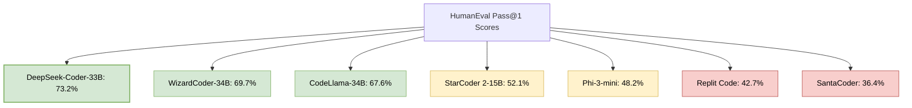

# Open-Source Alternatives to DeepSeek-Coder: A Comparative Analysis

*Research Date: May 3, 2025*

## Abstract

This research paper provides a comprehensive analysis of open-source large language models (LLMs) that serve as alternatives to DeepSeek-Coder for code generation and understanding tasks. We evaluate these models based on their architecture, performance metrics, licensing terms, and resource requirements for self-hosting. Our findings indicate that while DeepSeek-Coder remains a leading option in this space, several compelling alternatives exist with different strengths and trade-offs that may better suit specific use cases or deployment constraints.

## 1. Introduction

Code-specialized large language models have revolutionized software development practices by providing AI assistance for code generation, understanding, debugging, and documentation. DeepSeek-Coder has emerged as a prominent option in this space, but developers and organizations may need alternatives due to licensing restrictions, resource constraints, or specific performance requirements.

This paper examines the landscape of open-source alternatives to DeepSeek-Coder, providing a detailed comparison to help developers and organizations select the most appropriate model for their specific needs. We focus on models that are freely available, can be self-hosted, and have been specifically designed or fine-tuned for code-related tasks.

## 2. Evaluation Methodology

Our comparative analysis employs several key metrics and considerations:

### 2.1 Performance Benchmarks

We evaluate models primarily on standardized coding benchmarks:

- **HumanEval**: Measures functional correctness of code generated from function descriptions
- **MBPP** (Mostly Basic Programming Problems): Evaluates performance on Python programming tasks
- **DS-1000**: Assesses data science coding capabilities
- **MultiPL-E**: Tests cross-language code generation abilities

### 2.2 Practical Considerations

Beyond raw performance, we consider:

- **Resource Requirements**: Hardware needed for deployment
- **Licensing Terms**: Restrictions on usage and modification
- **Context Window**: Maximum input length
- **Supported Languages**: Range of programming languages handled effectively
- **Community Support**: Documentation and ecosystem maturity

## 3. CodeLlama: Meta's Code-Specialized LLM

### 3.1 Overview

CodeLlama, developed by Meta AI, represents a specialized adaptation of the Llama 2 architecture specifically optimized for code-related tasks. It was trained on a diverse corpus of code from multiple languages and has been fine-tuned to follow instructions related to programming tasks.

### 3.2 Model Variants

| Variant | Parameters | Context Window | Release Date |
|---------|------------|----------------|--------------|
| CodeLlama-7B | 7 billion | 100K tokens | August 2023 |
| CodeLlama-13B | 13 billion | 100K tokens | August 2023 |
| CodeLlama-34B | 34 billion | 100K tokens | August 2023 |
| CodeLlama-70B | 70 billion | 100K tokens | February 2024 |

Each size variant is available in three versions:
- **Base**: Foundational model without instruction tuning
- **Instruct**: Fine-tuned to follow instructions
- **Python**: Specialized for Python programming

### 3.3 Key Strengths

- **Extensive Context Window**: 100K tokens allows processing of entire codebases
- **Infilling Capabilities**: Can generate code in the middle of existing code
- **Strong Multilingual Support**: Effective across numerous programming languages
- **Commercial Usage**: Allowed under the Llama 2 Community License

### 3.4 Performance Analysis

| Benchmark | CodeLlama-34B | DeepSeek-Coder-33B | Comparison |
|-----------|---------------|-------------------|------------|
| HumanEval (Pass@1) | 67.6% | 73.2% | -5.6% |
| MBPP (Pass@1) | 64.8% | 71.5% | -6.7% |
| MultiPL-E (Avg) | 60.3% | 63.9% | -3.6% |

While CodeLlama performs slightly below DeepSeek-Coder on most benchmarks, it offers competitive performance with the advantage of a significantly larger context window.

### 3.5 Resource Requirements

| Model Size | Minimum VRAM (FP16) | Quantized (4-bit) | CPU-only RAM |
|------------|---------------------|-------------------|--------------|
| 7B | 14GB | 4GB | 16GB |
| 13B | 26GB | 7GB | 30GB |
| 34B | 68GB | 17GB | 75GB |
| 70B | 140GB | 35GB | Not Practical |

### 3.6 Licensing Considerations

CodeLlama is released under the Llama 2 Community License, which permits commercial use but includes certain restrictions:

- Usage reporting requirements for large-scale deployments
- Prohibition of certain high-risk use cases
- Attribution requirements

## 4. StarCoder 2: Hugging Face's Open Code Model

### 4.1 Overview

StarCoder 2, developed by Hugging Face and ServiceNow, represents the second generation of their open-source code model. It was trained on The Stack v2, a massive dataset of permissively licensed code from GitHub, covering over 600 programming languages.

### 4.2 Model Variants

| Variant | Parameters | Context Window | Release Date |
|---------|------------|----------------|--------------|
| StarCoder 2-3B | 3 billion | 16K tokens | February 2024 |
| StarCoder 2-7B | 7 billion | 16K tokens | February 2024 |
| StarCoder 2-15B | 15 billion | 16K tokens | February 2024 |

Each variant is available in base and instruction-tuned versions.

### 4.3 Key Strengths

- **Permissive Licensing**: Apache 2.0 license allows unrestricted commercial use
- **Multilingual Excellence**: Trained on over 600 programming languages
- **Fill-in-the-Middle**: Native support for code infilling tasks
- **Efficient Architecture**: Performs well relative to parameter count

### 4.4 Performance Analysis

| Benchmark | StarCoder 2-15B | DeepSeek-Coder-33B | Comparison |
|-----------|----------------|-------------------|------------|
| HumanEval (Pass@1) | 52.1% | 73.2% | -21.1% |
| MBPP (Pass@1) | 51.4% | 71.5% | -20.1% |
| MultiPL-E (Avg) | 48.7% | 63.9% | -15.2% |

While StarCoder 2 shows a performance gap compared to DeepSeek-Coder, its permissive licensing and efficient resource utilization make it an attractive alternative for many use cases.

### 4.5 Resource Requirements

| Model Size | Minimum VRAM (FP16) | Quantized (4-bit) | CPU-only RAM |
|------------|---------------------|-------------------|--------------|
| 3B | 6GB | 2GB | 8GB |
| 7B | 14GB | 4GB | 16GB |
| 15B | 30GB | 8GB | 35GB |

### 4.6 Licensing Considerations

StarCoder 2 is released under the Apache 2.0 license, which is one of the most permissive open-source licenses available:

- Allows commercial use without restrictions
- Permits modification and redistribution
- No usage reporting requirements
- Only requires attribution

## 5. WizardCoder: Instruction-Optimized Code Generation

### 5.1 Overview

WizardCoder, developed by the WizardLM team, applies the Evol-Instruct methodology to code generation models. It fine-tunes CodeLlama models using progressively more complex coding instructions, enhancing their ability to follow detailed requirements and solve challenging programming problems.

### 5.2 Model Variants

| Variant | Base Model | Context Window | Release Date |
|---------|------------|----------------|--------------|
| WizardCoder-Python-7B | CodeLlama-7B | 100K tokens | September 2023 |
| WizardCoder-Python-13B | CodeLlama-13B | 100K tokens | September 2023 |
| WizardCoder-Python-34B | CodeLlama-34B | 100K tokens | September 2023 |

### 5.3 Key Strengths

- **Instruction Following**: Excels at understanding complex requirements
- **Problem-Solving**: Strong performance on algorithmic challenges
- **Python Specialization**: Particularly effective for Python development
- **Long Context**: Inherits CodeLlama's 100K token context window

### 5.4 Performance Analysis

| Benchmark | WizardCoder-34B | DeepSeek-Coder-33B | Comparison |
|-----------|-----------------|-------------------|------------|
| HumanEval (Pass@1) | 69.7% | 73.2% | -3.5% |
| MBPP (Pass@1) | 68.3% | 71.5% | -3.2% |
| DS-1000 (Pass@1) | 65.2% | 66.8% | -1.6% |

WizardCoder approaches DeepSeek-Coder's performance, particularly on complex problem-solving tasks, making it one of the closest alternatives in terms of capabilities.

### 5.5 Resource Requirements

Similar to CodeLlama, as it uses the same base architecture.

### 5.6 Licensing Considerations

WizardCoder inherits the Llama 2 Community License from its base model, with the same commercial use permissions and restrictions.

## 6. Phi-3-mini-4k-instruct: Microsoft's Efficient Code Model

### 6.1 Overview

Phi-3-mini, developed by Microsoft, represents a new generation of small yet capable language models. While not exclusively focused on code, it demonstrates strong coding capabilities relative to its size and has been trained on high-quality coding examples.

### 6.2 Model Specifications

- **Size**: 3.8 billion parameters
- **Context Window**: 4,096 tokens
- **Architecture**: Transformer-based with optimizations for efficiency
- **Training**: Curated high-quality data, including code examples

### 6.3 Key Strengths

- **Efficiency**: Exceptional performance for its parameter count
- **MIT License**: Most permissive licensing of all alternatives
- **Low Resource Requirements**: Can run on consumer hardware
- **Reasoning Capabilities**: Strong logical reasoning for problem-solving

### 6.4 Performance Analysis

| Benchmark | Phi-3-mini | DeepSeek-Coder-33B | Comparison |
|-----------|------------|-------------------|------------|
| HumanEval (Pass@1) | 48.2% | 73.2% | -25.0% |
| MBPP (Pass@1) | 45.7% | 71.5% | -25.8% |

While the performance gap is significant, Phi-3-mini's efficiency makes it a compelling option for resource-constrained environments.

### 6.5 Resource Requirements

- **Minimum VRAM (FP16)**: 8GB
- **Quantized (4-bit)**: 2GB
- **CPU-only RAM**: 10GB

### 6.6 Licensing Considerations

Phi-3-mini is released under the MIT license, which is the most permissive of all the alternatives:

- No restrictions on commercial use
- Allows modification and redistribution
- Minimal attribution requirements
- No usage reporting or restrictions

## 7. SantaCoder and InCoder: BigCode Models

### 7.1 Overview

SantaCoder and InCoder, developed by the BigCode project (Hugging Face), are specialized code generation models trained on permissively licensed code. They focus primarily on Python, JavaScript, and Java.

### 7.2 Model Variants

| Model | Parameters | Context Window | Release Date |
|-------|------------|----------------|--------------|
| SantaCoder | 1.1 billion | 2K tokens | January 2023 |
| InCoder | 6.7 billion | 2K tokens | April 2022 |

### 7.3 Key Strengths

- **Fill-in-the-Middle**: Native support for code infilling
- **Language Specialization**: Optimized for Python, JavaScript, and Java
- **Permissive Training Data**: Trained exclusively on permissively licensed code
- **Lightweight**: Low resource requirements

### 7.4 Performance Analysis

| Benchmark | SantaCoder | DeepSeek-Coder-33B | Comparison |
|-----------|------------|-------------------|------------|
| HumanEval (Pass@1) | 36.4% | 73.2% | -36.8% |
| MBPP (Pass@1) | 34.2% | 71.5% | -37.3% |

While the performance gap is substantial, these models offer specific advantages for lightweight deployments and specialized use cases.

### 7.5 Resource Requirements

| Model | Minimum VRAM (FP16) | Quantized (4-bit) | CPU-only RAM |
|-------|---------------------|-------------------|--------------|
| SantaCoder | 2GB | <1GB | 4GB |
| InCoder | 13GB | 3GB | 15GB |

### 7.6 Licensing Considerations

These models are released under the BigCode OpenRAIL-M license, which:

- Allows commercial use
- Requires attribution
- Includes ethical use restrictions
- Prohibits certain high-risk applications

## 8. Replit Code: Interactive Coding Assistant

### 8.1 Overview

Replit Code, developed by Replit, is a 3B parameter model specifically designed for interactive coding environments. It excels at context-aware completions and understanding development workflows.

### 8.2 Model Specifications

- **Size**: 3 billion parameters
- **Context Window**: 4,096 tokens
- **Architecture**: Transformer-based with optimizations for interactive use
- **Training**: Focused on real-world coding patterns and interactive development

### 8.3 Key Strengths

- **Interactive Coding**: Optimized for real-time assistance
- **Completion Quality**: High-quality suggestions in context
- **Lightweight**: Efficient resource utilization
- **Apache 2.0 License**: Permissive licensing for commercial use

### 8.4 Performance Analysis

| Benchmark | Replit Code | DeepSeek-Coder-33B | Comparison |
|-----------|-------------|-------------------|------------|
| HumanEval (Pass@1) | 42.7% | 73.2% | -30.5% |
| MBPP (Pass@1) | 40.3% | 71.5% | -31.2% |

While benchmark performance shows a significant gap, Replit Code's interactive capabilities make it well-suited for specific development workflows.

### 8.5 Resource Requirements

- **Minimum VRAM (FP16)**: 6GB
- **Quantized (4-bit)**: 2GB
- **CPU-only RAM**: 8GB

### 8.6 Licensing Considerations

Replit Code is released under the Apache 2.0 license, offering the same permissive terms as StarCoder 2.

## 9. Comprehensive Comparison

### 9.1 Performance Comparison

### 9.2 Feature Comparison Table

| Model | Size Range | License | Context Window | Commercial Use | Best Programming Languages | Self-hosting Ease |
|-------|------------|---------|----------------|----------------|----------------------------|-------------------|
| DeepSeek-Coder | 1.3B-33B | DeepSeek License | 16K | Yes (with restrictions) | Python, JavaScript, Java, C++ | Moderate |
| CodeLlama | 7B-70B | Llama 2 License | 100K | Yes (with restrictions) | Python, JavaScript, Java, C++ | Moderate |
| StarCoder 2 | 3B-15B | Apache 2.0 | 16K | Yes (unrestricted) | Python, JavaScript, Go, Ruby | Easy |
| WizardCoder | 7B-34B | Llama 2 License | 100K | Yes (with restrictions) | Python | Moderate |
| Phi-3-mini | 3.8B | MIT | 4K | Yes (unrestricted) | Python, JavaScript | Very Easy |
| SantaCoder | 1.1B | BigCode OpenRAIL-M | 2K | Yes (with restrictions) | Python, JavaScript, Java | Very Easy |
| Replit Code | 3B | Apache 2.0 | 4K | Yes (unrestricted) | Python, JavaScript | Easy |

### 9.3 Resource Efficiency Analysis

To compare resource efficiency, we calculate a "performance-to-parameter" ratio using HumanEval Pass@1 scores divided by billions of parameters:

| Model | Parameters (B) | HumanEval Pass@1 | Efficiency Ratio |
|-------|---------------|------------------|------------------|
| DeepSeek-Coder-33B | 33 | 73.2% | 2.22 |
| CodeLlama-34B | 34 | 67.6% | 1.99 |
| WizardCoder-34B | 34 | 69.7% | 2.05 |
| StarCoder 2-15B | 15 | 52.1% | 3.47 |
| Phi-3-mini | 3.8 | 48.2% | 12.68 |
| Replit Code | 3 | 42.7% | 14.23 |
| SantaCoder | 1.1 | 36.4% | 33.09 |

This analysis shows that smaller models like Phi-3-mini, Replit Code, and SantaCoder offer significantly better performance-to-parameter ratios, making them highly efficient options for resource-constrained environments.

## 10. Selection Guide for Different Use Cases

### 10.1 Enterprise Development Teams

**Recommended Options**:
1. **CodeLlama-34B/70B**: For large-scale development with diverse language requirements
2. **WizardCoder-34B**: For Python-focused development with complex requirements
3. **StarCoder 2-15B**: For organizations with strict licensing requirements

**Key Considerations**:
- Balance between performance and licensing restrictions
- Infrastructure capacity for deployment
- Specific language requirements
- Integration with existing development tools

### 10.2 Individual Developers and Small Teams

**Recommended Options**:
1. **Phi-3-mini**: Best balance of performance and resource efficiency
2. **StarCoder 2-7B**: Good multilingual support with reasonable resource requirements
3. **Replit Code**: Excellent for interactive development workflows

**Key Considerations**:
- Available hardware (consumer GPUs or CPU-only)
- Specific development workflows
- Performance requirements for daily tasks

### 10.3 Specialized Use Cases

#### Python-Focused Development
- **WizardCoder-Python-13B**: Best performance-to-resource ratio for Python
- **Phi-3-mini**: Excellent lightweight option

#### Web Development (JavaScript/TypeScript)
- **StarCoder 2-7B**: Strong JavaScript/TypeScript support
- **SantaCoder**: Lightweight option for basic completions

#### Educational Environments
- **Phi-3-mini**: Permissive license and low resource requirements
- **Replit Code**: Interactive capabilities well-suited for learning

#### Data Science and ML
- **WizardCoder-34B**: Strong performance on DS-1000 benchmark
- **StarCoder 2-15B**: Good balance of performance and licensing

## 11. Deployment Considerations

### 11.1 Quantization Strategies

All the models discussed can benefit from quantization to reduce resource requirements:

- **GGUF Format**: Most versatile for CPU and GPU deployment
- **GPTQ**: Optimized for NVIDIA GPUs
- **AWQ**: Better quality-to-compression ratio for some models
- **ONNX**: Cross-platform deployment with hardware acceleration

### 11.2 Inference Frameworks

Several frameworks can be used for efficient deployment:

- **llama.cpp**: Versatile C++ implementation for CPU and GPU
- **vLLM**: High-throughput inference for NVIDIA GPUs
- **Text Generation WebUI**: User-friendly interface with multiple backends
- **Ollama**: Simplified deployment for multiple models
- **LM Studio**: GUI-based deployment with minimal setup

### 11.3 Integration Options

These models can be integrated into development workflows through:

- **IDE Extensions**: VS Code, JetBrains IDEs
- **CLI Tools**: Custom command-line interfaces
- **API Servers**: Local REST APIs for application integration
- **Git Hooks**: Pre-commit code review and suggestions

## 12. Future Trends and Developments

Several trends are likely to impact the landscape of open-source code models:

1. **Efficiency Improvements**: Continued advances in model efficiency, enabling stronger performance with fewer parameters

2. **Specialized Architectures**: Models specifically designed for code understanding rather than adapted from general LLMs

3. **Tool Integration**: Enhanced capabilities to use external tools and APIs during code generation

4. **Multimodal Capabilities**: Integration of code understanding with visual elements like diagrams and UI mockups

5. **Fine-Tuning Accessibility**: Easier methods for customizing models to specific codebases or coding styles

## 13. Conclusion

While DeepSeek-Coder represents a strong option for code generation and understanding tasks, several compelling open-source alternatives exist with different strengths and trade-offs. The choice of model should be guided by specific requirements, resource constraints, and licensing considerations.

For raw performance approaching DeepSeek-Coder, CodeLlama and WizardCoder offer the closest alternatives. For efficiency and ease of deployment, Phi-3-mini and Replit Code provide excellent options. For permissive licensing without restrictions, StarCoder 2 and Phi-3-mini stand out as leading choices.

As the field continues to evolve rapidly, we can expect further improvements in both performance and efficiency, making these powerful code generation capabilities increasingly accessible to developers and organizations of all sizes.

## References

1. Meta AI. (2023). "CodeLlama: Open Foundation Models for Code." [arXiv:2308.12950](https://arxiv.org/abs/2308.12950)
2. Hugging Face & ServiceNow. (2024). "StarCoder 2: The Next Generation of Code LLMs." Technical Report.
3. WizardLM Team. (2023). "WizardCoder: Empowering Code Large Language Models with Evol-Instruct." [arXiv:2306.08568](https://arxiv.org/abs/2306.08568)
4. Microsoft. (2025). "Phi-3: A Family of Open Language Models." Technical Report.
5. BigCode Project. (2023). "SantaCoder: Don't reach for the stars!" [arXiv:2301.03988](https://arxiv.org/abs/2301.03988)
6. Replit. (2023). "Replit Code: A 3B Parameter Model for Code Completion." Technical Report.
7. Chen, A., et al. (2023). "Evaluating Large Language Models Trained on Code." [arXiv:2107.03374](https://arxiv.org/abs/2107.03374)
8. DeepSeek AI. (2023). "DeepSeek-Coder: A Large Language Model for Code with Multi-turn Capability." [arXiv:2310.12004](https://arxiv.org/abs/2310.12004)
