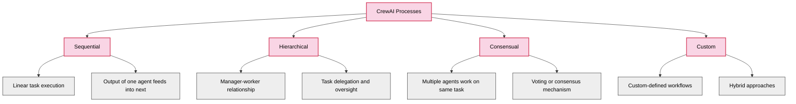
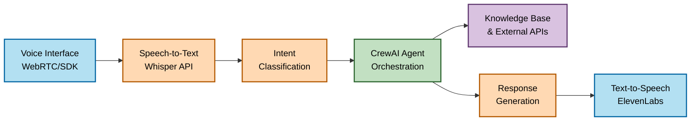
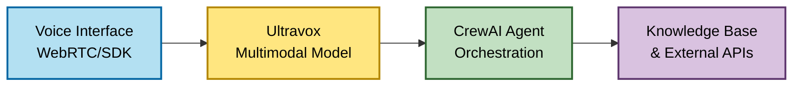
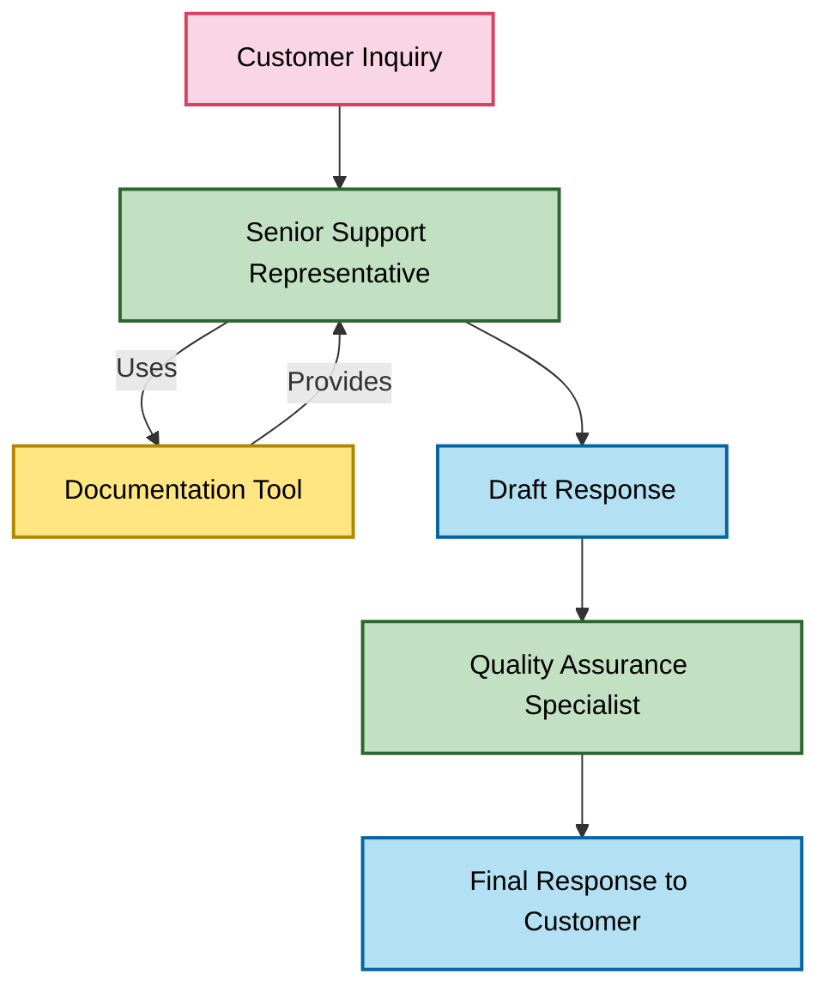

# CrewAI: An Overview for AI-Powered Customer Interaction Systems

*Research Date: May 3, 2025*

## Introduction

CrewAI is an open-source framework designed to orchestrate role-playing autonomous AI agents. It enables the creation of collaborative AI systems where multiple specialized agents work together to accomplish complex tasks. This research paper explores the capabilities, features, and potential applications of CrewAI in the context of developing AI-powered customer interaction systems for sales, technical support, and account management.

## Core Concepts of CrewAI

### 1. Agents

Agents are the fundamental building blocks in CrewAI. Each agent:

- Represents a specific role with defined responsibilities
- Has customizable attributes including:
  - Role and goals
  - Backstory and personality
  - Tools and capabilities
  - Memory and context awareness
  - LLM configuration (model, temperature, etc.)

Agents can be configured to use various LLM providers, including OpenAI, Anthropic, Google, and others, allowing flexibility in deployment.

### 2. Tasks

Tasks represent specific activities assigned to agents. Key characteristics include:

- Clear description and expected output
- Assignable to specific agents
- Configurable execution parameters
- Support for sequential and parallel execution
- Context sharing between related tasks

### 3. Crews

Crews are collections of agents working together. They:

- Manage task delegation and coordination
- Handle information flow between agents
- Support different process models:
  - Sequential (waterfall)
  - Hierarchical (manager-worker)
  - Consensus-based
  - Dynamic/adaptive workflows

### 4. Tools

CrewAI agents can leverage various tools to extend their capabilities:

- Web search and browsing
- Code execution
- Document retrieval and analysis
- API interactions
- Custom tools via simple Python interfaces

### 5. Processes

Processes in CrewAI define how agents collaborate and interact to complete tasks. They are a crucial component that determines the workflow and information flow between agents.

#### Process Types

#### Key Process Characteristics

- **Task Delegation Logic**: How tasks are assigned to specific agents
- **Information Sharing Protocol**: How context and outputs are shared between agents
- **Error Handling**: How failures or unexpected results are managed
- **Iteration Mechanisms**: How agents refine their outputs based on feedback
- **Termination Conditions**: How the process determines when the work is complete

#### Process Implementation

Processes in CrewAI are implemented through:

- **Process Classes**: Predefined process types with specific behaviors
- **Callback Hooks**: Custom functions that execute at specific points in the workflow
- **Task Dependencies**: Explicit relationships between tasks that determine execution order
- **Context Management**: Mechanisms for sharing state between agents and tasks

## Key Features Relevant to Customer Interaction Systems

### 1. Multi-Agent Collaboration

CrewAI's multi-agent architecture is particularly suited for customer interaction systems that require different specialized roles:

- **Sales Agent**: Handles product inquiries, pricing, and closing deals
- **Technical Support Agent**: Troubleshoots issues and provides solutions
- **Account Manager**: Maintains customer relationships and handles account-specific requests
- **Knowledge Base Agent**: Retrieves and synthesizes information from company resources

These agents can collaborate to provide comprehensive assistance, with seamless handoffs between different domains of expertise.

### 2. Memory and Context Management

CrewAI provides mechanisms for:

- Short-term conversation memory
- Long-term knowledge retention
- Cross-agent context sharing
- Conversation history management

This enables natural, contextually aware interactions where agents can refer to previous parts of the conversation and maintain coherent dialogue across multiple turns.

### 3. Process Flexibility

The framework supports various interaction patterns:

- **Sequential Processing**: For structured workflows (e.g., sales qualification → product recommendation → closing)
- **Hierarchical Delegation**: Where a manager agent coordinates specialized sub-agents
- **Dynamic Routing**: Directing customer queries to the most appropriate specialist agent

### 4. Integration Capabilities

CrewAI can integrate with:

- **Vector Databases**: For knowledge retrieval (e.g., Pinecone, Chroma)
- **External APIs**: For real-time data access
- **Custom Tools**: For specialized functionality
- **Existing Systems**: Through API interfaces

## Implementation Considerations

### 1. LLM Selection and Configuration

CrewAI is model-agnostic but requires careful selection of:

- Base models for different agent roles
- Temperature and other generation parameters
- Context window requirements
- Cost vs. performance tradeoffs

### 2. Knowledge Management

Effective customer interaction systems require:

- Comprehensive product/service knowledge bases
- Up-to-date troubleshooting guides
- Customer history and context
- Integration with existing CRM systems

### 3. Voice Integration Options

While CrewAI itself doesn't provide voice capabilities, it can be integrated with:

- **ElevenLabs**: For high-quality text-to-speech
- **Whisper API**: For speech-to-text
- **Real-time voice processing libraries**: For streaming audio interactions
- **WebRTC**: For web-based voice communication
- **Ultravox**: A multimodal model that handles both speech recognition and generation

#### Ultravox Integration Benefits

Integrating a multimodal model like Ultravox with CrewAI would provide several advantages:

- **Integrated Processing**: Single model handling both speech recognition and generation, reducing latency and complexity
- **Enhanced Understanding**: Ability to interpret vocal cues, tone, emphasis, and emotional signals
- **Streamlined Architecture**: Fewer integration points and simplified deployment
- **Advanced Capabilities**: Voice cloning, real-time adaptation, voice-based authentication, and multilingual support
- **Efficiency Improvements**: Reduced latency, lower costs, and more consistent quality

#### Alternative Voice Technologies

Beyond Ultravox, several other advanced voice technologies could enhance CrewAI's human interaction capabilities:

- **Anthropic Claude Sonnet**: Offers natural conversation flow with human-like pauses and intonation
- **NVIDIA Riva**: End-to-end speech AI SDK with customizable voices and low-latency processing
- **Resemble AI**: Provides emotional voice synthesis with fine-grained control over delivery
- **DeepMind Chirp**: Handles complex audio environments with superior noise cancellation
- **SoundHound Voice AI**: Optimized for real-time voice interactions in noisy environments
- **Suno AI**: Specializes in generating contextually appropriate background sounds and music
- **Speechify Neural**: Offers hyper-realistic voice synthesis with natural cadence

These technologies excel in different aspects of voice interaction, from emotional expressiveness to environmental adaptability, and could be selected based on specific use case requirements.

### 4. Monitoring and Evaluation

CrewAI provides:

- Detailed execution logs
- Performance metrics
- Conversation transcripts
- Debugging tools for agent behavior

## Open-Source Advantages and Limitations

### Advantages

- **Customizability**: Full access to source code allows deep customization
- **No Vendor Lock-in**: Freedom to switch between different LLM providers
- **Community Support**: Growing ecosystem of extensions and improvements
- **Cost Control**: Ability to optimize for performance/cost ratio
- **Privacy**: Potential for on-premises deployment with local models

### Limitations

- **Integration Effort**: Requires custom development for voice capabilities
- **Deployment Complexity**: Managing infrastructure for production systems
- **Model Costs**: Underlying LLM usage still incurs costs from providers
- **Performance Tuning**: Requires expertise to optimize for production use

## Example Architecture for Voice-Enabled Customer Support

#### Traditional Architecture

#### Multimodal Architecture with Ultravox

## Real-World Examples of CrewAI for Customer Interactions

Several implementations of CrewAI for customer service scenarios have been published, demonstrating practical applications of the framework.

### 1. Customer Support Crew

**Key Components:**
- **Agents**: Senior Support Representative and Support Quality Assurance Specialist
- **Tools**: Website scraping tool for accessing documentation
- **Tasks**: Inquiry resolution and quality assurance review
- **Process**: Hierarchical with delegation and review

This implementation demonstrates how a specialized support agent can address customer inquiries by accessing documentation, while a quality assurance agent reviews and refines responses to ensure accuracy and appropriate tone.

### 2. Multi-Agent Customer Support Automation

Another implementation focuses on a two-agent system with Google search integration:

**Key Components:**
- **Agents**: Support Agent and Quality Assurance Agent
- **Tools**: Google Search (SerperDevTool), Website Scraping, Website Search
- **Process**: The QA agent can delegate tasks to the Support Agent
- **Memory**: Enabled to maintain context throughout interactions

This implementation showcases how external tools like search engines can be integrated to provide agents with up-to-date information beyond their training data.

### 3. Sales and Marketing Applications

While not specifically for direct customer interactions, several CrewAI examples demonstrate capabilities relevant to sales and marketing:

- **Marketing Strategy Crew**: Creates comprehensive marketing strategies
- **Customer Outreach Campaign**: Develops personalized outreach messages
- **Match to Proposal**: Matches customer profiles to relevant offerings

These examples could be adapted for sales inquiry handling by focusing on product recommendations and personalized responses.

### Common Patterns in Customer Service Implementations

Across these examples, several common patterns emerge:

1. **Quality Assurance Role**: Most implementations include a dedicated QA agent to review and refine responses
2. **Documentation Access**: Tools for accessing up-to-date documentation are critical
3. **Hierarchical Process**: A manager-worker relationship is common for delegation and oversight
4. **Memory Usage**: Context retention across the conversation is essential
5. **Specialized Roles**: Clearly defined responsibilities for each agent

## Conclusion

CrewAI provides a robust foundation for building sophisticated AI-powered customer interaction systems. Its multi-agent architecture, flexible workflow capabilities, and integration options make it well-suited for applications in sales, technical support, and account management.

For voice-enabled interactions, CrewAI would need to be integrated with specialized voice processing components. The open-source nature of the framework allows for such customization, enabling the development of comprehensive solutions that combine the collaborative intelligence of multiple AI agents with natural voice interfaces.

## References

1. CrewAI GitHub Repository: [https://github.com/joaomdmoura/crewAI](https://github.com/joaomdmoura/crewAI)
2. CrewAI Documentation: [https://docs.crewai.com/](https://docs.crewai.com/)
3. ElevenLabs API (for voice synthesis): [https://elevenlabs.io/](https://elevenlabs.io/)
4. OpenAI Whisper API (for speech recognition): [https://platform.openai.com/docs/guides/speech-to-text](https://platform.openai.com/docs/guides/speech-to-text)
5. NVIDIA Riva (speech AI SDK): [https://developer.nvidia.com/riva](https://developer.nvidia.com/riva)
6. Resemble AI (emotional voice synthesis): [https://www.resemble.ai/](https://www.resemble.ai/)
7. SoundHound Voice AI: [https://www.soundhound.com/](https://www.soundhound.com/)
8. Anthropic Claude Documentation: [https://docs.anthropic.com/claude/](https://docs.anthropic.com/claude/)
