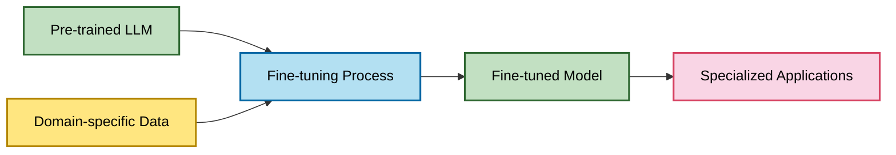
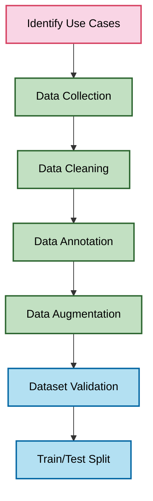
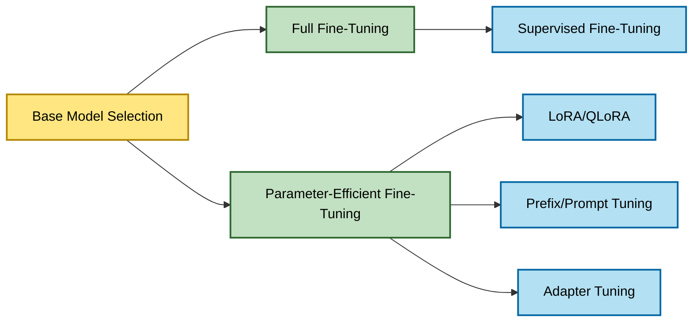
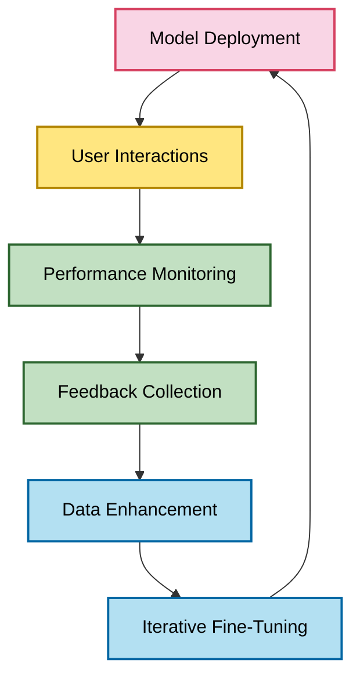
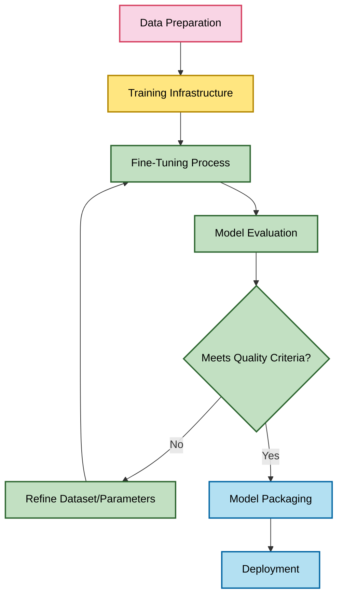
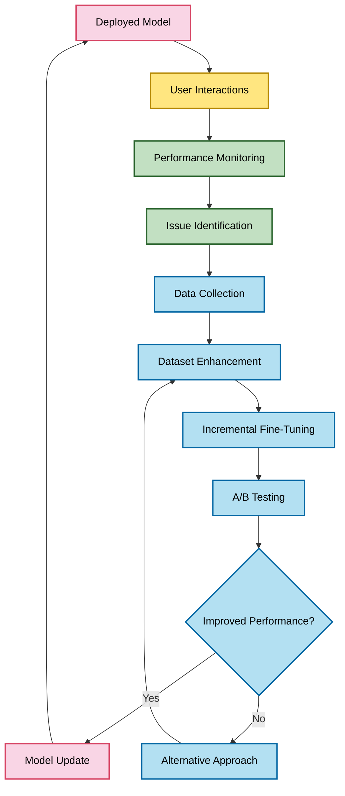

# Fine-Tuning Large Language Models: A Comprehensive Overview

*Research Date: May 3, 2025*

## 1. What is Fine-Tuning?

Fine-tuning is a transfer learning technique that adapts a pre-trained Large Language Model (LLM) to specific tasks, domains, or styles by further training it on a smaller, specialized dataset. This process allows organizations to customize general-purpose models for particular applications while leveraging the knowledge and capabilities already embedded in the base model.

### Core Concept

Fine-tuning works by adjusting the weights of a pre-trained model to optimize its performance for specific use cases. Rather than training a model from scratch—which would require enormous datasets and computational resources—fine-tuning starts with a model that already understands language and refines its capabilities for targeted applications.



### Historical Context

Fine-tuning emerged as a key technique in NLP following the introduction of transformer-based language models like BERT (2018) and GPT (2018). Initially, fine-tuning involved adapting these models for specific NLP tasks such as sentiment analysis or question answering. With the advent of larger models like GPT-3 and beyond, fine-tuning has evolved to include more sophisticated approaches that can adapt models while using fewer computational resources and smaller datasets.

### Key Benefits of Fine-Tuning

1. **Domain Adaptation**: Improves performance on industry-specific terminology and knowledge
2. **Task Specialization**: Optimizes the model for particular tasks like customer support or sales
3. **Style Alignment**: Adjusts the tone, format, and style to match organizational voice
4. **Reduced Hallucinations**: Decreases incorrect outputs by training on accurate domain data
5. **Improved Efficiency**: Can reduce the need for lengthy prompts by embedding instructions in the model
6. **Consistency**: Creates more predictable and standardized outputs across interactions

## 2. Major Components of Fine-Tuning for AI Agent Enhancement

Effective fine-tuning for AI customer agents involves several key components, each playing a crucial role in enhancing performance, quality, and reliability:

### 2.1 Data Collection and Preparation



#### Use Case Identification
- **Purpose**: Defines the specific applications and goals for the fine-tuned model
- **Key Considerations**: Customer service scenarios, common queries, desired outputs
- **Impact on Agents**: Determines the focus and specialization of the fine-tuning process

#### Data Collection
- **Purpose**: Gathers representative examples for the target use cases
- **Sources**: Customer interactions, support tickets, sales conversations, expert-written examples
- **Impact on Agents**: Data quality and relevance directly affect the model's specialized capabilities

#### Data Cleaning
- **Purpose**: Removes noise, errors, and sensitive information
- **Key Processes**: PII removal, error correction, formatting standardization
- **Impact on Agents**: Ensures the model learns from high-quality, appropriate examples

#### Data Annotation
- **Purpose**: Structures data in the format required for fine-tuning
- **Formats**: Instruction-response pairs, conversations, completions
- **Impact on Agents**: Proper annotation ensures the model learns the desired input-output patterns

#### Data Augmentation
- **Purpose**: Expands dataset size and diversity
- **Techniques**: Paraphrasing, template-based generation, synthetic data creation
- **Impact on Agents**: Improves generalization and robustness to query variations

#### Dataset Validation
- **Purpose**: Ensures dataset quality and alignment with goals
- **Processes**: Expert review, consistency checking, bias detection
- **Impact on Agents**: Critical for preventing undesired behaviors and biases

### 2.2 Fine-Tuning Methods



#### Full Fine-Tuning
- **Description**: Updates all model parameters during training
- **Resource Requirements**: High GPU memory (32GB+ for 7B models)
- **Advantages**: Maximum adaptation potential
- **Limitations**: Computationally expensive, risk of catastrophic forgetting
- **Impact on Agents**: Best when complete domain adaptation is required

#### Parameter-Efficient Fine-Tuning (PEFT)
- **Description**: Updates only a small subset of parameters or adds small trainable modules
- **Resource Requirements**: Significantly lower than full fine-tuning
- **Advantages**: Resource efficiency, reduced risk of catastrophic forgetting
- **Impact on Agents**: Enables fine-tuning on consumer hardware while maintaining performance

##### LoRA (Low-Rank Adaptation)
- **Description**: Adds low-rank matrices to transformer layers
- **Resource Requirements**: Can run on consumer GPUs (e.g., RTX 3090)
- **Advantages**: Nearly full fine-tuning performance with fraction of parameters
- **Impact on Agents**: Most popular PEFT method for customer service applications

##### QLoRA
- **Description**: Combines LoRA with quantization for further efficiency
- **Resource Requirements**: Can run on GPUs with 8-16GB VRAM
- **Advantages**: Enables fine-tuning of larger models on limited hardware
- **Impact on Agents**: Makes larger, more capable models accessible for customization

##### Prefix/Prompt Tuning
- **Description**: Prepends trainable tokens to inputs
- **Resource Requirements**: Very low, minimal additional parameters
- **Advantages**: Extremely parameter-efficient, model-agnostic
- **Impact on Agents**: Useful for minor adaptations and style adjustments

### 2.3 Training Process

- **Hyperparameter Selection**:
  - Learning rate: Typically 1e-5 to 5e-5 for full fine-tuning, 1e-4 for PEFT
  - Batch size: Balanced for available memory and training stability
  - Training epochs: Enough for convergence without overfitting
  - Weight decay: For regularization to prevent overfitting

- **Training Monitoring**:
  - Loss curves: Track training and validation loss
  - Evaluation metrics: Task-specific metrics during training
  - Early stopping: Prevent overfitting by monitoring validation performance

- **Evaluation Criteria**:
  - Task accuracy: Performance on specific customer service tasks
  - Response quality: Relevance, helpfulness, and correctness
  - Style alignment: Adherence to company voice and standards
  - Safety: Avoidance of harmful, biased, or inappropriate outputs

### 2.4 Model Deployment

- **Serving Infrastructure**:
  - Inference optimization: Quantization, efficient serving frameworks
  - Scaling: Load balancing and distribution for high availability
  - Monitoring: Performance tracking and quality assurance

- **Integration Points**:
  - API endpoints: For seamless access by agent frameworks
  - Version control: Managing multiple fine-tuned variants
  - Fallback mechanisms: Handling edge cases and failures

### 2.5 Continuous Improvement



- **Feedback Loops**:
  - User feedback collection: Explicit ratings and comments
  - Implicit signals: User behaviors and interaction patterns
  - Expert review: Quality assessment by domain specialists

- **Dataset Evolution**:
  - Continuous data collection: Adding new examples from real interactions
  - Targeted augmentation: Addressing identified weaknesses
  - Adversarial examples: Improving robustness to challenging inputs

- **Model Refinement**:
  - Iterative fine-tuning: Regular updates with enhanced data
  - Specialized variants: Models for specific subdomains or tasks
  - Ensemble approaches: Combining models for improved performance

## 3. Fine-Tuning Approaches Available

Various fine-tuning approaches have emerged to address different use cases, resource constraints, and performance requirements:

### 3.1 Supervised Fine-Tuning (SFT)

- **Description**: The standard approach that trains a model on labeled examples of desired behavior
- **Key Characteristics**:
  - Input-output pairs showing desired model behavior
  - Cross-entropy loss to maximize likelihood of target outputs
  - Direct optimization for the target task
- **Advantages**: Straightforward, effective for task adaptation
- **Limitations**: Requires high-quality labeled data
- **Use Cases**: Most customer service applications, response generation, query understanding

### 3.2 Parameter-Efficient Methods

#### LoRA (Low-Rank Adaptation)

- **Description**: Freezes pre-trained model weights and injects trainable rank decomposition matrices into each layer
- **Key Characteristics**:
  - Typically modifies attention layers
  - Rank (r) controls capacity and efficiency tradeoff
  - Significantly fewer trainable parameters (0.1-1% of full model)
- **Advantages**: Nearly full fine-tuning performance at fraction of computational cost
- **Limitations**: Still requires some GPU resources
- **Use Cases**: Domain adaptation for customer service, company-specific knowledge

#### QLoRA

- **Description**: Combines LoRA with 4-bit quantization of the base model
- **Key Characteristics**:
  - Base model loaded in 4-bit precision
  - LoRA adapters trained in higher precision
  - Dramatically reduced memory footprint
- **Advantages**: Enables fine-tuning of larger models on consumer hardware
- **Limitations**: Slight performance degradation compared to full-precision LoRA
- **Use Cases**: When larger models are needed but hardware is limited

#### Prefix Tuning

- **Description**: Prepends trainable continuous vectors ("virtual tokens") to the input
- **Key Characteristics**:
  - Only trains the prefix parameters
  - Model weights remain frozen
  - Very parameter-efficient
- **Advantages**: Extremely efficient, works well for style adaptation
- **Limitations**: Sometimes less effective than LoRA for complex adaptations
- **Use Cases**: Tone/style adjustment, simple domain adaptation

### 3.3 Specialized Fine-Tuning Approaches

#### Instruction Fine-Tuning

- **Description**: Trains models specifically to follow natural language instructions
- **Key Characteristics**:
  - Data formatted as instruction-response pairs
  - Emphasis on understanding diverse instruction formats
  - Often includes few-shot examples in prompts
- **Advantages**: Improves model's ability to follow specific directions
- **Limitations**: Requires carefully designed instruction dataset
- **Use Cases**: Customer service agents that need to follow specific protocols

#### RLHF (Reinforcement Learning from Human Feedback)

- **Description**: Uses human preferences to train a reward model that guides policy optimization
- **Key Characteristics**:
  - Three-stage process: SFT → Reward Model → RL Training
  - Optimizes for human preferences rather than just imitation
  - Can align model behavior with complex values
- **Advantages**: Can improve helpfulness, honesty, and safety beyond SFT
- **Limitations**: Complex, expensive, requires preference data
- **Use Cases**: High-stakes customer interactions requiring careful alignment

#### DPO (Direct Preference Optimization)

- **Description**: Simplified alternative to RLHF that directly optimizes for human preferences
- **Key Characteristics**:
  - Eliminates separate reward model and RL training
  - Uses preference data directly in optimization
  - More stable and efficient than full RLHF
- **Advantages**: Simpler than RLHF while achieving similar benefits
- **Limitations**: Still requires preference data
- **Use Cases**: Improving response quality and alignment in customer service

### 3.4 Multi-Stage Fine-Tuning


- **Description**: Sequential application of different fine-tuning stages for progressive specialization
- **Key Characteristics**:
  - Starts with general capabilities and progressively specializes
  - Each stage uses different datasets and potentially different techniques
  - Later stages can use parameter-efficient methods on earlier results
- **Advantages**: Balances general capabilities with specific adaptations
- **Use Cases**: Comprehensive customer service systems requiring both breadth and depth

### 3.5 Emerging Approaches

#### Mixture-of-Experts Fine-Tuning

- **Description**: Selectively activates and fine-tunes only relevant expert modules within a MoE model
- **Key Characteristics**:
  - Works with models that have a mixture-of-experts architecture
  - Can target specific experts for domain adaptation
  - Maintains general capabilities while adding specialized knowledge
- **Advantages**: Efficient specialization without degrading general performance
- **Use Cases**: Adding domain expertise to general customer service capabilities

#### Continual Learning

- **Description**: Techniques to add new knowledge without forgetting previously learned information
- **Key Characteristics**:
  - Regularization methods to prevent catastrophic forgetting
  - Replay buffers to maintain important examples
  - Knowledge distillation from previous model versions
- **Advantages**: Enables ongoing model improvement without full retraining
- **Use Cases**: Regularly updated product information, evolving policies

#### Multimodal Fine-Tuning

- **Description**: Adapts models to handle multiple modalities (text, images, etc.)
- **Key Characteristics**:
  - Specialized datasets with multiple modalities
  - Often focuses on alignment between modalities
  - Can use modality-specific adapters
- **Advantages**: Enables richer customer interactions with visual elements
- **Use Cases**: Product support with visual troubleshooting, visual catalog assistance

## 4. Best Fine-Tuning Approaches for Customer Service Use Cases

For AI customer agents handling sales inquiries and technical support, certain fine-tuning approaches are particularly effective based on specific requirements and constraints:

### 4.1 Sales Inquiry Agent Fine-Tuning

#### Recommended Approach: Multi-Stage LoRA with Instruction Tuning

- **Base Model Selection**: 
  - For enterprise deployments: Mistral 7B or Llama 3 8B
  - For resource-constrained environments: Phi-3 Mini

- **Implementation Strategy**:
  1. **General Instruction Tuning**: Fine-tune on general sales conversation patterns
  2. **Product Domain Adaptation**: Add product-specific knowledge and terminology
  3. **Company Voice Alignment**: Adjust tone and style to match brand guidelines

- **Technical Specifications**:
  - LoRA rank: 16-32 (balancing adaptation capacity with efficiency)
  - Learning rate: 2e-4 for LoRA parameters
  - Training epochs: 3-5 (with early stopping based on validation performance)
  - Batch size: 4-8 depending on available GPU memory

- **Dataset Requirements**:
  - 500-2,000 high-quality sales conversation examples
  - Product information in Q&A format
  - Brand voice examples with varied customer scenarios

#### Benefits for Sales Inquiries

- **Improved Product Knowledge**: Accurate information about offerings, pricing, and features
- **Persuasive Communication**: Ability to highlight benefits relevant to customer needs
- **Consistent Brand Voice**: Maintains company tone and style across interactions
- **Objection Handling**: Better responses to common customer concerns
- **Personalization**: More effective adaptation to different customer types

### 4.2 Technical Support Agent Fine-Tuning

#### Recommended Approach: QLoRA with Specialized Technical Datasets

- **Base Model Selection**:
  - For general technical support: Mixtral 8x7B
  - For code-heavy support: DeepSeek-Coder or CodeLlama

- **Implementation Strategy**:
  1. **Technical Documentation Ingestion**: Fine-tune on product manuals and documentation
  2. **Troubleshooting Pattern Learning**: Train on problem-solution pairs from support tickets
  3. **Procedural Instruction Following**: Optimize for step-by-step guidance capabilities

- **Technical Specifications**:
  - QLoRA with 4-bit quantization to handle larger models
  - LoRA rank: 32-64 (higher for more complex technical knowledge)
  - Learning rate: 1e-4 with cosine decay schedule
  - Training epochs: 2-3 with validation on real support scenarios

- **Dataset Requirements**:
  - Technical documentation converted to instruction-following format
  - 1,000+ troubleshooting examples from actual support cases
  - Step-by-step procedures for common technical tasks
  - Error messages and their resolutions

#### Benefits for Technical Support

- **Deeper Technical Knowledge**: More accurate understanding of product functionality
- **Better Troubleshooting**: Improved ability to diagnose and solve problems
- **Procedural Clarity**: Clearer step-by-step instructions for technical tasks
- **Error Recognition**: Better identification of common error patterns
- **Technical Language**: Appropriate use of technical terminology

### 4.3 Hybrid Customer Service Agents

For agents handling both sales and support functions:

#### Recommended Approach: Mixture-of-Experts Fine-Tuning or Multi-Task Learning

- **Base Model Selection**: Mixtral 8x7B (already has MoE architecture) or Llama 3 70B

- **Implementation Strategy**:
  - For MoE models: Selectively fine-tune different experts for different functions
  - For dense models: Multi-task learning across sales and support datasets

- **Technical Considerations**:
  - Task identification to route queries to appropriate "expertise"
  - Balanced training across domains to prevent overfitting to one area
  - Careful evaluation to ensure quality across all functions

### 4.4 Special Considerations

#### Multilingual Support

- **Base Model Selection**: Models with strong multilingual capabilities (DeepSeek, BLOOM, mT0)
- **Approach**: Parallel fine-tuning on multiple languages or cross-lingual transfer learning
- **Dataset Requirements**: Parallel data in target languages or high-quality translated examples

#### Compliance and Safety

- **Approach**: DPO or RLHF with specific focus on compliance scenarios
- **Dataset Requirements**: 
  - Examples of compliant vs. non-compliant responses
  - Preference pairs demonstrating appropriate handling of sensitive topics
  - Adversarial examples to improve robustness

#### Efficiency Optimization

- **Approach**: Knowledge distillation from larger fine-tuned models to smaller ones
- **Benefits**: Reduced inference costs while maintaining most performance improvements
- **Implementation**: Teacher-student training where larger fine-tuned model guides smaller model

## 5. Fine-Tuning Deployment and Integration with AI Agent Platforms

Successfully deploying fine-tuned models for AI customer agents requires careful planning for infrastructure, integration, and ongoing management:

### 5.1 Fine-Tuning Infrastructure



#### Training Environment Options

1. **Cloud GPU Services**:
   - **Advantages**: Scalability, latest hardware, managed infrastructure
   - **Options**: AWS SageMaker, Google Vertex AI, Azure ML
   - **Considerations**: Cost management, data transfer, security compliance

2. **On-Premises Hardware**:
   - **Advantages**: Data security, no usage fees, full control
   - **Requirements**: NVIDIA A100/H100 for larger models, RTX 4090 for smaller models
   - **Considerations**: Capital expense, maintenance, scaling limitations

3. **Specialized Fine-Tuning Platforms**:
   - **Advantages**: Simplified workflows, optimized infrastructure
   - **Options**: Hugging Face AutoTrain, Weights & Biases, Lamini
   - **Considerations**: Platform lock-in, customization limitations

#### Resource Requirements by Approach

| Approach | Model Size | GPU Memory | Training Time | Dataset Size |
|----------|------------|------------|---------------|-------------|
| Full Fine-Tuning | 7B | 32GB+ | 12-48 hours | 10K+ examples |
| LoRA | 7B | 16GB+ | 4-24 hours | 1K+ examples |
| QLoRA | 7B | 8GB+ | 6-30 hours | 1K+ examples |
| QLoRA | 70B | 24GB+ | 24-72 hours | 2K+ examples |
| Prefix Tuning | 7B | 8GB+ | 2-12 hours | 500+ examples |

### 5.2 Model Serving Infrastructure

#### Deployment Options

1. **Self-Hosted Inference Servers**:
   - **Technologies**: vLLM, Text Generation Inference, llama.cpp
   - **Advantages**: Full control, customization, privacy
   - **Challenges**: Operational complexity, scaling, maintenance

2. **Model-as-a-Service Platforms**:
   - **Options**: Hugging Face Inference Endpoints, Replicate, Baseten
   - **Advantages**: Simplified deployment, managed scaling
   - **Challenges**: Potential cost at scale, less control

3. **Edge Deployment**:
   - **Technologies**: ONNX Runtime, TensorRT, CoreML
   - **Advantages**: Low latency, offline operation, privacy
   - **Challenges**: Limited to smaller models, device compatibility

#### Optimization Techniques

- **Quantization**: Convert model to INT8 or INT4 precision for faster inference
- **Distillation**: Create smaller, specialized models from larger fine-tuned ones
- **Caching**: Store common responses for frequently asked questions
- **Batching**: Process multiple requests simultaneously for throughput optimization

### 5.3 Integration with Agent Frameworks

#### CrewAI Integration

```python
from crewai import Agent, Task, Crew, Process
from langchain.llms import HuggingFacePipeline
from transformers import AutoModelForCausalLM, AutoTokenizer, pipeline

# Load fine-tuned model
model_id = "path/to/fine-tuned/model"
model = AutoModelForCausalLM.from_pretrained(
    model_id,
    device_map="auto",
    torch_dtype="auto",
    load_in_4bit=True
)
tokenizer = AutoTokenizer.from_pretrained(model_id)

# Create LLM pipeline
llm_pipeline = pipeline(
    "text-generation",
    model=model,
    tokenizer=tokenizer,
    max_new_tokens=512,
    temperature=0.7,
    top_p=0.95,
    repetition_penalty=1.1
)

# Create LangChain LLM
llm = HuggingFacePipeline(pipeline=llm_pipeline)

# Create specialized agents with fine-tuned models
sales_agent = Agent(
    role="Sales Specialist",
    goal="Provide helpful and accurate product information",
    backstory="You are an expert in our product catalog with extensive sales experience",
    llm=llm,
    verbose=True
)

# Define tasks
sales_task = Task(
    description="Assist the customer with product selection based on their needs",
    expected_output="A personalized product recommendation with justification",
    agent=sales_agent
)

# Create crew
sales_crew = Crew(
    agents=[sales_agent],
    tasks=[sales_task],
    process=Process.sequential,
    verbose=2
)

# Execute
result = sales_crew.kickoff()
```

#### Key Integration Points

1. **Model Loading**:
   - Efficient loading with appropriate quantization
   - Parameter configuration for optimal performance
   - Caching strategies for faster startup

2. **Agent Configuration**:
   - Role alignment with fine-tuned capabilities
   - Appropriate backstory reflecting specialized knowledge
   - Goal setting that leverages model strengths

3. **Process Design**:
   - Task allocation based on model specialization
   - Fallback mechanisms for out-of-domain queries
   - Monitoring and evaluation metrics

### 5.4 Monitoring and Maintenance

#### Performance Monitoring

- **Quality Metrics**:
  - Response relevance and accuracy
  - Customer satisfaction scores
  - Task completion rates
  - Escalation frequency

- **Technical Metrics**:
  - Inference latency
  - Token throughput
  - Error rates
  - Resource utilization

#### Continuous Improvement Cycle



#### Adaptation Strategies

1. **Incremental Updates**:
   - Continuous fine-tuning with new data
   - Adapter-based updates for efficiency
   - Version control for model iterations

2. **Knowledge Refreshes**:
   - Regular updates for changing product information
   - Policy and compliance updates
   - Seasonal or campaign-specific adaptations

3. **Performance Optimization**:
   - Distillation for efficiency improvements
   - Pruning to remove unnecessary parameters
   - Quantization updates as technology improves

## Conclusion

Fine-tuning represents a powerful approach for enhancing AI customer agents, enabling them to provide more accurate, helpful, and brand-aligned interactions. By selecting the appropriate fine-tuning method based on specific use cases and resource constraints, organizations can significantly improve the performance of their AI customer service systems.

For sales inquiries, multi-stage LoRA with instruction tuning offers an effective balance of performance and efficiency, enabling agents to better understand products, communicate persuasively, and maintain brand voice. For technical support, QLoRA with specialized technical datasets provides the depth of knowledge and procedural clarity needed for effective troubleshooting and guidance.

Successful implementation requires careful attention to data quality, training infrastructure, model serving, and integration with agent frameworks like CrewAI. With proper monitoring and continuous improvement processes, fine-tuned models can adapt to changing requirements and deliver increasingly valuable customer experiences over time.

When combined with other techniques like RAG, fine-tuning creates AI customer agents that blend deep domain knowledge with the ability to access and apply up-to-date information, providing the best possible assistance to customers across sales and support scenarios.

## References

1. Hu, E. J., et al. (2021). "LoRA: Low-Rank Adaptation of Large Language Models." [arXiv:2106.09685](https://arxiv.org/abs/2106.09685)
2. Dettmers, T., et al. (2023). "QLoRA: Efficient Finetuning of Quantized LLMs." [arXiv:2305.14314](https://arxiv.org/abs/2305.14314)
3. Li, X. L., & Liang, P. (2021). "Prefix-Tuning: Optimizing Continuous Prompts for Generation." [arXiv:2101.00190](https://arxiv.org/abs/2101.00190)
4. Ouyang, L., et al. (2022). "Training language models to follow instructions with human feedback." [arXiv:2203.02155](https://arxiv.org/abs/2203.02155)
5. Rafailov, R., et al. (2023). "Direct Preference Optimization: Your Language Model is Secretly a Reward Model." [arXiv:2305.18290](https://arxiv.org/abs/2305.18290)
6. Hugging Face PEFT Documentation: [https://huggingface.co/docs/peft/](https://huggingface.co/docs/peft/)
7. vLLM Documentation: [https://vllm.ai/](https://vllm.ai/)
8. CrewAI Documentation: [https://docs.crewai.com/](https://docs.crewai.com/)
