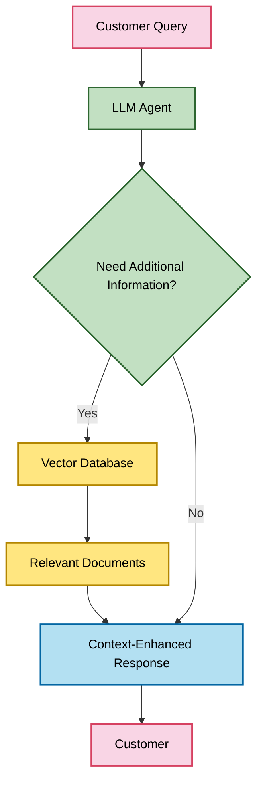

# Large Language Models: A Comprehensive Survey for AI Customer Agents

*Research Date: May 3, 2025*

## Introduction

Large Language Models (LLMs) have revolutionized natural language processing and AI-powered customer interactions. This research paper provides a comprehensive survey of important LLM models available as of May 2025, with a particular focus on open-source models suitable for self-hosting in customer service and sales inquiry applications. We examine their capabilities, resource requirements, licensing considerations, and suitability for integration with agent frameworks like CrewAI.

## Current Landscape of Large Language Models

### Proprietary Models

#### OpenAI Models
- **GPT-4o**: The latest multimodal model with advanced reasoning, vision capabilities, and significantly reduced latency compared to previous generations.
  - *Strengths*: State-of-the-art reasoning, instruction following, multimodal capabilities
  - *Limitations*: Proprietary, API-only access, usage-based pricing
  - *Best for*: High-complexity tasks requiring sophisticated reasoning

- **GPT-4 Turbo**: Optimized for production deployments with improved throughput and reduced cost compared to GPT-4.
  - *Strengths*: Strong reasoning, good balance of performance and cost
  - *Limitations*: Proprietary, API-only access
  - *Best for*: Production systems with moderate complexity requirements

- **GPT-3.5 Turbo**: Optimized for high-throughput, cost-effective deployments.
  - *Strengths*: Fast, cost-effective, good for straightforward tasks
  - *Limitations*: Less sophisticated reasoning than GPT-4 models
  - *Best for*: High-volume, routine customer inquiries

#### Anthropic Models
- **Claude 3 Opus**: Anthropic's most capable model with sophisticated reasoning and understanding.
  - *Strengths*: Exceptional reasoning, nuanced understanding, strong safety features
  - *Limitations*: Higher latency, higher cost, proprietary
  - *Best for*: Complex customer issues requiring careful reasoning

- **Claude 3 Sonnet**: Balanced performance model with good reasoning capabilities.
  - *Strengths*: Good balance of performance and speed, strong safety features
  - *Limitations*: Proprietary, API-only access
  - *Best for*: General customer support with moderate complexity

- **Claude 3 Haiku**: Optimized for low-latency applications.
  - *Strengths*: Very fast response times, cost-effective
  - *Limitations*: Less sophisticated than larger models
  - *Best for*: Real-time customer interactions requiring quick responses

#### Google Models
- **Gemini 1.5 Pro**: Google's advanced multimodal model with long context window.
  - *Strengths*: 1 million token context window, strong multimodal capabilities
  - *Limitations*: Proprietary, API-only access
  - *Best for*: Complex customer interactions involving multiple documents or long histories

- **Gemini 1.5 Flash**: Optimized for efficiency and speed.
  - *Strengths*: Fast inference, good performance-to-cost ratio
  - *Limitations*: Less capable than Pro version
  - *Best for*: High-volume customer interactions

### Open-Source Models

#### Mistral AI Models
- **Mistral Large**: Commercial-grade open weights model with strong reasoning capabilities.
  - *Strengths*: Strong performance, commercially usable
  - *Limitations*: Requires significant resources to run
  - *Best for*: Enterprise deployments requiring control over infrastructure

- **Mistral 7B**: Compact yet powerful model with efficient architecture.
  - *Strengths*: Excellent performance for its size, Apache 2.0 license
  - *Limitations*: Limited context window compared to larger models
  - *Best for*: Self-hosted deployments with moderate hardware

- **Mixtral 8x7B**: Mixture-of-experts model with strong performance.
  - *Strengths*: Near GPT-3.5 level performance, Apache 2.0 license
  - *Limitations*: Requires more resources than standard 7B models
  - *Best for*: Complex customer support scenarios requiring strong reasoning

#### Meta Models
- **Llama 3 70B**: Meta's largest open model with strong reasoning capabilities.
  - *Strengths*: Strong performance across benchmarks, commercially usable
  - *Limitations*: Requires significant hardware resources
  - *Best for*: Enterprise deployments requiring sophisticated reasoning

- **Llama 3 8B**: Compact model with good performance-to-size ratio.
  - *Strengths*: Good performance for size, commercially usable
  - *Limitations*: Less capable than larger models
  - *Best for*: Deployment on limited hardware resources

#### DeepSeek Models
- **DeepSeek-V2 67B**: A large-scale model with strong performance across reasoning and knowledge tasks.
  - *Strengths*: Excellent reasoning capabilities, strong performance on coding and math tasks, bilingual (English/Chinese)
  - *Limitations*: Requires significant hardware resources
  - *Licensing*: DeepSeek License (allows commercial use with ethical restrictions)
  - *Best for*: Complex customer support requiring strong reasoning

- **DeepSeek-V2 7B**: A more compact version with good performance-to-size ratio.
  - *Strengths*: Strong performance for its size, good for deployment on moderate hardware
  - *Limitations*: Less capable than larger variants
  - *Licensing*: DeepSeek License
  - *Best for*: Balanced customer support applications with moderate hardware

- **DeepSeek-Coder**: Specialized for coding tasks with strong technical documentation understanding.
  - *Strengths*: Excellent for technical support involving code or APIs, strong documentation comprehension
  - *Limitations*: More specialized than general-purpose models
  - *Licensing*: DeepSeek License
  - *Best for*: Technical support for developer products or APIs

#### Other Notable Open Models
- **Yi 34B**: Bilingual Chinese-English model with strong capabilities.
  - *Strengths*: Strong performance, excellent for multilingual applications
  - *Limitations*: Requires significant resources
  - *Best for*: Customer support requiring Chinese language capabilities

- **Phi-3 Mini**: Microsoft's compact yet capable model.
  - *Strengths*: Excellent performance for its size, MIT license
  - *Limitations*: Limited context window
  - *Best for*: Edge deployments or limited hardware scenarios

## Deep Dive: Self-Hostable Models for Customer Agents

For AI customer agents handling sales inquiries and support, several factors are critical when selecting self-hostable models:

1. Performance on conversational tasks
2. Resource requirements
3. Licensing for commercial use
4. Fine-tuning capabilities
5. Integration with agent frameworks

### Recommended Models for Self-Hosting

#### 1. Mistral 7B Instruct
- **Overview**: A 7B parameter model with excellent instruction following capabilities.
- **Hardware Requirements**: 
  - Minimum: 16GB VRAM (GPU) or 32GB RAM (CPU)
  - Recommended: NVIDIA A10 or better
- **Quantization Options**: 
  - 4-bit: ~8GB VRAM
  - 8-bit: ~14GB VRAM
- **Licensing**: Apache 2.0 (fully commercial use)
- **Strengths for Customer Agents**:
  - Strong instruction following
  - Good conversational capabilities
  - Efficient token usage
  - Excellent performance-to-resource ratio
- **Integration**: Well-supported by frameworks like LangChain, CrewAI

#### 2. Mixtral 8x7B Instruct
- **Overview**: A mixture-of-experts model with performance approaching GPT-3.5.
- **Hardware Requirements**:
  - Minimum: 24GB VRAM
  - Recommended: NVIDIA A100 or better
- **Quantization Options**:
  - 4-bit: ~16GB VRAM
  - 8-bit: ~28GB VRAM
- **Licensing**: Apache 2.0 (fully commercial use)
- **Strengths for Customer Agents**:
  - Strong reasoning capabilities
  - Excellent at complex instructions
  - Good at maintaining context
  - Strong multilingual performance
- **Integration**: Well-supported by major frameworks

#### 3. Llama 3 8B Instruct
- **Overview**: Meta's latest compact model with improved instruction following.
- **Hardware Requirements**:
  - Minimum: 16GB VRAM
  - Recommended: NVIDIA RTX 4090 or better
- **Quantization Options**:
  - 4-bit: ~8GB VRAM
  - 8-bit: ~14GB VRAM
- **Licensing**: Llama 3 Community License (allows commercial use with limitations)
- **Strengths for Customer Agents**:
  - Strong conversational abilities
  - Good at following complex instructions
  - Improved factuality over previous generations
  - Better safety guardrails than most open models
- **Integration**: Well-supported by major frameworks

#### 4. DeepSeek-V2 7B
- **Overview**: A compact yet powerful model with strong bilingual capabilities.
- **Hardware Requirements**:
  - Minimum: 16GB VRAM
  - Recommended: NVIDIA RTX 4070 or better
- **Quantization Options**:
  - 4-bit: ~8GB VRAM
  - 8-bit: ~14GB VRAM
- **Licensing**: DeepSeek License (allows commercial use with ethical restrictions)
- **Strengths for Customer Agents**:
  - Strong bilingual support (English/Chinese)
  - Good performance on technical and general queries
  - Efficient token usage
  - Balanced performance-to-resource ratio
- **Integration**: Compatible with major frameworks like LangChain, CrewAI

#### 5. Phi-3 Mini
- **Overview**: Microsoft's compact yet powerful model with excellent reasoning.
- **Hardware Requirements**:
  - Minimum: 8GB VRAM
  - Recommended: NVIDIA RTX 3080 or better
- **Quantization Options**:
  - 4-bit: ~4GB VRAM
  - 8-bit: ~7GB VRAM
- **Licensing**: MIT License (fully commercial use)
- **Strengths for Customer Agents**:
  - Excellent performance for size
  - Strong reasoning capabilities
  - Very efficient token usage
  - Can run on modest hardware
- **Integration**: Growing support in major frameworks

### Deployment Considerations

#### Inference Optimization
For production deployment of self-hosted models, several optimization techniques can improve performance:

1. **Quantization**: Reducing precision from FP16/FP32 to INT8 or INT4
   - Tools: GGML, GPTQ, AWQ, EXL2
   - Trade-off: Slight quality degradation for significant resource reduction

2. **Inference Servers**:
   - **vLLM**: High-throughput inference with PagedAttention
   - **Text Generation Inference (TGI)**: Optimized for Hugging Face models
   - **llama.cpp**: Efficient C++ implementation for CPU and GPU
   - **CTransformers**: Python bindings for high-performance C++ implementations

3. **Hardware Considerations**:
   - GPU: NVIDIA consumer GPUs (RTX series) for smaller models
   - Enterprise: A10, A100, H100 for larger models or high throughput
   - CPU: AMD EPYC or Intel Xeon with high core count for CPU-only deployment

## Fine-Tuning for Customer Service Applications

Fine-tuning can significantly improve model performance for specific customer service scenarios:

### Recommended Fine-Tuning Approaches

1. **LoRA (Low-Rank Adaptation)**:
   - Resource-efficient fine-tuning that modifies only a small subset of model parameters
   - Requires less compute and memory than full fine-tuning
   - Well-suited for domain adaptation in customer service

2. **QLoRA**:
   - Quantized version of LoRA that enables fine-tuning on consumer hardware
   - Can fine-tune even large models on single GPUs
   - Good option for specialized customer service domains

3. **Supervised Fine-Tuning (SFT)**:
   - Traditional approach using labeled examples
   - Best for teaching specific response patterns and company voice
   - Requires high-quality training data

### Fine-Tuning Datasets for Customer Agents

For effective fine-tuning, consider creating datasets that include:

1. **Company-Specific Knowledge**:
   - Product information and specifications
   - Pricing and availability details
   - Company policies and procedures

2. **Customer Interaction Patterns**:
   - Common customer questions and ideal responses
   - Escalation scenarios and appropriate handling
   - Multi-turn conversations showing proper flow

3. **Tone and Voice Examples**:
   - Demonstrations of company-approved communication style
   - Examples of handling difficult situations professionally
   - Proper use of technical terminology and explanations

## RAG Integration for Enhanced Knowledge Access

Retrieval-Augmented Generation (RAG) is essential for customer service applications to provide accurate, up-to-date information:

### RAG Architecture for Customer Agents

### Recommended Vector Databases

1. **Chroma**: Lightweight, easy to deploy
2. **Qdrant**: High-performance, production-ready
3. **Weaviate**: Hybrid search capabilities
4. **Pinecone**: Managed service with high scalability

### Document Processing Pipeline

For effective RAG implementation:

1. **Document Chunking**: Split documents into semantic units (not just arbitrary chunks)
2. **Embedding Generation**: Use specialized embedding models like E5, BGE, or INSTRUCTOR
3. **Metadata Enrichment**: Add metadata for filtering and relevance scoring
4. **Hybrid Retrieval**: Combine vector search with keyword search for better results

## Conclusion and Recommendations

Based on our comprehensive survey, we recommend the following approach for implementing AI customer agents:

### For Sales Inquiries
- **Model**: Mixtral 8x7B or Llama 3 8B with LoRA fine-tuning
- **Deployment**: vLLM on GPU infrastructure
- **RAG**: Qdrant or Weaviate with hybrid search
- **Agent Framework**: CrewAI with specialized sales agent roles

### For Technical Support
- **Model Options**:
  - **General Support**: Mistral 7B for simpler issues, Mixtral 8x7B for complex support
  - **Code/API Support**: DeepSeek-Coder for technical documentation and code-related issues
  - **Multilingual Support**: DeepSeek-V2 7B for English/Chinese bilingual support
- **Deployment**: Text Generation Inference with quantization
- **RAG**: Comprehensive knowledge base with semantic chunking
- **Agent Framework**: CrewAI with hierarchical process for escalation

### Next Steps
1. Evaluate hardware requirements and deployment options
2. Benchmark candidate models on domain-specific tasks
3. Develop fine-tuning datasets from existing customer interactions
4. Build RAG pipeline with company documentation
5. Implement and test agent roles and processes

This research provides a foundation for implementing effective, self-hosted AI customer agents using state-of-the-art open-source models and techniques.

## References

1. Mistral AI Documentation: [https://docs.mistral.ai/](https://docs.mistral.ai/)
2. Meta Llama 3 Technical Report: [https://ai.meta.com/llama/](https://ai.meta.com/llama/)
3. Microsoft Phi-3 Technical Report: [https://www.microsoft.com/en-us/research/project/phi-3/](https://www.microsoft.com/en-us/research/project/phi-3/)
4. DeepSeek Models: [https://github.com/deepseek-ai/DeepSeek-V2](https://github.com/deepseek-ai/DeepSeek-V2)
5. DeepSeek License: [https://github.com/deepseek-ai/DeepSeek-V3/blob/main/LICENSE-MODEL](https://github.com/deepseek-ai/DeepSeek-V3/blob/main/LICENSE-MODEL)
6. vLLM Documentation: [https://vllm.ai/](https://vllm.ai/)
7. CrewAI Documentation: [https://docs.crewai.com/](https://docs.crewai.com/)
8. Hugging Face Transformers: [https://huggingface.co/docs/transformers/](https://huggingface.co/docs/transformers/)
9. LangChain Documentation: [https://python.langchain.com/docs/](https://python.langchain.com/docs/)
