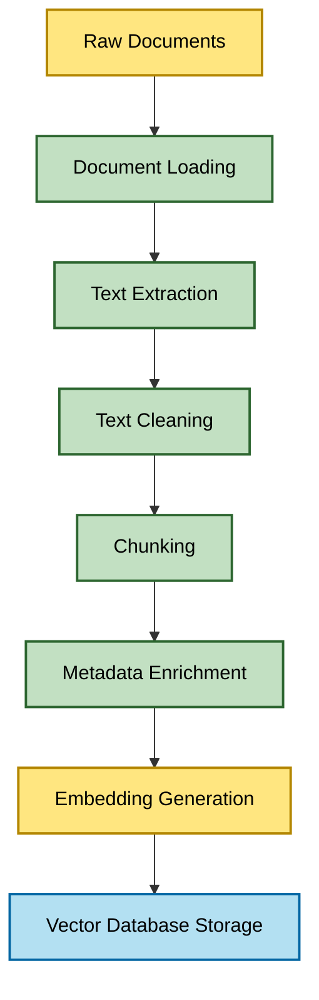
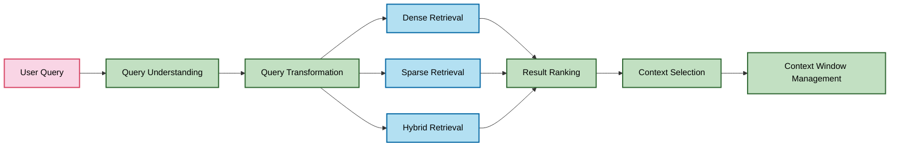
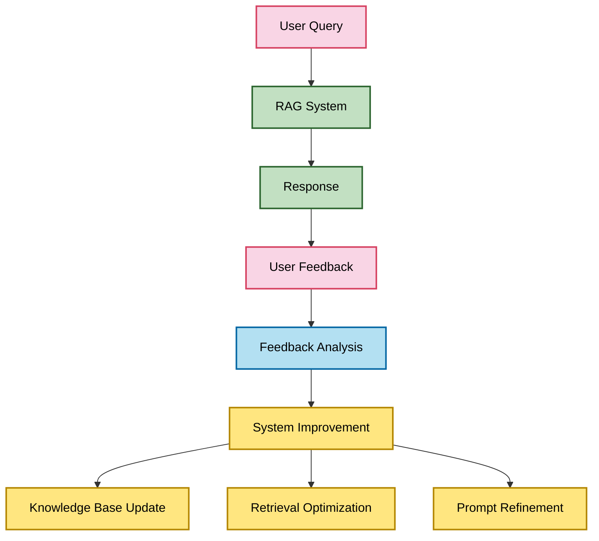
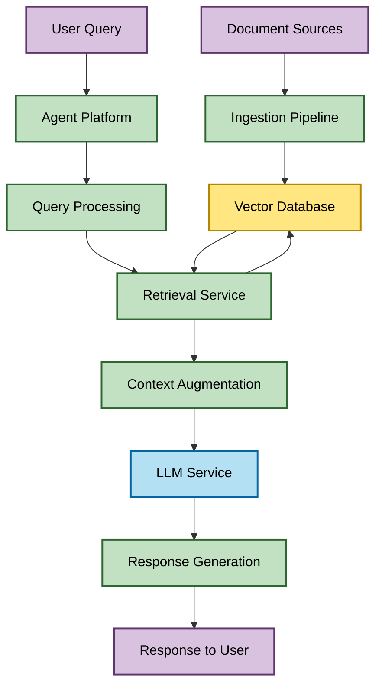

# Retrieval-Augmented Generation (RAG): A Comprehensive Overview

*Research Date: May 3, 2025*

## 1. What is RAG?

Retrieval-Augmented Generation (RAG) is an AI architecture that enhances Large Language Models (LLMs) by combining their generative capabilities with the ability to retrieve and incorporate external knowledge. RAG addresses key limitations of traditional LLMs:

1. **Knowledge Cutoff**: LLMs have a training cutoff date, after which they lack knowledge of new information.
2. **Hallucinations**: LLMs may generate plausible-sounding but factually incorrect information.
3. **Domain Specificity**: General-purpose LLMs lack deep expertise in specialized domains.
4. **Source Attribution**: Traditional LLMs struggle to cite sources for their responses.

### Core Concept

RAG operates on a simple yet powerful principle: when an LLM receives a query, instead of generating a response based solely on its parametric knowledge (what it learned during training), it first retrieves relevant information from external sources, then uses this information to generate a more accurate, up-to-date, and verifiable response.

```mermaid
flowchart LR
    A[User Query] --> B[Query Processing]
    B --> C[Retrieval System]
    C --> D[Knowledge Base]
    D --> E[Retrieved Context]
    E --> F[Context + Query]
    F --> G[LLM]
    G --> H[Enhanced Response]
    
    classDef user fill:#f9d5e5,stroke:#d64161,stroke-width:2px,color:#000000
    classDef process fill:#c2e0c2,stroke:#2d6630,stroke-width:2px,color:#000000
    classDef data fill:#ffe680,stroke:#b38600,stroke-width:2px,color:#000000
    classDef model fill:#b3e0f2,stroke:#0366a3,stroke-width:2px,color:#000000
    
    class A,H user
    class B,C,E,F process
    class D data
    class G model
```



### Historical Context

RAG was formally introduced in a 2020 paper by researchers at Facebook AI Research (now Meta AI), titled "Retrieval-Augmented Generation for Knowledge-Intensive NLP Tasks." Since then, it has evolved significantly, with various architectures and implementations emerging to address different use cases and performance requirements.

## 2. Major Components of RAG for AI Agent Enhancement

A comprehensive RAG system for AI agents consists of several key components, each playing a crucial role in enhancing performance, quality, and reliability:

### 2.1 Document Processing Pipeline



#### Document Loading
- **Purpose**: Ingests documents from various sources and formats
- **Key Features**: Support for multiple file types (PDF, DOCX, HTML, Markdown, etc.)
- **Impact on Agents**: Determines the breadth of knowledge available to the agent

#### Text Extraction
- **Purpose**: Extracts plain text from structured documents
- **Key Features**: OCR capabilities, table extraction, image caption extraction
- **Impact on Agents**: Ensures comprehensive knowledge capture from all document elements

#### Text Cleaning
- **Purpose**: Removes noise and standardizes text
- **Key Features**: Boilerplate removal, duplicate detection, formatting standardization
- **Impact on Agents**: Improves retrieval precision by reducing noise

#### Chunking
- **Purpose**: Divides documents into manageable, semantically meaningful segments
- **Key Features**: Semantic chunking, recursive chunking, fixed-size chunking
- **Impact on Agents**: Critical for retrieval relevance; optimal chunk size balances context and specificity

#### Metadata Enrichment
- **Purpose**: Adds structured information to enhance retrieval
- **Key Features**: Document source, creation date, author, categories, tags
- **Impact on Agents**: Enables filtered searches and improves response attribution

#### Embedding Generation
- **Purpose**: Converts text chunks into vector representations
- **Key Features**: Uses specialized embedding models to capture semantic meaning
- **Impact on Agents**: Embedding quality directly affects retrieval accuracy

### 2.2 Vector Database

- **Purpose**: Stores and indexes embeddings for efficient similarity search
- **Key Components**:
  - **Vector Store**: Specialized database optimized for vector similarity search
  - **Metadata Store**: Stores associated metadata for filtering
  - **Index**: Accelerates similarity search (e.g., HNSW, IVF, FAISS)
- **Key Features**:
  - Efficient similarity search algorithms
  - Filtering capabilities
  - Scalability to millions/billions of vectors
  - Update mechanisms for dynamic knowledge
- **Impact on Agents**: Search speed and accuracy directly affect agent response time and quality

### 2.3 Retrieval System



#### Query Understanding
- **Purpose**: Analyzes the user query to determine information needs
- **Key Features**: Intent recognition, query classification, entity extraction
- **Impact on Agents**: Helps target the right information sources and retrieval strategies

#### Query Transformation
- **Purpose**: Modifies queries to improve retrieval effectiveness
- **Key Features**: Query expansion, rewriting, decomposition, hypothetical document creation
- **Impact on Agents**: Dramatically improves recall for complex or ambiguous queries

#### Retrieval Methods
- **Dense Retrieval**: Uses vector similarity search with embeddings
- **Sparse Retrieval**: Uses keyword-based search (BM25, TF-IDF)
- **Hybrid Retrieval**: Combines both approaches for better results
- **Impact on Agents**: Different methods excel at different query types

#### Result Ranking
- **Purpose**: Orders retrieved documents by relevance
- **Key Features**: Reranking models, relevance scoring, diversity consideration
- **Impact on Agents**: Ensures the most relevant information is prioritized

#### Context Selection
- **Purpose**: Chooses which retrieved documents to include in the context
- **Key Features**: Relevance thresholds, context diversity, information density
- **Impact on Agents**: Balances comprehensive information with context window constraints

### 2.4 Prompt Engineering

- **Purpose**: Crafts effective prompts that incorporate retrieved information
- **Key Components**:
  - **Context Injection**: How retrieved information is presented to the LLM
  - **Instruction Design**: Clear guidance on how to use the retrieved information
  - **Format Specification**: Desired output structure
- **Key Features**:
  - Few-shot examples
  - Source attribution requirements
  - Confidence scoring instructions
- **Impact on Agents**: Proper prompt design dramatically improves how effectively the LLM uses retrieved information

### 2.5 Response Generation

- **Purpose**: Produces the final response using the LLM and retrieved context
- **Key Components**:
  - **LLM Integration**: How the model receives and processes the augmented prompt
  - **Response Formatting**: Structuring the output according to requirements
  - **Citation Generation**: Including sources for retrieved information
- **Impact on Agents**: Determines the quality, accuracy, and usefulness of the final response

### 2.6 Feedback Loop



- **Purpose**: Continuously improves RAG system performance
- **Key Components**:
  - **User Feedback Collection**: Explicit and implicit feedback mechanisms
  - **Performance Metrics**: Relevance, accuracy, helpfulness measurements
  - **Optimization Mechanisms**: Automated and manual system adjustments
- **Impact on Agents**: Enables continuous improvement and adaptation to user needs

## 3. RAG Approaches Available

RAG implementations have evolved significantly, with various approaches optimized for different use cases, performance requirements, and complexity levels:

### 3.1 Basic RAG

- **Description**: The simplest implementation, directly retrieving relevant documents and appending them to the prompt
- **Key Characteristics**:
  - Single-step retrieval
  - Fixed number of retrieved documents
  - Limited context processing
- **Advantages**: Simple to implement, works well for straightforward queries
- **Limitations**: Struggles with complex queries, limited context window utilization

### 3.2 Advanced RAG Architectures

#### Recursive Retrieval (Multi-step RAG)
- **Description**: Performs multiple rounds of retrieval, using initial results to refine subsequent queries
- **Key Characteristics**:
  - Sequential retrieval steps
  - Query refinement between steps
  - Progressive context building
- **Advantages**: Handles complex queries better, improves recall for multi-faceted questions
- **Use Cases**: Research assistance, complex problem-solving

#### Query Decomposition
- **Description**: Breaks complex queries into simpler sub-queries, retrieves information for each, then synthesizes
- **Key Characteristics**:
  - LLM-based query analysis and decomposition
  - Parallel retrieval for sub-queries
  - Information synthesis step
- **Advantages**: Handles complex, multi-part questions effectively
- **Use Cases**: Multi-faceted customer inquiries, research questions

#### Hypothetical Document Embedding (HyDE)
- **Description**: Generates a hypothetical ideal document that would answer the query, then uses this for retrieval
- **Key Characteristics**:
  - LLM generates a synthetic document based on the query
  - Retrieval uses this document's embedding rather than the query's
  - Results are then used for final response generation
- **Advantages**: Bridges vocabulary gaps, improves recall for conceptual queries
- **Use Cases**: Conceptual questions, queries using different terminology than source documents

### 3.3 Specialized RAG Approaches

#### Hybrid Search
- **Description**: Combines dense vector retrieval with sparse (keyword) retrieval
- **Key Characteristics**:
  - Parallel dense and sparse retrieval
  - Result fusion with weighting
  - Can incorporate BM25, TF-IDF alongside embeddings
- **Advantages**: Combines strengths of both approaches, better performance across query types
- **Use Cases**: General-purpose retrieval systems requiring high recall and precision

#### Reranking
- **Description**: Uses a specialized model to rerank initial retrieval results
- **Key Characteristics**:
  - Two-stage retrieval process
  - Initial broad retrieval followed by precise reranking
  - Often uses cross-encoders for pairwise relevance scoring
- **Advantages**: Improves precision without sacrificing recall
- **Use Cases**: When retrieval quality is critical, such as medical or legal applications

#### Adaptive Retrieval
- **Description**: Dynamically adjusts retrieval strategy based on query characteristics
- **Key Characteristics**:
  - Query classification to determine approach
  - Multiple retrieval strategies available
  - Runtime decision-making on strategy selection
- **Advantages**: Optimizes for different query types automatically
- **Use Cases**: Systems handling diverse query types

### 3.4 Emerging RAG Paradigms

#### RAG with Fine-tuning
- **Description**: Combines retrieval with a fine-tuned model specialized for the domain
- **Key Characteristics**:
  - Domain-specific LLM fine-tuning
  - Retrieval system tailored to domain knowledge
  - Often includes domain-specific embedding models
- **Advantages**: Superior performance in specialized domains
- **Use Cases**: Industry-specific applications, specialized customer support

#### Multi-modal RAG
- **Description**: Extends RAG to include non-text modalities like images and audio
- **Key Characteristics**:
  - Multi-modal embedding models
  - Support for diverse content types
  - Cross-modal retrieval capabilities
- **Advantages**: Can leverage all available information types
- **Use Cases**: Product support with visual components, multimedia knowledge bases

#### Agent-based RAG
- **Description**: Integrates RAG within an agent framework with planning and tool-use capabilities
- **Key Characteristics**:
  - Strategic retrieval planning
  - Tool use for enhanced information gathering
  - Memory systems for conversation context
- **Advantages**: More sophisticated information-seeking behavior
- **Use Cases**: Complex customer service scenarios, research assistants

## 4. Best RAG Approaches for Customer Service Use Cases

For AI customer agents handling sales inquiries and technical support, certain RAG approaches are particularly effective:

### 4.1 Sales Inquiry RAG Recommendations

#### Primary Approach: Hybrid Search with Reranking
- **Rationale**: Sales inquiries often combine specific product details with conceptual questions about benefits and comparisons
- **Implementation Details**:
  - Dense retrieval for conceptual questions
  - Sparse retrieval for product specifications and pricing
  - Cross-encoder reranking to prioritize most relevant information
  - Metadata filtering by product category and recency

#### Supporting Techniques:
- **Query Decomposition**: For complex inquiries involving multiple products or comparison requests
- **Adaptive Retrieval**: To handle both specific (e.g., "Does Product X have feature Y?") and open-ended queries (e.g., "Which product is best for my needs?")

#### Knowledge Base Structure:
- Product specifications
- Pricing and availability information
- Comparison matrices
- Customer testimonials and use cases
- Sales policies and procedures

### 4.2 Technical Support RAG Recommendations

#### Primary Approach: Recursive Retrieval with Hypothetical Document Embedding
- **Rationale**: Technical support often requires deep, multi-step problem solving with specific terminology
- **Implementation Details**:
  - Initial retrieval using HyDE to bridge terminology gaps
  - Recursive retrieval to gather additional context based on initial findings
  - Strict metadata filtering by product version, OS compatibility, etc.
  - Higher chunk overlap for technical documentation

#### Supporting Techniques:
- **Fine-tuned Embeddings**: Using domain-specific embedding models trained on technical documentation
- **Multi-modal RAG**: For issues involving visual elements or diagrams
- **Agent-based RAG**: For complex troubleshooting requiring multi-step reasoning

#### Knowledge Base Structure:
- Technical documentation
- Troubleshooting guides
- Error code databases
- Community forum solutions
- Internal support ticket resolutions

### 4.3 General Customer Service Considerations

#### Context Window Optimization
- **Challenge**: Limited context windows in LLMs (typically 8K-32K tokens)
- **Solution**: 
  - Semantic chunking to ensure meaningful context units
  - Dynamic chunk selection based on relevance scoring
  - Context compression techniques to maximize information density

#### Response Attribution
- **Challenge**: Providing verifiable sources for information
- **Solution**:
  - Metadata preservation throughout the retrieval pipeline
  - Explicit citation instructions in prompts
  - Post-processing to verify and format citations

#### Conversation History Integration
- **Challenge**: Maintaining context across multi-turn conversations
- **Solution**:
  - Conversation memory systems
  - Query rewriting to incorporate conversation context
  - Hybrid retrieval over both knowledge base and conversation history

## 5. RAG Deployment and Integration with AI Agent Platforms

Deploying RAG systems for AI customer agents requires careful architecture design, infrastructure planning, and integration with existing agent frameworks:

### 5.1 Deployment Architecture



#### Component Architecture
1. **Ingestion Pipeline**:
   - Document processors
   - Embedding service
   - Metadata extractors
   - Vector database writers

2. **Retrieval Service**:
   - Query processors
   - Vector search service
   - Result rankers
   - Context selectors

3. **LLM Integration**:
   - Prompt constructors
   - LLM interface
   - Response formatters
   - Citation generators

### 5.2 Infrastructure Requirements

#### Compute Resources
- **Embedding Generation**:
  - GPU requirements: Consumer-grade (e.g., NVIDIA RTX 3080) sufficient for most embedding models
  - CPU alternatives: High-core count CPUs for cost-effective embedding generation
  - Batch processing capabilities for efficient resource utilization

- **Vector Database**:
  - Memory requirements: 8GB+ RAM for medium-sized knowledge bases (millions of vectors)
  - Storage requirements: SSD storage for index performance
  - Scaling options: Horizontal scaling for large deployments

- **LLM Service**:
  - GPU requirements: Varies by model (see LLM overview document)
  - Inference optimization: vLLM, TGI, or similar for efficient serving
  - Caching mechanisms for common queries

#### Deployment Options

1. **Self-hosted**:
   - **Advantages**: Full control, data privacy, customization
   - **Challenges**: Infrastructure management, scaling complexity
   - **Recommended for**: Enterprises with sensitive data, specialized requirements

2. **Hybrid**:
   - **Advantages**: Balance of control and convenience
   - **Implementation**: Self-hosted vector database with managed LLM API
   - **Recommended for**: Mid-sized deployments with some sensitive data

3. **Fully Managed**:
   - **Advantages**: Simplicity, reduced operational overhead
   - **Options**: LangChain, Pinecone, OpenAI Assistants API
   - **Recommended for**: Smaller deployments, rapid prototyping

### 5.3 Integration with Agent Frameworks

#### CrewAI Integration

```python
from crewai import Agent, Task, Crew, Process
from langchain.vectorstores import Chroma
from langchain.embeddings import HuggingFaceEmbeddings
from langchain.retrievers import ContextualCompressionRetriever
from langchain.retrievers.document_compressors import LLMChainExtractor

# Setup RAG components
embeddings = HuggingFaceEmbeddings(model_name="BAAI/bge-large-en-v1.5")
vectorstore = Chroma(embedding_function=embeddings, persist_directory="./chroma_db")
retriever = vectorstore.as_retriever(search_kwargs={"k": 5})

# Create enhanced retriever with compression
compressor = LLMChainExtractor.from_llm(llm)
compression_retriever = ContextualCompressionRetriever(
    base_retriever=retriever,
    base_compressor=compressor
)

# Create RAG tool
class RAGTool:
    def __init__(self, retriever):
        self.retriever = retriever
        
    def search(self, query):
        docs = self.retriever.get_relevant_documents(query)
        return "\n\n".join([doc.page_content for doc in docs])

rag_tool = RAGTool(compression_retriever)

# Create agents with RAG capabilities
support_agent = Agent(
    role="Customer Support Specialist",
    goal="Provide accurate and helpful responses to customer inquiries",
    backstory="You are an experienced support specialist with deep product knowledge",
    tools=[rag_tool.search],
    verbose=True
)

# Define tasks
support_task = Task(
    description="Answer the customer's question using the knowledge base",
    expected_output="A comprehensive, accurate response with proper citations",
    agent=support_agent
)

# Create crew
support_crew = Crew(
    agents=[support_agent],
    tasks=[support_task],
    process=Process.sequential,
    verbose=2
)

# Execute
result = support_crew.kickoff(inputs={"customer_query": "How do I reset my password?"})
```

#### Key Integration Points

1. **Tool Integration**:
   - Implement RAG as a tool available to agents
   - Enable agents to strategically decide when to use retrieval

2. **Process Design**:
   - Sequential processes for simple queries
   - Hierarchical processes for complex queries requiring multiple specialists
   - Consensual processes for ambiguous queries requiring interpretation

3. **Memory Integration**:
   - Short-term memory for conversation context
   - Long-term memory for user preferences and history
   - Retrieval memory for knowledge base access

### 5.4 Monitoring and Optimization

#### Key Metrics to Track
- **Retrieval Performance**:
  - Recall@k: Percentage of relevant documents retrieved
  - Mean Reciprocal Rank (MRR): Average position of first relevant document
  - Retrieval latency: Time to retrieve documents

- **Response Quality**:
  - Accuracy: Correctness of information provided
  - Relevance: Appropriateness to the query
  - Helpfulness: Practical value to the user
  - Citation quality: Proper attribution of information

- **System Performance**:
  - End-to-end latency: Total response time
  - Resource utilization: CPU, GPU, memory usage
  - Cost per query: Total computational and API costs

#### Continuous Improvement
- **Feedback Collection**:
  - Explicit user ratings
  - Implicit signals (follow-up questions, resolved vs. escalated)
  - Agent self-assessment

- **Knowledge Base Maintenance**:
  - Regular updates for new information
  - Content gap analysis
  - Chunk optimization based on retrieval patterns

- **Retrieval Optimization**:
  - A/B testing of different retrieval strategies
  - Embedding model updates
  - Query transformation refinement

## Conclusion

Retrieval-Augmented Generation represents a critical advancement for AI customer agents, addressing key limitations of traditional LLMs while enabling more accurate, up-to-date, and verifiable responses. By carefully selecting and implementing the appropriate RAG approach for specific use cases, organizations can significantly enhance the quality and effectiveness of their AI customer service systems.

For sales inquiries, a hybrid search approach with reranking provides the versatility needed to handle both specific product questions and conceptual inquiries. For technical support, recursive retrieval with hypothetical document embedding offers the depth and precision required for complex troubleshooting scenarios.

Successful deployment requires thoughtful architecture design, appropriate infrastructure planning, and seamless integration with agent frameworks like CrewAI. With proper monitoring and continuous optimization, RAG-enhanced AI agents can deliver increasingly valuable customer experiences over time.

## References

1. Lewis, P., et al. (2020). "Retrieval-Augmented Generation for Knowledge-Intensive NLP Tasks." [arXiv:2005.11401](https://arxiv.org/abs/2005.11401)
2. Gao, J., et al. (2023). "Retrieval-Augmented Generation for Large Language Models: A Survey." [arXiv:2312.10997](https://arxiv.org/abs/2312.10997)
3. LangChain RAG Documentation: [https://python.langchain.com/docs/use_cases/question_answering/](https://python.langchain.com/docs/use_cases/question_answering/)
4. Llamaindex Documentation: [https://docs.llamaindex.ai/en/stable/](https://docs.llamaindex.ai/en/stable/)
5. CrewAI Documentation: [https://docs.crewai.com/](https://docs.crewai.com/)
6. Chroma Vector Database: [https://www.trychroma.com/](https://www.trychroma.com/)
7. Gao, T., et al. (2023). "Precise Zero-Shot Dense Retrieval without Relevance Labels." [arXiv:2212.10496](https://arxiv.org/abs/2212.10496) (HyDE)
8. Pradeep, R., et al. (2021). "The Expando-Mono-Duo Design Pattern for Text Ranking with Pretrained Sequence-to-Sequence Models." [arXiv:2101.05667](https://arxiv.org/abs/2101.05667) (Reranking)
