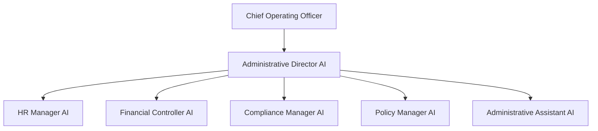
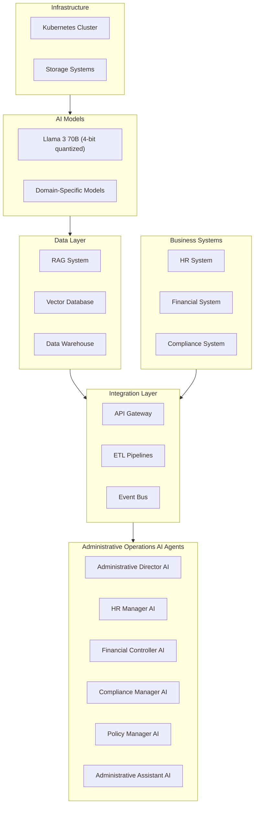
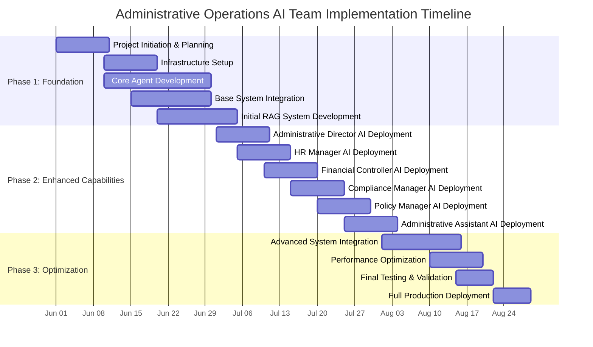
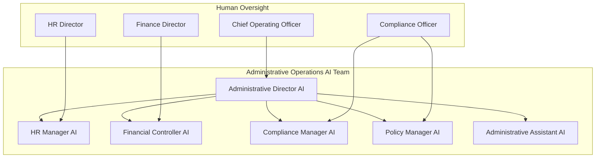

# Administrative Operations AI Strategy

## 1. Executive Summary

This strategy outlines the approach for implementing an AI-powered Administrative Operations Team focused on human resources management, financial management, compliance, and policy management. The Administrative Operations AI Team will report to the Chief Operating Officer (COO) and will be responsible for optimizing administrative functions across the organization.

The Administrative Operations AI Team will leverage advanced AI technologies, including Llama 3 70B (4-bit quantized) models and a comprehensive RAG system, to automate and enhance administrative processes. The implementation will follow an accelerated timeline of 2-3 months, leveraging Software Engineering AI Agents for development and deployment.

Key benefits include:
- Streamlined HR processes and policy management
- Enhanced financial transaction processing and reporting
- Improved compliance monitoring and risk management
- Optimized policy development and implementation
- Significant cost savings compared to traditional administrative staffing

## 2. Team Structure

### 2.1 Team Overview

The Administrative Operations AI Team will consist of specialized AI agents focused on human resources, finance, compliance, and policy management. The team will be led by an Administrative Director AI that reports directly to the COO.

### 2.2 Agent Roles and Responsibilities

#### Administrative Director AI
- Reports to the Chief Operating Officer
- Oversees all administrative functions
- Coordinates activities across administrative domains
- Provides strategic administrative insights and recommendations
- Ensures alignment with organizational objectives
- Manages administrative risk and performance

#### HR Manager AI
- Reports to the Administrative Director AI
- Develops and implements HR policies and procedures
- Manages recruitment and onboarding processes
- Administers employee benefits and compensation
- Coordinates performance management processes
- Ensures compliance with employment laws and regulations

#### Financial Controller AI
- Reports to the Administrative Director AI
- Processes financial transactions and maintains records
- Manages accounts payable and receivable processes
- Coordinates month-end and year-end closing activities
- Prepares financial statements and reports
- Supports budgeting and forecasting processes

#### Compliance Manager AI
- Reports to the Administrative Director AI
- Monitors regulatory requirements and changes
- Develops and implements compliance policies
- Conducts compliance risk assessments
- Coordinates audit preparation and response
- Manages compliance documentation and reporting

#### Policy Manager AI
- Reports to the Administrative Director AI
- Develops and maintains organizational policies
- Ensures policy alignment with regulations
- Communicates policy updates and changes
- Monitors policy compliance and exceptions
- Coordinates policy review and approval processes

#### Administrative Assistant AI
- Reports to the Administrative Director AI
- Manages administrative workflows and processes
- Coordinates meetings and communications
- Processes administrative documents and forms
- Provides administrative support to other AI agents
- Handles routine administrative inquiries and tasks

## 3. Functional Requirements

### 3.1 Core Capabilities

#### Human Resources Management
- Develop and implement HR policies and procedures
- Manage recruitment and onboarding processes
- Administer employee benefits and compensation
- Coordinate performance management processes
- Ensure compliance with employment laws and regulations
- Generate HR analytics and reports

#### Financial Management and Accounting
- Process financial transactions and maintain records
- Manage accounts payable and receivable processes
- Coordinate month-end and year-end closing activities
- Prepare financial statements and reports
- Support budgeting and forecasting processes
- Generate financial analytics and dashboards

#### Compliance and Risk Management
- Monitor regulatory requirements and changes
- Develop and implement compliance policies
- Conduct compliance risk assessments
- Coordinate audit preparation and response
- Manage compliance documentation and reporting
- Generate compliance status reports

#### Policy Management
- Develop and maintain organizational policies
- Ensure policy alignment with regulations
- Communicate policy updates and changes
- Monitor policy compliance and exceptions
- Coordinate policy review and approval processes
- Generate policy compliance reports

### 3.2 Deliverables

#### HR Reports and Analytics
- Employee census and demographics reports
- Recruitment and hiring metrics
- Benefits utilization and cost reports
- Performance management analytics
- Employee turnover and retention metrics
- HR compliance status reports

#### Financial Reports
- Daily cash position reports
- Weekly accounts payable and receivable aging
- Monthly financial statements
- Quarterly financial analysis and variance reports
- Budget vs. actual performance reports
- Financial forecasts and projections

#### Compliance Reports
- Compliance status dashboards
- Regulatory change impact assessments
- Audit preparation and findings reports
- Policy compliance monitoring reports
- Risk assessment and mitigation plans
- Compliance training and awareness materials

#### Administrative Support Deliverables
- Meeting coordination and scheduling
- Document processing and management
- Administrative workflow automation
- Communication coordination and distribution
- Administrative process documentation
- Administrative efficiency metrics

### 3.3 Integration Requirements

#### Business System Integration

- **HR System Integration**
  - Employee data synchronization and management
  - Benefits administration system integration
  - Payroll system integration
  - Recruitment and applicant tracking system integration
  - Performance management system integration
  - Time and attendance system integration

- **Financial System Integration**
  - General ledger integration
  - Accounts payable and receivable system integration
  - Banking and treasury system integration
  - Budgeting and forecasting system integration
  - Financial reporting system integration

#### Cross-Team Integration

- **Core Operations Team Integration**
  - Provide HR support for resource planning
  - Ensure financial controls for procurement processes
  - Implement compliance requirements for operational activities
  - Support operational reporting with financial data

- **Governance Team Integration**
  - Align HR policies with legal requirements
  - Ensure financial reporting meets regulatory standards
  - Coordinate compliance activities with regulatory affairs
  - Support tax compliance with financial data

## 4. Technical Architecture

### 4.1 Infrastructure Overview

### 4.2 System Components

#### Core Infrastructure

- **Kubernetes Cluster**
  - Leverages existing consolidated AI infrastructure
  - Deployed on AMD AI HX 370 nodes for compute-intensive workloads
  - Containerized microservices architecture for administrative functions
  - Horizontal scaling based on workload demands

- **Storage Systems**
  - Object storage for documents, reports, and administrative data
  - Relational databases for transactional data
  - Time-series databases for administrative metrics and monitoring
  - Persistent volumes for application state and configurations

#### AI Models

- **Primary LLM**
  - Llama 3 70B (4-bit quantized)
  - Fine-tuned for HR, finance, compliance, and policy management domains
  - Specialized for administrative document processing, analysis, and generation

- **Domain-Specific Models**
  - HR analytics and workforce planning models
  - Financial analysis and forecasting models
  - Compliance assessment and risk analysis models
  - Policy effectiveness and impact models

### 4.3 Data Architecture

- **RAG System**
  - Comprehensive knowledge base for administrative domains
  - HR policies and procedures documentation
  - Financial regulations and accounting standards
  - Compliance requirements and frameworks
  - Organizational policies and procedures

- **Vector Database**
  - Document embeddings for semantic search
  - HR document and policy vectors
  - Financial document and report vectors
  - Compliance documentation vectors
  - Policy and procedure vectors

- **Data Warehouse**
  - Consolidated administrative data repository
  - Historical HR and financial transaction data
  - Performance metrics and KPIs
  - Analytical datasets for reporting and analysis
  - Audit trails and compliance evidence

### 4.4 Integration Architecture

- **API Gateway**
  - Unified interface for business system integration
  - Authentication and authorization services
  - Rate limiting and request validation
  - API versioning and documentation
  - Monitoring and logging

- **ETL Pipelines**
  - Data extraction from business systems
  - Data transformation and normalization
  - Data loading to administrative data stores
  - Data quality validation and enrichment
  - Metadata management and lineage tracking

- **Event Bus**
  - Real-time event distribution and processing
  - Event-driven architecture for administrative workflows
  - Asynchronous communication between components
  - Event filtering and routing
  - Event persistence and replay capabilities

### 4.5 Business System Integration

- **HR System Integration**
  - Employee data synchronization and management
  - Benefits administration integration
  - Payroll processing integration
  - Recruitment and onboarding workflow integration
  - Performance management integration

- **Financial System Integration**
  - General ledger transaction integration
  - Accounts payable and receivable integration
  - Banking and treasury integration
  - Financial reporting integration
  - Budgeting and forecasting integration

- **Compliance System Integration**
  - Compliance monitoring and reporting integration
  - Audit management integration
  - Risk assessment integration
  - Policy management integration
  - Regulatory change management integration

## 5. Implementation Approach

### 5.1 Implementation Timeline

The Administrative Operations AI Team implementation will follow an accelerated timeline of 2-3 months, leveraging Software Engineering AI Agents for development and deployment. This approach allows for rapid implementation while ensuring thorough testing and validation.

### 5.2 Implementation Phases

#### Phase 1: Foundation (Weeks 1-4)

- **Project Initiation & Planning**
  - Define detailed project scope and requirements
  - Establish project governance and communication plan
  - Identify key stakeholders and integration points
  - Define success criteria and performance metrics

- **Infrastructure Setup**
  - Configure Kubernetes environment for Administrative Operations AI Team
  - Set up storage systems and databases
  - Establish monitoring and logging infrastructure
  - Configure security controls and access management

- **Core Agent Development**
  - Develop Administrative Director AI agent
  - Implement HR Manager AI agent
  - Create base Financial Controller AI agent
  - Develop initial Compliance Manager AI agent
  - Implement foundational Policy Manager AI agent
  - Develop initial Administrative Assistant AI agent

- **Base System Integration**
  - Establish API gateway and integration framework
  - Implement initial HR system integration
  - Set up basic financial system integration
  - Configure event bus for system communication

- **Initial RAG System Development**
  - Create knowledge base structure and taxonomy
  - Populate core administrative policies and procedures
  - Implement basic document retrieval and question answering
  - Develop initial vector embeddings for administrative documents

#### Phase 2: Enhanced Capabilities (Weeks 5-8)

- **Administrative Director AI Deployment**
  - Deploy comprehensive administrative planning capabilities
  - Implement administrative performance monitoring
  - Develop administrative risk assessment functionality
  - Configure cross-functional coordination capabilities

- **HR Manager AI Deployment**
  - Implement HR policy management capabilities
  - Deploy recruitment and onboarding functionality
  - Develop benefits and compensation administration
  - Configure performance management processes

- **Financial Controller AI Deployment**
  - Implement financial transaction processing
  - Deploy accounts payable and receivable functionality
  - Develop financial reporting capabilities
  - Configure budgeting and forecasting processes

- **Compliance Manager AI Deployment**
  - Implement compliance monitoring capabilities
  - Deploy regulatory change management functionality
  - Develop compliance risk assessment
  - Configure audit preparation and response

- **Policy Manager AI Deployment**
  - Implement policy development and maintenance
  - Deploy policy communication capabilities
  - Develop policy compliance monitoring
  - Configure policy review and approval processes

- **Administrative Assistant AI Deployment**
  - Implement administrative workflow management
  - Deploy meeting coordination capabilities
  - Develop document processing functionality
  - Configure administrative support processes

#### Phase 3: Optimization (Weeks 9-10)

- **Advanced System Integration**
  - Enhance HR system integration
  - Optimize financial system integration
  - Implement cross-team integration with Core Operations and Governance teams
  - Configure advanced data synchronization

- **Performance Optimization**
  - Optimize agent response times and accuracy
  - Enhance system scalability and reliability
  - Implement caching and performance improvements
  - Conduct load testing and performance tuning

- **Final Testing & Validation**
  - Conduct comprehensive system testing
  - Validate integration points and data flows
  - Perform user acceptance testing
  - Validate performance against success criteria

- **Full Production Deployment**
  - Complete production deployment
  - Establish ongoing monitoring and support
  - Conduct user training and documentation
  - Implement continuous improvement process

### 5.3 Resource Requirements

#### Hardware Requirements

- **Compute Resources**
  - 1 AMD AI HX 370 node for Administrative Operations AI Team
  - 128GB RAM and 2TB NVMe storage
  - Total compute capacity: 8 CPU cores, 128GB RAM

- **Storage Resources**
  - 5TB object storage for documents and reports
  - 1TB high-performance storage for databases
  - 2TB backup and archival storage

- **Network Resources**
  - 10Gbps internal network connectivity
  - Redundant network paths for high availability
  - Secure VPN access for remote management

#### Software Requirements

- **AI and Machine Learning**
  - Llama 3 70B (4-bit quantized) model
  - Vector database for document embeddings
  - RAG system components and libraries
  - Domain-specific model training frameworks

- **Infrastructure Software**
  - Kubernetes for container orchestration
  - Docker for containerization
  - Prometheus and Grafana for monitoring
  - ELK stack for logging and analysis

- **Integration Software**
  - API gateway and management platform
  - ETL and data integration tools
  - Event bus and message queue system
  - Identity and access management solution

#### Development Resources

- **AI Development Team**
  - 1 AI/ML engineer for model development and fine-tuning
  - 1 software engineer for agent development and integration
  - 0.5 data engineer for data pipeline and storage
  - 0.5 DevOps engineer for infrastructure and deployment

- **Domain Experts**
  - HR management specialist
  - Finance and accounting expert
  - Compliance and policy management specialist

### 5.4 Risk Management

#### Implementation Risks

| Risk | Impact | Probability | Mitigation Strategy |
|------|--------|------------|---------------------|
| Integration complexity with legacy systems | High | Medium | Develop comprehensive integration plan with fallback options |
| Data quality issues affecting agent performance | High | Medium | Implement data validation and cleansing processes |
| Security vulnerabilities in AI systems | High | Low | Conduct regular security assessments and penetration testing |
| Resistance to adoption from human staff | Medium | High | Develop change management and training program |
| Performance issues under peak load | Medium | Medium | Conduct thorough load testing and performance optimization |
| Compliance gaps in automated processes | High | Low | Implement comprehensive compliance validation and auditing |
| Dependency on specific AI models or frameworks | Medium | Medium | Design for model and framework independence where possible |
| Budget or timeline overruns | Medium | Medium | Implement agile development with regular reassessment |

#### Operational Risks

| Risk | Impact | Probability | Mitigation Strategy |
|------|--------|------------|---------------------|
| AI agent making critical administrative errors | High | Low | Implement human oversight for critical decisions |
| System downtime affecting administrative operations | High | Low | Design for high availability and disaster recovery |
| Data privacy or confidentiality breach | High | Low | Implement comprehensive security controls and encryption |
| Regulatory non-compliance in automated processes | High | Low | Regular compliance audits and validation |
| AI model degradation over time | Medium | Medium | Implement monitoring and regular model retraining |
| Dependency on specific vendor or technology | Medium | Medium | Design for vendor independence and technology flexibility |
| Scalability limitations during growth | Medium | Low | Design architecture for horizontal scaling |
| Knowledge gaps in specialized domains | Medium | Medium | Continuous knowledge base updates and domain expert review |

## 6. Oversight and Control Mechanisms

### 6.1 Governance Structure

### 6.2 Human Oversight Roles

#### Executive Oversight

- **Chief Operating Officer**
  - Ultimate accountability for Administrative Operations AI Team performance
  - Approval authority for strategic administrative decisions
  - Final escalation point for critical administrative issues
  - Quarterly review of Administrative Operations AI Team performance
  - Approval of significant administrative policy changes

#### Departmental Oversight

- **HR Director**
  - Day-to-day oversight of HR Manager AI
  - Review and approval of HR policies and procedures
  - Validation of employee-related decisions and actions
  - Monitoring of HR compliance and performance
  - Escalation point for HR issues

- **Finance Director**
  - Day-to-day oversight of Financial Controller AI
  - Review and approval of financial statements and forecasts
  - Validation of significant financial transactions
  - Monitoring of financial performance metrics
  - Escalation point for financial issues

- **Compliance Officer**
  - Day-to-day oversight of Compliance Manager AI and Policy Manager AI
  - Review and approval of compliance policies and procedures
  - Validation of compliance assessments and reports
  - Monitoring of compliance performance metrics
  - Escalation point for compliance and policy issues

### 6.3 Decision Authority Matrix

| Decision Type | AI Authority | Human Review Required | Approval Level |
|---------------|-------------|----------------------|---------------|
| **HR Management** | | | |
| HR policy implementation | Recommend | Yes | HR Director |
| Employee onboarding | Autonomous | Exceptions only | HR Director |
| Benefits administration | Autonomous | Exceptions only | HR Director |
| Performance management | Recommend | Yes | HR Director |
| **Financial Management** | | | |
| Financial transactions | Autonomous up to $5,000 | >$5,000 | Finance Director |
| Financial reporting | Recommend | Yes | Finance Director |
| Budget preparation | Recommend | Yes | Finance Director |
| Financial analysis | Autonomous | No | None |
| **Compliance Management** | | | |
| Compliance monitoring | Autonomous | Exceptions only | Compliance Officer |
| Compliance reporting | Recommend | Yes | Compliance Officer |
| Audit preparation | Autonomous | Final review | Compliance Officer |
| Regulatory changes | Recommend | Yes | Compliance Officer |
| **Policy Management** | | | |
| Policy development | Recommend | Yes | Compliance Officer |
| Policy distribution | Autonomous | No | None |
| Policy compliance monitoring | Autonomous | Exceptions only | Compliance Officer |
| Policy revision | Recommend | Yes | Compliance Officer |

### 6.4 Approval Workflows

#### Tiered Approval System

- **Tier 1: Autonomous Actions**
  - Routine administrative tasks within defined parameters
  - Standard report generation and distribution
  - Data collection and analysis activities
  - Low-risk, repetitive administrative tasks
  - System monitoring and maintenance

- **Tier 2: Review and Confirm**
  - AI agent prepares recommendation or draft
  - Human reviewer receives notification with recommendation
  - Reviewer can approve, reject, or modify recommendation
  - AI agent implements approved action
  - Action and approval are logged for audit purposes

- **Tier 3: Collaborative Decision-Making**
  - AI agent identifies decision requirement
  - AI agent prepares analysis and multiple options
  - Human decision-maker reviews options and analysis
  - Collaborative discussion between AI and human
  - Human makes final decision
  - AI agent implements and documents decision

- **Tier 4: Human-Led Decisions**
  - Strategic decisions beyond AI authority
  - High-risk or high-value decisions
  - Novel situations without precedent
  - Decisions with significant human impact
  - AI provides supporting analysis only
  - Human makes and implements decision

### 6.5 Monitoring and Audit

#### Performance Monitoring

- **Real-time Monitoring**
  - Continuous monitoring of AI agent activities and decisions
  - Automated alerts for anomalous behavior or decisions
  - Dashboard visualization of administrative metrics
  - Performance tracking against defined KPIs
  - System health and availability monitoring

- **Periodic Reviews**
  - Daily administrative performance summaries
  - Weekly exception and incident reports
  - Monthly performance and compliance reviews
  - Quarterly strategic performance assessments
  - Annual comprehensive system audit

#### Audit and Compliance

- **Decision Audit Trail**
  - Comprehensive logging of all AI decisions and actions
  - Documentation of decision rationale and supporting data
  - Traceability from decision to outcome
  - Preservation of approval workflows and authorizations
  - Immutable audit records for compliance purposes

- **Compliance Validation**
  - Regular automated compliance checks
  - Periodic manual compliance reviews
  - External compliance audits as required
  - Continuous monitoring of regulatory changes
  - Proactive compliance risk assessment

### 6.6 Feedback and Improvement

#### Continuous Learning

- **Performance Feedback Loop**
  - Capture feedback on AI agent decisions and recommendations
  - Analyze decision outcomes and accuracy
  - Identify patterns in successful and unsuccessful decisions
  - Incorporate feedback into agent training and configuration
  - Regular model retraining and optimization

- **Knowledge Base Enhancement**
  - Continuous update of administrative knowledge base
  - Incorporation of new policies, procedures, and best practices
  - Documentation of edge cases and exceptions
  - Addition of new domain expertise
  - Regular review and validation of knowledge base content

#### Incident Management

- **Incident Detection and Response**
  - Automated detection of administrative incidents
  - Immediate notification to appropriate human oversight
  - Structured incident response process
  - Root cause analysis for all significant incidents
  - Implementation of corrective actions

- **Incident Learning**
  - Documentation of all incidents and resolutions
  - Analysis of incident patterns and trends
  - Identification of systemic issues and vulnerabilities
  - Implementation of preventive measures
  - Regular review of incident history and resolution effectiveness

## 7. Cost Analysis

### 7.1 Implementation Costs

#### Hardware Costs

| Item | Quantity | Unit Cost | Total Cost |
|------|----------|-----------|------------|
| AMD AI HX 370 Node | 1 | $1,500 | $1,500 |
| Network Equipment | 1 | $500 | $500 |
| Storage Infrastructure | 1 | $1,000 | $1,000 |
| **Total Hardware** | | | **$3,000** |

#### Development Costs

| Item | Effort (person-weeks) | Rate ($/week) | Total Cost |
|------|----------------------|--------------|------------|
| AI/ML Engineering | 12 | $4,000 | $48,000 |
| Software Engineering | 12 | $3,500 | $42,000 |
| Data Engineering | 6 | $3,500 | $21,000 |
| DevOps Engineering | 6 | $3,500 | $21,000 |
| Domain Expert Consulting | 6 | $4,500 | $27,000 |
| **Total Development** | | | **$159,000** |

#### Training and Integration Costs

| Item | Effort (person-weeks) | Rate ($/week) | Total Cost |
|------|----------------------|--------------|------------|
| System Integration | 4 | $3,500 | $14,000 |
| Knowledge Base Development | 3 | $3,000 | $9,000 |
| User Training | 2 | $2,500 | $5,000 |
| Documentation | 2 | $2,500 | $5,000 |
| **Total Training & Integration** | | | **$33,000** |

#### Total Implementation Costs

| Category | Cost |
|----------|------|
| Hardware | $3,000 |
| Development | $159,000 |
| Training & Integration | $33,000 |
| **Total Implementation** | **$195,000** |

### 7.2 Operational Costs

#### Annual Infrastructure Costs

| Item | Monthly Cost | Annual Cost |
|------|-------------|-------------|
| Cloud/Data Center | $500 | $6,000 |
| Electricity | $200 | $2,400 |
| Maintenance | $100 | $1,200 |
| Backup & Recovery | $100 | $1,200 |
| **Total Infrastructure** | | **$10,800** |

#### Annual Support Costs

| Item | FTE | Annual Cost per FTE | Total Annual Cost |
|------|-----|---------------------|------------------|
| AI/ML Support | 0.2 | $200,000 | $40,000 |
| DevOps Support | 0.1 | $180,000 | $18,000 |
| Domain Expert Support | 0.1 | $220,000 | $22,000 |
| **Total Support** | | | **$80,000** |

#### Annual Licensing Costs

| Item | Monthly Cost | Annual Cost |
|------|-------------|-------------|
| Software Licenses | $300 | $3,600 |
| API Services | $200 | $2,400 |
| Security Services | $100 | $1,200 |
| **Total Licensing** | | **$7,200** |

#### Total Annual Operational Costs

| Category | Annual Cost |
|----------|-------------|
| Infrastructure | $10,800 |
| Support | $80,000 |
| Licensing | $7,200 |
| **Total Annual Operations** | **$98,000** |

### 7.3 Cost Comparison

#### Traditional Administrative Operations Team Costs

| Role | Quantity | Annual Cost per FTE | Total Annual Cost |
|------|----------|---------------------|------------------|
| Administrative Director | 1 | $180,000 | $180,000 |
| HR Manager | 1 | $130,000 | $130,000 |
| Financial Controller | 1 | $140,000 | $140,000 |
| Compliance Manager | 1 | $130,000 | $130,000 |
| Policy Manager | 1 | $110,000 | $110,000 |
| Administrative Staff | 3 | $60,000 | $180,000 |
| **Total Personnel** | 8 | | **$870,000** |

#### Annual Cost Savings

| Category | Traditional Approach | Administrative Operations AI Team | Savings |
|----------|----------------------|----------------------------------|--------|
| Personnel/Support | $870,000 | $80,000 | $790,000 |
| Infrastructure | $0 | $10,800 | -$10,800 |
| Licensing | $0 | $7,200 | -$7,200 |
| **Total Annual** | **$870,000** | **$98,000** | **$772,000** |

### 7.4 ROI Analysis

#### First Year ROI

| Category | Amount |
|----------|--------|
| Implementation Costs | $195,000 |
| First Year Operational Costs | $98,000 |
| First Year Total Costs | $293,000 |
| First Year Cost Savings | $772,000 |
| First Year Net Savings | $479,000 |
| **First Year ROI** | **163%** |

#### Three-Year ROI

| Category | Year 1 | Year 2 | Year 3 | Total |
|----------|--------|--------|--------|-------|
| Implementation Costs | $195,000 | $0 | $0 | $195,000 |
| Operational Costs | $98,000 | $102,900 | $108,045 | $308,945 |
| Total Costs | $293,000 | $102,900 | $108,045 | $503,945 |
| Cost Savings | $772,000 | $810,600 | $851,130 | $2,433,730 |
| Net Savings | $479,000 | $707,700 | $743,085 | $1,929,785 |
| **ROI** | 163% | 688% | 688% | **383%** |

## 8. Conclusion

### 8.1 Strategic Value

The Administrative Operations AI Team represents a transformative approach to administrative management that delivers substantial benefits:

- **Administrative Excellence**: AI-driven HR management, financial management, compliance, and policy management will dramatically improve administrative efficiency and accuracy.

- **Cost Efficiency**: With a projected first-year ROI of 163% and a three-year ROI of 383%, the financial case for implementation is compelling, offering over $770,000 in annual cost savings.

- **Scalability**: The AI-powered approach allows for seamless scaling of administrative functions without proportional increases in personnel costs.

- **Data-Driven Decision Making**: All administrative decisions will be backed by comprehensive data analysis, predictive modeling, and optimization algorithms.

- **Compliance Assurance**: Enhanced ability to maintain compliance with internal policies and external regulations through automated monitoring and reporting.

### 8.2 Integration with Other AI Teams

The Administrative Operations AI Team is designed to work in concert with the Core Operations AI Team and the Governance AI Team:

- **Core Operations Integration**: Seamless data sharing for resource planning, financial allocation, and operational policy implementation.

- **Governance Integration**: Direct alignment with corporate governance requirements, regulatory compliance frameworks, and legal standards.

- **Unified Data Architecture**: A common data platform enables cross-functional insights and coordinated decision-making across all administrative and operational domains.

- **Consistent AI Infrastructure**: Shared AI infrastructure reduces technical overhead and ensures consistent performance across all three teams.

### 8.3 Next Steps

To move forward with implementation of the Administrative Operations AI Team:

1. **Executive Approval**: Present this strategy document to executive leadership for approval and funding allocation.

2. **Resource Allocation**: Secure the necessary hardware, software, and human resources for implementation.

3. **Implementation Team Formation**: Assemble the cross-functional team of AI/ML engineers, software developers, data engineers, and administrative domain experts.

4. **Detailed Implementation Planning**: Develop a detailed project plan with specific milestones, deliverables, and timelines.

5. **Stakeholder Communication**: Develop a communication plan to inform all stakeholders about the upcoming changes and benefits.

By implementing the Administrative Operations AI Team as outlined in this strategy, the organization will position itself at the forefront of administrative excellence, leveraging cutting-edge AI technology to drive efficiency, reduce costs, and enhance decision-making capabilities across all administrative functions.
