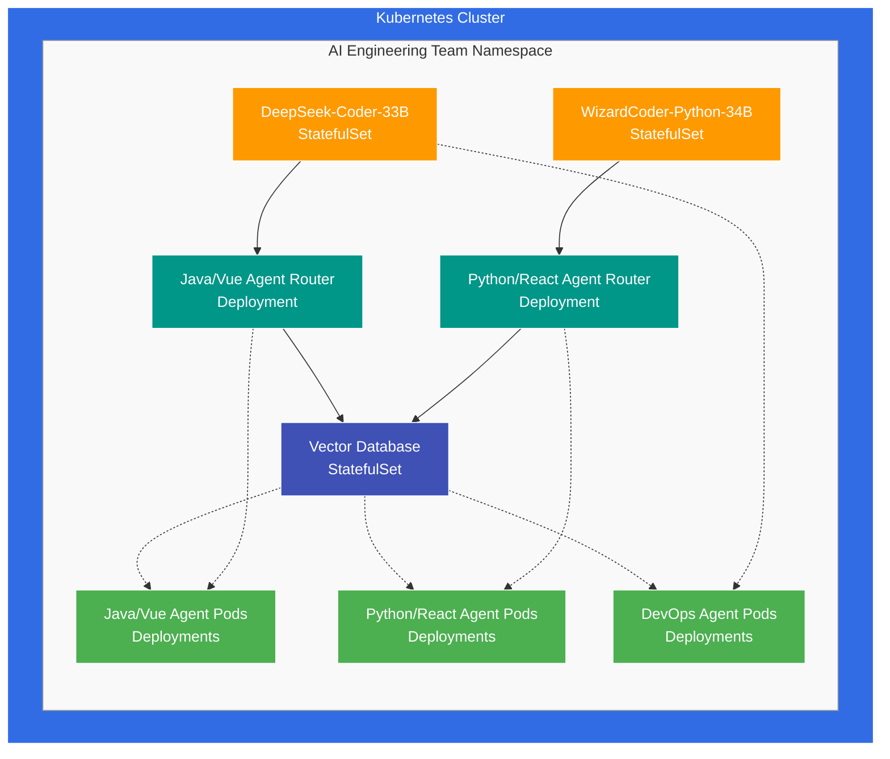
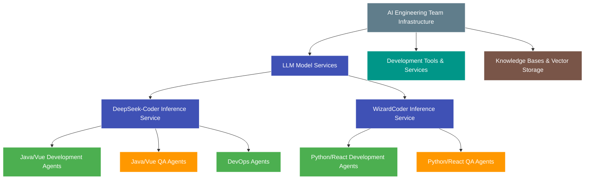
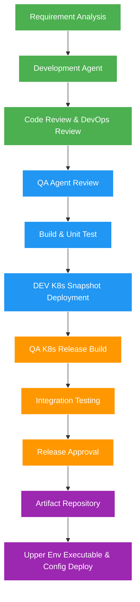

# AI Engineering Team Strategy: Building a Full-Stack Development Team with LLM Agents

*Strategy Document | May 3, 2025*

## 1. Executive Summary

This document outlines a comprehensive strategy for implementing an AI-powered software engineering team consisting of specialized agents for both development and quality assurance across Java/Vue and Python/React technology stacks, with dedicated DevOps expertise for Kubernetes-based deployments. The proposed approach leverages state-of-the-art code-specialized large language models (LLMs), fine-tuning techniques, and Retrieval-Augmented Generation (RAG) to create AI agents capable of performing senior-level software engineering tasks.

The strategy addresses model selection, infrastructure requirements, implementation phases, and integration points with existing development workflows, with particular emphasis on cloud-agnostic Kubernetes deployments. The approach enables a consistent CI/CD pipeline that supports building and testing code as snapshots in DEV environments, creating releases in QA, and deploying only executables and configuration to upper environments. By following this strategy, organizations can establish a cohesive team of AI agents that collaborate effectively while maintaining specialization in their respective technology domains and deployment practices.

## 2. Team Composition and Model Selection

### 2.1 Java/Vue Engineering Team

| Role | Quantity | Base Model | Specialization |
|------|----------|------------|----------------|
| Sr. Java/Vue Engineer | 2 | DeepSeek-Coder-33B | Java 11+, Tomcat, Vue.js |
| Sr. Java/Vue QA Engineer | 1 | DeepSeek-Coder-33B | Testing frameworks, QA methodologies |

**Model Selection Rationale**:
- DeepSeek-Coder-33B demonstrates superior performance on Java tasks
- Strong understanding of object-oriented programming patterns
- Effective comprehension of Maven/Gradle build systems
- Good capabilities with Vue.js frontend development
- Consistent model across development and QA ensures compatible understanding

### 2.2 Python/React Engineering Team

| Role | Quantity | Base Model | Specialization |
|------|----------|------------|----------------|
| Sr. Python/React Engineer | 2 | WizardCoder-Python-34B | Python 3.10+, React 18+ |
| Sr. Python/React QA Engineer | 1 | WizardCoder-Python-34B | Testing frameworks, QA methodologies |

**Model Selection Rationale**:
- WizardCoder-Python-34B shows excellent performance on Python tasks
- Strong understanding of modern Python features and libraries
- Better comprehension of React component architecture
- Longer context window (100K) beneficial for frontend development
- Consistent model across development and QA ensures compatible understanding

### 2.3 DevOps Engineering Team

| Role | Quantity | Base Model | Specialization |
|------|----------|------------|----------------|
| Sr. DevOps Engineer | 2 | DeepSeek-Coder-33B | Kubernetes, CI/CD, Infrastructure as Code |

**Model Selection Rationale**:
- DeepSeek-Coder-33B shows strong performance with infrastructure code and configuration
- Good understanding of YAML, JSON, and other configuration formats
- Effective comprehension of deployment patterns and container orchestration
- Compatible with both Java and Python deployment requirements
- Strong performance with infrastructure as code tools (Terraform, Helm, etc.)

## 3. Infrastructure Architecture

### 3.1 Kubernetes-Based Deployment Architecture

The AI Engineering Team infrastructure will be deployed on Kubernetes to ensure cloud agnosticism and operational consistency:



### 3.2 Infrastructure Configuration

The AI Engineering Team infrastructure will be deployed on a hybrid Kubernetes cluster with the following configuration:

#### 3.2.1 Cluster Hardware Configuration

```mermaid
flowchart TD
    subgraph cluster["Kubernetes Cluster (K8s 1.32, Ubuntu 24.04, ROCm XDNA)"]        
        subgraph control["Control Plane + Worker Nodes"]            
            node1["AMD Ryzen 9 8945HS\n64GB RAM, 2TB NVMe\nXDNA NPU"]            
            node2["AMD Ryzen 9 8945HS\n64GB RAM, 2TB NVMe\nXDNA NPU"]            
            node3["AMD Ryzen 9 8945HS\n64GB RAM, 2TB NVMe\nXDNA NPU"]        
        end        
        
        subgraph worker["Dedicated AI Worker Nodes"]            
            node4["AMD AI HX 370\n64GB RAM, 2TB NVMe\nXDNA2 NPU"]            
            node5["AMD AI HX 370\n64GB RAM, 2TB NVMe\nXDNA2 NPU"]        
        end        
        
        control --- worker    
    end
    
    classDef cluster fill:#326ce5,stroke:#fff,stroke-width:1px,color:white
    classDef controlPlane fill:#ff9800,stroke:#fff,stroke-width:1px,color:white
    classDef workerNodes fill:#4caf50,stroke:#fff,stroke-width:1px,color:white
    classDef node fill:#78909c,stroke:#fff,stroke-width:1px,color:white
    classDef aiNode fill:#3f51b5,stroke:#fff,stroke-width:1px,color:white
    
    class cluster cluster
    class control controlPlane
    class worker workerNodes
    class node1,node2,node3 node
    class node4,node5 aiNode
```

#### 3.2.2 Node Assignment Strategy

| Node Type | Hardware | Role | Workloads |
|-----------|----------|------|------------|
| Control+Worker | 3× AMD Ryzen 9 8945HS | Kubernetes control plane, basic services | Vector database, agent routers, lightweight agents |
| AI Worker | 2× AMD AI HX 370 | Model inference | DeepSeek-Coder-33B (INT4), WizardCoder-Python-34B (INT4) |

#### 3.2.3 Resource Allocation

| Component | Kubernetes Resource | Quantity | Node Placement | Resource Requests |
|-----------|---------------------|----------|----------------|-------------------|
| DeepSeek Inference | StatefulSet with nodeSelector | 1 pod | AMD AI HX 370 | 48GB RAM, 8 CPU cores |
| WizardCoder Inference | StatefulSet with nodeSelector | 1 pod | AMD AI HX 370 | 48GB RAM, 8 CPU cores |
| Agent Service Router | Deployment | 3 pods | AMD Ryzen 9 8945HS | 4GB RAM, 2 CPU cores each |
| Vector Database | StatefulSet | 3 pods | AMD Ryzen 9 8945HS | 16GB RAM, 4 CPU cores each |
| Agent Pods | Deployments | 6+ pods | AMD Ryzen 9 8945HS | 4GB RAM, 2 CPU cores each |
| Persistent Volumes | CEPH RBD StorageClass | 10+ PVs | Distributed | Various sizes |

### 3.3 Kubernetes-Specific Considerations

#### 3.3.1 Node Configuration

- **Taints and Tolerations**: AI worker nodes tainted to ensure only inference workloads are scheduled
- **Node Labels**: Hardware-specific labels for targeted pod placement
- **Resource Reservations**: System reserved resources on each node type
- **Huge Pages**: Configured on AI worker nodes for better memory performance

#### 3.3.2 Workload Management

- **Resource Quotas**: Namespace-level quotas to ensure fair resource allocation
- **Priority Classes**: Higher priority for inference services
- **Pod Disruption Budgets**: Ensuring high availability during cluster operations
- **Affinity/Anti-Affinity Rules**: Proper pod distribution for resilience

#### 3.3.3 Networking and Storage

- **Network Policies**: Secure communication between components
- **Service Mesh**: Istio for advanced traffic management
- **CEPH Integration**: Distributed storage for model weights and embeddings
- **PVC Data Protection**: Backup and snapshot policies

#### 3.3.4 AI-Specific Components

- **ROCm Device Plugin**: For AMD GPU/NPU access in containers
- **Custom Resource Definitions**: For specialized AI workload management
- **Metrics Collection**: GPU/NPU utilization and temperature monitoring
- **Auto-scaling**: Based on inference queue length and latency metrics

## 4. Agent Specialization Strategy

### 4.1 Development Agent Specialization

#### 4.1.1 Java/Vue Development Agents

**Fine-tuning Focus Areas**:
- Java 11+ language features and best practices
- Enterprise Java patterns (Spring, Hibernate, etc.)
- Tomcat deployment and configuration
- Vue.js component architecture and state management
- Java-Vue integration patterns
- Modern build systems (Maven, Gradle)

**RAG Knowledge Base Components**:
- Java standard library documentation
- Framework-specific documentation
- Vue.js best practices
- Enterprise architecture patterns
- Security guidelines
- Performance optimization techniques

#### 4.1.2 Python/React Development Agents

**Fine-tuning Focus Areas**:
- Python 3.10+ language features and best practices
- Modern Python frameworks (FastAPI, Django, etc.)
- React 18+ component patterns
- State management (Redux, Context API)
- Python-React integration approaches
- Modern JavaScript/TypeScript features

**RAG Knowledge Base Components**:
- Python standard library documentation
- React documentation and patterns
- JavaScript/TypeScript best practices
- API design principles
- Frontend performance optimization
- State management patterns

### 4.2 QA Agent Specialization

#### 4.2.1 Java/Vue QA Agent

**Fine-tuning Focus Areas**:
- Test-driven development in Java
- JUnit, TestNG, Mockito frameworks
- Vue Test Utils and Jest
- Integration testing strategies
- Performance testing methodologies
- Security testing approaches

**RAG Knowledge Base Components**:
- Testing patterns and anti-patterns
- Common Java vulnerabilities
- UI testing best practices
- Test coverage metrics
- Quality gates and standards
- Regression testing strategies

#### 4.2.2 Python/React QA Agent

**Fine-tuning Focus Areas**:
- Python testing frameworks (pytest, unittest)
- React Testing Library and Jest
- End-to-end testing with Cypress/Playwright
- API testing methodologies
- Performance testing for React applications
- Security testing for Python applications

**RAG Knowledge Base Components**:
- Python testing patterns
- React component testing strategies
- Frontend performance testing
- API contract testing
- Security testing methodologies
- Accessibility testing guidelines

## 5. Implementation Phases with AI-Assisted Development

The implementation timeline leverages AI-assisted development tools to accelerate coding while allocating dedicated time for testing and certification to ensure production readiness.

### 5.1 Phase 1: Foundation (Weeks 1-3)

- Deploy Kubernetes infrastructure for LLM inference
- Implement basic agent interfaces and routing
- Establish initial RAG knowledge bases
- Configure development environment integrations
- Deploy baseline models without specialized fine-tuning

**Key Deliverables**:
- Functional Kubernetes cluster with GPU/NPU support
- LLM inference StatefulSets and Services
- Basic agent interfaces for each role
- Initial integration with development tools
- Container images for all components

### 5.2 Phase 1: Testing & Certification (Week 4)

- Infrastructure validation and load testing
- Security assessment of base components
- Agent interface verification
- Knowledge base retrieval accuracy testing
- Performance benchmarking

**Key Deliverables**:
- Validated infrastructure performance metrics
- Security assessment report
- Agent interface test results
- Knowledge retrieval accuracy metrics
- Performance benchmark report

### 5.3 Phase 2: Specialization (Weeks 5-7)

- Implement domain-specific fine-tuning for each agent type
- Enhance RAG knowledge bases with specialized content
- Develop agent-specific tools and capabilities
- Implement feedback collection mechanisms
- Create Helm charts for all components

**Key Deliverables**:
- Fine-tuned models for each agent role
- Comprehensive RAG knowledge bases
- Agent-specific tool integrations
- Feedback collection system
- Kubernetes-native deployment packages

### 5.4 Phase 2: Testing & Certification (Week 8)

- Agent specialization validation
- Knowledge retrieval accuracy testing
- Tool functionality verification
- Feedback system validation
- Helm chart deployment testing

**Key Deliverables**:
- Agent specialization validation report
- Knowledge retrieval accuracy metrics
- Tool functionality test results
- Feedback system validation report
- Helm chart deployment test results

### 5.5 Phase 3: Integration (Weeks 9-11)

- Implement inter-agent communication protocols
- Establish GitOps-based workflow orchestration
- Integrate with CI/CD pipelines for multi-environment deployment
- Develop Kubernetes-native monitoring and observability
- Implement security and access controls

**Key Deliverables**:
- End-to-end workflow capabilities
- Complete CI/CD pipeline for DEV, QA, and upper environments
- Kubernetes-integrated monitoring dashboard
- Security controls implementation
- Inter-agent communication system

### 5.6 Phase 3: Testing & Certification (Week 12)

- End-to-end integration testing
- GitOps workflow validation
- CI/CD pipeline verification
- Security control assessment
- Monitoring system validation

**Key Deliverables**:
- Integration test results
- GitOps workflow validation report
- CI/CD pipeline verification report
- Security assessment report
- Monitoring system validation report

### 5.7 Phase 4: Optimization (Weeks 13-15)

- Performance tuning based on usage patterns
- Implement advanced caching strategies in Kubernetes
- Enhance model efficiency through quantization
- Develop advanced scheduling and resource allocation
- Optimize Kubernetes resource utilization

**Key Deliverables**:
- Optimized inference performance
- Reduced resource utilization
- Improved response quality
- Advanced scheduling implementation
- Kubernetes resource optimization

### 5.8 Phase 4: Final Testing & Certification (Week 16)

- End-to-end system validation
- Performance optimization verification
- Disaster recovery testing
- Final security certification
- System review by human engineering team

**Key Deliverables**:
- System validation report
- Performance optimization metrics
- Disaster recovery test results
- Security certification documentation
- Human review assessment
- Kubernetes resource optimization recommendations
- Horizontal and vertical scaling automation

## 6. AI Team Infrastructure and Application Deployment

This section outlines two distinct deployment aspects:
1. The infrastructure for the AI engineering team itself (Section 6.1)
2. The deployment strategy for applications and code produced by the AI team (Section 6.2)

### 6.1 AI Engineering Team Infrastructure

#### 6.1.1 Kubernetes-Based AI Agent Infrastructure

The AI engineering team's infrastructure will be deployed on Kubernetes to ensure high availability and scalability:



#### 6.1.2 AI Team Infrastructure Components

| Component | Purpose | Implementation |
|-----------|---------|----------------|
| LLM Inference Services | Model serving for agents | GPU-optimized containers with vLLM |
| Vector Database | Knowledge retrieval | Distributed vector store (Qdrant/Milvus) |
| Agent Orchestration | Coordination between agents | Custom Kubernetes controllers |
| Development Tools | IDE integration, code analysis | Language servers, static analyzers |
| Monitoring | Agent performance tracking | Prometheus, Grafana dashboards |

### 6.2 Application Deployment Strategy

The code and applications produced by the AI engineering team will follow a Kubernetes-centric deployment pipeline with distinct environments:

#### 6.2.1 Application CI/CD Pipeline



#### 6.2.2 Application Deployment Components

| Component | Purpose | Implementation |
|-----------|---------|----------------|
| Container Registry | Store application images | Harbor or cloud provider registry |
| Helm Charts Repository | Package K8s resources | ChartMuseum or OCI registry |
| GitOps Controller | Declarative deployments | ArgoCD or Flux |
| Kubernetes Operators | Custom resource management | Operator SDK-based custom controllers |
| Secret Management | Secure credential handling | Vault integration with K8s |
| Observability Stack | Monitoring and alerting | Prometheus, Grafana, Jaeger |

#### 6.2.3 Environment-Specific Application Deployment Strategy

##### DEV Environment
- **Deployment Type**: Snapshot builds with latest code
- **Kubernetes Resources**: Namespace per feature branch
- **CI Triggers**: Commit-based or scheduled builds
- **Artifact Handling**: Ephemeral images with feature branch tags
- **Testing**: Unit tests, component tests, linting

##### QA Environment
- **Deployment Type**: Release candidate builds
- **Kubernetes Resources**: Stable namespace with proper resource limits
- **CI Triggers**: Manual promotion or scheduled releases
- **Artifact Handling**: Versioned images with release tags
- **Testing**: Integration tests, performance tests, security scans

##### Upper Environments (UAT, Staging, Production)
- **Deployment Type**: Executable and configuration only
- **Kubernetes Resources**: Production-grade with guaranteed QoS
- **CI Triggers**: Approval-based promotion
- **Artifact Handling**: Immutable, signed images from release registry
- **Testing**: Smoke tests, canary deployments, blue-green switches

### 6.4 Integration Points

| System | Integration Method | Purpose |
|--------|-------------------|----------|
| GitHub/GitLab | Kubernetes Operator | Code repository access, PR/MR management |
| JIRA/Azure DevOps | API integration | Task management, requirement tracking |
| Kubernetes API | Direct client access | Resource management, deployment status |
| IDE | Plugin/extension | Developer assistance, code generation |
| Container Security | In-pipeline scanning | Vulnerability detection, compliance |

### 6.3 DevOps Agent Responsibilities for Application Deployment

The DevOps agents are responsible for ensuring that the code produced by development agents is properly containerized, deployed, and maintained in Kubernetes environments:

#### 6.3.1 Application Containerization
- Docker image creation and optimization for Java and Python applications
- Multi-stage build design for minimal image size
- Security scanning and vulnerability remediation
- Base image selection and maintenance
- Container registry management

#### 6.3.2 Kubernetes Resource Generation
- Kubernetes manifest generation and validation
- Helm chart development for application components
- Resource requirements calculation and specification
- Network policy and service mesh configuration
- StatefulSet vs Deployment selection based on application needs

#### 6.3.3 CI/CD Pipeline Management
- Pipeline definition for different application types
- Build and test automation configuration
- Environment-specific deployment strategies
- Promotion workflows between environments
- Rollback and recovery procedures

#### 6.3.4 Infrastructure as Code
- Terraform modules for cloud-agnostic infrastructure
- Kubernetes operator development for custom resources
- GitOps workflow implementation
- Configuration management and secret handling
- Infrastructure validation and compliance checking

### 6.4 Human-in-the-Loop Touchpoints for Application Deployment

While the AI engineering team automates much of the development and deployment process, human oversight remains essential at key decision points:

#### 6.4.1 Development Phase Touchpoints
- Initial requirement clarification and prioritization
- Architecture and design pattern selection approval
- Technology stack decisions for new applications
- Final code review approval for complex changes
- Security-critical feature review

#### 6.4.2 Deployment Phase Touchpoints
- Deployment promotion approvals between environments
- Production change management and scheduling
- Rollback decisions during failed deployments
- Performance and security critical reviews
- Infrastructure cost optimization approval

#### 6.4.3 Feedback Loop
- Application performance feedback
- End-user experience reports
- Production incident analysis
- Continuous improvement suggestions for deployment process
- AI agent performance evaluation

## 7. Evaluation and Quality Assurance

### 7.1 Performance Metrics

| Metric Category | Specific Metrics | Target |
|----------------|------------------|--------|
| Code Quality | Static analysis scores, complexity | Meet or exceed team standards |
| Functional Correctness | Test pass rate, bug detection | >95% test pass rate |
| Efficiency | Response time, resource utilization | <2s for common tasks |
| Productivity | Tasks completed, time savings | 3x human productivity |
| Learning Curve | Time to effective use | <2 weeks for developers |

### 7.2 Continuous Improvement Process

1. **Collect Feedback**:
   - Developer satisfaction surveys
   - Code quality metrics
   - Performance benchmarks
   - Error rates and patterns

2. **Analyze Patterns**:
   - Identify common failure modes
   - Detect performance bottlenecks
   - Recognize successful patterns

3. **Implement Improvements**:
   - Update fine-tuning datasets
   - Enhance RAG knowledge bases
   - Optimize inference parameters
   - Refine tool integrations

4. **Measure Impact**:
   - A/B testing of improvements
   - Comparative performance analysis
   - Developer productivity metrics

## 8. Risk Management

### 8.1 Technical Risks

| Risk | Mitigation Strategy |
|------|---------------------|
| Model hallucinations | Robust RAG, fact-checking, human review |
| Performance degradation | Monitoring, auto-scaling, optimization |
| Security vulnerabilities | Code scanning, security-focused fine-tuning |
| Knowledge staleness | Automated knowledge base updates |
| Tool API changes | Abstraction layers, version monitoring |

### 8.2 Organizational Risks

| Risk | Mitigation Strategy |
|------|---------------------|
| Developer resistance | Gradual introduction, clear value demonstration |
| Overreliance on AI | Maintain human oversight, clear boundaries |
| Skill atrophy | Continued learning, AI as augmentation |
| Process disruption | Phased integration, workflow adaptation |
| Compliance issues | Documentation, audit trails, transparency |

## 9. Budget and Resource Planning

### 9.1 Infrastructure Costs

| Component | Monthly Cost | Annual Cost |
|-----------|--------------|-------------|
| GPU/NPU Infrastructure | $15,000 | $180,000 |
| CPU Servers | $3,000 | $36,000 |
| Storage | $1,000 | $12,000 |
| Networking | $2,000 | $24,000 |
| **Total Infrastructure** | **$21,000** | **$252,000** |

*Note: The infrastructure costs reflect the operational expenses of running the full AI engineering team infrastructure, including cloud resources, maintenance, and scaling requirements.*

### 9.2 Development and Maintenance with AI-Assisted Development

#### 9.2.1 AI-Assisted Development Approach
Implementation costs are based on using AI-assisted development tools like Windsurf or Cursor, which significantly reduce development time and resources compared to traditional development approaches. This approach allows us to achieve approximately 20% of the cost of traditional human-led development.

#### 9.2.2 Development Cost Breakdown

| Activity | One-time Cost | Annual Cost |
|----------|---------------|-------------|
| Initial Setup | $15,000 | - |
| Fine-tuning | $10,000 | $5,000 |
| RAG Development | $8,000 | $4,000 |
| Integration Development | $12,000 | $6,000 |
| Ongoing Maintenance | - | $24,000 |
| **Total Development** | **$45,000** | **$39,000** |

### 9.3 Hardware Acquisition (One-time)
- 3x AMD Ryzen 9 8945HS nodes: $4,200
  - $1,400 per server × 3 servers
- 2x AMD AI HX 370 nodes: $3,000
  - $1,500 per server × 2 servers
- Network infrastructure: $400
- Installation and configuration: $1,000
- **Total Hardware Acquisition**: $8,600

### 9.4 ROI Analysis

#### 9.4.1 Cost Comparison

| Metric | Year 1 | Year 2 | Year 3 |
|--------|--------|--------|--------|
| Cost Savings (Developer Hours) | $450,000 | $900,000 | $1,350,000 |
| Quality Improvements | $200,000 | $400,000 | $600,000 |
| Time-to-Market Reduction | $300,000 | $600,000 | $900,000 |
| **Total Benefits** | **$950,000** | **$1,900,000** | **$2,850,000** |
| **Total Costs** | **$92,600** | **$39,000** | **$39,000** |
| **Net Benefit** | **$857,400** | **$1,861,000** | **$2,811,000** |
| **ROI** | **926%** | **4,772%** | **7,208%** |

*Note: Year 1 costs include one-time hardware acquisition ($8,600), AI-assisted development costs ($45,000), and annual operational expenses ($39,000).*

#### 9.4.2 Additional Value Creation
- Ability to review and improve other AI agent systems
- Continuous self-improvement capabilities
- Acceleration of all software development projects
- Reduction in technical debt through consistent code quality
- Enhanced knowledge retention and transfer

## 10. Conclusion and Next Steps

### 10.1 Key Success Factors

1. **Model Selection and Specialization**:
   - DeepSeek-Coder-33B for Java/Vue stack and DevOps
   - WizardCoder-Python-34B for Python/React stack
   - Consistent models across development and QA roles

2. **Kubernetes-Based Infrastructure**:
   - Cloud-agnostic deployment architecture
   - Containerized LLM inference with GPU support
   - Scalable and resilient Kubernetes resources
   - Environment-specific deployment strategies

3. **Agent Specialization**:
   - Technology-specific fine-tuning
   - Role-based capabilities (development, QA, DevOps)
   - Comprehensive RAG knowledge bases
   - Kubernetes-aware deployment expertise

4. **CI/CD Integration Strategy**:
   - DEV environment snapshot deployments
   - QA environment release builds
   - Upper environment executable and configuration deployment
   - GitOps-based deployment automation
   - Clear human approval touchpoints

### 10.2 Immediate Next Steps

1. **Establish Kubernetes Infrastructure**:
   - Deploy Kubernetes cluster with GPU node pools
   - Configure namespaces for different environments
   - Set up container registry and Helm repository
   - Implement GitOps controllers

2. **Secure AI Infrastructure Resources**:
   - Procure GPU-enabled nodes for Kubernetes
   - Deploy LLM inference StatefulSets
   - Establish vector database services
   - Configure networking and security policies

3. **Initiate Knowledge Base Development**:
   - Collect and organize documentation including Kubernetes manifests
   - Develop embedding pipeline as containerized services
   - Create initial retrieval mechanisms with Kubernetes-native storage

4. **Begin Fine-tuning Preparation**:
   - Collect training examples including DevOps scenarios
   - Develop evaluation datasets for all agent roles
   - Establish fine-tuning pipeline in Kubernetes

5. **Develop CI/CD Pipeline**:
   - Implement environment-specific deployment workflows
   - Configure build and test automation
   - Set up artifact management and promotion
   - Create deployment validation mechanisms

By following this Kubernetes-centric strategy, organizations can successfully implement an AI engineering team that combines the strengths of specialized models with cloud-agnostic deployment practices. This approach ensures consistent development and deployment across environments while maintaining the flexibility to run on any cloud provider or bare metal infrastructure, resulting in significant productivity improvements and quality enhancements across both Java/Vue and Python/React technology stacks.
