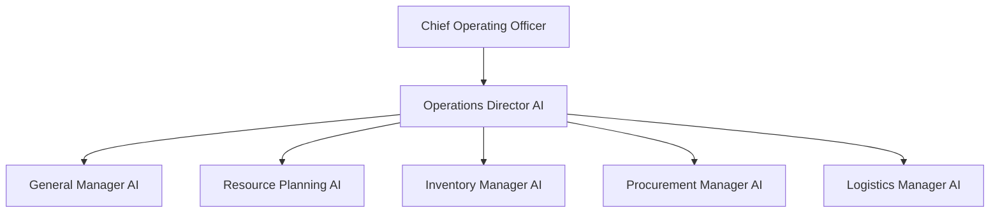
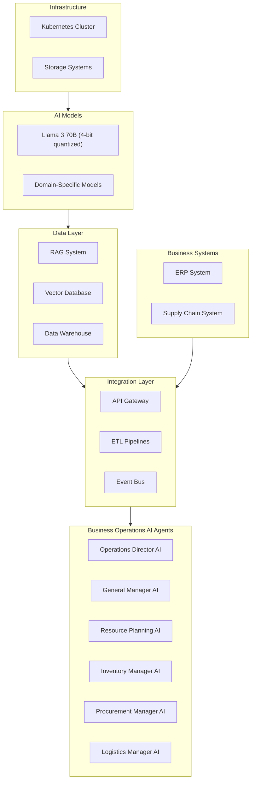
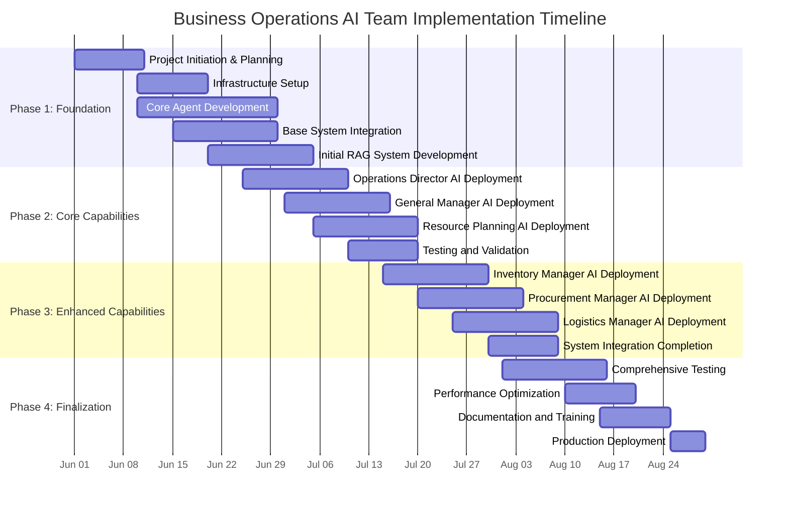
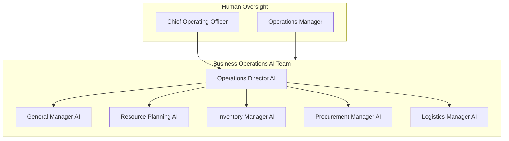

# Business Operations AI Strategy

## 1. Executive Summary

This strategy outlines the approach for implementing an AI-powered Business Operations Team focused on operational planning, inventory management, procurement, logistics, and resource planning. The Business Operations AI Team will report to the Chief Operating Officer (COO) and will be responsible for optimizing day-to-day operational functions.

The Business Operations AI Team will leverage advanced AI technologies, including Llama 3 70B (4-bit quantized) models and a comprehensive RAG system, to automate and enhance operational processes. The implementation will follow an accelerated timeline of 2-3 months, leveraging Software Engineering AI Agents for development and deployment.

Key benefits include:
- Streamlined operational planning and management
- Optimized inventory levels and procurement processes
- Enhanced logistics and supply chain efficiency
- Improved resource allocation and utilization
- Significant cost savings compared to traditional operational staffing

## 2. Team Structure

### 2.1 Team Overview

The Business Operations AI Team will consist of specialized AI agents focused on operational planning, inventory management, procurement, logistics, and resource planning. The team will be led by an Operations Director AI that reports directly to the COO.

### 2.2 Agent Roles and Responsibilities

#### Operations Director AI
- Reports to the Chief Operating Officer
- Oversees all business operational functions
- Coordinates activities across operational domains
- Provides strategic operational insights and recommendations
- Ensures alignment with organizational objectives
- Manages operational risk and performance

#### General Manager AI
- Reports to the Operations Director AI
- Manages day-to-day operational activities
- Coordinates cross-functional operational processes
- Identifies operational inefficiencies and improvements
- Implements operational policies and procedures
- Generates operational reports and analytics

#### Resource Planning AI
- Reports to the Operations Director AI
- Optimizes resource allocation across the organization
- Forecasts resource requirements based on business plans
- Identifies resource constraints and bottlenecks
- Develops capacity planning models
- Coordinates with HR for workforce planning

#### Inventory Manager AI
- Reports to the Operations Director AI
- Optimizes inventory levels and turnover
- Implements just-in-time inventory practices
- Conducts demand forecasting and planning
- Manages stock levels and reordering processes
- Identifies slow-moving and obsolete inventory

#### Procurement Manager AI
- Reports to the Operations Director AI
- Manages vendor evaluation and selection processes
- Negotiates and optimizes contracts and terms
- Processes purchase requisitions and orders
- Monitors vendor performance and compliance
- Analyzes spend data and identifies savings opportunities

#### Logistics Manager AI
- Reports to the Operations Director AI
- Optimizes transportation and logistics operations
- Manages warehouse and distribution activities
- Tracks shipments and delivery performance
- Coordinates with vendors and carriers
- Optimizes supply chain efficiency and resilience

## 3. Functional Requirements

### 3.1 Core Capabilities

#### Operational Planning and Management
- Develop and maintain operational plans and forecasts
- Monitor and report on operational KPIs and metrics
- Identify operational inefficiencies and improvement opportunities
- Coordinate cross-functional activities and dependencies
- Manage operational risk assessment and mitigation
- Generate operational dashboards and reports

#### Inventory Management
- Optimize inventory levels and turnover
- Implement just-in-time inventory practices
- Conduct demand forecasting and planning
- Manage stock levels and reordering processes
- Identify slow-moving and obsolete inventory
- Generate inventory analytics and reports

#### Procurement and Vendor Management
- Manage vendor evaluation and selection processes
- Negotiate and optimize contracts and terms
- Process purchase requisitions and orders
- Monitor vendor performance and compliance
- Analyze spend data and identify savings opportunities
- Generate procurement analytics and reports

#### Logistics and Supply Chain
- Optimize transportation and logistics operations
- Manage warehouse and distribution activities
- Track shipments and delivery performance
- Coordinate with vendors and carriers
- Optimize supply chain efficiency and resilience
- Generate logistics performance reports

#### Resource Planning
- Optimize resource allocation across the organization
- Forecast resource requirements based on business plans
- Identify resource constraints and bottlenecks
- Develop capacity planning models
- Coordinate with HR for workforce planning
- Generate resource utilization reports

### 3.2 Deliverables

#### Operational Reports and Analytics
- Daily operations status reports
- Weekly operational performance dashboards
- Monthly operational metrics and KPIs
- Quarterly operational performance analysis
- Ad-hoc operational analysis and recommendations
- Operational efficiency improvement plans

#### Inventory Management Reports
- Daily inventory status reports
- Weekly inventory movement analysis
- Monthly inventory turnover metrics
- Quarterly inventory optimization recommendations
- Inventory forecasting and planning reports
- Slow-moving and obsolete inventory reports

#### Procurement and Vendor Reports
- Purchase order status reports
- Vendor performance scorecards
- Spend analysis and savings reports
- Contract expiration and renewal alerts
- Vendor risk assessment reports
- Procurement efficiency metrics

#### Supply Chain Analytics
- Logistics performance reports
- Shipping and delivery status updates
- Transportation cost analysis
- Warehouse utilization reports
- Supply chain risk assessments
- Supply chain optimization recommendations

### 3.3 Integration Requirements

#### Business System Integration

- **ERP System Integration**
  - Bidirectional data exchange with ERP modules
  - Real-time transaction processing and validation
  - Master data synchronization and management
  - Business process automation and workflow integration
  - Reporting and analytics integration

- **Supply Chain System Integration**
  - Inventory management system integration
  - Procurement system integration
  - Warehouse management system integration
  - Transportation management system integration
  - Vendor management system integration
  - Demand planning system integration

#### Cross-Team Integration

- **Administrative Operations Team Integration**
  - Coordinate resource planning with HR management
  - Align procurement processes with financial controls
  - Ensure operational compliance with policy management
  - Share operational data for financial reporting

- **Governance Team Integration**
  - Ensure procurement compliance with legal requirements
  - Coordinate vendor contracts with legal review processes
  - Align operational reporting with regulatory requirements
  - Support tax compliance with operational data

## 4. Technical Architecture

### 4.1 Infrastructure Overview

### 4.2 System Components

#### Core Infrastructure

- **Kubernetes Cluster**
  - Leverages existing consolidated AI infrastructure
  - Deployed on AMD AI HX 370 nodes for compute-intensive workloads
  - Containerized microservices architecture for operational functions
  - Horizontal scaling based on workload demands

- **Storage Systems**
  - Object storage for documents, reports, and operational data
  - Relational databases for transactional data
  - Time-series databases for operational metrics and monitoring
  - Persistent volumes for application state and configurations

#### AI Models

- **Primary LLM**
  - Llama 3 70B (4-bit quantized)
  - Fine-tuned for operational planning, inventory management, procurement, and logistics domains
  - Specialized for operational document processing, analysis, and generation

- **Domain-Specific Models**
  - Inventory optimization and demand forecasting models
  - Procurement analytics and vendor selection models
  - Logistics optimization and route planning models
  - Resource allocation and optimization models

### 4.3 Data Architecture

- **RAG System**
  - Comprehensive knowledge base for operational domains
  - Operational policies and procedures documentation
  - Industry best practices and standards
  - Historical operational data and precedents
  - Vendor information and performance history

- **Vector Database**
  - Document embeddings for semantic search
  - Operational report and analysis vectors
  - Vendor contract and documentation vectors
  - Historical decision and recommendation vectors
  - Operational process documentation vectors

- **Data Warehouse**
  - Consolidated operational data repository
  - Historical transaction and activity data
  - Performance metrics and KPIs
  - Analytical datasets for reporting and analysis
  - Audit trails and operational evidence

### 4.4 Integration Architecture

- **API Gateway**
  - Unified interface for business system integration
  - Authentication and authorization services
  - Rate limiting and request validation
  - API versioning and documentation
  - Monitoring and logging

- **ETL Pipelines**
  - Data extraction from business systems
  - Data transformation and normalization
  - Data loading to operational data stores
  - Data quality validation and enrichment
  - Metadata management and lineage tracking

- **Event Bus**
  - Real-time event distribution and processing
  - Event-driven architecture for operational workflows
  - Asynchronous communication between components
  - Event filtering and routing
  - Event persistence and replay capabilities

### 4.5 Business System Integration

- **ERP System Integration**
  - Bidirectional data exchange with ERP modules
  - Transaction processing and validation
  - Master data synchronization
  - Business process automation
  - Reporting and analytics integration

- **Supply Chain System Integration**
  - Inventory management system integration
  - Procurement system integration
  - Warehouse management integration
  - Transportation management integration
  - Vendor management integration
  - Demand planning integration

## 5. Implementation Approach

### 5.1 Implementation Timeline

The Business Operations AI Team implementation will follow an accelerated timeline of 2-3 months, leveraging Software Engineering AI Agents for development and deployment. This approach allows for rapid implementation while ensuring thorough testing and validation.

### 5.2 Implementation Phases

#### Phase 1: Foundation (Weeks 1-4)

- **Project Initiation & Planning**
  - Define detailed project scope and requirements
  - Establish project governance and communication plan
  - Identify key stakeholders and integration points
  - Define success criteria and performance metrics

- **Infrastructure Setup**
  - Configure Kubernetes environment for Business Operations AI Team
  - Set up storage systems and databases
  - Establish monitoring and logging infrastructure
  - Configure security controls and access management

- **Core Agent Development**
  - Develop Operations Director AI agent
  - Implement General Manager AI agent
  - Create base Resource Planning AI agent
  - Develop initial Inventory Manager AI agent
  - Implement foundational Procurement Manager AI agent
  - Develop initial Logistics Manager AI agent

- **Base System Integration**
  - Establish API gateway and integration framework
  - Implement initial ERP system integration
  - Set up basic supply chain system integration
  - Configure event bus for system communication

- **Initial RAG System Development**
  - Create knowledge base structure and taxonomy
  - Populate core operational policies and procedures
  - Implement basic document retrieval and question answering
  - Develop initial vector embeddings for operational documents

#### Phase 2: Core Capabilities (Weeks 5-6)

- **Operations Director AI Deployment**
  - Deploy comprehensive operational planning capabilities
  - Implement operational performance monitoring
  - Develop operational risk assessment functionality
  - Configure cross-functional coordination capabilities

- **General Manager AI Deployment**
  - Implement day-to-day operational management capabilities
  - Deploy operational policy enforcement functionality
  - Develop operational reporting and analytics
  - Configure operational process optimization

- **Resource Planning AI Deployment**
  - Implement resource allocation optimization
  - Deploy resource forecasting capabilities
  - Develop capacity planning models
  - Configure resource constraint analysis

#### Phase 3: Enhanced Capabilities (Weeks 7-9)

- **Inventory Manager AI Deployment**
  - Implement inventory optimization algorithms
  - Deploy demand forecasting capabilities
  - Develop just-in-time inventory management
  - Configure slow-moving inventory identification

- **Procurement Manager AI Deployment**
  - Implement vendor evaluation and selection
  - Deploy contract optimization capabilities
  - Develop purchase order processing
  - Configure spend analysis and savings identification

- **Logistics Manager AI Deployment**
  - Implement transportation optimization
  - Deploy warehouse management capabilities
  - Develop shipment tracking and performance monitoring
  - Configure supply chain efficiency optimization

#### Phase 4: Finalization (Weeks 10-12)

- **Comprehensive Testing**
  - Perform end-to-end system testing
  - Conduct performance and load testing
  - Execute security and vulnerability testing
  - Validate business process workflows

- **Performance Optimization**
  - Optimize agent response times and accuracy
  - Fine-tune model parameters and configurations
  - Enhance system scalability and resilience
  - Optimize resource utilization and efficiency

- **Documentation and Training**
  - Create comprehensive system documentation
  - Develop user guides and training materials
  - Conduct stakeholder training sessions
  - Establish ongoing support processes

- **Production Deployment**
  - Execute production deployment plan
  - Perform final validation and acceptance testing
  - Transition to operational support
  - Initiate continuous improvement process

### 5.3 Resource Requirements

#### Hardware Requirements

- **Compute Resources**
  - 1 AMD AI HX 370 node for Business Operations AI Team
  - 128GB RAM and 2TB NVMe storage
  - Total compute capacity: 8 CPU cores, 128GB RAM

- **Storage Resources**
  - 5TB object storage for documents and reports
  - 1TB high-performance storage for databases
  - 2TB backup and archival storage

- **Network Resources**
  - 10Gbps internal network connectivity
  - Redundant network paths for high availability
  - Secure VPN access for remote management

#### Software Requirements

- **AI and Machine Learning**
  - Llama 3 70B (4-bit quantized) model
  - Vector database for document embeddings
  - RAG system components and libraries
  - Domain-specific model training frameworks

- **Infrastructure Software**
  - Kubernetes for container orchestration
  - Docker for containerization
  - Prometheus and Grafana for monitoring
  - ELK stack for logging and analysis

- **Integration Software**
  - API gateway and management platform
  - ETL and data integration tools
  - Event bus and message queue system
  - Identity and access management solution

#### Development Resources

- **AI Development Team**
  - 1 AI/ML engineer for model development and fine-tuning
  - 1 software engineer for agent development and integration
  - 0.5 data engineer for data pipeline and storage
  - 0.5 DevOps engineer for infrastructure and deployment

- **Domain Experts**
  - Operations management specialist
  - Inventory and supply chain expert
  - Procurement and vendor management specialist

### 5.4 Risk Management

#### Implementation Risks

| Risk | Impact | Probability | Mitigation Strategy |
|------|--------|------------|---------------------|
| Integration complexity with legacy systems | High | Medium | Develop comprehensive integration plan with fallback options |
| Data quality issues affecting agent performance | High | Medium | Implement data validation and cleansing processes |
| Security vulnerabilities in AI systems | High | Low | Conduct regular security assessments and penetration testing |
| Resistance to adoption from human staff | Medium | High | Develop change management and training program |
| Performance issues under peak load | Medium | Medium | Conduct thorough load testing and performance optimization |
| Dependency on specific AI models or frameworks | Medium | Medium | Design for model and framework independence where possible |
| Budget or timeline overruns | Medium | Medium | Implement agile development with regular reassessment |

#### Operational Risks

| Risk | Impact | Probability | Mitigation Strategy |
|------|--------|------------|---------------------|
| AI agent making critical operational errors | High | Low | Implement human oversight for critical decisions |
| System downtime affecting operations | High | Low | Design for high availability and disaster recovery |
| Data privacy or confidentiality breach | High | Low | Implement comprehensive security controls and encryption |
| AI model degradation over time | Medium | Medium | Implement monitoring and regular model retraining |
| Dependency on specific vendor or technology | Medium | Medium | Design for vendor independence and technology flexibility |
| Scalability limitations during growth | Medium | Low | Design architecture for horizontal scaling |
| Knowledge gaps in specialized domains | Medium | Medium | Continuous knowledge base updates and domain expert review |

## 6. Oversight and Control Mechanisms

### 6.1 Governance Structure

### 6.2 Human Oversight Roles

#### Executive Oversight

- **Chief Operating Officer**
  - Ultimate accountability for Business Operations AI Team performance
  - Approval authority for strategic operational decisions
  - Final escalation point for critical operational issues
  - Quarterly review of Business Operations AI Team performance
  - Approval of significant operational policy changes

#### Departmental Oversight

- **Operations Manager**
  - Day-to-day oversight of Business Operations AI agents
  - Review and approval of operational plans and forecasts
  - Validation of inventory and procurement decisions
  - Monitoring of operational performance metrics
  - Escalation point for operational issues

### 6.3 Decision Authority Matrix

| Decision Type | AI Authority | Human Review Required | Approval Level |
|---------------|-------------|----------------------|---------------|
| Operational planning | Recommend | Yes | Operations Manager |
| Resource allocation | Autonomous up to $10,000 | >$10,000 | Operations Manager |
| Inventory optimization | Autonomous | Exceptions only | Operations Manager |
| Vendor selection | Recommend | Yes | Operations Manager |
| Contract negotiation | Recommend | Yes | Operations Manager |
| Purchase orders | Autonomous up to $5,000 | >$5,000 | Operations Manager |
| Logistics routing | Autonomous | Exceptions only | Operations Manager |
| Performance reporting | Autonomous | No | None |
| Process optimization | Recommend | Yes | Operations Manager |
| System integration | Recommend | Yes | Operations Manager |

### 6.4 Approval Workflows

#### Tiered Approval System

- **Tier 1: Autonomous Actions**
  - Routine operational tasks within defined parameters
  - Standard report generation and distribution
  - Data collection and analysis activities
  - Low-risk, repetitive operational tasks
  - System monitoring and maintenance

- **Tier 2: Review and Confirm**
  - AI agent prepares recommendation or draft
  - Human reviewer receives notification with recommendation
  - Reviewer can approve, reject, or modify recommendation
  - AI agent implements approved action
  - Action and approval are logged for audit purposes

- **Tier 3: Collaborative Decision-Making**
  - AI agent identifies decision requirement
  - AI agent prepares analysis and multiple options
  - Human decision-maker reviews options and analysis
  - Collaborative discussion between AI and human
  - Human makes final decision
  - AI agent implements and documents decision

- **Tier 4: Human-Led Decisions**
  - Strategic decisions beyond AI authority
  - High-risk or high-value decisions
  - Novel situations without precedent
  - Decisions with significant human impact
  - AI provides supporting analysis only
  - Human makes and implements decision

### 6.5 Monitoring and Audit

#### Performance Monitoring

- **Real-time Monitoring**
  - Continuous monitoring of AI agent activities and decisions
  - Automated alerts for anomalous behavior or decisions
  - Dashboard visualization of operational metrics
  - Performance tracking against defined KPIs
  - System health and availability monitoring

- **Periodic Reviews**
  - Daily operational performance summaries
  - Weekly exception and incident reports
  - Monthly performance and compliance reviews
  - Quarterly strategic performance assessments
  - Annual comprehensive system audit

#### Audit and Compliance

- **Decision Audit Trail**
  - Comprehensive logging of all AI decisions and actions
  - Documentation of decision rationale and supporting data
  - Traceability from decision to outcome
  - Preservation of approval workflows and authorizations
  - Immutable audit records for compliance purposes

- **Compliance Validation**
  - Regular automated compliance checks
  - Periodic manual compliance reviews
  - External compliance audits as required
  - Continuous monitoring of regulatory changes
  - Proactive compliance risk assessment

### 6.6 Feedback and Improvement

#### Continuous Learning

- **Performance Feedback Loop**
  - Capture feedback on AI agent decisions and recommendations
  - Analyze decision outcomes and accuracy
  - Identify patterns in successful and unsuccessful decisions
  - Incorporate feedback into agent training and configuration
  - Regular model retraining and optimization

- **Knowledge Base Enhancement**
  - Continuous update of operational knowledge base
  - Incorporation of new policies, procedures, and best practices
  - Documentation of edge cases and exceptions
  - Addition of new domain expertise
  - Regular review and validation of knowledge base content

#### Incident Management

- **Incident Detection and Response**
  - Automated detection of operational incidents
  - Structured incident response procedures
  - Root cause analysis for all significant incidents
  - Documentation of lessons learned
  - Implementation of preventive measures

## 7. Cost Analysis

### 7.1 Implementation Costs

#### Hardware Costs

| Item | Quantity | Unit Cost | Total Cost |
|------|----------|-----------|------------|
| AMD AI HX 370 Node | 1 | $1,500 | $1,500 |
| Network Equipment | 1 | $500 | $500 |
| Storage Infrastructure | 1 | $1,000 | $1,000 |
| **Total Hardware** | | | **$3,000** |

#### Development Costs

| Item | Effort (person-weeks) | Rate ($/week) | Total Cost |
|------|----------------------|--------------|------------|
| AI/ML Engineering | 12 | $4,000 | $48,000 |
| Software Engineering | 12 | $3,500 | $42,000 |
| Data Engineering | 6 | $3,500 | $21,000 |
| DevOps Engineering | 6 | $3,500 | $21,000 |
| Domain Expert Consulting | 6 | $4,500 | $27,000 |
| **Total Development** | | | **$159,000** |

#### Training and Integration Costs

| Item | Effort (person-weeks) | Rate ($/week) | Total Cost |
|------|----------------------|--------------|------------|
| System Integration | 4 | $3,500 | $14,000 |
| Knowledge Base Development | 3 | $3,000 | $9,000 |
| User Training | 2 | $2,500 | $5,000 |
| Documentation | 2 | $2,500 | $5,000 |
| **Total Training & Integration** | | | **$33,000** |
