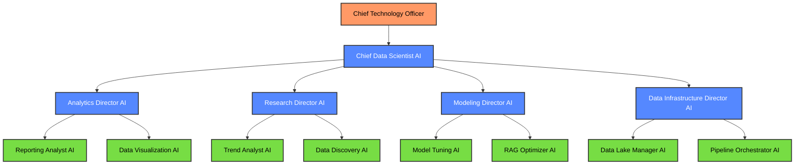
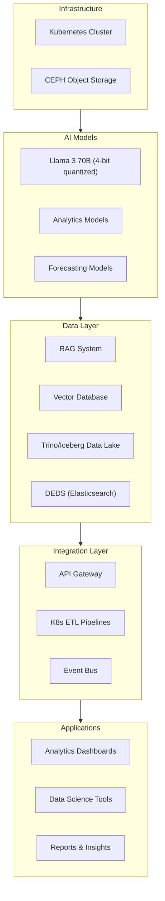
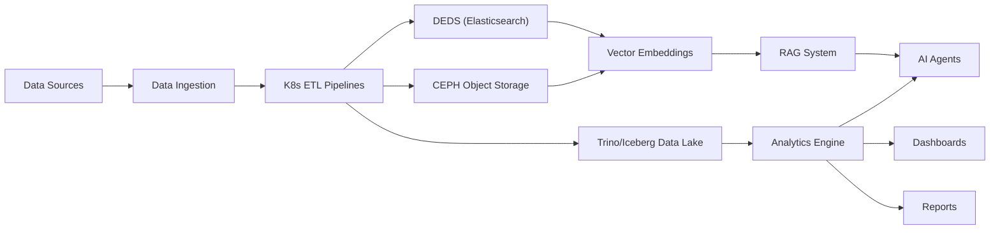
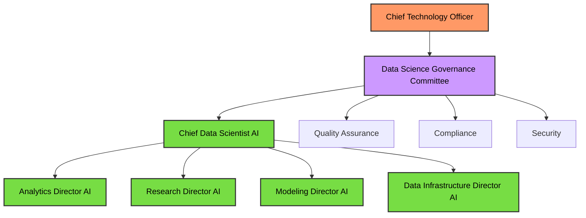

# AI Data Science Team Strategy

## Executive Summary

This document outlines a strategy for implementing an AI-powered data science team that can operate with oversight from the Chief Technology Officer. The proposed solution leverages large language models, specialized AI agents, and the company's existing data infrastructure to handle analytics reporting, data lake management, data research, trend analysis, operational analytics, predictive analytics, model fine-tuning, and RAG system optimization.

The AI Data Science Team will complement the existing AI teams (Engineering, Sales, Technical Support, Marketing, and Product Management) by providing data-driven insights, predictive capabilities, and continuous model optimization to enhance the performance of all AI systems across the organization.

## Table of Contents

1. Introduction
2. AI Agent Roles and Hierarchy
3. Functional Requirements
4. Technical Architecture
5. Implementation Approach
6. Oversight and Control Mechanisms
7. Growth and Transition Strategy
8. Cost Analysis
9. Next Steps

## 1. Introduction

### 1.1 Purpose

This strategy document outlines the approach for implementing an AI-powered data science team that can operate with oversight from the Chief Technology Officer. The goal is to establish effective data science operations that can provide actionable insights, optimize AI models, and enhance data-driven decision-making across the organization.

### 1.2 Business Objectives

- Establish comprehensive analytics reporting and data visualization capabilities
- Optimize data lake management and data pipeline operations
- Conduct advanced data research and trend analysis
- Provide operational analytics (insights) and predictive analytics (foresights)
- Fine-tune and optimize AI models for all existing AI agent teams
- Enhance RAG system performance through continuous optimization
- Create a scalable foundation that can incorporate human data scientists in the future

### 1.3 Key Challenges

- Ensuring data quality and consistency across diverse data sources
- Balancing computational resources between analytics and AI model optimization
- Coordinating data science activities across multiple AI agent teams
- Establishing appropriate validation methods for predictive models
- Maintaining data security and privacy while enabling broad analytical access
- Planning for eventual transition to a hybrid AI-human data science team

## 2. AI Agent Roles and Hierarchy

### 2.1 Agent Hierarchy

### 2.2 Agent Roles and Responsibilities

#### Strategic Layer

**Chief Data Scientist AI**
- Coordinates all data science activities
- Develops overall data strategy and priorities
- Allocates resources across data initiatives
- Reports to CTO with clear metrics and recommendations
- Ensures data science activities align with company strategy
- Orchestrates communication between data science and other AI teams

#### Management Layer

**Analytics Director AI**
- Oversees analytics reporting and visualization
- Defines key performance indicators (KPIs)
- Ensures data consistency across reports
- Develops analytics frameworks and methodologies
- Prioritizes analytics requests from other teams

**Research Director AI**
- Leads data research initiatives
- Identifies trends and patterns in company data
- Directs exploratory data analysis
- Develops research methodologies
- Coordinates cross-functional research projects

**Modeling Director AI**
- Manages AI model fine-tuning and optimization
- Oversees RAG system enhancements
- Develops model evaluation frameworks
- Prioritizes model improvement initiatives
- Coordinates model deployment with other AI teams

**Data Infrastructure Director AI**
- Manages data lake operations
- Optimizes data pipeline performance
- Ensures data quality and consistency
- Develops data governance frameworks
- Coordinates infrastructure scaling and maintenance

#### Execution Layer

**Reporting Analyst AI**
- Creates standard and ad-hoc reports
- Performs data aggregation and summarization
- Identifies anomalies and outliers
- Generates insights from operational data
- Automates recurring reporting processes

**Data Visualization AI**
- Designs interactive dashboards
- Creates data visualizations and charts
- Develops visual storytelling frameworks
- Optimizes visualizations for different audiences
- Implements visualization best practices

**Trend Analyst AI**
- Identifies patterns and trends in time-series data
- Performs seasonal decomposition and analysis
- Detects emerging trends and early signals
- Conducts comparative trend analysis
- Generates trend reports and forecasts

**Data Discovery AI**
- Explores data for hidden patterns and relationships
- Performs feature engineering and selection
- Identifies correlations and causal relationships
- Conducts hypothesis testing
- Develops new analytical approaches

**Model Tuning AI**
- Fine-tunes LLMs for specific use cases
- Optimizes model parameters and configurations
- Evaluates model performance and accuracy
- Implements continuous improvement processes
- Develops specialized training datasets

**RAG Optimizer AI**
- Enhances retrieval mechanisms for RAG systems
- Optimizes vector embeddings and similarity metrics
- Improves context selection and relevance
- Develops RAG evaluation frameworks
- Implements retrieval performance monitoring

**Data Lake Manager AI**
- Manages data lake organization and structure
- Optimizes storage formats and partitioning
- Implements data retention and archiving policies
- Ensures data accessibility and discoverability
- Monitors data lake performance and usage

**Pipeline Orchestrator AI**
- Manages ETL/ELT pipeline operations
- Optimizes data transformation processes
- Schedules and prioritizes data workflows
- Monitors pipeline performance and reliability
- Implements data quality validation checks

## 3. Functional Requirements

### 3.1 Core Capabilities

#### Analytics and Reporting

- **KPI Monitoring and Dashboards**
  - Create real-time dashboards for business KPIs across all departments
  - Implement drill-down capabilities for detailed analysis
  - Develop automated anomaly detection for key metrics
  - Generate scheduled reports for executive leadership
  - Create customized views for different stakeholder groups

- **Data Visualization**
  - Design interactive visualizations for complex data relationships
  - Develop standardized visualization templates and libraries
  - Create narrative-driven data stories for key insights
  - Optimize visualizations for different display formats and devices
  - Implement accessibility features for all visualizations

- **Ad-hoc Analysis**
  - Respond to specific analytical requests from other AI teams
  - Generate custom reports based on natural language queries
  - Perform comparative analysis across time periods and segments
  - Create what-if scenario modeling for business decisions
  - Develop automated insight generation from raw data

#### Data Research and Discovery

- **Trend Analysis**
  - Identify long-term trends in business metrics and market data
  - Perform seasonal decomposition and cyclical pattern detection
  - Conduct cross-metric correlation analysis
  - Generate trend forecasts with confidence intervals
  - Develop early warning systems for trend shifts

- **Pattern Discovery**
  - Identify hidden patterns and relationships in complex datasets
  - Perform unsupervised learning for customer segmentation
  - Discover causal relationships between business variables
  - Identify feature importance for business outcomes
  - Develop automated pattern recognition algorithms

- **Exploratory Data Analysis**
  - Conduct comprehensive analysis of new data sources
  - Generate statistical summaries and distributions
  - Identify data quality issues and anomalies
  - Perform dimensional reduction for high-dimensional data
  - Create interactive exploratory interfaces for data scientists

#### Predictive Analytics

- **Forecasting**
  - Develop time-series forecasting models for business metrics
  - Create demand prediction models for resource planning
  - Implement probabilistic forecasting with uncertainty quantification
  - Develop ensemble forecasting approaches for improved accuracy
  - Create automated forecast evaluation and improvement

- **Predictive Modeling**
  - Build predictive models for customer behavior and outcomes
  - Develop churn prediction and prevention models
  - Create lead scoring and conversion likelihood models
  - Implement predictive maintenance for infrastructure
  - Develop automated model selection and hyperparameter tuning

- **Scenario Analysis**
  - Create what-if scenario models for business planning
  - Develop sensitivity analysis for key business drivers
  - Implement Monte Carlo simulations for risk assessment
  - Create optimization models for resource allocation
  - Develop decision support systems with multiple scenarios

#### Model Optimization

- **LLM Fine-tuning**
  - Fine-tune foundation models for specific business domains
  - Develop specialized instruction tuning for AI agents
  - Implement continuous learning from user interactions
  - Create automated evaluation frameworks for fine-tuned models
  - Develop specialized datasets for domain-specific training

- **RAG System Optimization**
  - Enhance vector embedding quality for improved retrieval
  - Optimize chunking strategies for different document types
  - Improve relevance ranking algorithms
  - Develop automated evaluation of retrieval performance
  - Implement query reformulation and expansion techniques

- **Performance Monitoring**
  - Create comprehensive model performance dashboards
  - Implement drift detection for model inputs and outputs
  - Develop automated A/B testing for model improvements
  - Create feedback loops for continuous improvement
  - Implement model explainability and transparency tools

#### Data Infrastructure Management

- **Data Lake Operations**
  - Manage Trino/Iceberg data lake organization and structure
  - Optimize storage formats and partitioning strategies
  - Implement data retention and archiving policies
  - Ensure data accessibility and discoverability
  - Monitor data lake performance and usage patterns

- **Pipeline Orchestration**
  - Manage Kubernetes-based ETL/ELT pipeline operations
  - Optimize data transformation processes for efficiency
  - Schedule and prioritize data workflows based on business needs
  - Monitor pipeline performance and reliability
  - Implement comprehensive data quality validation

- **DEDS Management**
  - Optimize Elasticsearch-based document store performance
  - Manage document schema evolution and compatibility
  - Implement efficient indexing strategies
  - Ensure high-performance query capabilities
  - Develop automated document quality assessment

### 3.2 Data Science Deliverables

#### Strategic Deliverables

- **Data Strategy and Roadmap**
  - Long-term data strategy (3-5 years)
  - Data acquisition and integration priorities
  - Analytics capability development plan
  - Data governance framework
  - Technology evolution roadmap

- **Quarterly Business Reviews**
  - Comprehensive analysis of business performance
  - Trend identification and forecasting
  - Strategic recommendations based on data insights
  - Competitive landscape analysis
  - Emerging opportunity identification

- **AI Model Strategy**
  - Model improvement priorities and roadmap
  - Fine-tuning strategy for different AI agents
  - RAG optimization approach and metrics
  - Model evaluation framework
  - Continuous improvement methodology

#### Tactical Deliverables

- **Business Dashboards**
  - Executive dashboards for key metrics
  - Department-specific performance dashboards
  - Operational monitoring dashboards
  - Customer and market insights dashboards
  - AI system performance dashboards

- **Analytical Reports**
  - Standard recurring reports (daily, weekly, monthly)
  - Ad-hoc analysis reports
  - Trend analysis and forecasts
  - Comparative performance analysis
  - Anomaly and exception reports

- **Predictive Models**
  - Customer behavior prediction models
  - Demand forecasting models
  - Resource optimization models
  - Risk assessment models
  - Anomaly detection models

#### Operational Deliverables

- **Data Quality Reports**
  - Data completeness and accuracy assessments
  - Data pipeline performance metrics
  - Data lake health and optimization recommendations
  - Data governance compliance reports
  - Data security and access audit reports

- **Model Performance Reports**
  - AI model accuracy and performance metrics
  - RAG system retrieval quality assessments
  - Model drift and degradation alerts
  - A/B test results for model improvements
  - Fine-tuning impact assessments

- **Infrastructure Optimization**
  - Resource utilization and efficiency reports
  - Performance bottleneck identification
  - Scaling recommendations
  - Cost optimization strategies
  - Technology upgrade recommendations

## 4. Technical Architecture

### 4.1 Infrastructure Overview

### 4.2 System Components

#### Core Infrastructure

- **Kubernetes Cluster**
  - Leverages the existing consolidated AI infrastructure
  - Deployed on AMD AI HX 370 nodes for compute-intensive workloads
  - Containerized microservices architecture for analytics and modeling
  - Horizontal scaling based on workload demands

- **Storage Systems**
  - Data lake based on Trino, Iceberg, and S3/CEPH object store for time series data and analytics
  - Custom Dynamically Extensible Document Store (DEDS) based on Elasticsearch for document storage and search
  - CEPH object storage for large datasets, model artifacts, and training data

- **Data Processing**
  - Custom Kubernetes-based data pipelines for ETL processes
  - Real-time data ingestion and processing
  - Automated data quality validation and enrichment
  - Stream processing for continuous data flows

#### AI Models

- **Primary LLM**
  - Llama 3 70B (4-bit quantized)
  - Fine-tuned for data science and analytics tasks
  - Specialized for data interpretation and insight generation

- **Analytics Models**
  - Time series forecasting models (ARIMA, Prophet, LSTM)
  - Classification and regression models for predictive analytics
  - Clustering and segmentation models for pattern discovery
  - Anomaly detection models for outlier identification

- **Optimization Models**
  - Hyperparameter optimization for LLM fine-tuning
  - Vector embedding optimization for RAG systems
  - Query optimization for data lake performance
  - Resource allocation optimization for computational efficiency

### 4.3 Data Sources and Integration

#### Internal Data Sources

- **Business Systems**
  - CRM data (customer interactions, sales pipeline)
  - ERP data (operations, finance, inventory)
  - Marketing automation platforms
  - Support ticketing systems
  - Product usage and telemetry

- **AI Agent Data**
  - Interaction logs from all AI agent teams
  - Model performance metrics and feedback
  - RAG system query and retrieval logs
  - User feedback and satisfaction metrics
  - Training and fine-tuning datasets

- **Infrastructure Data**
  - System performance and utilization metrics
  - Network traffic and latency data
  - Storage usage and efficiency metrics
  - Application logs and error reports
  - Security and access logs

#### External Data Sources

- **Market Intelligence**
  - Industry reports and analysis
  - Competitor information and news
  - Economic indicators and trends
  - Regulatory updates and compliance requirements
  - Technology trend data

- **Public Datasets**
  - Open data repositories relevant to business domains
  - Benchmark datasets for model evaluation
  - Reference data for enrichment and validation
  - Academic research datasets
  - Government and regulatory data

### 4.4 Analytics and Visualization Platform

#### Dashboard Framework

- **Interactive Visualization Layer**
  - Web-based interactive dashboards
  - Drill-down and exploration capabilities
  - Customizable views and layouts
  - Mobile-responsive design
  - Embedded analytics for other applications

- **Reporting Engine**
  - Scheduled report generation
  - PDF and Excel export capabilities
  - Email and notification distribution
  - Parameterized report templates
  - Natural language query interface

- **Alert System**
  - Threshold-based alerting
  - Anomaly detection alerts
  - Trend shift notifications
  - Predictive alerts based on forecasts
  - Customizable notification channels

### 4.5 Integration with Other AI Teams

- **Engineering AI Team**
  - Provides performance metrics and optimization insights
  - Supports model selection and evaluation
  - Assists with technical debt assessment
  - Delivers infrastructure scaling recommendations
  - Collaborates on code quality analytics

- **Sales AI Team**
  - Provides sales performance analytics and forecasts
  - Develops lead scoring and opportunity models
  - Optimizes sales agent models and RAG systems
  - Delivers customer segmentation and targeting insights
  - Collaborates on sales strategy analytics

- **Technical Support AI Team**
  - Provides support metrics and trend analysis
  - Develops issue prediction and prevention models
  - Optimizes support agent models and knowledge retrieval
  - Delivers customer satisfaction analytics
  - Collaborates on support quality improvement

- **Marketing AI Team**
  - Provides campaign performance analytics
  - Develops customer journey and conversion models
  - Optimizes marketing agent models and content analysis
  - Delivers market segmentation and targeting insights
  - Collaborates on marketing ROI optimization

- **Product Management AI Team**
  - Provides product usage analytics and insights
  - Develops feature prioritization models
  - Optimizes product management agent models
  - Delivers market opportunity assessment
  - Collaborates on product roadmap analytics

## 5. Implementation Approach

### 5.1 Phased Implementation

#### Phase 1: Foundation (Months 1-3)

- **Infrastructure Setup**
  - Configure Kubernetes resources for data science workloads
  - Optimize data lake and DEDS configurations for analytics
  - Set up development and testing environments
  - Implement monitoring and logging systems

- **Core AI Agent Deployment**
  - Deploy Chief Data Scientist AI and Director-level agents
  - Implement basic analytics capabilities
  - Establish initial RAG systems for data science knowledge
  - Configure integration with existing AI teams

- **Data Integration**
  - Connect to primary internal data sources
  - Establish data quality validation processes
  - Implement initial ETL pipelines
  - Create data catalog and metadata management

#### Phase 2: Analytics Capabilities (Months 4-6)

- **Reporting and Visualization**
  - Deploy Reporting Analyst and Data Visualization agents
  - Implement dashboard framework and templates
  - Create standard report library
  - Develop natural language query capabilities

- **Data Lake Enhancement**
  - Deploy Data Lake Manager and Pipeline Orchestrator agents
  - Optimize data partitioning and storage formats
  - Implement advanced data quality checks
  - Enhance metadata and lineage tracking

- **Basic Predictive Capabilities**
  - Implement initial forecasting models
  - Develop anomaly detection systems
  - Create basic segmentation models
  - Establish model evaluation frameworks

#### Phase 3: Advanced Analytics (Months 7-9)

- **Research Capabilities**
  - Deploy Trend Analyst and Data Discovery agents
  - Implement advanced pattern recognition
  - Develop causal analysis capabilities
  - Create exploratory data analysis tools

- **Advanced Predictive Models**
  - Implement comprehensive forecasting systems
  - Develop scenario analysis capabilities
  - Create optimization models
  - Establish automated model selection

- **External Data Integration**
  - Connect to market intelligence sources
  - Implement public dataset integration
  - Develop data enrichment processes
  - Create external data validation

#### Phase 4: Model Optimization (Months 10-12)

- **LLM Fine-tuning**
  - Deploy Model Tuning agent
  - Implement domain-specific fine-tuning
  - Develop continuous learning systems
  - Create specialized training datasets

- **RAG Optimization**
  - Deploy RAG Optimizer agent
  - Enhance vector embedding quality
  - Optimize chunking strategies
  - Implement advanced retrieval algorithms

- **Performance Monitoring**
  - Develop comprehensive model dashboards
  - Implement drift detection
  - Create automated A/B testing
  - Establish feedback loops

### 5.2 Integration Strategy

#### Integration with AI Teams

- **Phase 1**
  - Establish API endpoints for basic data access
  - Implement shared authentication and authorization
  - Create initial documentation and examples
  - Develop basic monitoring and logging

- **Phase 2**
  - Implement specialized analytics for each AI team
  - Create team-specific dashboards and reports
  - Develop data sharing protocols
  - Establish regular sync mechanisms

- **Phase 3**
  - Implement advanced model optimization for AI teams
  - Create cross-team analytics and insights
  - Develop collaborative forecasting
  - Establish integrated performance monitoring

#### Integration with Business Systems

- **Phase 1**
  - Connect to core CRM and ERP systems
  - Implement basic data extraction
  - Create initial data transformations
  - Establish data refresh schedules

- **Phase 2**
  - Implement bidirectional data flows
  - Create real-time data integration
  - Develop enhanced data transformations
  - Establish data quality monitoring

- **Phase 3**
  - Implement predictive insights for business systems
  - Create embedded analytics
  - Develop automated decision support
  - Establish comprehensive data governance

### 5.3 Knowledge Management

#### Data Science Knowledge Base

- **Core Knowledge Areas**
  - Statistical methods and techniques
  - Machine learning algorithms and models
  - Data visualization principles and best practices
  - Data engineering patterns and approaches
  - Industry-specific analytical frameworks

- **Knowledge Acquisition**
  - Curated data science publications and research
  - Industry best practices and case studies
  - Internal analytical methodologies and approaches
  - Model documentation and performance history
  - Lessons learned and continuous improvement

- **Knowledge Application**
  - RAG-based retrieval for analytical approaches
  - Methodology selection based on problem characteristics
  - Automated application of best practices
  - Continuous learning from successful analyses
  - Cross-domain knowledge transfer

## 6. Oversight and Control Mechanisms

### 6.1 Governance Framework

#### Oversight Structure

#### Decision Authority Matrix

| Decision Type | CTO | Governance Committee | Chief Data Scientist AI | Director AIs | Specialist AIs |
|---------------|-----|----------------------|------------------------|--------------|----------------|
| Strategic Direction | Approve | Recommend | Propose | Input | - |
| Resource Allocation | Approve | Review | Recommend | Propose | - |
| Methodology Selection | - | Approve | Recommend | Propose | Input |
| Model Deployment | - | Approve | Recommend | Review | Propose |
| Data Access | - | Approve | Recommend | Review | Request |
| Analytics Priorities | Approve | Review | Recommend | Propose | Input |
| Standard Reports | - | - | Approve | Review | Propose |
| Ad-hoc Analysis | - | - | Approve | Review | Execute |

### 6.2 Quality Control

#### Data Quality Framework

- **Data Validation**
  - Automated schema validation
  - Statistical distribution checks
  - Outlier and anomaly detection
  - Completeness and consistency verification
  - Cross-source reconciliation

- **Model Quality**
  - Rigorous validation and testing protocols
  - Performance benchmarking against standards
  - Continuous monitoring for drift and degradation
  - A/B testing for improvements
  - Explainability and transparency requirements

- **Output Validation**
  - Statistical validation of results
  - Logical consistency checks
  - Historical comparison and trend validation
  - Cross-validation with alternative methods
  - Human review for critical insights

### 6.3 Review Workflows

#### Tiered Approval System

- **Tier 1: Routine Analytics**
  - Standard reports and dashboards
  - Regular forecasting updates
  - Basic data quality reports
  - Automated approval by Director AIs
  - Post-review sampling by Governance Committee

- **Tier 2: Advanced Analytics**
  - New predictive models
  - Complex trend analysis
  - Pattern discovery insights
  - Review by Chief Data Scientist AI
  - Notification to Governance Committee

- **Tier 3: Strategic Insights**
  - Major business recommendations
  - Significant trend shifts
  - High-impact predictions
  - Review by Governance Committee
  - Final approval by CTO

- **Tier 4: Model Changes**
  - LLM fine-tuning implementations
  - RAG system architectural changes
  - New model deployments
  - Review by Governance Committee
  - Final approval by CTO

## 7. Growth and Transition Strategy

### 7.1 Capability Evolution

#### Short-term (Year 1)

- Focus on core analytics and reporting capabilities
- Establish reliable data infrastructure and pipelines
- Implement basic predictive modeling
- Optimize existing AI agent models
- Develop foundational dashboards and reports

#### Medium-term (Years 2-3)

- Expand to advanced predictive analytics
- Implement comprehensive model optimization
- Develop specialized industry analytics
- Create advanced visualization capabilities
- Establish automated insight generation

#### Long-term (Years 4-5)

- Implement prescriptive analytics and decision automation
- Develop autonomous model improvement
- Create cross-domain analytical frameworks
- Implement advanced causal inference
- Develop comprehensive business simulation models

### 7.2 Human-AI Collaboration

#### Transition Approach

- **Initial Phase: AI-First**
  - AI agents handle all routine data science tasks
  - CTO provides oversight and strategic direction
  - Governance Committee ensures quality and compliance
  - External consultants validate critical models and insights

- **Growth Phase: Human Integration**
  - Hire specialized data scientists for complex domains
  - Establish human-AI collaborative workflows
  - Humans focus on novel research and methodology development
  - AI agents handle routine analytics and model maintenance

- **Mature Phase: Hybrid Team**
  - Balanced team of human data scientists and AI agents
  - Humans lead strategic initiatives and novel research
  - AI agents provide scale and consistency for routine tasks
  - Continuous knowledge transfer between humans and AI

#### Roles Evolution

| Role | Initial Phase | Growth Phase | Mature Phase |
|------|--------------|--------------|-------------|
| Chief Data Scientist | AI Agent | AI Agent with Human Oversight | Human with AI Support |
| Analytics Director | AI Agent | AI Agent | AI Agent with Human Oversight |
| Research Director | AI Agent | Human with AI Support | Human with AI Team |
| Modeling Director | AI Agent | Human with AI Support | Human with AI Team |
| Infrastructure Director | AI Agent | AI Agent with Human Oversight | AI Agent with Human Oversight |
| Specialist Roles | AI Agents | Primarily AI Agents | Mix of Humans and AI Agents |

## 8. Cost Analysis

### 8.1 Implementation Costs

#### Hardware Costs

| Component | Unit Cost | Quantity | Total Cost |
|-----------|-----------|----------|------------|
| AMD AI HX 370 nodes | $1,300 | 2 | $2,600 |
| Network equipment | $100 | 1 | $100 |
| **Total Hardware** | | | **$2,700** |

*Note: This assumes leveraging the existing Kubernetes infrastructure and only adding dedicated nodes for data science workloads.*

#### Implementation Costs

| Category | Cost |
|----------|------|
| **Infrastructure Configuration** | |
| Kubernetes configuration and optimization | $1,800 |
| Data lake and DEDS optimization | $2,200 |
| **Subtotal** | **$4,000** |
| **AI Agent Development** | |
| Chief Data Scientist and Director agents | $3,000 |
| Specialist agents development | $5,000 |
| **Subtotal** | **$8,000** |
| **Integration Development** | |
| Data source connectors | $2,000 |
| API development | $1,500 |
| **Subtotal** | **$3,500** |
| **Analytics Platform** | |
| Dashboard framework | $2,000 |
| Reporting engine | $1,500 |
| **Subtotal** | **$3,500** |
| **Testing and Validation** | |
| System testing | $1,000 |
| Performance validation | $1,000 |
| **Subtotal** | **$2,000** |
| **Knowledge Base** | |
| Data science knowledge acquisition | $1,000 |
| RAG system configuration | $1,000 |
| **Subtotal** | **$2,000** |
| **Total Implementation** | **$23,000** |

*Note: Implementation costs are approximately 60% lower than traditional data science platform implementation due to leveraging existing infrastructure and AI capabilities.*

#### Operational Costs (Annual)

| Category | Annual Cost |
|----------|------------|
| **Infrastructure Costs** | |
| Server hosting (2x AMD AI HX 370 nodes) | $3,000 |
| Network and storage costs | $1,200 |
| Database and backup services | $800 |
| **Subtotal** | **$5,000** |
| **AI System Maintenance** | |
| Model updates and fine-tuning | $3,000 |
| Knowledge base maintenance | $6,000 |
| Ongoing development and optimization | $12,000 |
| **Subtotal** | **$21,000** |
| **Third-Party Services** | |
| Market intelligence platforms | $6,000 |
| Analytics and visualization services | $4,000 |
| External data sources | $4,000 |
| **Subtotal** | **$14,000** |
| **Security and Compliance** | |
| Security monitoring and updates | $1,200 |
| Compliance verification | $800 |
| **Subtotal** | **$2,000** |
| **Total Annual Operations** | **$42,000** |

*Note: Operational costs include all necessary maintenance, updates, and third-party services required for the AI Data Science Team to function effectively.*

### 8.2 Cost Comparison

#### AI Data Science Team vs. Traditional Team

| Expense Category | AI Data Science Team | Traditional Team | Savings |
|------------------|----------------------|-----------------|----------|
| Salaries | $0 | $900,000 | $900,000 |
| Benefits | $0 | $270,000 | $270,000 |
| Technology | $42,000 | $120,000 | $78,000 |
| Office Space | $0 | $90,000 | $90,000 |
| Training | $0 | $45,000 | $45,000 |
| **Total Annual** | **$42,000** | **$1,425,000** | **$1,383,000** |

*Traditional team assumes 6 data science professionals including Chief Data Scientist, data engineers, data analysts, ML engineers, and visualization specialists with a combined salary of $900,000.*

### 8.3 ROI Analysis

#### First Year ROI

| Metric | Value |
|--------|-------|
| Initial Investment | $25,700 (Hardware + Implementation) |
| Year 1 Operational Costs | $42,000 |
| Year 1 Total Costs | $67,700 |
| Year 1 Cost Avoidance | $1,425,000 |
| Year 1 Net Benefit | $1,357,300 |
| Year 1 ROI | 2,005% |

#### Three-Year ROI

| Metric | Value |
|--------|-------|
| Total 3-Year Investment | $151,700 (Initial + 3 Years Operations) |
| Total 3-Year Cost Avoidance | $4,275,000 |
| Total 3-Year Net Benefit | $4,123,300 |
| 3-Year ROI | 2,718% |

#### Additional Value Creation

Beyond direct cost savings, the AI Data Science Team will create additional value through:

1. **Improved Decision Making**: Data-driven insights leading to better strategic and operational decisions
2. **Enhanced AI Performance**: Optimized models and RAG systems improving all AI agent teams
3. **Operational Efficiency**: Predictive analytics reducing waste and improving resource allocation
4. **Revenue Growth**: Market insights and customer analytics driving new revenue opportunities
5. **Risk Reduction**: Early warning systems and predictive models reducing business risks

## 9. Next Steps

### 9.1 Immediate Actions

1. **Executive Approval**
   - Present strategy to executive leadership
   - Secure budget allocation
   - Establish governance committee

2. **Infrastructure Preparation**
   - Allocate Kubernetes resources
   - Configure data lake and DEDS for analytics workloads
   - Set up development and testing environments

3. **Initial Development**
   - Develop Chief Data Scientist AI and Director agents
   - Implement core data connectors
   - Create initial knowledge base

### 9.2 Key Milestones

| Milestone | Timeline | Success Criteria |
|-----------|----------|------------------|
| Strategy Approval | Month 0 | Executive sign-off and budget allocation |
| Infrastructure Ready | Month 1 | Kubernetes resources allocated and configured |
| Core Agents Deployed | Month 3 | Chief Data Scientist and Director agents operational |
| Basic Analytics | Month 4 | First dashboards and reports available |
| Data Lake Optimization | Month 6 | Optimized data storage and access patterns |
| Advanced Analytics | Month 9 | Predictive models and trend analysis operational |
| Model Optimization | Month 12 | LLM fine-tuning and RAG optimization capabilities |

### 9.3 Risk Mitigation

| Risk | Probability | Impact | Mitigation Strategy |
|------|------------|--------|---------------------|
| Data quality issues | High | High | Implement comprehensive data validation, cleansing, and monitoring |
| Integration complexity | Medium | High | Phased approach with clear interfaces and thorough testing |
| Performance bottlenecks | Medium | Medium | Regular performance testing and optimization, scalable architecture |
| Model accuracy concerns | Medium | High | Rigorous validation, A/B testing, and human review for critical insights |
| Knowledge gaps | Low | Medium | Comprehensive knowledge base with continuous updates |
| Governance challenges | Medium | High | Clear decision authority matrix and tiered approval workflows |
