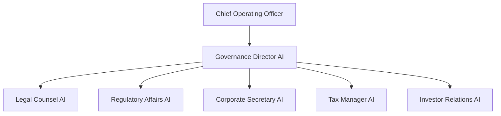
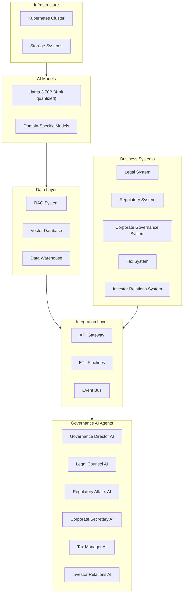
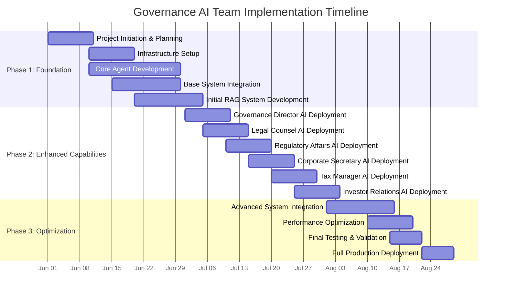
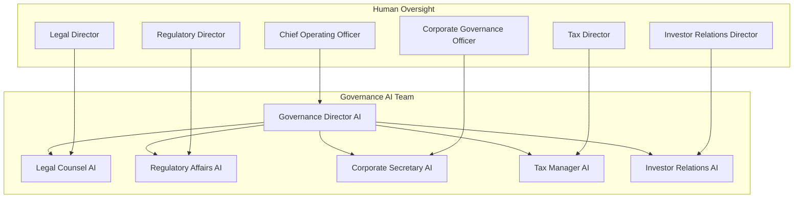

# Governance AI Strategy

## 1. Executive Summary

This strategy outlines the approach for implementing an AI-powered Governance Team focused on legal affairs, regulatory compliance, corporate governance, tax compliance, and investor relations. The Governance AI Team will report to the Chief Operating Officer (COO) and will be responsible for optimizing governance functions across the organization.

The Governance AI Team will leverage advanced AI technologies, including Llama 3 70B (4-bit quantized) models and a comprehensive RAG system, to automate and enhance governance processes. The implementation will follow an accelerated timeline of 2-3 months, leveraging Software Engineering AI Agents for development and deployment.

Key benefits include:
- Enhanced legal document review and contract management
- Improved regulatory compliance and reporting
- Streamlined corporate governance processes
- Optimized tax compliance and planning
- Significant cost savings compared to traditional governance staffing

## 2. Team Structure

### 2.1 Team Overview

The Governance AI Team will consist of specialized AI agents focused on legal affairs, regulatory compliance, corporate governance, tax compliance, and investor relations. The team will be led by a Governance Director AI that reports directly to the COO.

### 2.2 Agent Roles and Responsibilities

#### Governance Director AI
- Reports to the Chief Operating Officer
- Oversees all governance functions
- Coordinates activities across governance domains
- Provides strategic governance insights and recommendations
- Ensures alignment with organizational objectives
- Manages governance risk and performance

#### Legal Counsel AI
- Reports to the Governance Director AI
- Provides legal guidance and opinions
- Reviews and drafts legal documents and contracts
- Manages intellectual property matters
- Monitors legal risks and compliance
- Coordinates with external legal counsel

#### Regulatory Affairs AI
- Reports to the Governance Director AI
- Manages regulatory filing requirements
- Prepares government reports and submissions
- Ensures compliance with reporting deadlines
- Monitors changes in reporting requirements
- Coordinates with regulatory agencies

#### Corporate Secretary AI
- Reports to the Governance Director AI
- Prepares board meeting materials and presentations
- Manages board communications and notifications
- Maintains corporate records and documentation
- Ensures compliance with corporate bylaws
- Coordinates shareholder communications

#### Tax Manager AI
- Reports to the Governance Director AI
- Manages tax filing requirements and deadlines
- Prepares tax returns and supporting documentation
- Ensures compliance with tax regulations
- Monitors tax law changes and impacts
- Coordinates with tax authorities

#### Investor Relations AI
- Reports to the Governance Director AI
- Manages investor communications and inquiries
- Prepares investor presentations and reports
- Coordinates earnings calls and investor meetings
- Monitors investor sentiment and feedback
- Ensures compliance with disclosure requirements

## 3. Functional Requirements

### 3.1 Core Capabilities

#### Legal Affairs Management
- Provide legal guidance and opinions
- Review and draft legal documents and contracts
- Manage intellectual property matters
- Patent Portfolio Management
  - Patent application preparation and filing
  - Patent prosecution management
  - Patent portfolio analysis and valuation
  - Patent licensing and monetization
  - Competitive patent landscape monitoring
- Monitor legal risks and compliance
- Coordinate with external legal counsel
- Generate legal status reports

#### Regulatory Compliance and Reporting
- Manage regulatory filing requirements
- Prepare government reports and submissions
- Ensure compliance with reporting deadlines
- Monitor changes in reporting requirements
- Coordinate with regulatory agencies
- Generate regulatory reporting status updates

#### Corporate Governance
- Prepare board meeting materials and presentations
- Manage board communications and notifications
- Maintain corporate records and documentation
- Ensure compliance with corporate bylaws
- Coordinate shareholder communications
- Generate corporate governance reports

#### Tax Compliance
- Manage tax filing requirements and deadlines
- Prepare tax returns and supporting documentation
- Ensure compliance with tax regulations
- Monitor tax law changes and impacts
- Coordinate with tax authorities
- Generate tax compliance reports

#### Investor Relations
- Manage investor communications and inquiries
- Prepare investor presentations and reports
- Coordinate earnings calls and investor meetings
- Monitor investor sentiment and feedback
- Ensure compliance with disclosure requirements
- Generate investor relations metrics and reports

### 3.2 Deliverables

#### Legal Affairs Reports
- Contract status and expiration reports
- Legal risk assessment and mitigation plans
- Intellectual property portfolio reports
- Patent portfolio management reports
  - Patent application status tracking
  - Patent prosecution timeline and milestone reports
  - Patent portfolio valuation and ROI analysis
  - Licensing revenue and opportunity reports
  - Competitive patent landscape analysis
- Litigation status and exposure reports
- Legal compliance monitoring reports
- Legal department performance metrics

#### Regulatory Filings and Reports
- Regulatory filing calendars and status reports
- Completed regulatory submissions and filings
- Regulatory compliance status reports
- Regulatory change impact assessments
- Regulatory agency communication logs
- Regulatory reporting efficiency metrics

#### Corporate Governance Documents
- Board meeting agendas and materials
- Board meeting minutes and resolutions
- Corporate governance compliance reports
- Shareholder communications and materials
- Corporate record maintenance reports
- Governance best practice recommendations

#### Tax Documentation
- Tax filing calendars and status reports
- Completed tax returns and supporting documentation
- Tax compliance status reports
- Tax law change impact assessments
- Tax planning recommendations
- Tax efficiency metrics and benchmarks

#### Investor Relations Materials
- Investor presentations and reports
- Earnings call scripts and materials
- Investor meeting summaries
- Investor sentiment analysis reports
- Disclosure compliance reports
- Investor relations performance metrics

### 3.3 Integration Requirements

#### Business System Integration

- **Legal and Compliance System Integration**
  - Contract management system integration
  - Regulatory compliance system integration
  - Corporate governance system integration
  - Intellectual property management integration
  - Litigation management integration

- **Tax System Integration**
  - Tax preparation system integration
  - Tax compliance monitoring system integration
  - Tax planning system integration
  - Tax authority reporting system integration

#### Cross-Team Integration

- **Core Operations Team Integration**
  - Provide legal guidance for procurement and contracts
  - Ensure regulatory compliance for operational activities
  - Support tax planning for operational decisions
  - Coordinate corporate governance for operational reporting

- **Administrative Operations Team Integration**
  - Ensure legal compliance for HR policies and procedures
  - Coordinate regulatory compliance with policy management
  - Support financial reporting with governance requirements
  - Align tax compliance with financial management

## 4. Technical Architecture

### 4.1 Infrastructure Overview

### 4.2 System Components

#### Core Infrastructure

- **Kubernetes Cluster**
  - Leverages existing consolidated AI infrastructure
  - Deployed on AMD AI HX 370 nodes for compute-intensive workloads
  - Containerized microservices architecture for governance functions
  - Horizontal scaling based on workload demands

- **Storage Systems**
  - Object storage for documents, reports, and governance data
  - Relational databases for transactional data
  - Time-series databases for governance metrics and monitoring
  - Persistent volumes for application state and configurations

#### AI Models

- **Primary LLM**
  - Llama 3 70B (4-bit quantized)
  - Fine-tuned for legal, regulatory, corporate governance, tax, and investor relations domains
  - Specialized for governance document processing, analysis, and generation

- **Domain-Specific Models**
  - Legal document analysis and contract review models
  - Regulatory compliance assessment models
  - Corporate governance evaluation models
  - Tax planning and optimization models
  - Investor sentiment analysis models

### 4.3 Data Architecture

- **RAG System**
  - Comprehensive knowledge base for governance domains
  - Legal precedents and case law
  - Regulatory requirements and frameworks
  - Corporate governance best practices
  - Tax regulations and guidelines
  - Investor relations standards and practices

- **Vector Database**
  - Document embeddings for semantic search
  - Legal document and contract vectors
  - Regulatory filing and compliance vectors
  - Corporate governance document vectors
  - Tax document and filing vectors
  - Investor communication vectors

- **Data Warehouse**
  - Consolidated governance data repository
  - Historical legal and regulatory data
  - Corporate governance records
  - Tax filing history and data
  - Investor relations metrics and data
  - Analytical datasets for reporting and analysis

### 4.4 Integration Architecture

- **API Gateway**
  - Unified interface for business system integration
  - Authentication and authorization services
  - Rate limiting and request validation
  - API versioning and documentation
  - Monitoring and logging

- **ETL Pipelines**
  - Data extraction from business systems
  - Data transformation and normalization
  - Data loading to governance data stores
  - Data quality validation and enrichment
  - Metadata management and lineage tracking

- **Event Bus**
  - Real-time event distribution and processing
  - Event-driven architecture for governance workflows
  - Asynchronous communication between components
  - Event filtering and routing
  - Event persistence and replay capabilities

### 4.5 Business System Integration

- **Legal System Integration**
  - Contract management system integration
  - Legal case management integration
  - Intellectual property management integration
  - Legal research database integration
  - External counsel management integration

- **Regulatory System Integration**
  - Regulatory filing system integration
  - Compliance management system integration
  - Regulatory change management integration
  - Regulatory reporting system integration
  - Regulatory agency communication integration

- **Corporate Governance System Integration**
  - Board management system integration
  - Corporate records management integration
  - Shareholder management system integration
  - Corporate filing system integration
  - Governance risk management integration

- **Tax System Integration**
  - Tax preparation system integration
  - Tax compliance monitoring integration
  - Tax planning system integration
  - Tax authority reporting integration
  - Tax document management integration

- **Investor Relations System Integration**
  - Investor communication system integration
  - Earnings announcement system integration
  - Investor meeting management integration
  - Disclosure management system integration
  - Investor sentiment monitoring integration

## 5. Implementation Approach

### 5.1 Implementation Timeline

The Governance AI Team implementation will follow an accelerated timeline of 2-3 months, leveraging Software Engineering AI Agents for development and deployment. This approach allows for rapid implementation while ensuring thorough testing and validation.

### 5.2 Implementation Phases

#### Phase 1: Foundation (Weeks 1-4)

- **Project Initiation & Planning**
  - Define detailed project scope and requirements
  - Establish project governance and communication plan
  - Identify key stakeholders and integration points
  - Define success criteria and performance metrics

- **Infrastructure Setup**
  - Configure Kubernetes environment for Governance AI Team
  - Set up storage systems and databases
  - Establish monitoring and logging infrastructure
  - Configure security controls and access management

- **Core Agent Development**
  - Develop Governance Director AI agent
  - Implement Legal Counsel AI agent
  - Create base Regulatory Affairs AI agent
  - Develop initial Corporate Secretary AI agent
  - Implement foundational Tax Manager AI agent
  - Develop initial Investor Relations AI agent

- **Base System Integration**
  - Establish API gateway and integration framework
  - Implement initial legal system integration
  - Set up basic regulatory system integration
  - Configure event bus for system communication

- **Initial RAG System Development**
  - Create knowledge base structure and taxonomy
  - Populate core legal and regulatory documents
  - Implement basic document retrieval and question answering
  - Develop initial vector embeddings for governance documents

#### Phase 2: Enhanced Capabilities (Weeks 5-8)

- **Governance Director AI Deployment**
  - Deploy comprehensive governance planning capabilities
  - Implement governance performance monitoring
  - Develop governance risk assessment functionality
  - Configure cross-functional coordination capabilities

- **Legal Counsel AI Deployment**
  - Implement legal guidance and opinion capabilities
  - Deploy contract review and drafting functionality
  - Develop intellectual property management
  - Configure legal risk monitoring

- **Regulatory Affairs AI Deployment**
  - Implement regulatory filing management
  - Deploy government reporting capabilities
  - Develop regulatory deadline monitoring
  - Configure regulatory change tracking

- **Corporate Secretary AI Deployment**
  - Implement board meeting materials preparation
  - Deploy board communication management
  - Develop corporate records maintenance
  - Configure shareholder communication coordination

- **Tax Manager AI Deployment**
  - Implement tax filing management
  - Deploy tax return preparation capabilities
  - Develop tax compliance monitoring
  - Configure tax law change tracking

- **Investor Relations AI Deployment**
  - Implement investor communication management
  - Deploy investor presentation preparation
  - Develop earnings call coordination
  - Configure investor sentiment monitoring

#### Phase 3: Optimization (Weeks 9-10)

- **Advanced System Integration**
  - Enhance legal system integration
  - Optimize regulatory system integration
  - Implement cross-team integration with Core Operations and Administrative teams
  - Configure advanced data synchronization

- **Performance Optimization**
  - Optimize agent response times and accuracy
  - Enhance system scalability and reliability
  - Implement caching and performance improvements
  - Conduct load testing and performance tuning

- **Final Testing & Validation**
  - Conduct comprehensive system testing
  - Validate integration points and data flows
  - Perform user acceptance testing
  - Validate performance against success criteria

- **Full Production Deployment**
  - Complete production deployment
  - Establish ongoing monitoring and support
  - Conduct user training and documentation
  - Implement continuous improvement process

### 5.3 Resource Requirements

#### Hardware Requirements

- **Compute Resources**
  - 1 AMD AI HX 370 node for Governance AI Team
  - 128GB RAM and 2TB NVMe storage
  - Total compute capacity: 8 CPU cores, 128GB RAM

- **Storage Resources**
  - 5TB object storage for documents and reports
  - 1TB high-performance storage for databases
  - 2TB backup and archival storage

- **Network Resources**
  - 10Gbps internal network connectivity
  - Redundant network paths for high availability
  - Secure VPN access for remote management

#### Software Requirements

- **AI and Machine Learning**
  - Llama 3 70B (4-bit quantized) model
  - Vector database for document embeddings
  - RAG system components and libraries
  - Domain-specific model training frameworks

- **Infrastructure Software**
  - Kubernetes for container orchestration
  - Docker for containerization
  - Prometheus and Grafana for monitoring
  - ELK stack for logging and analysis

- **Integration Software**
  - API gateway and management platform
  - ETL and data integration tools
  - Event bus and message queue system
  - Identity and access management solution

#### Development Resources

- **AI Development Team**
  - 1 AI/ML engineer for model development and fine-tuning
  - 1 software engineer for agent development and integration
  - 0.5 data engineer for data pipeline and storage
  - 0.5 DevOps engineer for infrastructure and deployment

- **Domain Experts**
  - Legal affairs specialist
  - Regulatory compliance expert
  - Corporate governance specialist
  - Tax compliance expert
  - Investor relations specialist

### 5.4 Risk Management

#### Implementation Risks

| Risk | Impact | Probability | Mitigation Strategy |
|------|--------|------------|---------------------|
| Integration complexity with legacy systems | High | Medium | Develop comprehensive integration plan with fallback options |
| Data quality issues affecting agent performance | High | Medium | Implement data validation and cleansing processes |
| Security vulnerabilities in AI systems | High | Low | Conduct regular security assessments and penetration testing |
| Resistance to adoption from human staff | Medium | High | Develop change management and training program |
| Performance issues under peak load | Medium | Medium | Conduct thorough load testing and performance optimization |
| Compliance gaps in automated processes | High | Low | Implement comprehensive compliance validation and auditing |
| Dependency on specific AI models or frameworks | Medium | Medium | Design for model and framework independence where possible |
| Budget or timeline overruns | Medium | Medium | Implement agile development with regular reassessment |

#### Operational Risks

| Risk | Impact | Probability | Mitigation Strategy |
|------|--------|------------|---------------------|
| AI agent making critical governance errors | High | Low | Implement human oversight for critical decisions |
| System downtime affecting governance operations | High | Low | Design for high availability and disaster recovery |
| Data privacy or confidentiality breach | High | Low | Implement comprehensive security controls and encryption |
| Regulatory non-compliance in automated processes | High | Low | Regular compliance audits and validation |
| AI model degradation over time | Medium | Medium | Implement monitoring and regular model retraining |
| Dependency on specific vendor or technology | Medium | Medium | Design for vendor independence and technology flexibility |
| Scalability limitations during growth | Medium | Low | Design architecture for horizontal scaling |
| Knowledge gaps in specialized domains | Medium | Medium | Continuous knowledge base updates and domain expert review |

## 6. Oversight and Control Mechanisms

### 6.1 Governance Structure

### 6.2 Human Oversight Roles

#### Executive Oversight

- **Chief Operating Officer**
  - Ultimate accountability for Governance AI Team performance
  - Approval authority for strategic governance decisions
  - Final escalation point for critical governance issues
  - Quarterly review of Governance AI Team performance
  - Approval of significant governance policy changes

#### Departmental Oversight

- **Legal Director**
  - Day-to-day oversight of Legal Counsel AI
  - Review and approval of legal opinions and documents
  - Validation of contract reviews and drafts
  - Monitoring of legal compliance and performance
  - Escalation point for legal issues

- **Regulatory Director**
  - Day-to-day oversight of Regulatory Affairs AI
  - Review and approval of regulatory filings and reports
  - Validation of regulatory compliance assessments
  - Monitoring of regulatory performance metrics
  - Escalation point for regulatory issues

- **Corporate Governance Officer**
  - Day-to-day oversight of Corporate Secretary AI
  - Review and approval of board materials and minutes
  - Validation of corporate records and filings
  - Monitoring of governance performance metrics
  - Escalation point for corporate governance issues

- **Tax Director**
  - Day-to-day oversight of Tax Manager AI
  - Review and approval of tax filings and reports
  - Validation of tax compliance assessments
  - Monitoring of tax performance metrics
  - Escalation point for tax issues

- **Investor Relations Director**
  - Day-to-day oversight of Investor Relations AI
  - Review and approval of investor communications
  - Validation of investor presentations and reports
  - Monitoring of investor relations performance metrics
  - Escalation point for investor relations issues

### 6.3 Decision Authority Matrix

| Decision Type | AI Authority | Human Review Required | Approval Level |
|---------------|-------------|----------------------|---------------|
| **Legal Affairs** | | | |
| Legal opinions | Recommend | Yes | Legal Director |
| Contract review | Recommend | Yes | Legal Director |
| IP management | Recommend | Yes | Legal Director |
| Legal risk assessment | Autonomous | Final review | Legal Director |
| **Regulatory Affairs** | | | |
| Regulatory filings | Recommend | Yes | Regulatory Director |
| Government reports | Recommend | Yes | Regulatory Director |
| Regulatory compliance | Autonomous | Exceptions only | Regulatory Director |
| Regulatory change assessment | Recommend | Yes | Regulatory Director |
| **Corporate Governance** | | | |
| Board materials | Recommend | Yes | Corporate Governance Officer |
| Corporate records | Autonomous | Final review | Corporate Governance Officer |
| Shareholder communications | Recommend | Yes | Corporate Governance Officer |
| Governance compliance | Autonomous | Exceptions only | Corporate Governance Officer |
| **Tax Management** | | | |
| Tax filings | Recommend | Yes | Tax Director |
| Tax compliance | Autonomous | Exceptions only | Tax Director |
| Tax planning | Recommend | Yes | Tax Director |
| Tax authority communications | Recommend | Yes | Tax Director |
| **Investor Relations** | | | |
| Investor communications | Recommend | Yes | Investor Relations Director |
| Earnings materials | Recommend | Yes | Investor Relations Director |
| Investor meeting preparation | Autonomous | Final review | Investor Relations Director |
| Disclosure compliance | Autonomous | Exceptions only | Investor Relations Director |

### 6.4 Approval Workflows

#### Tiered Approval System

- **Tier 1: Autonomous Actions**
  - Routine governance tasks within defined parameters
  - Standard report generation and distribution
  - Data collection and analysis activities
  - Low-risk, repetitive governance tasks
  - System monitoring and maintenance

- **Tier 2: Review and Confirm**
  - AI agent prepares recommendation or draft
  - Human reviewer receives notification with recommendation
  - Reviewer can approve, reject, or modify recommendation
  - AI agent implements approved action
  - Action and approval are logged for audit purposes

- **Tier 3: Collaborative Decision-Making**
  - AI agent identifies decision requirement
  - AI agent prepares analysis and multiple options
  - Human decision-maker reviews options and analysis
  - Collaborative discussion between AI and human
  - Human makes final decision
  - AI agent implements and documents decision

- **Tier 4: Human-Led Decisions**
  - Strategic decisions beyond AI authority
  - High-risk or high-value decisions
  - Novel situations without precedent
  - Decisions with significant human impact
  - AI provides supporting analysis only
  - Human makes and implements decision

### 6.5 Monitoring and Audit

#### Performance Monitoring

- **Real-time Monitoring**
  - Continuous monitoring of AI agent activities and decisions
  - Automated alerts for anomalous behavior or decisions
  - Dashboard visualization of governance metrics
  - Performance tracking against defined KPIs
  - System health and availability monitoring

- **Periodic Reviews**
  - Daily governance performance summaries
  - Weekly exception and incident reports
  - Monthly performance and compliance reviews
  - Quarterly strategic performance assessments
  - Annual comprehensive system audit

#### Audit and Compliance

- **Decision Audit Trail**
  - Comprehensive logging of all AI decisions and actions
  - Documentation of decision rationale and supporting data
  - Traceability from decision to outcome
  - Preservation of approval workflows and authorizations
  - Immutable audit records for compliance purposes

- **Compliance Validation**
  - Regular automated compliance checks
  - Periodic manual compliance reviews
  - External compliance audits as required
  - Continuous monitoring of regulatory changes
  - Proactive compliance risk assessment

### 6.6 Feedback and Improvement

#### Continuous Learning

- **Performance Feedback Loop**
  - Capture feedback on AI agent decisions and recommendations
  - Analyze decision outcomes and accuracy
  - Identify patterns in successful and unsuccessful decisions
  - Incorporate feedback into agent training and configuration
  - Regular model retraining and optimization

- **Knowledge Base Enhancement**
  - Continuous update of governance knowledge base
  - Incorporation of new laws, regulations, and best practices
  - Documentation of edge cases and exceptions
  - Addition of new domain expertise
  - Regular review and validation of knowledge base content

#### Incident Management

- **Incident Detection and Response**
  - Automated detection of governance incidents
  - Immediate notification to appropriate human oversight
  - Structured incident response process
  - Root cause analysis for all significant incidents
  - Implementation of corrective actions

- **Incident Learning**
  - Documentation of all incidents and resolutions
  - Analysis of incident patterns and trends
  - Identification of systemic issues and vulnerabilities
  - Implementation of preventive measures
  - Regular review of incident history and resolution effectiveness

## 7. Cost Analysis

### 7.1 Implementation Costs

#### Hardware Costs

| Item | Quantity | Unit Cost | Total Cost |
|------|----------|-----------|------------|
| AMD AI HX 370 Node | 1 | $1,500 | $1,500 |
| Network Equipment | 1 | $500 | $500 |
| Storage Infrastructure | 1 | $1,000 | $1,000 |
| **Total Hardware** | | | **$3,000** |

#### Development Costs

| Item | Effort (person-weeks) | Rate ($/week) | Total Cost |
|------|----------------------|--------------|------------|
| AI/ML Engineering | 12 | $4,000 | $48,000 |
| Software Engineering | 12 | $3,500 | $42,000 |
| Data Engineering | 6 | $3,500 | $21,000 |
| DevOps Engineering | 6 | $3,500 | $21,000 |
| Domain Expert Consulting | 6 | $4,500 | $27,000 |
| **Total Development** | | | **$159,000** |

#### Training and Integration Costs

| Item | Effort (person-weeks) | Rate ($/week) | Total Cost |
|------|----------------------|--------------|------------|
| System Integration | 4 | $3,500 | $14,000 |
| Knowledge Base Development | 3 | $3,000 | $9,000 |
| User Training | 2 | $2,500 | $5,000 |
| Documentation | 2 | $2,500 | $5,000 |
| **Total Training & Integration** | | | **$33,000** |

#### Total Implementation Costs

| Category | Cost |
|----------|------|
| Hardware | $3,000 |
| Development | $159,000 |
| Training & Integration | $33,000 |
| **Total Implementation** | **$195,000** |

### 7.2 Operational Costs

#### Annual Infrastructure Costs

| Item | Monthly Cost | Annual Cost |
|------|-------------|-------------|
| Cloud/Data Center | $500 | $6,000 |
| Electricity | $200 | $2,400 |
| Maintenance | $100 | $1,200 |
| Backup & Recovery | $100 | $1,200 |
| **Total Infrastructure** | | **$10,800** |

#### Annual Support Costs

| Item | FTE | Annual Cost per FTE | Total Annual Cost |
|------|-----|---------------------|------------------|
| AI/ML Support | 0.2 | $200,000 | $40,000 |
| DevOps Support | 0.1 | $180,000 | $18,000 |
| Domain Expert Support | 0.1 | $220,000 | $22,000 |
| **Total Support** | | | **$80,000** |

#### Annual Licensing Costs

| Item | Monthly Cost | Annual Cost |
|------|-------------|-------------|
| Software Licenses | $300 | $3,600 |
| API Services | $200 | $2,400 |
| Security Services | $100 | $1,200 |
| **Total Licensing** | | **$7,200** |

#### Total Annual Operational Costs

| Category | Annual Cost |
|----------|-------------|
| Infrastructure | $10,800 |
| Support | $80,000 |
| Licensing | $7,200 |
| **Total Annual Operations** | **$98,000** |

### 7.3 Cost Comparison

#### Traditional Governance Team Costs

| Role | Quantity | Annual Cost per FTE | Total Annual Cost |
|------|----------|---------------------|------------------|
| Legal Director | 1 | $200,000 | $200,000 |
| Regulatory Director | 1 | $180,000 | $180,000 |
| Corporate Governance Officer | 1 | $170,000 | $170,000 |
| Tax Director | 1 | $180,000 | $180,000 |
| Investor Relations Director | 1 | $160,000 | $160,000 |
| Legal & Governance Staff | 3 | $70,000 | $210,000 |
| **Total Personnel** | 8 | | **$1,100,000** |

#### Annual Cost Savings

| Category | Traditional Approach | Governance AI Team | Savings |
|----------|----------------------|-------------------|--------|
| Personnel/Support | $1,100,000 | $80,000 | $1,020,000 |
| Infrastructure | $0 | $10,800 | -$10,800 |
| Licensing | $0 | $7,200 | -$7,200 |
| **Total Annual** | **$1,100,000** | **$98,000** | **$1,002,000** |

### 7.4 ROI Analysis

#### First Year ROI

| Category | Amount |
|----------|--------|
| Implementation Costs | $195,000 |
| First Year Operational Costs | $98,000 |
| First Year Total Costs | $293,000 |
| First Year Cost Savings | $1,002,000 |
| First Year Net Savings | $709,000 |
| **First Year ROI** | **242%** |

#### Three-Year ROI

| Category | Year 1 | Year 2 | Year 3 | Total |
|----------|--------|--------|--------|-------|
| Implementation Costs | $195,000 | $0 | $0 | $195,000 |
| Operational Costs | $98,000 | $102,900 | $108,045 | $308,945 |
| Total Costs | $293,000 | $102,900 | $108,045 | $503,945 |
| Cost Savings | $1,002,000 | $1,052,100 | $1,104,705 | $3,158,805 |
| Net Savings | $709,000 | $949,200 | $996,660 | $2,654,860 |
| **ROI** | 242% | 923% | 923% | **527%** |

## 8. Conclusion

### 8.1 Strategic Value

The Governance AI Team represents a transformative approach to corporate governance that delivers substantial benefits:

- **Governance Excellence**: AI-driven legal affairs, regulatory compliance, corporate governance, tax compliance, and investor relations will dramatically improve governance efficiency, accuracy, and risk management.

- **Cost Efficiency**: With a projected first-year ROI of 242% and a three-year ROI of 527%, the financial case for implementation is compelling, offering over $1 million in annual cost savings.

- **Risk Mitigation**: Enhanced ability to identify, assess, and mitigate legal, regulatory, and governance risks through proactive monitoring and analysis.

- **Regulatory Compliance**: Improved capacity to maintain compliance with complex and evolving regulatory frameworks across multiple jurisdictions.

- **Stakeholder Confidence**: Strengthened investor and stakeholder relations through consistent, accurate, and transparent governance practices.

### 8.2 Integration with Other AI Teams

The Governance AI Team is designed to work in concert with the Core Operations AI Team and the Administrative Operations AI Team:

- **Core Operations Integration**: Ensuring operational activities align with legal requirements, regulatory frameworks, and corporate governance standards.

- **Administrative Operations Integration**: Coordinating policy development, compliance monitoring, and financial governance across administrative functions.

- **Unified Data Architecture**: A common data platform enables cross-functional insights and coordinated decision-making across all governance, administrative, and operational domains.

- **Consistent AI Infrastructure**: Shared AI infrastructure reduces technical overhead and ensures consistent performance across all three teams.

### 8.3 Next Steps

To move forward with implementation of the Governance AI Team:

1. **Executive Approval**: Present this strategy document to executive leadership and the board for approval and funding allocation.

2. **Resource Allocation**: Secure the necessary hardware, software, and human resources for implementation.

3. **Implementation Team Formation**: Assemble the cross-functional team of AI/ML engineers, software developers, data engineers, and legal/governance domain experts.

4. **Detailed Implementation Planning**: Develop a detailed project plan with specific milestones, deliverables, and timelines.

5. **Stakeholder Communication**: Develop a communication plan to inform all stakeholders about the upcoming changes and benefits.

By implementing the Governance AI Team as outlined in this strategy, the organization will position itself at the forefront of corporate governance excellence, leveraging cutting-edge AI technology to drive efficiency, reduce costs, enhance compliance, and mitigate risks across all governance functions.
