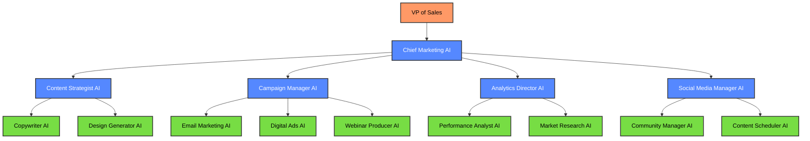
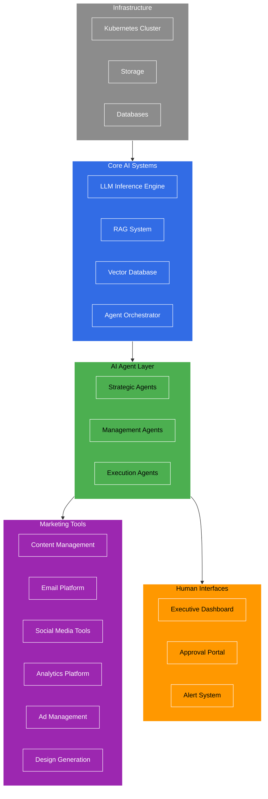
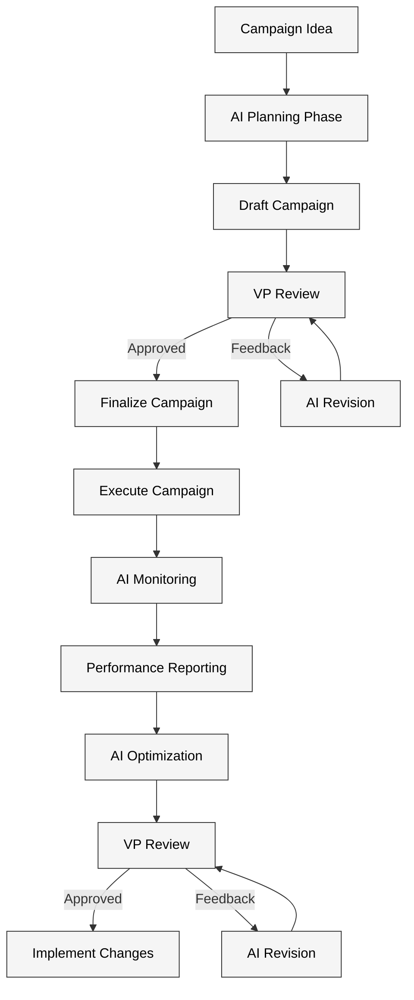
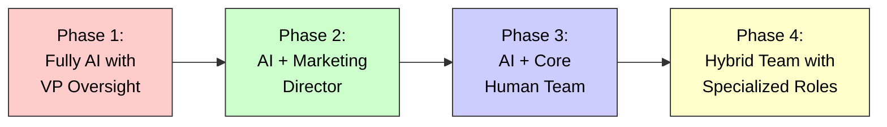

# AI Marketing Team Strategy

## Executive Summary

This document outlines a strategy for implementing an AI-powered marketing team that can operate with minimal human oversight while reporting to the VP of Sales. The proposed solution leverages large language models, specialized AI agents, and automation tools to handle content creation, campaign management, analytics, and social media presence until the organization grows large enough to require human marketing personnel.

## Table of Contents

1. Introduction
2. AI Agent Roles and Hierarchy
3. Functional Requirements
4. Technical Architecture
5. Implementation Approach
6. Oversight and Control Mechanisms
7. Growth and Transition Strategy
8. Cost Analysis
9. Next Steps

## 1. Introduction

### 1.1 Purpose

This strategy document outlines the approach for implementing an AI-powered marketing team that can operate autonomously with transparent oversight from the VP of Sales. The goal is to establish effective marketing operations without immediate human marketing personnel, creating a foundation that can later transition to a hybrid AI-human team as the organization grows.

### 1.2 Business Objectives

- Establish a consistent brand presence across digital channels
- Generate high-quality marketing content and campaigns
- Support sales efforts through lead generation and nurturing
- Provide data-driven insights to inform business strategy
- Minimize operational overhead while maximizing marketing effectiveness
- Create a scalable foundation that can incorporate human marketers in the future

### 1.3 Key Challenges

- Ensuring brand consistency without human oversight
- Maintaining creative quality and relevance
- Adapting to market changes and competitive dynamics
- Integrating with sales processes and systems
- Establishing appropriate approval workflows and safeguards
- Planning for eventual transition to a hybrid AI-human team

## 2. AI Agent Roles and Hierarchy

### 2.1 Agent Hierarchy

### 2.2 Agent Roles and Responsibilities

#### Strategic Layer

**Chief Marketing AI**
- Coordinates all marketing activities
- Develops overall marketing strategy
- Allocates resources across initiatives
- Reports to VP of Sales with clear metrics and recommendations
- Ensures brand consistency across all channels

#### Management Layer

**Content Strategist AI**
- Plans content calendar and themes
- Ensures content aligns with business objectives
- Manages content production workflow
- Maintains content quality standards

**Campaign Manager AI**
- Designs integrated marketing campaigns
- Coordinates campaign execution across channels
- Monitors campaign performance
- Optimizes campaigns based on results

**Analytics Director AI**
- Collects and analyzes marketing data
- Identifies trends and opportunities
- Generates actionable insights
- Creates performance reports for VP of Sales

**Social Media Manager AI**
- Develops social media strategy
- Manages brand presence across platforms
- Monitors social conversations
- Identifies engagement opportunities

#### Execution Layer

**Copywriter AI**
- Creates written content for various channels
- Adapts messaging for different audiences
- Maintains consistent brand voice
- Generates SEO-optimized content

**Design Generator AI**
- Creates visual assets for marketing materials
- Ensures brand visual consistency
- Generates graphics for social media, web, and email
- Produces basic video content

**Email Marketing AI**
- Designs email campaigns and newsletters
- Segments audience for targeted messaging
- Optimizes email performance
- Manages automated email sequences

**Digital Ads AI**
- Creates and manages digital ad campaigns
- Optimizes ad spend and targeting
- Tests different ad variations
- Monitors ad performance

**Webinar Producer AI**
- Plans webinar content and structure
- Creates presentation materials
- Manages registration and promotion
- Coordinates with human presenters

**Performance Analyst AI**
- Tracks KPIs across marketing initiatives
- Identifies performance gaps
- Recommends optimization strategies
- Creates automated performance dashboards

**Market Research AI**
- Monitors industry trends and competitor activities
- Analyzes customer feedback and preferences
- Identifies market opportunities
- Provides competitive intelligence

**Community Manager AI**
- Engages with audience on social platforms
- Responds to comments and messages
- Identifies potential leads and opportunities
- Escalates complex issues to VP of Sales

**Content Scheduler AI**
- Optimizes posting schedule across channels
- Ensures consistent content distribution
- Adapts scheduling based on performance data
- Maintains content calendar

### 2.3 Human Oversight Points

**VP of Sales Responsibilities**
- Review and approve quarterly marketing strategy
- Set budget constraints and priorities
- Approve campaigns above defined threshold
- Review weekly performance dashboards
- Provide final approval for major brand decisions
- Serve as escalation point for sensitive issues

## 3. Functional Requirements

### 3.1 Core Marketing Capabilities

#### Content Creation

- **Written Content**: Blog posts, whitepapers, case studies, website copy, email content
- **Visual Content**: Social media graphics, infographics, presentation slides, basic video
- **Interactive Content**: Webinars, quizzes, assessments, calculators
- **Technical Content**: Product documentation, technical guides, feature announcements

#### Campaign Management

- **Campaign Planning**: Strategy development, timeline creation, resource allocation
- **Multi-channel Execution**: Coordinated deployment across email, social, web, and ads
- **Performance Tracking**: Real-time monitoring of campaign metrics
- **Budget Management**: Allocation and optimization of marketing spend

#### Analytics and Reporting

- **Performance Measurement**: Tracking of KPIs across all marketing activities
- **Audience Insights**: Analysis of customer behavior and preferences
- **Competitive Intelligence**: Monitoring of competitor activities and market trends
- **ROI Analysis**: Measurement of marketing impact on business objectives

#### Customer Engagement

- **Social Media Management**: Content creation, scheduling, and engagement
- **Community Building**: Fostering relationships with customers and prospects
- **Lead Nurturing**: Developing relationships with potential customers
- **Customer Feedback**: Collecting and analyzing customer input

### 3.2 AI-Specific Requirements

#### Autonomous Operation

- **Self-optimization**: Ability to learn from performance data and improve over time
- **Adaptive Planning**: Adjusting strategies based on market changes and results
- **Resource Management**: Efficient allocation of computational resources
- **Error Recovery**: Identifying and addressing issues without human intervention

#### Human Oversight

- **Approval Workflows**: Clear processes for human review and approval
- **Transparency**: Visibility into AI decision-making and actions
- **Override Mechanisms**: Ability for VP of Sales to modify or halt activities
- **Escalation Protocols**: Clear criteria for when human input is required

#### Learning and Improvement

- **Performance Analysis**: Continuous evaluation of marketing effectiveness
- **Knowledge Acquisition**: Ongoing learning about industry and audience
- **Skill Development**: Expanding capabilities based on business needs
- **Feedback Integration**: Incorporating human feedback into future activities

### 3.3 Integration Requirements

- **CRM Integration**: Bidirectional sync with CRM system for lead data
- **Sales Enablement**: Support for sales team with content and insights
- **Website Management**: Content updates and performance optimization
- **Analytics Platforms**: Connection to data sources for performance tracking
- **Ad Platforms**: Integration with digital advertising systems
- **Email Marketing Tools**: Connection to email delivery systems
- **Social Media Platforms**: API integration with major social networks
- **Design Tools**: Integration with design and creative platforms

## 4. Technical Architecture

### 4.1 System Overview

### 4.2 Hardware Requirements

| Component | Specification | Quantity | Purpose |
|-----------|--------------|----------|----------|
| Server Nodes | AMD AI HX 370 | 2 | AI agent inference and orchestration |
| Memory | 64GB DDR5 | Per server | Model inference and application hosting |
| Storage | 4TB NVMe SSD | Per server | Knowledge base and asset storage |
| AI Accelerator | Dedicated AI compute engine | Per server | Large model inference acceleration |
| Network | 10GbE | Per server | Cluster communication |
| CDN Integration | Cloud CDN | 1 | Content delivery and caching |

### 4.3 Software Components

#### Core AI Systems

| Component | Technology | Purpose |
|-----------|------------|----------|
| LLM Engine | Llama 3 70B | Primary reasoning and content generation |
| RAG Framework | LlamaIndex | Knowledge retrieval and augmentation |
| Vector Database | Chroma | Knowledge embedding storage |
| Agent Orchestrator | Custom Framework | Coordination between AI agents |
| Kubernetes | K8s 1.29+ | Container orchestration |

#### Marketing Tools

| Component | Technology | Purpose |
|-----------|------------|----------|
| Content Management | Headless CMS | Website and content management |
| Email Platform | API-based Email Service | Email campaign execution |
| Social Media | Platform APIs | Social media management |
| Analytics | Custom Dashboard + GA4 | Performance tracking |
| Ad Management | Platform APIs | Digital advertising management |
| Design Generation | Stable Diffusion + DALL-E | Visual content creation |

#### Human Interface Systems

| Component | Technology | Purpose |
|-----------|------------|----------|
| Executive Dashboard | React + D3.js | Performance visualization for VP |
| Approval Portal | React Application | Review and approval interface |
| Alert System | Push Notifications | Critical issues notification |
| Audit Trail | Event Logging | Record of all AI actions |

### 4.4 Data Architecture

#### Knowledge Base Components

- **Brand Guidelines**: Visual identity, tone of voice, messaging frameworks
- **Product Information**: Features, benefits, use cases, technical specifications
- **Market Intelligence**: Competitor analysis, industry trends, customer research
- **Content Library**: Previous marketing assets, templates, and resources
- **Performance Data**: Historical campaign results and analytics

#### Data Flow

```mermaid
flowchart LR
    sources["Data Sources"] --> ingest["Data Ingestion"]
    ingest --> process["Processing Pipeline"]
    process --> store["Storage Layer"]
    store --> vector["Vector Embeddings"]
    store --> analytics["Analytics Engine"]
    vector --> rag["RAG System"]
    analytics --> insights["Insights Generation"]
    rag --> agents["AI Agents"]
    insights --> agents
    agents --> actions["Marketing Actions"]
    actions --> results["Performance Data"]
    results --> sources
    
    style sources fill:#f5f5f5,stroke:#333,stroke-width:1px,color:black
    style ingest fill:#f5f5f5,stroke:#333,stroke-width:1px,color:black
    style process fill:#f5f5f5,stroke:#333,stroke-width:1px,color:black
    style store fill:#f5f5f5,stroke:#333,stroke-width:1px,color:black
    style vector fill:#f5f5f5,stroke:#333,stroke-width:1px,color:black
    style analytics fill:#f5f5f5,stroke:#333,stroke-width:1px,color:black
    style rag fill:#f5f5f5,stroke:#333,stroke-width:1px,color:black
    style insights fill:#f5f5f5,stroke:#333,stroke-width:1px,color:black
    style agents fill:#f5f5f5,stroke:#333,stroke-width:1px,color:black
    style actions fill:#f5f5f5,stroke:#333,stroke-width:1px,color:black
    style results fill:#f5f5f5,stroke:#333,stroke-width:1px,color:black
```

### 4.5 Security and Compliance

- **Access Control**: Role-based access with principle of least privilege
- **Data Protection**: Encryption at rest and in transit
- **Audit Logging**: Comprehensive logging of all system actions
- **Approval Workflows**: Multi-level approval for sensitive operations
- **Content Safeguards**: AI-generated content review mechanisms
- **Brand Protection**: Automated brand guideline enforcement
- **Compliance Checks**: Regulatory compliance verification for marketing materials

## 5. Implementation Approach

### 5.1 Phased Rollout Strategy

#### Phase 1: Foundation (Months 1-2)

- Deploy core infrastructure and AI systems
- Implement Chief Marketing AI and Analytics Director AI
- Establish brand guidelines and knowledge base
- Create executive dashboard for VP of Sales
- Set up approval workflows and security controls

#### Phase 2: Content Production (Months 3-4)

- Implement Content Strategist AI and execution agents
- Develop content creation and management workflows
- Establish website and blog management capabilities
- Create initial content library and templates
- Train AI on brand voice and messaging

#### Phase 3: Campaign Execution (Months 5-6)

- Implement Campaign Manager AI and execution agents
- Establish email marketing and social media capabilities
- Develop campaign planning and execution workflows
- Integrate with CRM and sales systems
- Create campaign performance tracking

#### Phase 4: Optimization (Months 7-8)

- Implement advanced analytics and optimization
- Develop A/B testing and performance improvement systems
- Enhance personalization capabilities
- Implement advanced audience segmentation
- Establish continuous learning mechanisms

### 5.2 Knowledge Base Development

#### Initial Knowledge Requirements

1. **Brand Foundation**
   - Brand identity and visual guidelines
   - Tone of voice and messaging frameworks
   - Target audience personas and segments
   - Value propositions and positioning statements

2. **Product Knowledge**
   - Product features and specifications
   - Use cases and customer success stories
   - Competitive differentiators
   - Pricing and packaging information

3. **Market Intelligence**
   - Competitor analysis and positioning
   - Industry trends and market dynamics
   - Customer pain points and needs
   - Regulatory and compliance considerations

#### Knowledge Acquisition Process

1. **Initial Seeding**: VP of Sales provides core brand and product information
2. **Document Ingestion**: Processing of existing marketing materials
3. **External Research**: AI-driven research on industry and competitors
4. **Continuous Learning**: Ongoing acquisition of new information
5. **Knowledge Refinement**: Regular review and updating of knowledge base

### 5.3 Integration Strategy

#### CRM Integration

- Bidirectional sync with CRM system
- Lead scoring and qualification
- Campaign attribution tracking
- Customer journey mapping

#### Website Integration

- Content management system connection
- Landing page creation and optimization
- Form submission processing
- SEO management and monitoring

#### Analytics Integration

- Google Analytics and other tracking tools
- Custom dashboard creation
- Attribution modeling
- Conversion tracking

#### Ad Platform Integration

- Google Ads, LinkedIn, Facebook, etc.
- Campaign creation and management
- Budget allocation and optimization
- Performance tracking and reporting

## 6. Oversight and Control Mechanisms

### 6.1 Approval Workflows

#### Content Approval Tiers

| Content Type | Approval Level | Approver | Turnaround Time |
|--------------|---------------|----------|------------------|
| Social Media Posts | Low | Automated with spot checks | 1 hour |
| Blog Posts | Medium | VP of Sales review | 24 hours |
| Whitepapers/Case Studies | High | VP of Sales + Subject Matter Expert | 48 hours |
| Campaign Strategy | Critical | VP of Sales + Executive Team | 1 week |

#### Campaign Approval Process

### 6.2 Transparency Mechanisms

#### Executive Dashboard

The VP of Sales will have access to a comprehensive dashboard showing:

- **Activity Feed**: Real-time view of all AI marketing activities
- **Content Calendar**: Upcoming and scheduled content
- **Campaign Overview**: Active and planned campaigns
- **Performance Metrics**: Key marketing KPIs and trends
- **Budget Tracking**: Marketing spend and allocation
- **Approval Queue**: Items requiring review and approval

#### Audit and Logging

- **Action Logs**: Comprehensive record of all AI actions
- **Decision Trails**: Documentation of AI decision-making processes
- **Version Control**: History of content revisions and approvals
- **Performance Records**: Historical data on marketing activities

### 6.3 Risk Management

#### Content Safeguards

- **Brand Compliance**: Automated checking against brand guidelines
- **Factual Accuracy**: Verification of claims and statements
- **Sensitivity Review**: Screening for potentially problematic content
- **Legal Compliance**: Checking for regulatory and legal issues

#### Operational Safeguards

- **Budget Controls**: Spending limits and approval thresholds
- **Escalation Triggers**: Automatic flagging of potential issues
- **Emergency Stop**: Ability to halt all marketing activities
- **Backup Systems**: Redundancy for critical functions

## 7. Growth and Transition Strategy

### 7.1 Scaling the AI Marketing Team

#### Capacity Expansion

- **Horizontal Scaling**: Adding more server nodes for increased capacity
- **Capability Expansion**: Adding new AI agent types for specialized functions
- **Knowledge Enhancement**: Expanding the knowledge base for new markets or products
- **Integration Growth**: Connecting to additional marketing platforms and tools

#### Performance Optimization

- **Model Refinement**: Fine-tuning AI models based on performance data
- **Process Improvement**: Optimizing workflows and decision processes
- **Resource Allocation**: Adjusting computational resources based on needs
- **Automation Expansion**: Increasing the scope of automated activities

### 7.2 Transition to Hybrid Team

#### Human Role Integration

As the organization grows, human marketers can be integrated into the AI team in the following roles:

1. **Marketing Director**: Overall strategy and AI team oversight
2. **Creative Director**: Creative vision and high-level content direction
3. **Campaign Strategist**: Complex campaign planning and optimization
4. **Content Specialist**: Premium content creation and editorial oversight
5. **Analytics Expert**: Advanced analysis and strategic insights

#### Transition Process

#### AI-Human Collaboration Model

| Function | Initial AI Role | Human Integration | Final Hybrid Model |
|----------|----------------|-------------------|--------------------|
| Strategy | Full autonomy with approval | Human-led with AI support | Collaborative development |
| Content Creation | Complete generation | Human creative direction | AI drafting with human refinement |
| Campaign Execution | Full management | Human oversight | AI execution with human strategy |
| Analytics | Automated reporting | Human interpretation | AI insights with human strategy |
| Customer Engagement | Automated responses | Human handling of complex cases | Tiered engagement model |

### 7.3 Organizational Integration

#### Reporting Structure Evolution

1. **Initial**: All AI agents report to VP of Sales
2. **Intermediate**: AI agents report to Marketing Director, who reports to VP of Sales
3. **Mature**: Hybrid team with specialized departments, Marketing Director reports to VP of Sales

#### Knowledge Transfer

- **AI to Human**: Documentation and training on AI capabilities and processes
- **Human to AI**: Incorporation of human expertise into AI knowledge base
- **Collaborative Learning**: Shared insights and continuous improvement

## 8. Cost Analysis

### 8.1 Implementation Costs

#### Hardware and Infrastructure

| Item | Unit Cost | Quantity | Total Cost |
|-----------|--------------|----------|------------|
| AMD AI HX 370 Nodes (64GB RAM, 2TB NVMe) | $1,300 | 2 | $2,600 |
| Network Infrastructure | $100 | 1 | $100 |
| **Total Hardware** | | | **$2,700** |

*Note: Hardware costs are based on the latest pricing for AMD AI HX 370 nodes with optimized specifications for our AI workloads.*

#### Implementation Costs with AI-Assisted Development

Implementation costs are based on using AI-assisted development tools and the Software Engineering AI Team, which significantly reduce development time and resources compared to traditional development approaches. This approach allows us to achieve approximately 20% of the cost of traditional human-led development while maintaining high quality through dedicated testing phases.

| Activity | Cost |
|----------|------|
| **Infrastructure Setup and Configuration** | |
| Kubernetes cluster configuration | $1,200 |
| Network and security setup | $400 |
| Monitoring implementation | $400 |
| **AI Agent Development** | |
| Core agent framework | $3,000 |
| Specialized SEO and Advertising agents | $1,000 |
| Agent orchestration system | $2,000 |
| **Knowledge Base Development** | |
| Base knowledge structure | $2,000 |
| SEO and advertising domain knowledge | $600 |
| Knowledge retrieval optimization | $1,000 |
| **Integration Development** | |
| CRM integration | $1,200 |
| Ad platform integrations | $1,600 |
| Analytics and reporting integrations | $1,000 |
| SEO tool integrations | $600 |
| **Dashboard and Interface Development** | |
| Executive dashboard | $1,000 |
| Approval workflows | $800 |
| Reporting interfaces | $600 |
| **Testing and Optimization** | |
| Automated testing framework | $1,000 |
| Performance testing | $1,000 |
| User acceptance testing | $1,000 |
| **Security and Compliance** | |
| Security controls | $400 |
| Compliance verification | $200 |
| **Total Implementation** | **$22,000** |

*Note: Implementation costs reflect a 62% reduction from the original estimate of $58,000 due to the use of AI-assisted development tools and the Software Engineering AI Team.*

#### Operational Costs (Annual)

| Category | Annual Cost |
|----------|------------|
| **Infrastructure Costs** | |
| Server hosting (2x AMD AI HX 370 nodes) | $3,000 |
| Network and CDN costs | $1,200 |
| Storage and backup | $600 |
| **Subtotal** | **$4,800** |
| **AI System Maintenance** | |
| Model updates and fine-tuning | $2,800 |
| Knowledge base maintenance | $5,600 |
| Ongoing development and optimization | $12,800 |
| **Subtotal** | **$21,200** |
| **Third-Party Services** | |
| SEO tools and data sources | $3,600 |
| Ad platform APIs and management tools | $4,800 |
| Analytics and reporting services | $2,400 |
| Content distribution services | $1,200 |
| **Subtotal** | **$12,000** |
| **Security and Compliance** | |
| Security monitoring and updates | $1,200 |
| Compliance verification | $800 |
| **Subtotal** | **$2,000** |
| **Total Annual Operations** | **$40,000** |

*Note: Operational costs include all necessary maintenance, updates, and third-party services required for the AI marketing team to function effectively.*

### 8.2 Cost Comparison

#### AI Marketing Team vs. Traditional Team

| Expense Category | AI Marketing Team | Traditional Team | Savings |
|------------------|-------------------|-----------------|----------|
| Salaries | $0 | $625,000 | $625,000 |
| Benefits | $0 | $187,500 | $187,500 |
| Technology | $40,000 | $50,000 | $10,000 |
| Office Space | $0 | $70,000 | $70,000 |
| Training | $0 | $30,000 | $30,000 |
| **Total Annual** | **$40,000** | **$962,500** | **$922,500** |

*Traditional team assumes 7 marketing professionals including content specialists, SEO specialist, PPC/advertising specialist, social media manager, marketing analysts, and marketing director with a combined salary of $625,000.*

### 8.3 ROI Analysis

#### First Year ROI

| Metric | Value |
|--------|-------|
| Initial Investment | $24,700 (Hardware + Implementation) |
| Year 1 Operational Costs | $40,000 |
| Year 1 Total Costs | $64,700 |
| Year 1 Cost Avoidance | $962,500 |
| Year 1 Net Benefit | $897,800 |
| Year 1 ROI | 1,387% |

#### Three-Year ROI

| Metric | Value |
|--------|-------|
| Total 3-Year Investment | $144,700 (Initial + 3 Years Operations) |
| Total 3-Year Cost Avoidance | $2,887,500 |
| Total 3-Year Net Benefit | $2,742,800 |
| 3-Year ROI | 1,895% |

#### Additional Value Creation

- **24/7 Marketing Operations**: Unlike human teams, the AI marketing team operates continuously
- **Consistent Execution**: Eliminates variability in marketing execution quality
- **Rapid Scaling**: Can handle increased workload without proportional cost increases
- **Data-Driven Optimization**: Continuously improves based on performance data
- **Reduced Management Overhead**: Minimal supervision required from VP of Sales

## 9. Next Steps

### 9.1 Immediate Actions (Next 30 Days)

1. **Infrastructure Planning**: Finalize hardware specifications and procurement plan
2. **Knowledge Gathering**: Begin collecting brand guidelines and product information
3. **Integration Assessment**: Evaluate existing systems for integration requirements
4. **Approval Framework**: Design and validate the approval workflow with VP of Sales
5. **Project Team Assembly**: Form the development and implementation team

### 9.2 Short-Term Milestones (60-90 Days)

1. **Infrastructure Deployment**: Set up Kubernetes cluster and core AI systems
2. **Knowledge Base Creation**: Develop initial knowledge base with brand and product information
3. **Chief Marketing AI Prototype**: Implement basic version of the strategic AI layer
4. **Executive Dashboard**: Create initial version of the VP dashboard
5. **Content Generation Test**: Validate content creation capabilities with sample outputs

### 9.3 Critical Success Factors

1. **Clear Brand Guidelines**: Well-defined brand identity and messaging frameworks
2. **Comprehensive Knowledge Base**: Thorough product and market information
3. **Effective Approval Workflows**: Streamlined processes for VP of Sales oversight
4. **Integration Quality**: Seamless connection with sales and other business systems
5. **Performance Measurement**: Clear metrics for evaluating marketing effectiveness
6. **Adaptability**: Ability to evolve as business needs change

By implementing this AI marketing team strategy, organizations can establish effective marketing operations without immediate human marketing personnel, while maintaining transparent oversight from the VP of Sales and creating a foundation that can later transition to a hybrid AI-human team as the organization grows.
