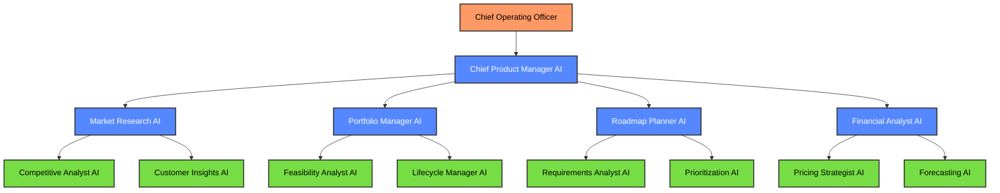
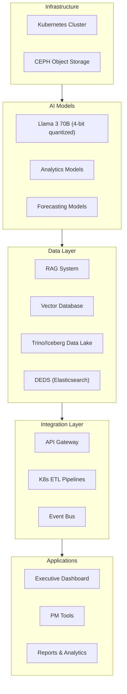
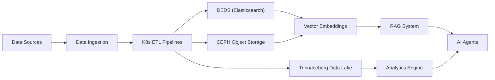
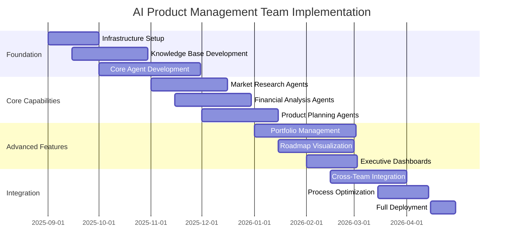
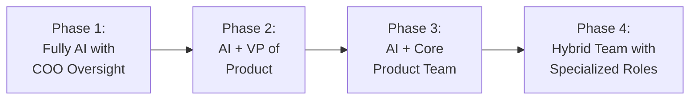

# AI Product Management Team Strategy

## Executive Summary

This document outlines a strategy for implementing an AI-powered product management team that can operate with oversight from the human Chief Operating Officer. The proposed solution leverages large language models, specialized AI agents, and automation tools to handle product research, market analysis, roadmap planning, and product lifecycle management until the organization grows large enough to require additional human product management personnel.

The AI Product Management Team will complement the existing AI teams (Engineering, Sales, Technical Support, and Marketing) by providing strategic product direction, market insights, and coordinated product development planning across the organization.

## Table of Contents

1. Introduction
2. AI Agent Roles and Hierarchy
3. Functional Requirements
4. Technical Architecture
5. Implementation Approach
6. Oversight and Control Mechanisms
7. Growth and Transition Strategy
8. Cost Analysis
9. Next Steps

## 1. Introduction

### 1.1 Purpose

This strategy document outlines the approach for implementing an AI-powered product management team that can operate with oversight from the Chief Operating Officer. The goal is to establish effective product management operations that can scale with the organization's growth while ensuring products are market-driven, financially viable, and aligned with company strategy.

### 1.2 Business Objectives

- Establish data-driven product strategy and roadmap processes
- Create standardized product management artifacts and methodologies
- Support business decisions with market research and competitive analysis
- Optimize product portfolio for maximum market impact and profitability
- Minimize operational overhead while maximizing product management effectiveness
- Create a scalable foundation that can incorporate human product managers in the future

### 1.3 Key Challenges

- Ensuring product decisions are aligned with market needs without human intuition
- Balancing innovation with practical market constraints
- Coordinating cross-functional requirements across engineering, sales, and marketing
- Establishing appropriate approval workflows for strategic product decisions
- Maintaining competitive awareness and industry trend monitoring
- Planning for eventual transition to a hybrid AI-human product management team

## 2. AI Agent Roles and Hierarchy

### 2.1 Agent Hierarchy

### 2.2 Agent Roles and Responsibilities

#### Strategic Layer

**Chief Product Manager AI**
- Coordinates all product management activities
- Develops overall product strategy and vision
- Allocates resources across product initiatives
- Reports to COO with clear metrics and recommendations
- Ensures product decisions align with company strategy
- Orchestrates communication between product teams and other departments

#### Management Layer

**Market Research AI**
- Conducts comprehensive market analysis
- Identifies market trends and opportunities
- Monitors competitive landscape
- Synthesizes customer feedback and needs
- Produces market intelligence reports

**Portfolio Manager AI**
- Manages the complete product portfolio
- Evaluates new product opportunities
- Conducts feasibility studies
- Manages product lifecycle decisions
- Optimizes product mix for market coverage

**Roadmap Planner AI**
- Creates and maintains product roadmaps
- Coordinates cross-functional requirements
- Manages feature prioritization
- Aligns development timelines with market needs
- Communicates roadmap to stakeholders

**Financial Analyst AI**
- Develops pricing strategies
- Creates revenue forecasts and financial models
- Conducts ROI analysis for product investments
- Monitors product financial performance
- Identifies profit optimization opportunities

#### Execution Layer

**Competitive Analyst AI**
- Conducts detailed competitor analysis
- Monitors competitor product changes
- Identifies competitive advantages and gaps
- Creates competitive positioning strategies
- Tracks industry innovations and patents

**Customer Insights AI**
- Analyzes customer feedback and usage data
- Identifies customer needs and pain points
- Segments customers for targeted product development
- Creates user personas and journey maps
- Validates product concepts with market data

**Feasibility Analyst AI**
- Evaluates technical feasibility of product concepts
- Assesses resource requirements for development
- Identifies potential implementation challenges
- Coordinates with Engineering AI for technical validation
- Creates feasibility reports with confidence ratings

**Lifecycle Manager AI**
- Tracks product performance across lifecycle stages
- Recommends product enhancements or retirement
- Manages end-of-life planning
- Identifies product refresh opportunities
- Optimizes product portfolio balance

**Requirements Analyst AI**
- Gathers and documents product requirements
- Translates market needs into technical specifications
- Validates requirements with stakeholders
- Ensures requirements clarity and testability
- Manages requirements traceability

**Prioritization AI**
- Scores and ranks product features
- Applies prioritization frameworks (RICE, MoSCoW, etc.)
- Balances customer value with business impact
- Optimizes for resource constraints
- Recommends feature sequencing

**Pricing Strategist AI**
- Develops pricing models and structures
- Conducts price sensitivity analysis
- Recommends pricing tiers and packaging
- Monitors market pricing trends
- Optimizes pricing for market penetration or profit

**Forecasting AI**
- Creates sales and adoption forecasts
- Models market scenarios and impacts
- Predicts product performance metrics
- Identifies leading indicators for success
- Updates forecasts based on market changes

## 3. Functional Requirements

### 3.1 Core Capabilities

#### Market Research and Analysis

- **Market Sizing and Segmentation**
  - Calculate total addressable market (TAM), serviceable addressable market (SAM), and serviceable obtainable market (SOM)
  - Segment markets by industry, geography, company size, and other relevant dimensions
  - Identify high-value market segments based on growth potential and fit with company capabilities

- **Competitive Intelligence**
  - Monitor competitor product offerings, pricing, and positioning
  - Track competitor news, press releases, and public financial information
  - Analyze competitor strengths, weaknesses, opportunities, and threats (SWOT)
  - Create competitive comparison matrices and battlecards

- **Customer Research**
  - Analyze customer feedback from support tickets, surveys, and sales calls
  - Identify patterns in customer behavior and preferences
  - Create detailed customer personas with needs, pain points, and buying criteria
  - Map customer journeys and identify improvement opportunities

- **Industry Trend Analysis**
  - Monitor industry publications, analyst reports, and research papers
  - Identify emerging technologies and methodologies
  - Track regulatory changes and compliance requirements
  - Forecast industry shifts and their potential impact on product strategy

#### Product Planning and Management

- **Product Strategy Development**
  - Create product vision and mission statements
  - Define product positioning and unique value propositions
  - Develop go-to-market strategies
  - Align product strategy with overall company objectives

- **Product Roadmapping**
  - Create and maintain visual product roadmaps
  - Balance short-term wins with long-term strategic initiatives
  - Coordinate cross-functional dependencies
  - Communicate roadmap changes to stakeholders

- **Requirements Management**
  - Document detailed product requirements
  - Create user stories and acceptance criteria
  - Prioritize features using objective scoring frameworks
  - Manage requirements traceability from market need to implementation

- **Product Lifecycle Management**
  - Track product performance across introduction, growth, maturity, and decline stages
  - Recommend product enhancements, refreshes, or retirement
  - Manage end-of-life planning and customer migration
  - Optimize product portfolio for market coverage and resource efficiency

#### Financial Analysis

- **Pricing Strategy**
  - Develop pricing models (subscription, usage-based, tiered, etc.)
  - Conduct price sensitivity analysis
  - Create competitive pricing benchmarks
  - Optimize pricing for market penetration or profit maximization

- **Revenue Forecasting**
  - Create sales forecasts based on market data and historical performance
  - Model different market scenarios and their financial impact
  - Project customer acquisition, retention, and expansion metrics
  - Calculate customer lifetime value (CLV) and customer acquisition cost (CAC)

- **ROI Analysis**
  - Calculate return on investment for product initiatives
  - Estimate development costs and timeline
  - Project revenue impact of new features or products
  - Analyze payback period and break-even points

### 3.2 Product Management Artifacts

#### Strategic Documents

- **Product Vision and Strategy**
  - Long-term product vision (3-5 years)
  - Strategic objectives and key results (OKRs)
  - Market positioning statement
  - Core value propositions

- **Market Opportunity Assessment**
  - Market size and growth projections
  - Target customer segments
  - Competitive landscape analysis
  - Market entry strategy

- **Product Portfolio Plan**
  - Product line structure and relationships
  - Portfolio gaps and opportunities
  - Product lifecycle status for each offering
  - Portfolio evolution roadmap

#### Tactical Documents

- **Product Requirements Document (PRD)**
  - Detailed feature specifications
  - User stories and acceptance criteria
  - Technical requirements and constraints
  - Success metrics and KPIs

- **Product Roadmap**
  - Feature timeline and release schedule
  - Development priorities and dependencies
  - Resource allocation across initiatives
  - Milestone tracking and status updates

- **Go-to-Market Plan**
  - Launch strategy and timeline
  - Positioning and messaging
  - Sales enablement requirements
  - Marketing campaign coordination

#### Analytical Documents

- **Competitive Analysis**
  - Feature comparison matrix
  - Pricing analysis
  - Positioning map
  - Competitive response scenarios

- **Financial Models**
  - Revenue projections
  - Cost structure analysis
  - Pricing sensitivity models
  - ROI calculations

- **Performance Dashboards**
  - Product usage metrics
  - Revenue and growth tracking
  - Customer acquisition and retention
  - Feature adoption and engagement

## 4. Technical Architecture

### 4.1 Infrastructure Overview

### 4.2 System Components

#### Core Infrastructure

- **Kubernetes Cluster**
  - Leverages the existing consolidated AI infrastructure
  - Deployed on AMD AI HX 370 nodes
  - Containerized microservices architecture
  - Horizontal scaling based on workload demands

- **Storage Systems**
  - Data lake based on Trino, Iceberg, and S3/CEPH object store for time series data and analytics
  - Custom Dynamically Extensible Document Store (DEDS) based on Elasticsearch for product artifacts and JSON documents
  - CEPH object storage for large datasets and market research

- **Data Processing**
  - Custom Kubernetes-based data pipelines for ETL processes
  - Real-time data ingestion and processing
  - Automated data quality validation and enrichment

#### AI Models

- **Primary LLM**
  - Llama 3 70B (4-bit quantized)
  - Fine-tuned for product management tasks
  - Specialized for financial analysis and market research

- **Analytics Models**
  - Time series forecasting models
  - Market segmentation clustering algorithms
  - Sentiment analysis for customer feedback
  - Feature prioritization scoring models

- **RAG System**
  - Comprehensive knowledge base of product management methodologies
  - Industry and market data repository
  - Competitive intelligence database
  - Internal product performance history

### 4.3 Data Sources and Integration

#### External Data Sources

- **Market Intelligence Platforms**
  - Gartner, Forrester, IDC research
  - Industry news and publications
  - Patent databases
  - Regulatory information sources

- **Competitive Intelligence**
  - Competitor websites and documentation
  - Press releases and financial reports
  - Product review sites
  - Social media monitoring

- **Customer Data**
  - Support tickets and feedback
  - Usage analytics
  - NPS and satisfaction surveys
  - Sales call notes and win/loss analysis

#### Internal Data Sources

- **Product Performance**
  - Feature usage metrics
  - Performance and reliability data
  - Customer adoption rates
  - Revenue and profitability metrics

- **Engineering Data**
  - Development velocity metrics
  - Technical debt assessments
  - Architecture documentation
  - Implementation feasibility data

- **Sales and Marketing Data**
  - Lead generation metrics
  - Conversion rates
  - Customer acquisition costs
  - Marketing campaign performance

### 4.4 Integration with Other AI Teams

- **Engineering AI Team**
  - Shares technical feasibility assessments
  - Coordinates on requirements specifications
  - Aligns roadmap with development capacity
  - Collaborates on technical architecture decisions

- **Sales AI Team**
  - Exchanges customer feedback and market insights
  - Coordinates on pricing strategies
  - Aligns on product positioning
  - Collaborates on sales enablement materials

- **Technical Support AI Team**
  - Shares customer pain points and feature requests
  - Coordinates on product quality improvements
  - Aligns on support documentation requirements
  - Collaborates on issue prioritization

- **Marketing AI Team**
  - Exchanges market research and competitive intelligence
  - Coordinates on product messaging and positioning
  - Aligns on go-to-market strategies
  - Collaborates on product launch planning

## 5. Implementation Approach

### 5.1 Phased Implementation

#### Phase 1: Foundation (Months 1-3)

**Infrastructure and Knowledge Base**
- Deploy on existing Kubernetes infrastructure
- Establish core databases and storage systems
- Develop initial product management knowledge base
- Implement data ingestion pipelines for market data

**Core Agent Development**
- Develop Chief Product Manager AI
- Implement Market Research AI with basic capabilities
- Create Financial Analyst AI with fundamental models
- Establish COO oversight dashboard and controls

#### Phase 2: Core Capabilities (Months 4-6)

**Market Research Expansion**
- Enhance competitive intelligence capabilities
- Implement customer insights analysis
- Develop industry trend monitoring
- Create market sizing and segmentation tools

**Financial Analysis Enhancement**
- Develop pricing strategy models
- Implement revenue forecasting capabilities
- Create ROI analysis frameworks
- Establish financial dashboard for product metrics

**Product Planning Foundation**
- Implement requirements management system
- Develop basic roadmapping capabilities
- Create product strategy framework
- Establish document generation for PRDs

#### Phase 3: Advanced Capabilities (Months 7-9)

**Portfolio Management**
- Implement product lifecycle tracking
- Develop portfolio optimization algorithms
- Create feasibility analysis framework
- Establish portfolio visualization tools

**Advanced Roadmapping**
- Implement cross-functional dependency management
- Develop scenario planning capabilities
- Create resource allocation optimization
- Establish roadmap communication tools

**Executive Reporting**
- Implement executive dashboards
- Develop automated insight generation
- Create strategic recommendation engine
- Establish decision support system

#### Phase 4: Integration and Optimization (Months 10-12)

**Cross-Team Integration**
- Integrate with Engineering AI for development coordination
- Connect with Sales AI for market feedback loop
- Link with Marketing AI for go-to-market alignment
- Establish data sharing with Technical Support AI

**Process Optimization**
- Refine agent workflows and interactions
- Optimize knowledge retrieval and application
- Enhance decision-making algorithms
- Improve artifact generation quality

**Full Deployment**
- Complete end-to-end testing
- Finalize documentation and runbooks
- Establish performance monitoring
- Deploy to production environment

### 5.2 Knowledge Engineering Approach

#### Product Management Corpus Development

- **Methodologies and Frameworks**
  - Product management best practices
  - Industry-standard frameworks (RICE, MoSCoW, etc.)
  - Strategic planning methodologies
  - Financial analysis techniques

- **Market Intelligence**
  - Industry reports and analysis
  - Competitive landscape information
  - Market trends and forecasts
  - Customer segment profiles

- **Internal Knowledge**
  - Company strategy and objectives
  - Historical product performance
  - Technical capabilities and constraints
  - Customer feedback and requirements

#### Knowledge Acquisition Process

1. **Initial Corpus Creation**
   - Curate product management textbooks and resources
   - Import industry reports and market data
   - Document internal product history and performance
   - Catalog company strategy and objectives

2. **Continuous Knowledge Updates**
   - Automated ingestion of market news and competitor updates
   - Regular import of customer feedback and usage data
   - Periodic refresh of industry reports and analysis
   - Ongoing capture of internal product decisions and rationales

3. **Knowledge Validation**
   - Regular review by COO for strategic alignment
   - Cross-validation with other AI teams for consistency
   - Automated fact-checking against trusted sources
   - Performance monitoring of knowledge-based decisions

## 6. Oversight and Control Mechanisms

### 6.1 Human Oversight Framework

The AI Product Management Team will operate under a structured oversight framework led by the Chief Operating Officer, ensuring that all product decisions align with company strategy and meet quality standards.

#### Oversight Roles and Responsibilities

- **Chief Operating Officer**
  - Provides strategic direction and priorities
  - Reviews and approves major product decisions
  - Evaluates product strategy recommendations
  - Serves as the final decision authority

- **Executive Team**
  - Reviews product roadmaps and portfolio plans
  - Provides input on strategic market opportunities
  - Approves major product investments
  - Evaluates product performance against objectives

- **Subject Matter Experts**
  - Validate technical feasibility assessments
  - Review market research findings
  - Provide domain expertise for specialized products
  - Evaluate competitive analysis accuracy

### 6.2 Decision Authority Matrix

The following matrix defines the level of autonomy and required approval for different types of product management activities:

| Activity Type | Decision Authority | Approval Required | Response Time |
|---------------|-------------------|-------------------|---------------|
| Market Research Reports | AI Autonomous | None (informational) | N/A |
| Competitive Analysis | AI Autonomous | Spot checks by COO | N/A |
| Product Requirements | AI with Review | COO approval | 48 hours |
| Feature Prioritization | AI with Review | COO approval | 48 hours |
| Product Roadmaps | AI Draft | COO and Executive Team | 1 week |
| Portfolio Strategy | AI Draft | COO and Executive Team | 2 weeks |
| Pricing Strategy | AI Recommendation | COO and Finance approval | 1 week |
| New Product Proposals | AI Recommendation | COO and Executive Team | 2 weeks |

### 6.3 Quality Control Mechanisms

#### Automated Validation

- **Data Quality Checks**
  - Verification of data sources and reliability
  - Cross-validation of market data against multiple sources
  - Statistical analysis to identify anomalies
  - Confidence scoring for all research findings

- **Logical Consistency Checks**
  - Validation of financial projections against historical data
  - Verification of market size estimates against industry benchmarks
  - Consistency checking across related documents and artifacts
  - Identification of contradictory recommendations or assumptions

#### Human Review Workflows

- **Progressive Disclosure**
  - Tiered information presentation based on importance
  - Executive summaries with drill-down capabilities
  - Highlighted areas requiring specific attention
  - Clear indication of confidence levels and assumptions

- **Feedback Mechanisms**
  - Structured feedback capture for all reviewed documents
  - Learning from approval/rejection patterns
  - Continuous improvement based on human input
  - Regular calibration sessions with COO

## 7. Growth and Transition Strategy

### 7.1 Evolution Roadmap

The AI Product Management Team is designed to evolve over time, gradually incorporating human product managers as the organization grows and product complexity increases.

#### Phase 1: Fully AI with COO Oversight (Initial Implementation)

- AI Product Management Team handles all product management functions
- Chief Operating Officer provides strategic direction and oversight
- Executive team approves major product decisions
- Focus on establishing core product management processes and artifacts

#### Phase 2: AI + VP of Product (Company Growth Stage)

- Hire VP of Product to oversee the AI Product Management Team
- VP takes on strategic product leadership and vision setting
- AI team continues to handle day-to-day product management tasks
- VP provides domain expertise and refines AI recommendations

#### Phase 3: AI + Core Product Team (Market Expansion Stage)

- Add 2-3 human product managers for key product lines
- Human PMs focus on strategic aspects and customer relationships
- AI team handles analytical tasks, research, and documentation
- Establish clear division of responsibilities between AI and human PMs

#### Phase 4: Hybrid Team with Specialized Roles (Mature Organization)

- Expand to full product organization with specialized roles
- AI agents become specialized tools for human product managers
- Human PMs lead strategy and stakeholder management
- AI focuses on analytics, research, and operational efficiency

### 7.2 Transition Management

#### Knowledge Transfer Process

- **Documentation and Knowledge Base**
  - Comprehensive documentation of all product decisions and rationales
  - Structured knowledge base of market research and competitive intelligence
  - Historical record of product performance and customer feedback
  - Artifact templates and standardized methodologies

- **Onboarding Support for Human PMs**
  - AI-assisted onboarding program for new product managers
  - Historical context briefings on product decisions
  - Market and competitive landscape orientations
  - Guided access to product management knowledge base

#### Role Evolution

- **AI Role Transformation**
  - Shift from autonomous decision-making to decision support
  - Increased focus on data analysis and pattern recognition
  - Development of specialized AI tools for human PM productivity
  - Transition to embedded assistants within PM workflows

- **Human Role Introduction**
  - Initial focus on strategic direction and stakeholder management
  - Gradual assumption of decision-making authority
  - Development of collaborative workflows with AI assistants
  - Specialization in areas requiring human judgment and creativity

### 7.3 Hybrid Workflow Design

#### Collaboration Models

- **Augmented Intelligence Approach**
  - AI handles data gathering and initial analysis
  - Human PMs review insights and make strategic decisions
  - AI implements and documents decisions
  - Continuous feedback loop for improvement

- **Task-Based Division**
  - AI: Market research, competitive analysis, data processing
  - Human: Customer interviews, executive presentations, vision setting
  - AI: Documentation, reporting, metrics tracking
  - Human: Strategic decisions, cross-functional leadership

#### Communication and Coordination

- **Unified Product Management Platform**
  - Shared workspace for AI and human team members
  - Transparent tracking of tasks and responsibilities
  - Collaborative document editing and version control
  - Integrated communication and feedback channels

- **Decision Support System**
  - AI-generated recommendations with supporting evidence
  - Human review and approval workflows
  - Automated implementation of approved decisions
  - Learning from human modifications and overrides

## 8. Cost Analysis

### 8.1 Implementation Costs

#### Hardware and Infrastructure

| Item | Unit Cost | Quantity | Total Cost |
|-----------|--------------|----------|------------|
| AMD AI HX 370 Nodes (64GB RAM, 2TB NVMe) | $1,300 | 2 | $2,600 |
| Network Infrastructure | $100 | 1 | $100 |
| **Total Hardware** | | | **$2,700** |

*Note: Hardware costs leverage the existing consolidated AI infrastructure, with two additional AMD AI HX 370 nodes dedicated to product management workloads.*

#### Implementation Costs with AI-Assisted Development

#### AI-Assisted Development Approach
Implementation costs are based on using AI-assisted development tools and the Software Engineering AI Team, which significantly reduce development time and resources compared to traditional development approaches. This approach allows us to achieve approximately 20% of the cost of traditional human-led development while maintaining high quality through dedicated testing phases.

#### Implementation Cost Breakdown

| Activity | Cost |
|----------|------|
| Infrastructure setup and configuration | $2,000 |
| Model deployment and optimization | $4,000 |
| Integration development | $6,000 |
| User interface development | $4,000 |
| Testing and quality assurance | $3,000 |
| Knowledge base development | $3,000 |
| **Total Implementation** | **$22,000** |

*Note: Implementation costs reflect a 62% reduction from the original estimate of $58,000 due to the use of AI-assisted development tools and the Software Engineering AI Team. The costs are further optimized by leveraging existing data infrastructure components that only require configuration rather than building from scratch.*

#### Operational Costs (Annual)

| Category | Annual Cost |
|----------|------------|
| **Infrastructure Costs** | |
| Server hosting (2x AMD AI HX 370 nodes) | $3,000 |
| Network and storage costs | $1,200 |
| Database and backup services | $800 |
| **Subtotal** | **$5,000** |
| **AI System Maintenance** | |
| Model updates and fine-tuning | $3,000 |
| Knowledge base maintenance | $6,000 |
| Ongoing development and optimization | $12,000 |
| **Subtotal** | **$21,000** |
| **Third-Party Services** | |
| Market intelligence platforms | $6,000 |
| Financial data services | $4,800 |
| Analytics and reporting services | $1,200 |
| **Subtotal** | **$12,000** |
| **Security and Compliance** | |
| Security monitoring and updates | $1,200 |
| Compliance verification | $800 |
| **Subtotal** | **$2,000** |
| **Total Annual Operations** | **$40,000** |

*Note: Operational costs include all necessary maintenance, updates, and third-party services required for the AI Product Management Team to function effectively.*

### 8.2 Cost Comparison

#### AI Product Management Team vs. Traditional Team

| Expense Category | AI Product Management Team | Traditional Team | Savings |
|------------------|----------------------------|-----------------|----------|
| Salaries | $0 | $750,000 | $750,000 |
| Benefits | $0 | $225,000 | $225,000 |
| Technology | $40,000 | $60,000 | $20,000 |
| Office Space | $0 | $80,000 | $80,000 |
| Training | $0 | $35,000 | $35,000 |
| **Total Annual** | **$40,000** | **$1,150,000** | **$1,110,000** |

*Traditional team assumes 5 product management professionals including VP of Product, senior product managers, product analysts, and market researchers with a combined salary of $750,000.*

### 8.3 ROI Analysis

#### First Year ROI

| Metric | Value |
|--------|-------|
| Initial Investment | $24,700 (Hardware + Implementation) |
| Year 1 Operational Costs | $40,000 |
| Year 1 Total Costs | $64,700 |
| Year 1 Cost Avoidance | $1,150,000 |
| Year 1 Net Benefit | $1,085,300 |
| Year 1 ROI | 1,677% |

#### Three-Year ROI

| Metric | Value |
|--------|-------|
| Total 3-Year Investment | $144,700 (Initial + 3 Years Operations) |
| Total 3-Year Cost Avoidance | $3,450,000 |
| Total 3-Year Net Benefit | $3,305,300 |
| 3-Year ROI | 2,285% |

#### Additional Value Creation

- Improved product-market fit through data-driven decision making
- Faster time-to-market through streamlined product planning
- More accurate financial forecasting and pricing optimization
- Enhanced competitive positioning through continuous market monitoring
- Standardized product management practices and artifacts

## 9. Next Steps

### 9.1 Immediate Actions

1. **Executive Approval**
   - Present AI Product Management Team strategy to executive leadership
   - Secure budget approval for implementation
   - Establish COO as executive sponsor
   - Define success metrics and evaluation criteria

2. **Resource Allocation**
   - Secure necessary AMD AI HX 370 nodes from IT
   - Allocate Kubernetes cluster resources
   - Identify data sources and access requirements
   - Establish integration points with other AI teams

3. **Implementation Planning**
   - Create detailed implementation schedule
   - Define key milestones and deliverables
   - Establish project governance structure
   - Identify risks and mitigation strategies

### 9.2 Key Dependencies

1. **Technical Dependencies**
   - Completion of consolidated AI infrastructure
   - Availability of Llama 3 70B model
   - Access to market intelligence data sources
   - Integration with existing business systems

2. **Organizational Dependencies**
   - COO availability for oversight and approvals
   - Executive team alignment on product strategy
   - Access to historical product performance data
   - Subject matter expert availability for validation

### 9.3 Success Criteria

1. **Implementation Metrics**
   - On-time completion of implementation phases
   - Successful deployment of all agent types
   - Knowledge base coverage and accuracy
   - System performance and reliability

2. **Operational Metrics**
   - Quality of product management artifacts
   - Accuracy of market research and analysis
   - Timeliness of product decisions
   - COO satisfaction with recommendations

3. **Business Impact Metrics**
   - Improved product-market fit
   - Faster time-to-market
   - More effective resource allocation
   - Enhanced competitive positioning

## 10. Conclusion

The AI Product Management Team strategy presents a comprehensive approach to implementing AI-powered product management capabilities that can operate with oversight from the Chief Operating Officer. By leveraging large language models, specialized AI agents, and automation tools, the organization can establish effective product management operations without immediate human product management personnel.

This strategy aligns with the company's broader AI transformation initiatives and builds upon the existing AI teams in Engineering, Sales, Technical Support, and Marketing. The AI Product Management Team will provide strategic product direction, market insights, and coordinated product development planning across the organization.

With a phased implementation approach and clear transition strategy, the AI Product Management Team can evolve over time to incorporate human product managers as the organization grows. The significant cost savings and ROI make this approach financially attractive, while the standardized product management practices and data-driven decision-making will enhance the organization's competitive positioning and market success.
