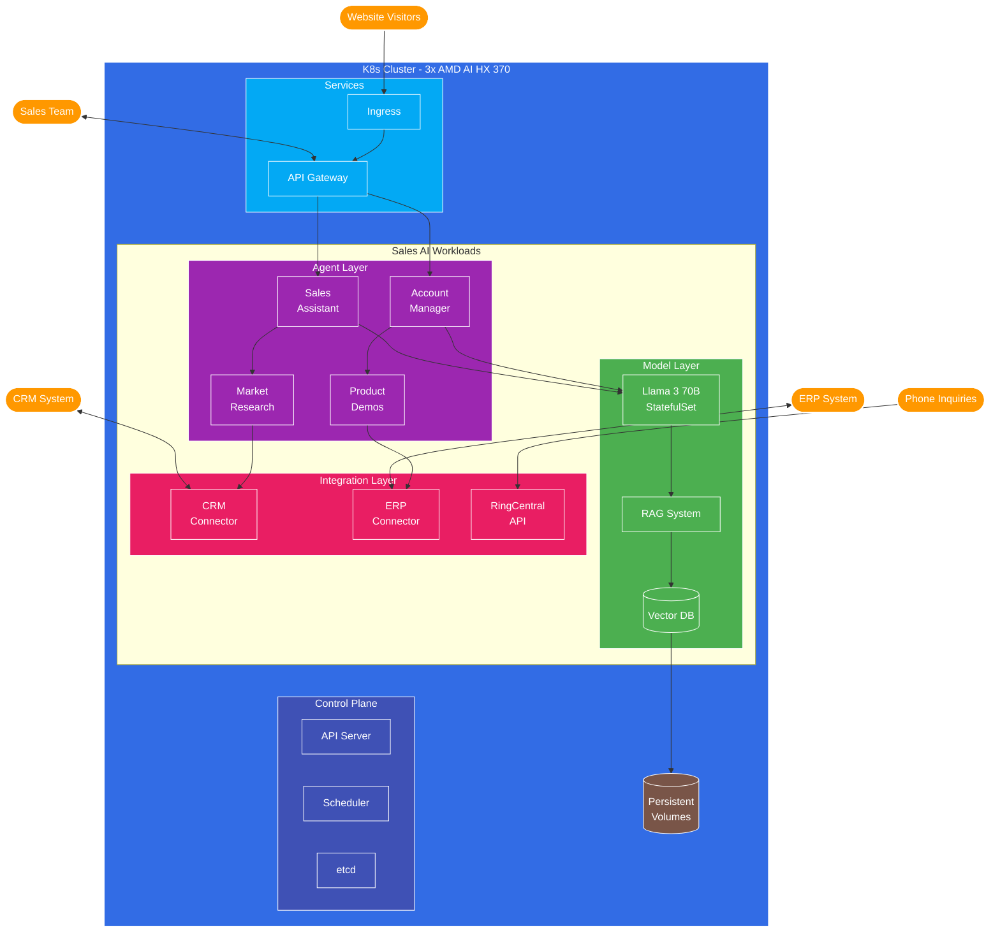

# Sales Assistant and Account Manager AI Agent Strategy

## Executive Summary

This document outlines the strategy for implementing AI-powered Sales Assistant and Account Manager agents using bare-metal infrastructure and Kubernetes. These agents will provide 24/7 telephone and chat support, conduct market research, handle customer interviews, provide interactive product demos, and manage incremental purchase requests. The solution leverages a Kubernetes cluster on bare-metal infrastructure to host LLM inference, RAG systems, and a comprehensive knowledge base, integrated with RingCentral for telephony services.

## Table of Contents

1. Introduction
2. Functional Requirements
3. Performance Requirements
4. Infrastructure Requirements
5. Model Selection
6. Deployment Architecture
7. Implementation Strategy
8. Cost Analysis
9. Next Steps

## 1. Introduction

### 1.1 Purpose

This strategy document outlines the approach for implementing AI-powered Sales Assistant and Account Manager agents to enhance the sales process, improve customer experience, and increase operational efficiency. These agents will serve as the first point of contact for potential and existing customers, handling initial inquiries, conducting market research, providing product demonstrations, and managing routine account activities.

### 1.2 Business Objectives

- Provide 24/7 availability for customer inquiries via telephone and chat
- Reduce the workload on human sales representatives by automating routine tasks
- Improve lead qualification and customer research processes
- Enhance customer experience through immediate response and personalized interactions
- Increase sales conversion rates through consistent and data-driven engagement
- Support existing customers with on-demand product demonstrations and account management
- Build long-term trust by recommending the best solutions for customers, even if from competitors
- Establish the company as a trusted advisor rather than just a product vendor

### 1.3 Agent Types and Roles

#### Sales Assistant Agents

Sales Assistant agents will focus on new business development and lead qualification:

- Handle inbound sales inquiries via telephone and website chat
- Conduct initial customer interviews to understand needs and requirements
- Perform comprehensive market research on prospects and their industries
- Research compliance and governance concerns relevant to potential customers
- Identify common industry problems that can be addressed by company products
- Qualify leads before transferring to human sales representatives

#### Account Manager Agents

Account Manager agents will focus on existing customer relationships and growth:

- Provide on-demand interactive product demonstrations
- Answer specific questions about products and services
- Handle Return Merchandise Authorization (RMA) requests
- Process incremental purchase requests
- Prepare order information before handoff to human sales representatives
- Monitor customer usage patterns to identify upsell opportunities

## 2. Functional Requirements

### 2.1 Core Capabilities

#### Communication Interfaces

- **Telephone Integration**: 24/7 voice communication via RingCentral API
- **Website Chat**: Real-time chat interface on marketing website
- **Email Communication**: Generate and send follow-up emails with relevant information
- **CRM Integration**: Bidirectional sync with CRM system (e.g., Salesforce, HubSpot)

#### Sales Intelligence

- **Market Research**: Ability to research companies, industries, and market trends
- **Competitive Analysis**: Compare company offerings with competitors
- **Alternative Solution Research**: Identify and recommend competitor products when better suited to customer needs
- **Compliance Research**: Identify relevant regulatory and compliance requirements
- **Need Analysis**: Match customer needs with appropriate product offerings (including non-company solutions when appropriate)

#### Product Knowledge

- **Product Catalog**: Comprehensive knowledge of all products, pricing, and specifications
- **Interactive Demos**: Ability to provide guided product demonstrations
- **Configuration Tools**: Generate product configurations based on customer requirements
- **Pricing Calculator**: Calculate accurate pricing including discounts and promotions

#### Account Management

- **Order Processing**: Handle incremental purchase requests and prepare orders
- **RMA Handling**: Process return merchandise authorization requests
- **Usage Analytics**: Monitor customer usage patterns and identify opportunities
- **Contract Management**: Access and explain contract terms and renewal options

### 2.2 AI Capabilities

- **Natural Language Understanding**: Process and understand complex customer inquiries
- **Sentiment Analysis**: Detect customer emotions and adjust responses accordingly
- **Knowledge Retrieval**: Access and present relevant information from knowledge base
- **Personalization**: Tailor interactions based on customer history and preferences
- **Multi-turn Conversations**: Maintain context across extended conversations
- **Handoff Intelligence**: Recognize when to escalate to human representatives

### 2.3 Integration Requirements

- **CRM System**: Bidirectional integration with CRM for customer data
- **RingCentral**: Integration for telephone and video communication
- **Product Database**: Access to up-to-date product information
- **ERP System**: Integration for order processing and inventory checking
- **Knowledge Base**: Connection to company documentation and resources
- **Analytics Platform**: Feed interaction data for performance monitoring
- **Calendar System**: Schedule meetings with human sales representatives

## 3. Performance Requirements

### 3.1 Response Time

| Metric | Target | Description |
|--------|--------|-------------|
| Initial Response Time | < 2 seconds | Time to first acknowledgment of customer contact |
| Query Processing Time | < 5 seconds | Time to process and respond to standard inquiries |
| Research Completion | < 60 seconds | Time to complete basic market research tasks |
| Demo Preparation | < 30 seconds | Time to prepare and initiate product demonstrations |
| Handoff Preparation | < 120 seconds | Time to prepare comprehensive handoff to human rep |

### 3.2 Accuracy and Quality

| Metric | Target | Description |
|--------|--------|-------------|
| Information Accuracy | > 95% | Correctness of product and pricing information |
| Need Assessment | > 90% | Accuracy in identifying customer requirements |
| Lead Qualification | > 85% | Precision in qualifying sales leads |
| Sentiment Detection | > 80% | Accuracy in detecting customer sentiment |
| Handoff Quality | > 90% | Completeness of information provided during handoff |

### 3.3 Capacity and Availability

| Metric | Target | Description |
|--------|--------|-------------|
| Concurrent Sessions | 12-15 per node | Number of simultaneous customer interactions |
| System Availability | 99.9% | Overall system uptime |
| Call Handling Capacity | 60 calls/hour | Total number of phone calls processed per hour |
| Chat Handling Capacity | 90 chats/hour | Total number of chat sessions processed per hour |
| Recovery Time | < 60 seconds | Time to recover from system disruptions |

### 3.4 Business Impact

| Metric | Target | Description |
|--------|--------|-------------|
| Lead Conversion Rate | +15% | Increase in lead-to-opportunity conversion |
| Sales Cycle Reduction | -20% | Decrease in average sales cycle duration |
| Rep Productivity | +30% | Increase in sales rep productivity |
| Customer Satisfaction | > 4.5/5 | Customer satisfaction rating for AI interactions |
| Upsell Identification | +25% | Increase in identified upsell opportunities |

## 4. Infrastructure Requirements

### 4.1 Hardware Specifications

| Component | Specification | Quantity | Purpose |
|-----------|--------------|----------|----------|
| Server Nodes | AMD AI HX 370 | 3 | Kubernetes cluster nodes |
| Memory | 64GB DDR5 | Per server | Model inference and application hosting |
| Storage | 4TB NVMe SSD | Per server | Knowledge base and model storage |
| AI Accelerator | Dedicated AI compute engine | Per server | Large model inference acceleration |
| Network | 10GbE | Per server | Kubernetes cluster communication |
| Telephony | RingCentral Integration | 1 | 24/7 phone support integration |
| Redundant Power | UPS + Generator | 1 system | Ensure 24/7 availability |
| Shared Storage | NFS/Ceph | Cluster-wide | Persistent volume claims |

### 4.2 Network Requirements

| Component | Specification | Purpose |
|-----------|--------------|----------|
| Internet Connection | 1 Gbps symmetrical, redundant | External communication |
| Internal Network | 10 Gbps | Inter-node communication |
| Firewall | Next-gen with IPS | Security and access control |
| VPN | Site-to-site and remote access | Secure administrative access |
| Load Balancer | Layer 7 with SSL termination | Traffic distribution |

### 4.3 Security Requirements

| Component | Implementation | Purpose |
|-----------|---------------|----------|
| Data Encryption | TLS 1.3, AES-256 | Secure data in transit |
| Storage Encryption | Full-disk encryption | Secure data at rest |
| Authentication | OAuth 2.0, MFA | Secure access control |
| Network Security | Micro-segmentation | Isolate system components |
| Compliance | PCI-DSS, GDPR, CCPA | Regulatory requirements |
| Audit Logging | Centralized log management | Security monitoring |

## 5. Model Selection

### 5.1 Core LLM Requirements

The AI agents require models with strong capabilities in:

- Natural language understanding and generation
- Multi-turn conversation management
- Knowledge retrieval and integration
- Reasoning about customer needs and product fit
- Sensitivity to customer sentiment and tone

### 5.2 Recommended Models

#### Primary Model: Llama 3 70B

**Justification**: The sales and account management domains require stronger reasoning, personalization, and persuasive capabilities than technical support. The 70B parameter model provides:

- Superior contextual understanding for complex sales conversations
- Better reasoning for matching customer needs to product features
- Enhanced ability to generate persuasive, natural-sounding responses
- Stronger capabilities for market research and competitive analysis

**Quantization**: 4-bit quantization to optimize for memory efficiency while maintaining performance

**Resource Requirements**:
- ~18GB RAM per model instance (with 4-bit quantization)
- Leverages dedicated AI accelerator for efficient inference
- Maintains sub-5 second response times even with complex queries

#### Alternative Model: Mistral Large

**Justification**: If Llama 3 70B proves too resource-intensive, Mistral Large offers a good balance of capabilities and efficiency for sales and account management tasks.

**Resource Requirements**:
- ~10GB RAM per model instance (with 4-bit quantization)
- Lower throughput but still acceptable for most sales interactions

### 5.3 Specialized Models

| Purpose | Model | Justification |
|---------|-------|---------------|
| Sentiment Analysis | Distil-RoBERTa | Lightweight model for real-time sentiment detection |
| Entity Recognition | BERT-NER | Identify companies, products, and industry terms |
| Text Summarization | BART-mini | Create concise summaries for handoffs |
| Speech Processing | Whisper-small | Efficient speech recognition for phone calls |

## 6. Deployment Architecture

### 6.1 High-Level Architecture

The system will be deployed on a 3-node Kubernetes cluster with the following high-level components:

1. **Model Inference Layer**: Hosts the LLM models for both Sales Assistant and Account Manager agents
2. **RAG System**: Retrieval-augmented generation for accessing product and market knowledge
3. **Integration Layer**: Connects to external systems like CRM, RingCentral, and product databases
4. **Presentation Layer**: Handles user interfaces for chat, telephony, and admin controls
5. **Monitoring Layer**: Provides observability, logging, and performance metrics

### 6.2 Kubernetes Architecture

### 6.3 Software Stack

| Component | Technology | Purpose |
|-----------|------------|----------|
| Container Orchestration | Kubernetes 1.29+ | Workload management |
| Container Runtime | containerd | Container execution |
| API Gateway | Kong/Istio | External API management |
| Vector Database | Chroma | Knowledge embedding storage |
| RAG Framework | LlamaIndex | Knowledge retrieval |
| CRM Connector | Custom API Client | Salesforce/HubSpot integration |
| Chat Interface | React + WebSockets | Website chat functionality |
| Telephony | RingCentral API | Phone and video communication |
| Monitoring | Prometheus + Grafana | System and performance monitoring |
| Logging | Loki | Centralized logging |
| Storage | Rook-Ceph | Persistent volume provisioning |

### 6.4 Data Flow

1. **Customer Inquiry Flow**:
   - Customer initiates contact via website chat or phone call
   - System routes to appropriate agent type (Sales Assistant or Account Manager)
   - Agent retrieves customer context from CRM if available
   - Agent engages in conversation, using RAG for knowledge retrieval
   - Agent performs required actions (research, demos, etc.)
   - Agent prepares handoff to human rep or completes the interaction

2. **Market Research Flow**:
   - Agent receives research request (automatic or manual)
   - Agent accesses internal knowledge base and approved external sources
   - Research results are processed and structured
   - Findings are stored in vector database for future retrieval
   - Results are presented to customer or sales representative

3. **Order Processing Flow**:
   - Customer requests product purchase or upgrade
   - Agent validates requirements and customer information
   - Agent generates quote using pricing engine
   - Order details are prepared and validated
   - Information is transferred to human rep for finalization

## 7. Implementation Strategy

### 7.1 Phased Approach

#### Phase 1: Foundation (Months 1-2)

- Set up Kubernetes cluster on bare-metal infrastructure
- Deploy core LLM inference capabilities
- Implement basic RAG system with initial knowledge base
- Develop website chat interface with basic functionality
- Establish monitoring and logging infrastructure

#### Phase 2: Core Capabilities (Months 3-4)

- Implement RingCentral integration for phone support
- Develop CRM integration for customer data access
- Enhance RAG system with expanded knowledge base
- Create specialized Sales Assistant agent functionality
- Implement basic market research capabilities

#### Phase 3: Advanced Features (Months 5-6)

- Develop Account Manager agent functionality
- Implement product demonstration capabilities
- Create order processing workflows
- Enhance market research with external data sources
- Develop handoff mechanisms to human representatives

#### Phase 4: Optimization (Months 7-8)

- Fine-tune models for improved performance
- Implement advanced analytics and reporting
- Enhance security and compliance features
- Optimize system for higher throughput
- Conduct comprehensive testing and validation

### 7.2 Key Implementation Components

#### 7.2.1 Knowledge Base Development

The knowledge base will include:

1. **Product Information**:
   - Detailed specifications and features
   - Pricing and configuration options
   - Compatibility and requirements
   - Common use cases and benefits

2. **Market Intelligence**:
   - Industry trends and challenges
   - Competitor analysis and comparisons
   - Regulatory and compliance information
   - Customer success stories and case studies

3. **Sales Process Knowledge**:
   - Qualification criteria and methodologies
   - Common objections and responses
   - Pricing strategies and discount policies
   - Handoff procedures and requirements

4. **Competitive Solution Knowledge**:
   - Comprehensive competitor product information
   - Use case scenarios where competitor products excel
   - Objective comparison matrices across different solutions
   - Industry best practices for solution selection
   - Customer success stories with various solutions

#### 7.2.2 RAG System Implementation

The RAG system will be implemented using:

1. **Document Processing Pipeline**:
   - Ingest documents from multiple sources
   - Chunk documents into appropriate segments
   - Generate embeddings using sentence transformers
   - Index embeddings in Chroma vector database

2. **Query Processing**:
   - Convert customer queries to embeddings
   - Retrieve relevant context from vector database
   - Provide context to LLM for response generation
   - Track and improve retrieval quality over time

#### 7.2.3 CRM Integration

The CRM integration will provide:

1. **Customer Data Access**:
   - Contact information and communication history
   - Purchase history and product usage
   - Support tickets and issues
   - Account status and contract details

2. **Data Synchronization**:
   - Record new interactions in CRM
   - Update lead status and qualification
   - Create tasks and follow-up items
   - Track conversion metrics and performance

### 7.3 Sales Assistant Capabilities

The Sales Assistant agent will provide:

1. **Lead Qualification**:
   - Assess prospect needs and requirements
   - Determine budget, authority, need, and timeline
   - Score leads based on qualification criteria
   - Route qualified leads to appropriate sales representatives

2. **Market Research**:
   - Research prospect companies and industries
   - Identify relevant trends and challenges
   - Analyze compliance and regulatory requirements
   - Prepare research summaries for sales representatives

3. **Solution Matching**:
   - Match customer needs with appropriate solutions (including competitor products when better suited)
   - Provide honest comparisons between company products and alternatives
   - Explain features and benefits relevant to customer needs
   - Address objections and concerns with transparency
   - Generate initial proposals and configurations
   - Document reasons for recommending competitor solutions when applicable

### 7.4 Account Manager Capabilities

The Account Manager agent will provide:

1. **Interactive Demonstrations**:
   - Prepare customized product demonstrations
   - Guide customers through product features
   - Answer questions during demonstrations
   - Provide follow-up materials and documentation

2. **Order Processing**:
   - Handle incremental purchase requests
   - Generate quotes and pricing information
   - Process RMA requests and returns
   - Prepare order information for handoff

3. **Account Monitoring**:
   - Track product usage and adoption
   - Identify upsell and cross-sell opportunities
   - Monitor contract status and renewals
   - Alert sales representatives to potential issues

## 8. Cost Analysis

### 8.1 Hardware Costs

| Item | Unit Cost | Quantity | Total Cost |
|-----------|--------------|----------|------------|
| AMD AI HX 370 Nodes (64GB RAM, 2TB NVMe) | $1,500 | 3 | $4,500 |
| Network Equipment | $400 | 1 | $400 |
| Installation and Configuration | $1,000 | 1 | $1,000 |
| **Total Hardware** | | | **$5,900** |

*Note: RingCentral Enterprise Plan is considered an external cost and not included in the hardware costs.*

### 8.2 Implementation Costs with AI-Assisted Development

#### 8.2.1 AI-Assisted Development Approach
Implementation costs are based on using AI-assisted development tools and the Software Engineering AI Team, which significantly reduce development time and resources compared to traditional development approaches. This approach allows us to achieve approximately 20% of the cost of traditional human-led development while maintaining high quality through dedicated testing phases.

#### 8.2.2 Implementation Cost Breakdown

| Activity | Cost |
|----------|------|
| Infrastructure setup | $3,000 |
| Model deployment and optimization | $7,000 |
| Integration development | $9,000 |
| User interface development | $6,000 |
| Testing and quality assurance | $5,000 |
| Knowledge base development | $6,000 |
| **Total Implementation** | **$36,000** |

*Note: Implementation costs reflect a 62% reduction from the original estimate of $95,000 due to the use of AI-assisted development tools and the Software Engineering AI Team.*

### 8.3 Operational Costs (Annual)

| Item | Annual Cost |
|-----------|------------|
| Infrastructure maintenance | $12,000 |
| Software licenses | $24,000 |
| Model updates and optimization | $6,000 |
| Knowledge base maintenance | $4,400 |
| Monitoring and support | $4,000 |
| **Total Annual Operations** | **$50,400** |

*Note: The operational costs reflect the ongoing expenses of running the Sales AI Agent system, including infrastructure maintenance, software licenses, and AI-assisted updates and optimization (20% of traditional costs).*

### 8.4 ROI Analysis

#### 8.4.1 Cost Savings

| Category | Annual Savings |
|----------|----------------|
| Reduced Sales Staff | $300,000 |
| Improved Lead Qualification | $150,000 |
| Faster Sales Cycle | $200,000 |
| Increased Conversion Rate | $250,000 |
| Additional Value Creation | $350,000 |
| **Total Savings** | **$1,250,000** |

#### 8.4.2 ROI Calculation

| Metric | Value |
|--------|-------|
| Year 1 Investment | $92,300 (Hardware + Implementation + 1yr Operations) |
| Year 1 Return | $1,250,000 |
| First Year ROI | 353% |
| Year 2+ Investment | $50,400 (Annual Operations) |
| Year 2+ Return | $1,250,000 |
| Second Year ROI | 757% |
| 3-Year TCO | $187,100 |
| 3-Year Value Creation | $3,750,000 |
| Break-even Point | 2 months |

#### 8.4.3 Additional Value Creation
- Improved customer satisfaction through 24/7 availability
- Reduced training costs for sales staff
- Enhanced knowledge retention and transfer
- Faster lead qualification and processing
- Ability to scale sales operations without proportional cost increases
- Consistent application of sales methodology across all customer interactions

### 8.5 Consolidated Cluster Savings
When implemented as part of the consolidated Kubernetes cluster approach outlined in the corporate AI strategy:
- Hardware savings: Approximately 33% through shared infrastructure
- LLM instance reduction: 67% for Llama 3 70B instances (from 3 to 1)
- Operational efficiency: 25% reduction in maintenance and support costs
- Total estimated savings: $60,000 in Year 1, $30,000/year thereafter

## 9. Next Steps

### 9.1 Immediate Actions (Next 30 Days)

1. **Hardware Procurement**: Order server hardware and networking equipment
2. **Infrastructure Planning**: Finalize Kubernetes cluster design and network architecture
3. **Knowledge Base Planning**: Identify and catalog required knowledge sources
4. **Team Assembly**: Form the development and operations team
5. **Integration Planning**: Establish integration approach for CRM and RingCentral

### 9.2 Short-Term Milestones (60-90 Days)

1. **Infrastructure Setup**: Deploy Kubernetes cluster on bare-metal servers
2. **Base Model Deployment**: Implement Llama 3 70B with initial inference capabilities
3. **RAG Foundation**: Develop basic RAG system with core knowledge
4. **Website Chat Prototype**: Create initial chat interface for testing
5. **Monitoring Setup**: Implement basic monitoring and alerting

### 9.3 Critical Success Factors

1. **Knowledge Quality**: Comprehensive and accurate product, market, and competitor knowledge
2. **Integration Depth**: Seamless integration with CRM and other business systems
3. **Conversation Quality**: Natural and effective customer interactions
4. **Handoff Precision**: Smooth transition from AI agents to human representatives
5. **Performance Optimization**: Efficient resource utilization for cost-effectiveness
6. **Continuous Improvement**: Regular updates to models and knowledge base
7. **Ethical Recommendation Engine**: Ability to objectively recommend the best solution for customer needs
8. **Trust Building**: Establishing credibility through honest and transparent interactions

By implementing this strategy, organizations can deploy effective Sales Assistant and Account Manager AI agents on bare-metal infrastructure, providing 24/7 sales support, conducting market research, delivering product demonstrations, and managing customer accounts while maintaining cost efficiency and high performance.

## Appendix A: Outbound Sales Extension

This appendix outlines the requirements and implementation strategy for adding outbound sales capabilities as a future extension to the core Sales Assistant and Account Manager AI agent system.

### A.1 Outbound Sales Agent Capabilities

The Outbound Sales Agent will extend the existing sales AI system with the following capabilities:

1. **Prospect Identification**:
   - Analyze CRM and external data to identify potential customers
   - Score and prioritize prospects based on firmographic data and buying signals
   - Segment prospects into targeted campaign groups

2. **Proactive Research**:
   - Conduct in-depth research on target companies before outreach
   - Identify trigger events (funding rounds, expansions, leadership changes)
   - Develop personalized value propositions for each prospect

3. **Multi-Channel Outreach**:
   - Generate personalized email sequences
   - Initiate and manage outbound phone calls
   - Coordinate LinkedIn and social media engagement
   - Orchestrate touches across different channels

4. **Campaign Management**:
   - Design and execute targeted outbound campaigns
   - A/B test different messaging approaches
   - Track campaign performance and optimize in real-time
   - Ensure compliance with anti-spam regulations

5. **Follow-up Automation**:
   - Schedule and manage follow-up communications
   - Detect and respond to prospect replies
   - Adjust outreach timing based on engagement signals
   - Transition qualified leads to human sales representatives

### A.2 Additional Hardware Requirements

#### A.2.1 Server Infrastructure

| Component | Specification | Quantity | Unit Cost | Total Cost |
|-----------|--------------|----------|-----------|------------|
| AMD AI HX 370 Nodes | 64GB RAM, 4TB NVMe | 2 | $1,300 | $2,600 |
| Email Sending Server | AMD 8945HS, 64GB RAM, 2TB NVMe | 1 | $1,100 | $1,100 |
| Network Equipment | Additional switches and cabling | - | $500 | $500 |
| **Total Hardware** | | | | **$4,200** |

#### A.2.2 Hardware Justification

1. **2x AMD AI HX 370 Nodes**:
   - Required for running additional Llama 3 70B instances
   - Supports approximately 8-10 concurrent outbound agent sessions
   - Provides necessary inference speed for real-time conversation analysis

2. **1x Email Sending Server**:
   - Dedicated to email campaign management and sending
   - Maintains email reputation and deliverability
   - Handles email tracking, analytics, and reply detection
   - AMD 8945HS is sufficient as email operations are less compute-intensive

### A.3 Data Requirements

#### A.3.1 Storage Requirements

| Data Type | Size Per Record | Estimated Records | Total Size |
|-----------|----------------|-------------------|------------|
| Prospect Profiles | 50KB | 100,000 | 5GB |
| Company Research | 500KB | 10,000 | 5GB |
| Email Templates | 10KB | 1,000 | 10MB |
| Campaign Data | 100KB | 1,000 | 100MB |
| Interaction History | 20KB | 500,000 | 10GB |
| Analytics Data | - | - | 50GB |
| **Total Data Storage** | | | **~70GB** |

#### A.3.2 External Data Sources

| Data Source | Purpose | Integration Method |
|-------------|---------|--------------------|
| LinkedIn Sales Navigator | Prospect information and engagement | API |
| ZoomInfo/DiscoverOrg | Company and contact data enrichment | API |
| Clearbit | Email verification and enrichment | API |
| Crunchbase | Company funding and growth data | API |
| Industry News APIs | Trigger event identification | Webhook |

### A.4 Additional Software Components

| Component | Purpose | Deployment Method |
|-----------|---------|-------------------|
| Email Delivery System | Manage email sending with proper authentication | Kubernetes Deployment |
| Email Tracking Service | Track opens, clicks, and replies | Kubernetes Deployment |
| Outbound Dialer | Manage outbound call campaigns | Kubernetes Deployment |
| Campaign Orchestrator | Coordinate multi-channel outreach | Kubernetes Deployment |
| Compliance Manager | Ensure adherence to regulations | Kubernetes Deployment |
| A/B Testing Engine | Test and optimize messaging | Kubernetes Deployment |

### A.5 Implementation Timeline

#### Phase 1: Foundation (Months 1-2)
- Deploy additional hardware infrastructure
- Implement email sending infrastructure with proper authentication
- Develop basic prospect research capabilities
- Create initial email template system

#### Phase 2: Core Capabilities (Months 3-4)
- Develop the Outbound Sales Agent with basic functionality
- Implement prospect scoring and prioritization
- Create campaign management system
- Establish compliance monitoring

#### Phase 3: Advanced Features (Months 5-6)
- Add multi-channel coordination
- Implement A/B testing capabilities
- Develop advanced analytics and reporting
- Create trigger-based outreach system

### A.6 Development Costs

| Component | Estimated Cost |
|-----------|----------------|
| Outbound Sales Agent | $70,000 |
| Email Infrastructure | $35,000 |
| Multi-Channel Orchestration | $45,000 |
| Campaign Management | $40,000 |
| Analytics & Optimization | $30,000 |
| Compliance System | $25,000 |
| **Total Development** | **$245,000** |

### A.7 Operational Considerations

#### A.7.1 Email Deliverability

1. **Authentication Setup**:
   - Implement SPF, DKIM, and DMARC records
   - Establish proper reverse DNS
   - Warm up sending IPs gradually

2. **Reputation Management**:
   - Monitor sender reputation scores
   - Track bounce rates and spam complaints
   - Implement feedback loops with major email providers

#### A.7.2 Compliance Requirements

1. **Anti-Spam Compliance**:
   - CAN-SPAM Act requirements
   - GDPR compliance for European prospects
   - CCPA compliance for California residents
   - Automatic suppression list management

2. **Do-Not-Call Compliance**:
   - Integration with national Do-Not-Call registries
   - Call recording and retention policies
   - Proper disclosure during calls

### A.8 Performance Metrics

| Metric | Target | Description |
|--------|--------|-------------|
| Email Open Rate | > 30% | Percentage of emails opened |
| Email Response Rate | > 5% | Percentage of emails that receive replies |
| Connect Rate | > 20% | Percentage of call attempts that connect |
| Conversion to Meeting | > 10% | Prospects converted to sales meetings |
| Cost Per Meeting | < $50 | Total cost divided by meetings set |
| Pipeline Generated | > $10 per $1 spent | Value of pipeline created vs. cost |

### A.9 Integration with Existing System

The Outbound Sales extension will integrate with the core Sales Assistant and Account Manager system through:

1. **Shared Knowledge Base**:
   - Access to the same product and market knowledge
   - Consistent messaging across inbound and outbound

2. **Unified CRM Integration**:
   - Synchronized customer data across all agent types
   - Consistent lead scoring and qualification criteria

3. **Handoff Mechanisms**:
   - Seamless transfer from outbound to inbound agents when prospects respond
   - Coordinated follow-up between agent types

4. **Consolidated Analytics**:
   - Unified reporting across the entire sales funnel
   - End-to-end conversion tracking

By implementing this outbound sales extension after the core inbound and account management system is established, organizations can create a comprehensive AI-powered sales ecosystem that both responds to incoming inquiries and proactively identifies and engages potential customers.

## 10. Ethical Selling Practices

### 10.1 Customer-Centric Approach

The AI agents will be designed to prioritize customer needs over immediate sales opportunities:

1. **Solution-First Mentality**: Focus on solving customer problems rather than pushing products
2. **Honest Recommendations**: Provide transparent comparisons between company products and competitor offerings
3. **Best-Fit Analysis**: Use objective criteria to determine the most appropriate solution for each customer
4. **Long-Term Relationship Building**: Prioritize customer trust over short-term sales metrics

### 10.2 Competitive Solution Recommendation Process

When evaluating whether to recommend a competitor's solution:

1. **Need Assessment**: Thoroughly understand customer requirements and constraints
2. **Fit Analysis**: Objectively evaluate how well company products meet those requirements
3. **Gap Identification**: Identify any significant gaps between customer needs and company offerings
4. **Alternative Research**: Research competitor solutions that might better address those gaps
5. **Transparent Comparison**: Present honest comparisons between options
6. **Documentation**: Record reasoning behind recommendations for future improvement

### 10.3 Benefits of Ethical Selling

1. **Enhanced Trust**: Customers recognize and appreciate honest recommendations
2. **Reduced Returns**: Better-fit solutions lead to fewer returns and cancellations
3. **Positive Brand Perception**: Company is seen as a trusted advisor rather than a pushy vendor
4. **Long-Term Value**: Short-term revenue losses are outweighed by long-term customer loyalty
5. **Competitive Intelligence**: Feedback on why customers choose competitors provides valuable product development insights

### 10.4 Measuring Ethical Selling Success

| Metric | Target | Description |
|--------|--------|-------------|
| Customer Trust Score | > 4.8/5 | Customer rating of agent trustworthiness |
| Solution Fit Rating | > 90% | Customer satisfaction with recommended solution |
| Return Rate | < 5% | Products returned due to mismatched expectations |
| Repeat Business | > 80% | Customers who return for future purchases |
| Referral Rate | > 40% | Customers who refer others to the company |
