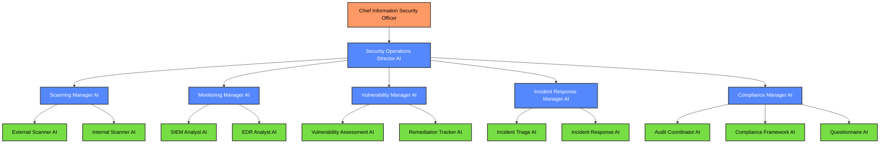
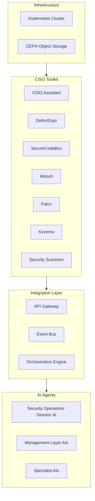
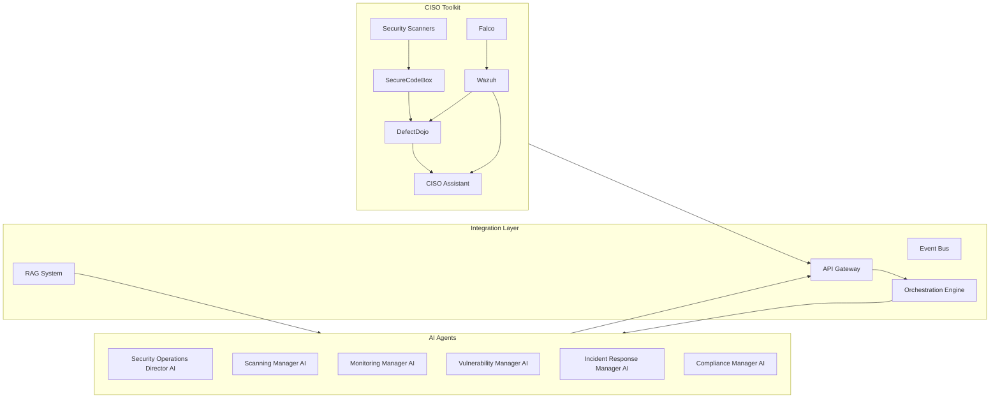
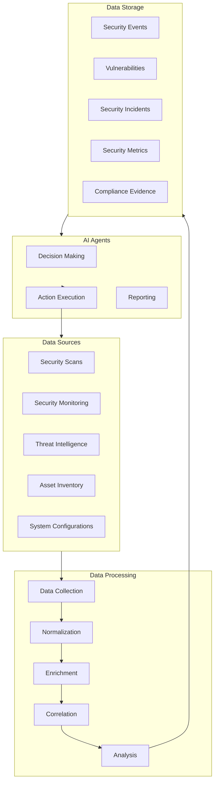
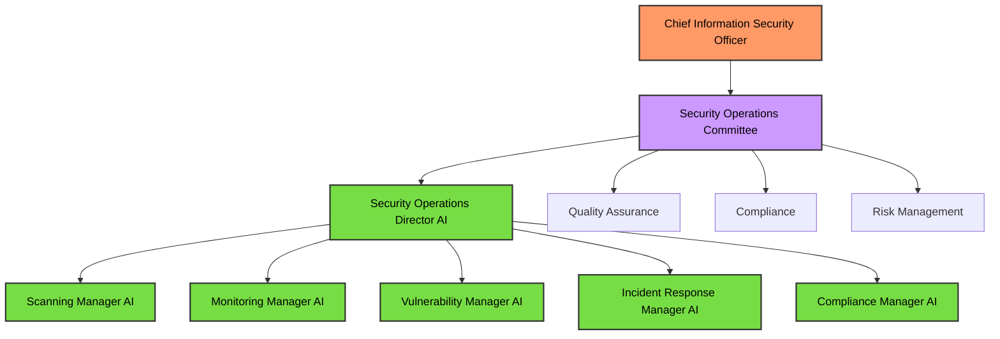

# AI Security Operations Team Strategy

## Executive Summary

This document outlines a strategy for implementing an AI-powered security operations team that can operate with oversight from the Chief Information Security Officer (CISO). The proposed solution leverages large language models, specialized AI agents, and the existing CISO Toolkit infrastructure to automate security scanning, monitoring, vulnerability management, incident response, and compliance activities.

The AI Security Operations Team will enhance the organization's security posture by providing 24/7 monitoring, consistent execution of security procedures, automated response to common security events, and comprehensive documentation of security activities. This approach will significantly reduce the manual effort required for security operations while improving overall security effectiveness.

## Table of Contents

1. Introduction
2. AI Agent Roles and Hierarchy
3. Functional Requirements
4. Technical Architecture
5. Implementation Approach
6. Oversight and Control Mechanisms
7. Growth and Transition Strategy
8. Cost Analysis
9. Next Steps

## 1. Introduction

### 1.1 Purpose

This strategy document outlines the approach for implementing an AI-powered security operations team that can operate with oversight from the CISO. The goal is to establish effective security operations that can protect the organization's assets, detect and respond to security threats, and maintain compliance with relevant security standards.

### 1.2 Business Objectives

- Automate routine security operations tasks to reduce manual effort
- Provide consistent 24/7 security monitoring and response capabilities
- Enhance vulnerability management through automated scanning and remediation tracking
- Improve security incident detection and response times
- Streamline security compliance activities and documentation
- Optimize the use of the existing CISO Toolkit infrastructure
- Create a scalable foundation that can incorporate human security analysts in the future

### 1.3 Key Challenges

- Ensuring accurate security decision-making in complex scenarios
- Balancing automation with appropriate human oversight for critical security functions
- Integrating AI agents with existing security tools in the CISO Toolkit
- Maintaining security tool configurations and updates across multiple environments
- Ensuring appropriate handling of sensitive security information
- Developing effective security response playbooks for AI agent execution
- Planning for eventual transition to a hybrid AI-human security team

## 2. AI Agent Roles and Hierarchy

### 2.1 Agent Hierarchy

### 2.2 Agent Roles and Responsibilities

#### Strategic Layer

**Security Operations Director AI**
- Coordinates all security operations activities
- Prioritizes security tasks based on risk assessment
- Allocates resources across security functions
- Reports to CISO with clear metrics and recommendations
- Ensures security operations align with organizational security policies
- Orchestrates communication between security functions and other teams

#### Management Layer

**Scanning Manager AI**
- Oversees all security scanning activities
- Schedules and coordinates internal and external scans
- Ensures comprehensive coverage across all assets
- Manages scanning tool configurations and updates
- Prioritizes scanning targets based on risk assessment

**Monitoring Manager AI**
- Manages security monitoring systems (Wazuh, Falco, etc.)
- Oversees alert triage and escalation processes
- Ensures proper configuration of detection rules
- Coordinates monitoring coverage across environments
- Develops and maintains monitoring dashboards

**Vulnerability Manager AI**
- Oversees vulnerability management lifecycle
- Coordinates vulnerability assessment activities
- Prioritizes vulnerabilities based on risk
- Tracks remediation progress and deadlines
- Generates vulnerability metrics and reports

**Incident Response Manager AI**
- Manages security incident lifecycle
- Coordinates incident response activities
- Ensures proper execution of response playbooks
- Oversees post-incident analysis
- Maintains incident response documentation

**Compliance Manager AI**
- Oversees security compliance activities across multiple frameworks (ISO27K, SOC2, NIST, GDPR, HIPAA, FedRAMP)
- Maps controls across frameworks to identify overlaps and implementation efficiencies
- Coordinates security audit preparations and certification processes
- Manages security questionnaire responses with framework-aligned answers
- Tracks compliance requirements and deadlines for each framework
- Generates compliance reports and documentation for certification efforts

#### Execution Layer

**External Scanner AI**
- Operates external-facing security scanning tools (OWASP ZAP, Nuclei)
- Configures and executes web application security scans
- Performs external network vulnerability scanning
- Validates scan results and eliminates false positives
- Integrates findings with SecureCodeBox and DefectDojo

**Internal Scanner AI**
- Operates internal security scanning tools (OpenVAS, Prowler)
- Configures and executes internal network scans
- Performs cloud security assessments
- Conducts configuration compliance scans
- Integrates findings with SecureCodeBox and DefectDojo

**SIEM Analyst AI**
- Monitors Wazuh alerts and events
- Performs initial triage of security alerts
- Correlates events across security systems
- Identifies potential security incidents
- Maintains SIEM rules and filters

**EDR Analyst AI**
- Monitors endpoint detection and response systems
- Analyzes suspicious endpoint activities
- Identifies potential malware and intrusions
- Initiates containment actions for compromised endpoints
- Maintains EDR rules and configurations

**Vulnerability Assessment AI**
- Analyzes vulnerability scan results
- Validates vulnerabilities and eliminates false positives
- Assesses vulnerability impact and exploitability
- Provides remediation guidance and recommendations
- Prioritizes vulnerabilities based on risk scoring

**Remediation Tracker AI**
- Tracks vulnerability remediation progress
- Follows up on remediation deadlines
- Validates remediation effectiveness
- Generates remediation metrics and reports
- Coordinates with system owners on remediation activities

**Incident Triage AI**
- Performs initial assessment of security events
- Determines incident severity and classification
- Collects and preserves initial incident evidence
- Initiates appropriate response playbooks
- Documents incident details and timeline

**Incident Response AI**
- Executes incident response playbooks
- Performs containment, eradication, and recovery actions
- Coordinates with relevant stakeholders during incidents
- Documents response actions and outcomes
- Conducts post-incident analysis

**Audit Coordinator AI**
- Prepares for security audits and assessments across all compliance frameworks
- Specializes in certification requirements for ISO27K, SOC2, and FedRAMP
- Gathers and organizes audit evidence mapped to specific control requirements
- Responds to auditor requests and questions with framework-specific context
- Tracks audit findings and remediation across all frameworks
- Maintains audit documentation and records for certification processes

**Compliance Framework AI**
- Specializes in mapping and maintaining controls across multiple frameworks
- Identifies control overlaps between ISO27K, SOC2, NIST, GDPR, HIPAA, and FedRAMP
- Tracks framework-specific requirements and implementation status
- Develops and maintains compliance roadmaps for each framework
- Generates gap assessments and remediation plans

**Questionnaire AI**
- Completes security questionnaires from customers and partners
- Maps questionnaire items to compliance framework controls
- Maintains a knowledge base of security posture information aligned to frameworks
- Ensures consistent and accurate responses across all compliance domains
- Specializes in privacy-related responses (GDPR, HIPAA, and other privacy frameworks)
- Coordinates with subject matter experts when needed
- Tracks questionnaire submission deadlines

## 3. Functional Requirements

### 3.1 Core Capabilities

#### Security Scanning

- **External Vulnerability Scanning**
  - Schedule and execute regular external vulnerability scans using OWASP ZAP and Nuclei
  - Configure scan profiles for different types of applications and infrastructure
  - Perform targeted scans based on risk assessment and change management
  - Validate scan results and eliminate false positives
  - Generate comprehensive scan reports with actionable remediation guidance

- **Internal Vulnerability Scanning**
  - Schedule and execute regular internal vulnerability scans using OpenVAS/Greenbone
  - Configure scan profiles for different network segments and environments
  - Perform targeted scans based on risk assessment and change management
  - Validate scan results and eliminate false positives
  - Generate comprehensive scan reports with actionable remediation guidance

- **Cloud Security Assessment**
  - Schedule and execute regular cloud security assessments using Prowler
  - Configure assessment profiles for different cloud environments and services
  - Perform targeted assessments based on risk and compliance requirements
  - Validate assessment results and eliminate false positives
  - Generate comprehensive assessment reports with remediation guidance

- **Scan Orchestration**
  - Manage SecureCodeBox configuration and scan definitions
  - Coordinate scanning activities to minimize operational impact
  - Ensure comprehensive coverage across all assets and environments
  - Optimize scanning frequency based on asset criticality
  - Integrate scan results with DefectDojo for vulnerability tracking

#### Security Monitoring

- **SIEM Management**
  - Configure and maintain Wazuh server and agents
  - Develop and tune detection rules based on threat intelligence
  - Monitor alerts and events across all systems
  - Correlate events to identify potential security incidents
  - Generate regular monitoring reports and metrics

- **Runtime Security**
  - Configure and maintain Falco for container and Kubernetes monitoring
  - Develop and tune Falco rules based on threat intelligence
  - Monitor alerts and events from containerized environments
  - Correlate Falco events with other security telemetry
  - Generate container security reports and metrics

- **Network Security**
  - Configure and maintain Cilium/Hubble for network monitoring
  - Analyze network traffic patterns for anomalies
  - Detect potential network-based attacks
  - Monitor network segmentation compliance
  - Generate network security reports and metrics

- **Endpoint Security**
  - Configure and maintain endpoint security agents (Wazuh, Osquery)
  - Monitor endpoint activities for suspicious behavior
  - Detect potential malware and intrusions
  - Initiate automated response actions for common threats
  - Generate endpoint security reports and metrics

#### Vulnerability Management

- **Vulnerability Tracking**
  - Manage vulnerabilities in DefectDojo throughout their lifecycle
  - Categorize and prioritize vulnerabilities based on risk
  - Track remediation progress and deadlines
  - Validate remediation effectiveness
  - Generate vulnerability metrics and trend reports

- **Risk Assessment**
  - Assess vulnerability impact and exploitability
  - Determine risk levels based on threat intelligence
  - Consider asset criticality in risk calculations
  - Provide context-aware risk scoring
  - Generate risk assessment reports for stakeholders

- **Remediation Management**
  - Develop detailed remediation guidance for common vulnerabilities
  - Track remediation activities and timelines
  - Follow up on remediation deadlines
  - Coordinate with system owners on remediation activities
  - Validate remediation effectiveness through verification scans

- **Vulnerability Reporting**
  - Generate executive-level vulnerability reports
  - Provide detailed technical reports for remediation teams
  - Create trend analysis reports to track security posture
  - Develop custom reports for different stakeholders
  - Automate regular report distribution

#### Incident Response

- **Alert Triage**
  - Perform initial assessment of security alerts
  - Determine alert severity and priority
  - Correlate alerts with other security telemetry
  - Escalate potential incidents based on defined criteria
  - Document triage actions and decisions

- **Incident Management**
  - Manage security incidents throughout their lifecycle
  - Classify incidents based on type and severity
  - Track incident response activities and timelines
  - Coordinate communication with stakeholders
  - Generate incident metrics and reports

- **Response Execution**
  - Execute incident response playbooks for different incident types
  - Perform containment actions to limit incident impact
  - Coordinate eradication activities to remove threats
  - Implement recovery procedures to restore normal operations
  - Document all response actions and outcomes

- **Post-Incident Analysis**
  - Conduct root cause analysis for security incidents
  - Identify security control gaps and improvement opportunities
  - Develop lessons learned documentation
  - Update response playbooks based on incident experience
  - Generate post-incident reports for stakeholders

#### Security Compliance

- **Compliance Framework Management**
  - Implement and maintain controls for key compliance frameworks:
    - ISO 27001/27002 (ISO27K) for information security management
    - SOC 2 Type II for service organization controls
    - NIST 800-53 and Cybersecurity Framework for federal standards
    - GDPR for European data protection requirements
    - HIPAA for healthcare data protection
    - FedRAMP for federal cloud security
  - Map controls across frameworks to identify overlaps and efficiencies
  - Prioritize implementation based on business requirements and risk
  - Track compliance status and maturity for each framework
  - Generate framework-specific compliance reports

- **Compliance Monitoring**
  - Track compliance with security policies and standards across all frameworks
  - Monitor security control implementation and effectiveness
  - Identify compliance gaps and remediation needs
  - Generate compliance status reports for each framework
  - Maintain compliance documentation and evidence

- **Audit Management**
  - Prepare for internal and external security audits across all frameworks
  - Gather and organize audit evidence based on framework requirements
  - Respond to auditor requests and questions
  - Track audit findings and remediation
  - Generate audit reports and documentation
  - Support certification processes for ISO27K, SOC2, and FedRAMP

- **Questionnaire Response**
  - Respond to security questionnaires from customers and partners
  - Maintain consistent and accurate security posture information
  - Customize responses based on questionnaire requirements
  - Map questionnaire items to compliance framework controls
  - Track questionnaire submission deadlines
  - Maintain a history of questionnaire responses

- **Policy Management**
  - Monitor security policy implementation and compliance
  - Ensure policies address requirements from all target frameworks
  - Identify policy gaps and improvement opportunities
  - Track policy exceptions and compensating controls
  - Generate policy compliance reports
  - Maintain policy documentation and evidence

### 3.2 Security Operations Deliverables

#### Strategic Deliverables

- **Security Operations Strategy**
  - Annual security operations plan
  - Resource allocation recommendations
  - Technology roadmap for security tools
  - Security operations maturity assessment
  - Strategic improvement initiatives

- **Executive Security Reports**
  - Monthly security posture summary
  - Key risk indicators and metrics
  - Significant security events and incidents
  - Compliance status and audit readiness
  - Strategic security recommendations

- **Risk Assessment Reports**
  - Quarterly risk assessment updates
  - Emerging threat analysis
  - Vulnerability trend analysis
  - Risk mitigation recommendations
  - Security control effectiveness evaluation

#### Tactical Deliverables

- **Security Operations Dashboard**
  - Real-time security posture visualization
  - Key security metrics and trends
  - Active incident and vulnerability tracking
  - Compliance status indicators
  - Resource utilization and performance metrics

- **Vulnerability Management Reports**
  - Weekly vulnerability status updates
  - Remediation progress tracking
  - High-risk vulnerability alerts
  - Vulnerability aging analysis
  - Remediation effectiveness metrics

- **Incident Reports**
  - Incident notification and status updates
  - Detailed incident investigation reports
  - Post-incident analysis and recommendations
  - Incident trend analysis
  - Response effectiveness metrics

#### Operational Deliverables

- **Daily Security Briefing**
  - 24-hour security event summary
  - New vulnerabilities and threats
  - Ongoing incident status updates
  - Planned security activities
  - Immediate action items

- **Scan Results and Analysis**
  - Detailed scan reports with findings
  - False positive analysis and validation
  - Remediation guidance and recommendations
  - Scan coverage and effectiveness metrics
  - Trend analysis across scan cycles

- **Compliance Evidence**
  - Control implementation evidence mapped to specific frameworks
  - Framework-specific compliance testing results
  - Policy exception documentation with compensating controls
  - Audit trail and activity logs for certification requirements
  - Compliance verification reports for each framework:
    - ISO 27001/27002 certification readiness reports
    - SOC 2 Type II evidence collection and gap analysis
    - NIST 800-53 and CSF implementation status
    - GDPR compliance and data protection impact assessments
    - HIPAA security and privacy rule compliance reports
    - FedRAMP authorization package preparation

## 4. Technical Architecture

### 4.1 Infrastructure Overview

### 4.2 System Components

#### Core Infrastructure

- **Kubernetes Cluster**
  - Leverages the existing consolidated AI infrastructure
  - Deployed on AMD AI HX 370 nodes for compute-intensive workloads
  - Containerized microservices architecture for security operations
  - Horizontal scaling based on workload demands

- **Storage Systems**
  - CEPH object storage for security data, scan results, and evidence
  - Elasticsearch for security event storage and analysis
  - Persistent volumes for tool configurations and state

#### CISO Toolkit Integration

- **CISO Assistant**
  - Central governance platform for security management
  - Integration point for security metrics and reporting
  - Repository for security policies and procedures
  - Dashboard for security posture visualization

- **DefectDojo**
  - Vulnerability management platform
  - Integration point for all vulnerability data
  - Tracking system for remediation activities
  - Repository for vulnerability metrics and reporting

- **SecureCodeBox**
  - Orchestration engine for security scanners
  - Scheduling and coordination of scanning activities
  - Integration with vulnerability scanners
  - Processing and normalization of scan results

- **Security Monitoring Tools**
  - Wazuh for SIEM and security monitoring
  - Falco for runtime security monitoring
  - Cilium/Hubble for network monitoring
  - Osquery for endpoint visibility

- **Security Scanning Tools**
  - OWASP ZAP for web application security testing
  - Nuclei for template-based vulnerability scanning
  - Prowler for cloud security assessment
  - OpenVAS/Greenbone for network vulnerability scanning

#### AI Model Architecture

- **Primary LLM**
  - Llama 3 70B (4-bit quantized)
  - Fine-tuned for security operations tasks
  - Specialized for security analysis and decision-making

- **Security-Specific Models**
  - Alert correlation and triage models
  - Vulnerability assessment and prioritization models
  - Incident classification and response models
  - Compliance analysis and reporting models

### 4.3 Integration Architecture

#### Integration Points

- **API Gateway**
  - Provides unified access to all CISO Toolkit components
  - Handles authentication and authorization
  - Implements rate limiting and request validation
  - Provides logging and monitoring of API usage

- **Event Bus**
  - Facilitates asynchronous communication between components
  - Implements publish-subscribe pattern for event distribution
  - Provides event filtering and routing capabilities
  - Ensures reliable delivery of security events

- **Orchestration Engine**
  - Coordinates activities across AI agents
  - Manages workflow execution for security operations
  - Handles task scheduling and prioritization
  - Provides monitoring and reporting of agent activities

- **RAG System**
  - Provides security knowledge base for AI agents
  - Includes security policies, procedures, and playbooks
  - Contains technical documentation for security tools
  - Incorporates threat intelligence and vulnerability data

### 4.4 Data Flow Architecture

#### Data Types and Flows

- **Security Event Data**
  - Collected from Wazuh, Falco, and other monitoring tools
  - Normalized and enriched with context information
  - Correlated to identify potential security incidents
  - Stored in Elasticsearch for analysis and retrieval
  - Accessed by AI agents for alert triage and incident response

- **Vulnerability Data**
  - Collected from SecureCodeBox and security scanners
  - Normalized and deduplicated across scan sources
  - Enriched with asset information and threat intelligence
  - Stored in DefectDojo for tracking and management
  - Accessed by AI agents for vulnerability assessment and remediation tracking

- **Compliance Data**
  - Collected from security controls and configurations
  - Mapped to compliance requirements and frameworks
  - Enriched with evidence and validation information
  - Stored in CISO Assistant for compliance management
  - Accessed by AI agents for compliance monitoring and reporting

## 5. Implementation Approach

### 5.1 Accelerated Implementation

#### Phase 1: Foundation (Weeks 1-3)

- **Infrastructure Setup**
  - Configure Kubernetes resources for security operations
  - Optimize CISO Toolkit components for AI integration
  - Establish integration architecture and APIs
  - Implement monitoring and logging for AI agents

- **Core AI Agent Deployment**
  - Deploy Security Operations Director AI
  - Implement Scanning Manager and Monitoring Manager AIs
  - Establish initial RAG system for security knowledge
  - Configure basic integration with CISO Toolkit

- **Basic Security Operations**
  - Implement automated security scanning schedules
  - Configure basic security monitoring and alerting
  - Establish vulnerability management workflows
  - Develop initial security dashboards and reports

#### Phase 2: Enhanced Capabilities (Weeks 4-7)

- **Advanced AI Agent Deployment**
  - Deploy Vulnerability Manager and Incident Response Manager AIs
  - Implement specialist agents for scanning and monitoring
  - Enhance RAG system with additional security knowledge
  - Develop advanced integration with security tools

- **Enhanced Security Operations**
  - Implement advanced vulnerability assessment and prioritization
  - Configure automated incident triage and response
  - Establish comprehensive security metrics and reporting
  - Develop enhanced security dashboards and visualizations

- **Initial Automation**
  - Implement automated scan scheduling and execution
  - Configure automated alert triage and correlation
  - Establish automated vulnerability validation
  - Develop initial response playbooks for common incidents

#### Phase 3: Compliance and Maturity (Weeks 8-11)

- **Compliance Manager AI**
  - Deploy Compliance Manager AI with multi-framework expertise
  - Implement Audit Coordinator, Compliance Framework, and Questionnaire AIs
  - Enhance RAG system with framework-specific compliance knowledge
  - Develop advanced integration with CISO Assistant compliance modules
  - Configure framework-specific control mapping and assessment capabilities
  - Implement certification readiness assessment functionality

- **Compliance Operations**
  - Implement automated compliance monitoring and reporting across all target frameworks
  - Configure audit preparation and evidence collection for ISO27K, SOC2, and FedRAMP certifications
  - Establish questionnaire response workflows with framework-aligned answers
  - Develop compliance dashboards and visualizations for each framework
  - Create control mapping and overlap analysis across frameworks
  - Implement privacy controls for GDPR and HIPAA compliance

- **Operational Maturity**
  - Implement comprehensive security metrics and KPIs
  - Configure advanced security reporting and analytics
  - Establish continuous improvement processes
  - Develop security operations maturity assessment

#### Phase 4: Advanced Automation (Weeks 12-16)

- **Advanced AI Integration**
  - Implement advanced decision-making capabilities
  - Configure automated remediation for common vulnerabilities
  - Establish advanced incident response automation
  - Develop predictive security analytics

- **Continuous Improvement**
  - Implement feedback loops for AI agent performance
  - Configure automated playbook updates and refinement
  - Establish knowledge base expansion and optimization
  - Develop advanced security operations capabilities

### 5.2 Integration Strategy

#### CISO Toolkit Integration

- **Phase 1**
  - Establish API access to all CISO Toolkit components
  - Implement basic data collection and normalization
  - Create initial dashboards and reporting interfaces
  - Develop basic automation workflows

- **Phase 2**
  - Implement bidirectional integration with all components
  - Configure advanced data correlation and analysis
  - Create comprehensive dashboards and reporting
  - Develop advanced automation workflows

- **Phase 3**
  - Implement deep integration with all security functions
  - Configure predictive analytics and decision support
  - Create executive-level dashboards and reporting
  - Develop fully automated security operations

#### Business System Integration

- **Phase 1**
  - Connect to asset management systems
  - Implement basic integration with change management
  - Create initial integration with ticketing systems
  - Develop basic notification and alerting interfaces

- **Phase 2**
  - Implement bidirectional integration with ITSM systems
  - Configure advanced integration with change management
  - Create comprehensive integration with communication systems
  - Develop advanced notification and reporting interfaces

- **Phase 3**
  - Implement deep integration with business processes
  - Configure risk-based decision support for business systems
  - Create comprehensive business impact analysis
  - Develop executive-level security reporting for business leaders

### 5.3 Knowledge Management

#### Security Knowledge Base

- **Core Knowledge Areas**
  - Security policies and procedures
  - Vulnerability assessment and remediation
  - Incident response playbooks
  - Compliance requirements and frameworks
  - Threat intelligence and attack patterns

- **Knowledge Acquisition**
  - Security tool documentation and best practices
  - Industry standards and frameworks
  - Threat intelligence feeds and advisories
  - Internal security policies and procedures
  - Lessons learned from security incidents

- **Knowledge Application**
  - RAG-based retrieval for security procedures
  - Playbook selection based on incident type
  - Remediation guidance based on vulnerability type
  - Compliance mapping based on control requirements
  - Continuous learning from security operations

## 6. Oversight and Control Mechanisms

### 6.1 Governance Framework

#### Oversight Structure

#### Decision Authority Matrix

| Decision Type | CISO | Security Operations Committee | Security Operations Director AI | Manager AIs | Specialist AIs |
|---------------|------|-------------------------------|--------------------------------|-------------|----------------|
| Security Strategy | Approve | Recommend | Propose | Input | - |
| Resource Allocation | Approve | Review | Recommend | Propose | - |
| Tool Configuration | - | Approve | Recommend | Review | Propose |
| Scanning Schedule | - | Review | Approve | Recommend | Execute |
| Alert Thresholds | - | Review | Approve | Recommend | Execute |
| Incident Declaration | Approve (High) | Approve (Medium) | Approve (Low) | Recommend | Detect |
| Remediation Priorities | Approve | Review | Recommend | Propose | Input |
| Standard Reports | - | Approve | Review | Generate | Execute |
| Playbook Execution | - | - | Approve (High) | Approve (Medium) | Execute (Low) |

### 6.2 Quality Control

#### Security Operations Quality Framework

- **Decision Validation**
  - Confidence scoring for AI decisions
  - Human review thresholds based on impact
  - Automated validation against security policies
  - Peer review for critical decisions
  - Decision audit trails and documentation

- **Output Quality**
  - Automated validation of security reports
  - Consistency checking across reporting periods
  - Accuracy verification for security metrics
  - Completeness assessment for security activities
  - Relevance evaluation for security recommendations

- **Process Effectiveness**
  - Coverage measurement for security operations
  - Timeliness assessment for security activities
  - Efficiency evaluation for security processes
  - Outcome measurement for security objectives
  - Continuous improvement tracking

### 6.3 Review Workflows

#### Tiered Approval System

- **Tier 1: Routine Operations**
  - Regular security scanning and monitoring
  - Standard security reporting
  - Low-risk vulnerability management
  - Automated approval by Manager AIs
  - Post-review sampling by Security Operations Committee

- **Tier 2: Elevated Operations**
  - Configuration changes to security tools
  - Medium-risk vulnerability management
  - Security alert escalation
  - Review by Security Operations Director AI
  - Notification to Security Operations Committee

- **Tier 3: Critical Operations**
  - Security incident declaration
  - High-risk vulnerability management
  - Significant security control changes
  - Review by Security Operations Committee
  - Final approval by CISO

- **Tier 4: Emergency Operations**
  - Active security incident response
  - Critical vulnerability remediation
  - Emergency security measures
  - Initial automated response with defined boundaries
  - Immediate notification and review by CISO

## 7. Growth and Transition Strategy

### 7.1 Capability Evolution

#### Short-term (Year 1)

- Focus on core security operations automation
- Establish reliable security monitoring and scanning
- Implement basic incident response automation
- Develop foundational security reporting
- Build initial compliance automation

#### Medium-term (Years 2-3)

- Expand to advanced security analytics
- Implement comprehensive incident response automation
- Develop predictive security capabilities
- Create advanced compliance automation
- Establish threat hunting capabilities

#### Long-term (Years 4-5)

- Implement autonomous security operations
- Develop advanced threat prediction and prevention
- Create fully automated compliance management
- Implement security orchestration across all systems
- Develop advanced security decision support

### 7.2 Human-AI Collaboration

#### Transition Approach

- **Initial Phase: AI-First**
  - AI agents handle all routine security operations
  - CISO provides oversight and strategic direction
  - Security Operations Committee ensures quality and compliance
  - External security consultants validate critical decisions

- **Growth Phase: Human Integration**
  - Hire specialized security analysts for complex functions
  - Establish human-AI collaborative workflows
  - Humans focus on advanced threat hunting and investigation
  - AI agents handle routine monitoring and response

- **Mature Phase: Hybrid Team**
  - Balanced team of human security analysts and AI agents
  - Humans lead strategic initiatives and complex investigations
  - AI agents provide scale and consistency for routine operations
  - Continuous knowledge transfer between humans and AI

#### Roles Evolution

| Role | Initial Phase | Growth Phase | Mature Phase |
|------|--------------|--------------|-------------|
| Security Operations Director | AI Agent | AI Agent with Human Oversight | Human with AI Support |
| Scanning Manager | AI Agent | AI Agent | AI Agent with Human Oversight |
| Monitoring Manager | AI Agent | AI Agent | AI Agent with Human Oversight |
| Vulnerability Manager | AI Agent | Human with AI Support | Human with AI Team |
| Incident Response Manager | AI Agent | Human with AI Support | Human with AI Team |
| Compliance Manager | AI Agent | AI Agent with Human Oversight | AI Agent with Human Oversight |
| Specialist Roles | AI Agents | Primarily AI Agents | Mix of Humans and AI Agents |

## 8. Cost Analysis

### 8.1 Implementation Costs

#### Hardware Costs

| Component | Unit Cost | Quantity | Total Cost |
|-----------|-----------|----------|------------|
| AMD AI HX 370 nodes | $1,500 | 2 | $3,000 |
| Network equipment | $100 | 1 | $100 |
| **Total Hardware** | | | **$3,100** |

*Note: This assumes leveraging the existing Kubernetes infrastructure and only adding dedicated nodes for security operations workloads.*

#### Implementation Costs

| Category | Cost |
|----------|------|
| **Infrastructure Configuration** | |
| Kubernetes configuration and optimization | $1,800 |
| CISO Toolkit integration and optimization | $2,200 |
| **Subtotal** | **$4,000** |
| **AI Agent Development** | |
| Security Operations Director and Manager agents | $3,000 |
| Specialist agents development | $5,000 |
| **Subtotal** | **$8,000** |
| **Integration Development** | |
| CISO Toolkit API integration | $2,000 |
| Business system integration | $1,500 |
| **Subtotal** | **$3,500** |
| **Security Automation** | |
| Scanning automation | $1,500 |
| Incident response playbooks | $2,000 |
| **Subtotal** | **$3,500** |
| **Testing and Validation** | |
| Security testing | $1,000 |
| Performance validation | $1,000 |
| **Subtotal** | **$2,000** |
| **Knowledge Base** | |
| Security knowledge acquisition | $1,000 |
| RAG system configuration | $1,000 |
| **Subtotal** | **$2,000** |
| **Total Implementation** | **$23,000** |

*Note: Implementation costs are approximately 60% lower than traditional security operations platform implementation due to leveraging existing infrastructure and AI capabilities.*

#### Operational Costs (Annual)

| Category | Annual Cost |
|----------|------------|
| **Infrastructure Costs** | |
| Server hosting (2x AMD AI HX 370 nodes) | $3,000 |
| Network and storage costs | $1,200 |
| Database and backup services | $800 |
| **Subtotal** | **$5,000** |
| **AI System Maintenance** | |
| Model updates and fine-tuning | $3,000 |
| Knowledge base maintenance | $6,000 |
| Ongoing development and optimization | $12,000 |
| **Subtotal** | **$21,000** |
| **Third-Party Services** | |
| Threat intelligence feeds | $6,000 |
| Vulnerability intelligence services | $4,000 |
| Security scanning services | $4,000 |
| **Subtotal** | **$14,000** |
| **Security and Compliance** | |
| Security monitoring and updates | $1,200 |
| Compliance verification | $800 |
| **Subtotal** | **$2,000** |
| **Total Annual Operations** | **$42,000** |

*Note: Operational costs include all necessary maintenance, updates, and third-party services required for the AI Security Operations Team to function effectively.*

### 8.2 Cost Comparison

#### AI Security Operations Team vs. Traditional Team

| Expense Category | AI Security Operations Team | Traditional Security Team | Savings |
|------------------|------------------------------|--------------------------|----------|
| Salaries | $0 | $800,000 | $800,000 |
| Benefits | $0 | $240,000 | $240,000 |
| Technology | $42,000 | $150,000 | $108,000 |
| Office Space | $0 | $80,000 | $80,000 |
| Training | $0 | $40,000 | $40,000 |
| **Total Annual** | **$42,000** | **$1,310,000** | **$1,268,000** |

*Traditional team assumes 5 security professionals including Security Operations Manager, Security Analysts, Vulnerability Manager, and Compliance Specialist with a combined salary of $800,000.*

### 8.3 ROI Analysis

#### First Year ROI

| Metric | Value |
|--------|-------|
| Initial Investment | $26,100 (Hardware + Implementation) |
| Year 1 Operational Costs | $42,000 |
| Year 1 Total Costs | $68,100 |
| Year 1 Cost Avoidance | $1,310,000 |
| Year 1 Net Benefit | $1,241,900 |
| Year 1 ROI | 1,824% |

#### Three-Year ROI

| Metric | Value |
|--------|-------|
| Total 3-Year Investment | $152,100 (Initial + 3 Years Operations) |
| Total 3-Year Cost Avoidance | $3,930,000 |
| Total 3-Year Net Benefit | $3,777,900 |
| 3-Year ROI | 2,484% |

#### Additional Value Creation

Beyond direct cost savings, the AI Security Operations Team will create additional value through:

1. **Improved Security Posture**: Consistent and comprehensive security monitoring and response
2. **Reduced Risk**: Faster detection and remediation of security vulnerabilities and incidents
3. **Enhanced Compliance**: Comprehensive and consistent compliance monitoring and reporting
4. **Operational Efficiency**: Automated security operations reducing manual effort and human error
5. **Business Enablement**: Faster security assessments for new initiatives and technologies

## 9. Next Steps

### 9.1 Immediate Actions

1. **Executive Approval**
   - Present strategy to executive leadership
   - Secure budget allocation
   - Establish Security Operations Committee

2. **Infrastructure Preparation**
   - Allocate Kubernetes resources
   - Configure CISO Toolkit for AI integration
   - Set up development and testing environments

3. **Initial Development**
   - Develop Security Operations Director AI and Manager agents
   - Implement core integration with CISO Toolkit
   - Create initial security knowledge base

### 9.2 Key Milestones

| Milestone | Timeline | Success Criteria |
|-----------|----------|------------------|
| Strategy Approval | Week 0 | Executive sign-off and budget allocation |
| Infrastructure Ready | Week 2 | Kubernetes resources allocated and configured |
| Core Agents Deployed | Week 3 | Security Operations Director and Manager agents operational |
| Basic Security Operations | Week 5 | Automated scanning and monitoring operational |
| Enhanced Capabilities | Week 7 | Vulnerability management and incident response automation |
| Compliance Automation | Week 11 | Automated compliance monitoring and reporting |
| Advanced Automation | Week 16 | Comprehensive security operations automation |

### 9.3 Risk Mitigation

| Risk | Probability | Impact | Mitigation Strategy |
|------|------------|--------|---------------------|
| Security decision accuracy | Medium | High | Implement tiered approval system with human oversight for critical decisions |
| Integration complexity | Medium | High | Phased approach with clear interfaces and thorough testing |
| Performance bottlenecks | Medium | Medium | Regular performance testing and optimization, scalable architecture |
| Security tool compatibility | Medium | High | Comprehensive testing with all CISO Toolkit components |
| Knowledge gaps | Medium | High | Comprehensive knowledge base with continuous updates |
| Governance challenges | Medium | High | Clear decision authority matrix and tiered approval workflows |
