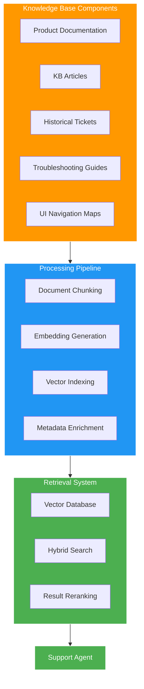
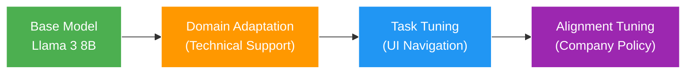
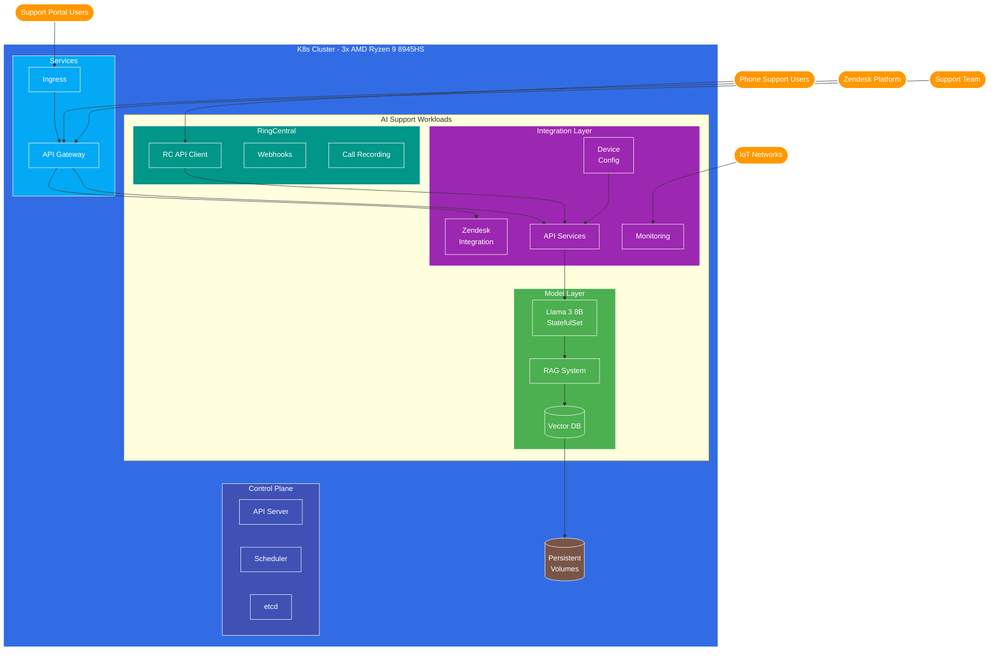
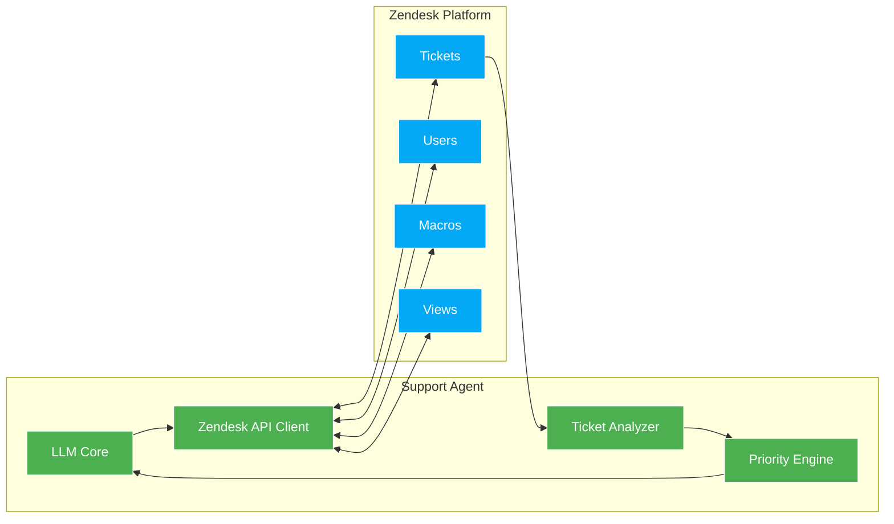
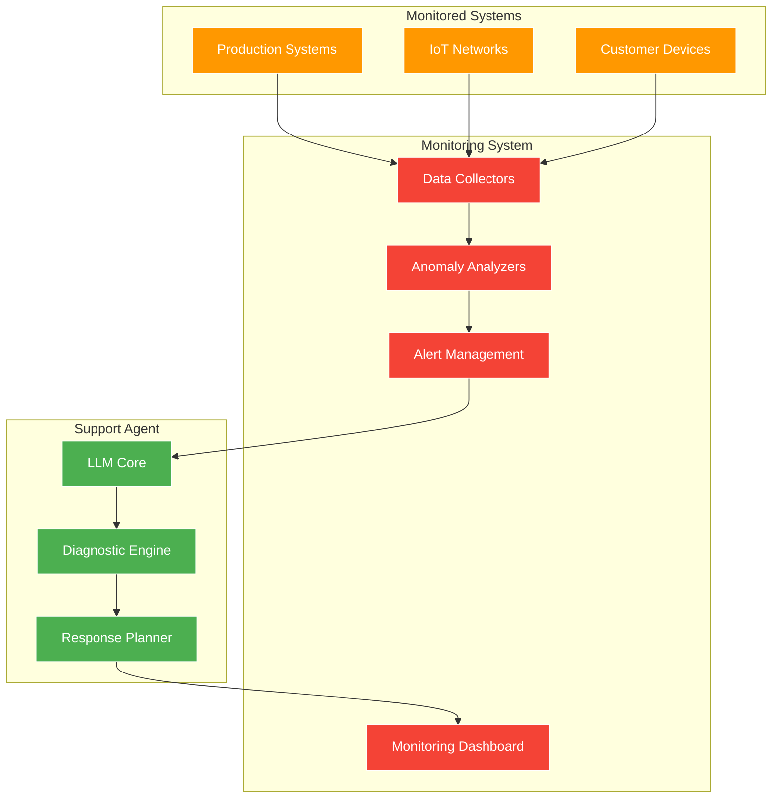
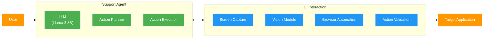

# Technical Support AI Agent Strategy

*Strategy Document | May 3, 2025*

## 1. Executive Summary

This document outlines a comprehensive strategy for implementing AI-powered technical support agents capable of providing 24/7 customer assistance through verbal/text chat interfaces, navigating user interfaces on behalf of customers, configuring client devices, monitoring production systems and IoT networks, and managing support tickets through Zendesk integration. The strategy focuses on using smaller, more efficient models deployed on bare-metal infrastructure in an office environment, optimized with RAG and fine-tuning techniques to achieve high-quality support interactions without the resource requirements of larger models.

The proposed approach balances performance, cost-efficiency, and practical deployment considerations while ensuring the technical support agents can effectively assist users with their support needs through a multi-modal interaction model. The system is designed to provide round-the-clock support with intelligent escalation management to human agents when necessary.

## 2. Technical Support Agent Requirements

### 2.1 Functional Requirements

| Capability | Description | Priority |
|------------|-------------|----------|
| Chat Interface | Text-based interaction with users through support portal | High |
| Voice Interface | Voice-based interaction capabilities for 24/7 phone support | High |
| UI Navigation | Ability to navigate application UIs on behalf of users | High |
| Knowledge Retrieval | Access to product documentation and support knowledge base | High |
| Email Communication | Send follow-up emails and notifications | Medium |
| Zendesk Integration | Full integration with Zendesk for ticket management | High |
| Device Configuration | Remote configuration of client devices | High |
| System Monitoring | Monitor production systems and customer IoT networks/devices | High |
| Problem Diagnosis | Analyze and diagnose technical issues | High |
| Solution Implementation | Implement solutions through UI interaction | High |
| Escalation Management | Identify, prioritize and manage escalations to human agents | High |
| 24/7 Availability | Continuous operation for round-the-clock support | High |

### 2.2 Performance Requirements

| Metric | Target | Notes |
|--------|--------|-------|
| Response Time | < 2 seconds | For standard queries |
| Accuracy | > 90% | For common support scenarios |
| Resolution Rate | > 70% | Without human escalation |
| Concurrent Sessions | 20-30 | Per server node |
| Availability | 99.99% | 24/7 operation with redundancy |
| Context Retention | Full session | Maintain conversation context |
| Monitoring Latency | < 30 seconds | For critical system alerts |
| Escalation Time | < 5 minutes | For critical issues to human agents |
| Device Config Time | < 10 minutes | For standard device setups |

### 2.3 Infrastructure Requirements

| Requirement | Description |
|-------------|-------------|
| Deployment | Kubernetes cluster on bare-metal servers in office environment for 24/7 operation |
| Network | Secure access to internal systems, user portal, and customer IoT networks |
| Integration | APIs for Zendesk, device management systems, monitoring platforms, and telephony |
| Security | Data encryption, access controls, audit logging, and secure remote access |
| Monitoring | Performance, usage, error tracking, and system health monitoring |
| Telephony | SIP integration for 24/7 phone support with call routing and recording |
| Failover | Kubernetes-managed automatic failover and self-healing capabilities |

## 3. Model Selection Strategy

### 3.1 Model Comparison for Technical Support

| Model | Size | Strengths | Weaknesses | Suitability |
|-------|------|-----------|------------|-------------|
| Llama 3 8B | 8B | Compact, good instruction following, efficient | Limited context window, less sophisticated reasoning | High |
| Mistral 7B | 7B | Strong reasoning, good with technical content | May need more fine-tuning for UI tasks | High |
| Phi-3 14B | 14B | Excellent reasoning, strong technical capabilities | Larger resource requirements | Medium |
| Claude Haiku | ~8B | Strong in conversation, good with instructions | Closed source, API dependency | Medium |
| Gemma 7B | 7B | Good performance/size ratio, Google-backed | Less mature ecosystem | Medium |

### 3.2 Recommended Model: Llama 3 8B

For technical support agents, we recommend **Llama 3 8B** as the primary model for the following reasons:

1. **Efficiency**: Runs effectively on consumer-grade hardware
2. **Performance**: Strong instruction-following capabilities essential for support tasks
3. **Fine-tuning**: Well-suited for domain-specific fine-tuning
4. **Open Source**: Fully customizable for specific requirements
5. **Community**: Large community and available optimizations

### 3.3 Model Quantization Strategy

To optimize for bare-metal deployment, we recommend:

| Quantization | RAM Usage | Performance Impact | Use Case |
|--------------|-----------|-------------------|----------|
| GPTQ (4-bit) | ~4GB | 5-10% degradation | Primary deployment |
| GGUF (5-bit) | ~5GB | 3-5% degradation | Alternative for critical tasks |
| AWQ (4-bit) | ~4GB | 3-8% degradation | For UI navigation tasks |

## 4. RAG Implementation Strategy

### 4.1 Knowledge Base Architecture

### 4.2 Vector Database Selection

For bare-metal deployment, we recommend:

| Database | Strengths | Deployment Model | Resource Requirements |
|----------|-----------|------------------|------------------------|
| Qdrant | High performance, easy deployment | Self-hosted | 8GB RAM, 4 cores |
| Chroma | Lightweight, Python native | Embedded | 4GB RAM, 2 cores |
| FAISS | Extremely efficient, Facebook-backed | Embedded | 2GB RAM, 2 cores |

**Recommendation**: Chroma for its balance of performance and resource efficiency in an office deployment.

### 4.3 Retrieval Optimization Techniques

1. **Hybrid Search**: Combine vector similarity with keyword search
2. **Chunking Strategy**: Overlapping chunks with variable sizes based on content type
3. **Metadata Filtering**: Use metadata to narrow search scope based on query context
4. **UI Element Mapping**: Special embedding space for UI navigation instructions
5. **Contextual Reranking**: Rerank results based on conversation history

## 5. Fine-Tuning Strategy

### 5.1 Fine-Tuning Approach

### 5.2 Fine-Tuning Datasets

| Dataset Type | Source | Size | Purpose |
|--------------|--------|------|---------|
| Support Conversations | Historical tickets | 10,000 examples | Domain adaptation |
| UI Navigation | Screen recordings | 5,000 examples | Task-specific tuning |
| Email Communication | Support emails | 3,000 examples | Communication style |
| Troubleshooting | Resolved cases | 7,000 examples | Problem-solving |
| Company Policy | Internal documents | 1,000 examples | Alignment with guidelines |

### 5.3 Fine-Tuning Techniques

1. **Parameter-Efficient Fine-Tuning (PEFT)**: Using LoRA with rank 16
2. **Quantized Fine-Tuning**: QLoRA to maintain 4-bit deployment compatibility
3. **Instruction Tuning**: Focus on support-specific instructions
4. **Multi-Task Learning**: Combine UI navigation and problem-solving objectives
5. **Reinforcement Learning from Human Feedback (RLHF)**: For final alignment

## 6. Bare-Metal Deployment Architecture

### 6.1 Hardware Configuration

| Component | Specification | Quantity | Purpose |
|-----------|---------------|----------|----------|
| Server | AMD Ryzen 9 8945HS | 3 | Kubernetes cluster nodes |
| RAM | 64GB DDR5 | Per server | Model weights and Kubernetes workloads |
| Storage | 4TB NVMe SSD | Per server | Knowledge base and model storage |
| NPU | XDNA NPU (integrated) | Per server | Model inference acceleration |
| Network | 10GbE | Per server | Kubernetes cluster communication |
| Telephony | RingCentral Integration | 1 | 24/7 phone support integration |
| Redundant Power | UPS + Generator | 1 system | Ensure 24/7 availability |
| Shared Storage | NFS/Ceph | Cluster-wide | Persistent volume claims |

### 6.2 Kubernetes Architecture

### 6.3 Software Stack

| Component | Technology | Purpose |
|-----------|------------|----------|
| Operating System | Ubuntu Server 24.04 LTS | Base OS |
| Container Runtime | containerd | Container management |
| Kubernetes | K8s 1.29+ | Orchestration platform |
| Inference Engine | llama.cpp / vLLM | Model serving |
| Vector Database | Chroma | RAG storage |
| API Gateway | Kong / Istio | Service interface |
| UI Automation | Playwright | Interface navigation |
| Monitoring | Prometheus + Grafana | Performance tracking |
| Zendesk Integration | Zendesk API + Custom Middleware | Ticket management |
| Device Management | Ansible + Custom Agents | Remote device configuration |
| System Monitoring | Prometheus Exporters | Production system monitoring |
| IoT Monitoring | MQTT + Custom Collectors | IoT network monitoring |
| Telephony | RingCentral API | 24/7 phone support |
| Speech Processing | Whisper + RingCentral Transcription | Voice transcription |
| Escalation System | Custom Rule Engine | Manage support escalations |
| Storage | Rook-Ceph | Persistent volume provisioning |

## 7. Specialized Capabilities

### 7.1 Zendesk Integration

The technical support agent will integrate with Zendesk through the following components:

#### Key Zendesk Integration Features:

1. **Ticket Creation and Management**: Create, update, and resolve support tickets
2. **Comment Management**: Add internal and public comments to tickets
3. **Ticket Prioritization**: Analyze content to determine priority and SLA requirements
4. **Macro Application**: Apply appropriate Zendesk macros for common scenarios
5. **User Management**: Create and update user records as needed
6. **Ticket Routing**: Route tickets to appropriate human agents when escalation is needed

### 7.2 Device Configuration Capabilities

The agent will be able to remotely configure client devices through:

1. **Configuration Templates**: Pre-defined templates for common device types
2. **Secure Remote Access**: Encrypted connections to customer devices
3. **Configuration Validation**: Verification of successful configuration changes
4. **Rollback Capability**: Ability to revert changes if issues arise
5. **Audit Logging**: Detailed logs of all configuration changes

### 7.3 System and IoT Monitoring

The agent will monitor production systems and customer IoT networks through:

#### Key Monitoring Features:

1. **Real-time Data Collection**: Continuous monitoring of system metrics
2. **Anomaly Detection**: AI-based identification of unusual patterns
3. **Automated Diagnostics**: Initial problem diagnosis before human involvement
4. **Alert Prioritization**: Intelligent ranking of alerts by severity
5. **Proactive Resolution**: Automatic resolution of common issues

### 7.4 24/7 Phone Support with RingCentral

The agent will provide round-the-clock phone support through RingCentral integration:

1. **RingCentral API**: Direct integration with your existing RingCentral account
2. **Webhook Events**: Real-time notification of incoming calls and events
3. **Call Control**: Programmatic management of calls including transfers and conferencing
4. **RingCentral Transcription**: Leveraging built-in and custom transcription services
5. **Sentiment Analysis**: Detection of customer frustration for potential escalation
6. **Video Support**: Optional escalation to video calls for complex troubleshooting

### 7.5 Escalation Management

The agent will manage escalations through a sophisticated system that:

1. **Identifies Critical Issues**: Recognizes problems requiring human expertise
2. **Prioritizes Escalations**: Ranks escalations by urgency and impact
3. **Routes Appropriately**: Directs issues to the right human specialists
4. **Provides Context**: Supplies complete issue history to human agents
5. **Follows Up**: Tracks resolution and follows up with customers

## 8. UI Navigation Capabilities

### 7.1 UI Interaction Approach

The technical support agent will use a combination of techniques to navigate user interfaces:

1. **Screen Understanding**: Process screenshots to understand UI state
2. **Element Recognition**: Identify interactive elements (buttons, fields, etc.)
3. **Action Planning**: Determine sequence of actions to accomplish task
4. **Execution**: Perform actions through automation API

### 7.2 UI Navigation Architecture

### 7.3 UI Navigation Training Data

To enable effective UI navigation, we will create specialized training data:

1. **Screen Recordings**: Captured workflows of common support tasks
2. **Element Annotations**: Labeled UI elements with actions
3. **Task Decomposition**: Step-by-step breakdown of complex workflows
4. **Error Recovery**: Examples of handling unexpected UI states

## 8. Implementation Phases

### 8.1 Phase 1: Foundation (Months 1-2)

- Deploy base Llama 3 8B model with 4-bit quantization
- Implement basic RAG system with product documentation
- Develop chat interface integration with support portal
- Set up bare-metal servers with inference optimization
- Establish basic Zendesk integration for ticket viewing

**Key Deliverables**:
- Functional support chat capability
- Basic knowledge retrieval
- Initial bare-metal deployment
- Basic Zendesk ticket reading capability
- Preliminary 24/7 infrastructure setup

### 8.2 Phase 2: Enhancement (Months 3-4)

- Implement domain-specific fine-tuning
- Expand RAG with historical tickets and troubleshooting guides
- Develop UI navigation capabilities for common tasks
- Integrate email and notification systems
- Implement full Zendesk ticket management
- Deploy basic device configuration capabilities
- Set up system monitoring infrastructure

**Key Deliverables**:
- Fine-tuned support model
- Enhanced knowledge retrieval
- Basic UI navigation capabilities
- Communication integrations
- Full Zendesk ticket management
- Basic device configuration
- System monitoring dashboard

### 8.3 Phase 3: Advanced Capabilities (Months 5-6)

- Implement RLHF for alignment with company policies
- Develop advanced UI navigation for complex workflows
- Create specialized agents for different support domains
- Implement comprehensive monitoring and analytics
- Deploy full 24/7 phone support integration
- Implement IoT network monitoring
- Develop sophisticated escalation management

**Key Deliverables**:
- Fully aligned support agents
- Advanced UI navigation
- Domain-specific support capabilities
- Performance monitoring dashboard
- Complete 24/7 phone support
- IoT network monitoring system
- Intelligent escalation management

## 9. Performance Optimization

### 9.1 Inference Optimization Techniques

| Technique | Description | Performance Impact |
|-----------|-------------|-------------------|
| KV Cache Management | Optimize context handling | 20-30% throughput improvement |
| Batch Processing | Handle multiple queries together | 40-50% throughput improvement |
| Continuous Batching | Dynamic batching of incoming requests | 30-40% latency reduction |
| Attention Optimizations | Flash Attention implementation | 20-30% speed improvement |
| CPU Thread Optimization | Optimal thread allocation | 10-15% throughput improvement |

### 9.2 Scaling Strategy

To handle varying loads, the system will implement:

1. **Vertical Scaling**: Configure servers for maximum performance
2. **Horizontal Scaling**: Add additional servers during peak periods
3. **Load Balancing**: Distribute requests across available servers
4. **Request Prioritization**: Critical issues get processing priority
5. **Graceful Degradation**: Fallback strategies during high load

## 10. Evaluation and Quality Assurance

### 10.1 Evaluation Metrics

| Metric | Measurement Method | Target |
|--------|-------------------|--------|
| Task Completion Rate | % of support tasks completed successfully | >85% |
| Time to Resolution | Average time to resolve support issues | <15 minutes |
| Customer Satisfaction | Post-interaction survey | >4.5/5 |
| Accuracy | Correctness of information provided | >95% |
| Escalation Rate | % of issues requiring human intervention | <25% |
| Zendesk Ticket Quality | Audit of ticket handling | >90% compliance |
| Device Config Success | % of successful device configurations | >92% |
| Alert Response Time | Time from alert to action | <2 minutes |
| Phone Support Quality | Call quality assessment | >4.3/5 |
| 24/7 Availability | System uptime | >99.95% |

### 10.2 Quality Assurance Process

1. **Automated Testing**: Regular evaluation against test cases
2. **Human Evaluation**: Support specialists review agent interactions
3. **A/B Testing**: Compare different model versions and configurations
4. **User Feedback Loop**: Incorporate customer feedback into improvements
5. **Continuous Monitoring**: Track performance metrics in real-time

## 11. Cost Analysis

### 11.1 Hardware Costs

| Component | Cost per Unit | Quantity | Total Cost |
|-----------|--------------|----------|------------|
| AMD Ryzen 9 8945HS Servers (64GB RAM, 8TB NVMe) | $1,400 | 3 | $4,200 |
| Network Infrastructure | $150 | 1 | $150 |
| **Total Hardware** | | | **$4,350** |

*Note: RingCentral Enterprise Plan is considered an external cost and not included in the hardware costs.*

### 11.2 Implementation Costs

| Activity | Cost |
|----------|------|
| **Knowledge Engineering** | |
| Technical documentation conversion | $8,000 |
| Process documentation and workflow mapping | $5,000 |
| **AI System Development** | |
| RAG system implementation | $10,000 |
| Model optimization and deployment | $6,000 |
| UI navigation capabilities | $12,000 |
| **Integration Work** | |
| Zendesk integration | $8,000 |
| Device configuration system | $7,000 |
| Monitoring system | $6,000 |
| **Testing and Optimization** | |
| Performance testing | $5,000 |
| Security testing | $4,000 |
| User acceptance testing | $4,000 |
| **Total Implementation** | **$75,000** |

### 11.3 Operational Costs

| Item | Monthly Cost | Annual Cost |
|------|--------------|-------------|
| Infrastructure Maintenance | $200 | $2,400 |
| Electricity and Cooling | $100 | $1,200 |
| Ongoing Development and Optimization | $1,500 | $18,000 |
| Human Oversight | $500 | $6,000 |
| **Total Operational** | **$2,300** | **$27,600** |

*Note: Zendesk and RingCentral licensing are considered external costs and not included in the operational costs.*

### 11.4 ROI Analysis

| Metric | Value |
|--------|-------|
| Support Staff Cost Savings | $400,000/year |
| Improved Resolution Time Value | $75,000/year |
| Customer Satisfaction Impact | $100,000/year |
| Reduced System Downtime | $150,000/year |
| IoT Network Optimization | $80,000/year |
| Total Benefits | $805,000/year |
| Total Costs (Year 1) | $106,950 |
| Annual Operational Costs (Year 2+) | $27,600 |
| **ROI (Year 1)** | **653%** |
| **ROI (Year 2+)** | **2,817%** |

## 12. Conclusion and Recommendations

### 12.1 Key Recommendations

1. **Model Selection**: Proceed with Llama 3 8B (4-bit quantized) as the primary model
2. **Deployment Strategy**: Implement Kubernetes cluster on 3x AMD Ryzen 9 8945HS servers
3. **RAG Implementation**: Use Chroma with hybrid search and contextual reranking
4. **Fine-Tuning Approach**: Multi-stage fine-tuning with PEFT techniques
5. **UI Navigation**: Develop specialized capabilities using Playwright and vision modules
6. **Zendesk Integration**: Implement comprehensive ticket management with custom middleware
7. **24/7 Support**: Leverage Kubernetes for high availability and self-healing
8. **Monitoring**: Implement Prometheus-based monitoring for systems and IoT networks
9. **Escalation Management**: Develop intelligent escalation system with priority routing

### 12.2 Critical Success Factors

1. **Quality Training Data**: Comprehensive support conversations and UI interactions
2. **Effective Knowledge Base**: Well-structured and comprehensive support documentation
3. **Optimization Strategy**: Proper quantization and inference optimization
4. **Integration Capabilities**: Seamless connection with Zendesk, monitoring systems, and telephony
5. **Monitoring and Feedback**: Continuous improvement based on performance data
6. **24/7 Reliability**: Robust infrastructure with redundancy and failover
7. **Escalation Efficiency**: Appropriate routing of complex issues to human agents
8. **Device Configuration Accuracy**: Reliable and secure remote device management
9. **System Monitoring Precision**: Accurate detection of issues in production and IoT systems

### 12.3 Next Steps

1. **Procure Hardware**: Set up enhanced bare-metal infrastructure with redundancy
2. **Baseline Model**: Deploy quantized Llama 3 8B and benchmark performance
3. **Knowledge Base Development**: Begin RAG implementation with existing documentation
4. **Fine-Tuning Data Collection**: Gather and prepare support conversation datasets
5. **Zendesk Integration**: Develop initial API connections and ticket handling capabilities
6. **Monitoring Framework**: Implement system and IoT monitoring infrastructure
7. **Telephony Setup**: Configure 24/7 phone support infrastructure
8. **Device Management**: Develop secure remote device configuration system

By implementing this strategy, organizations can deploy effective technical support AI agents on bare-metal infrastructure in an office environment, providing high-quality 24/7 support through chat and phone interfaces, UI navigation, device configuration, system monitoring, and Zendesk ticket management while maintaining cost efficiency and performance.

## Appendix A: Tier 1 Tech Support Agent Capacity Analysis

This appendix provides a detailed analysis of how many Tier 1 Tech Support AI agents the specified 3-node Kubernetes cluster can support.

### A.1 Hardware Resource Analysis

Each AMD Ryzen 9 8945HS node provides:
- 8 cores / 16 threads
- 64GB RAM
- XDNA NPU with ~16 TOPS
- 4TB NVMe storage

### A.2 AI Agent Resource Requirements

Each Llama 3 8B agent instance with 4-bit quantization requires:
- ~4GB RAM for model weights
- ~2GB RAM for operation overhead
- ~1-2 CPU cores for processing
- ~0.5-1GB RAM for context window

### A.3 Concurrent Agent Capacity

#### Per-Node Capacity
- **RAM-constrained calculation**: 64GB RAM / 7GB per agent ≈ 9 agents
- **CPU-constrained calculation**: 16 threads / 2 threads per agent ≈ 8 agents
- **Conservative estimate**: 8 agents per node

#### Cluster-Wide Capacity
- **Raw capacity**: 8 agents × 3 nodes = 24 agents
- **With Kubernetes overhead**: ~22 agents
- **With high availability reserve**: ~18-20 agents

### A.4 Throughput Analysis

Considering average Tier 1 support call metrics:
- Average call duration: 12 minutes
- Post-call processing: 3 minutes
- Total handling time: 15 minutes per call

**Hourly throughput**:
- 18 agents × 4 calls per hour = 72 support calls per hour
- Daily capacity (24 hours): ~1,700 support calls

### A.5 Scaling Considerations

1. **Peak Load Handling**:
   - The system can handle ~20 concurrent support sessions
   - For higher peaks, implement a queue system with estimated wait times

2. **Vertical Scaling Options**:
   - Increase RAM to 128GB per node to support ~16 agents per node
   - Add GPUs for inference acceleration

3. **Horizontal Scaling**:
   - Add more nodes to the cluster as demand grows
   - Each additional node adds capacity for ~8 more concurrent agents

### A.6 Conclusion

For a Tier 1 Tech Support operation, this 3-node cluster can effectively support:
- **18-20 concurrent AI support agents**
- **~72 support calls per hour**
- **~1,700 support calls per day**

This should be sufficient for a medium-sized support operation. If higher volumes are anticipated, consider adding more nodes to the cluster or upgrading the RAM in the existing nodes.
